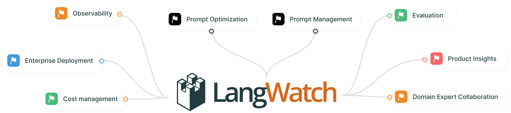
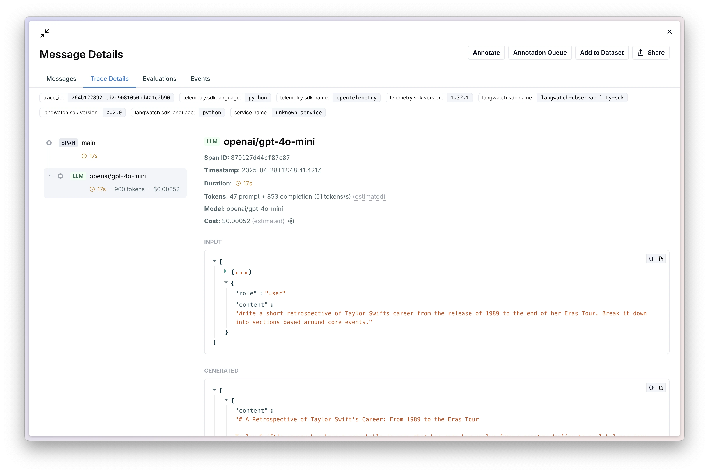

<p align="center">
<a href="https://discord.gg/kT4PhDS2gH"></a>
<a href="https://pypi.org/project/langwatch/"></a>
<a href="https://www.npmjs.com/package/langwatch"></a>
</p>

LangWatch is an open platform for **Observing**, **Evaluating** and **Optimizing** your LLM and Agentic applications. We offer:

- [**Observability**](https://docs.langwatch.ai/integration/overview) - Add tracing to your LLM, based on the OpenTelemetry standard, allowing LangWatch to provide real-time powers.
- [**Evaluation**](https://docs.langwatch.ai/llm-evaluation/offline-evaluation) - Run real-time and offline evaluations against production or synthetic datasets. Compare performance across various matrixes (prompts, modules, hosting providers, and complete LLM pipelines).
- [**Datasets**](https://docs.langwatch.ai/features/datasets) - Automatically created from traced messages, or upload, datasets which can be used across the platform for evals.
- [**Optimization Studio**](https://docs.langwatch.ai/optimization-studio/overview) – Build and run evaluations faster with our no+lo 🧘 code studio. If you need more flexibility, you have access to the DSL that powers it too.
- [**Prompt Management & Optimization**](https://docs.langwatch.ai/features/prompt-versioning) – Version prompts, test changes on datasets, and improve real-world performance. Auto-optimize with DSPy's MIPROv2 to generate better prompts and few-shot examples.
- [**Annotations**](https://docs.langwatch.ai/features/annotations) - Human in the Loop, done right. Accelerate better data creation by combining domain expert input with smart workflows. Use LangWatch's intuitive annotation interface to collaborate directly with experts while keeping full control over your code. Quickly generate high-quality labels, catch edge cases, and fine-tune datasets to build more accurate, robust AI models.

LangWatch is framework- and LLM-agnostic, with support for (LangGraph, DSPy, Langflow, Flowise, and others) and LLM providers (OpenAI, Azure, Bedrock, Gemini, Deepseek, Groq, MistralAI, VertexAI, LiteLLM, and others) via [OpenTelemetry](https://opentelemetry.io/).

Our use of **open**, and **community-driven** **standards** is all about supporting your business decisions, and enabling your teams to be flexible to the rapidly changing AI ecosystem without worrying about compatibility.

## Getting Started

### Cloud ☁️

The easiest way to get started with LangWatch.

[Create a free account](https://app.langwatch.ai) to get started.

### Local setup 💻

Get up and running in your own machine using docker compose:

```bash
git clone https://github.com/langwatch/langwatch.git
cd langwatch
cp langwatch/.env.example langwatch/.env
docker compose up -d --wait --build
open http://localhost:5560
```

You'll be launched right into our onboarding flow. Welcome aboard 🫡.

### Self-hosted ⚓️

Run LangWatch on your own infrastructure:

- [Docker Compose](https://docs.langwatch.ai/self-hosting/open-source#docker-compose) - Run LangWatch on your own machine.
- [Kubernetes (Helm)](https://docs.langwatch.ai/self-hosting/open-source#helm-chart-for-langwatch) - Run LangWatch on a Kubernetes cluster using Helm for a production-ready setup.
- [OnPrem](https://docs.langwatch.ai/self-hosting/onprem) - For high-scale deployments, we offer cloud specific setups for AWS, Google Cloud and Azure.
- [Hybrid (OnPrem data)](https://docs.langwatch.ai/self-hosting/hybrid) - For companies that have strict data residency and control requirements, without needing to go fully on-prem.


### Other Flavours 🍦

<details>
<summary>Self-hosted (OnPrem) ⚓️</summary>
LangWatch offers a fully self-hosted version of the platform for companies that require strict data control and compliance, complete with Azure AD support.

Read more about it on our [docs](https://docs.langwatch.ai/self-hosting/overview).
</details>
<details>
<summary>Hybrid (OnPrem data) 🔀</summary>
LangWatch offers a hybrid setup for companies that have strict data control and compliance requirements, without needing to go fully on-prem.

Read more about it on our [docs](https://docs.langwatch.ai/hybrid-setup/overview).
</details>
<details>
<summary>Local Development 👩‍💻</summary>
You can also run LangWatch locally without docker to develop and help contribute to the project.

Start just the databases using docker and leave it running:

```bash
docker compose up redis postgres opensearch
```

Then, on another terminal, install the dependencies and start LangWatch:

```bash
make install
make start
```
</details>

## 🚀 Quick Start

Get observing in minutes. Now you have an account and have created a project inside LangWatch, lets get your messages flowing through LangWatch.

> [!NOTE]
> Not using Python or OpenAI? Don't worry, we have your back . [Visit our docs](https://docs.langwatch.ai/integration/overview) for full guides for other popular languages, LLM providers, and frameworks.

### Install and configure SDK

Available for install via `pip`, or `uv`. The SDK will also check your environment variables by default for your API key and endpoint.

```bash
pip install langwatch
```

```python
LANGWATCH_API_KEY="sk-lw-..."

# This is only needed if you aren't using LangWatch Cloud.
# LANGWATCH_ENDPOINT="https://self-hosted-url.internal/"
```

### Create your first trace and auto-instrument OpenAI

```python
import langwatch
from openai import OpenAI

client = OpenAI()

@langwatch.trace()
def main():
    langwatch.get_current_trace().autotrack_openai_calls(client)
    ...
```

### See your traces in LangWatch



You can also view a public share of the trace [**here**](https://app.langwatch.ai/share/pA8sBaRf5Nn2sa7OkhJfi).

## 🗺️ Integrations

LangWatch builds and maintains several integrations listed below, additionally our tracing platform is built on top of [OpenTelemetry](https://opentelemetry.io/), so we support any OpenTelemetry compatible library out of the box.

We also support various community standards, such as [OpenInference](https://github.com/Arize-ai/openinference), [OpenLLMetry](https://github.com/traceloop/openllmetry), and more.

### Python 🐍

Our Python SDK supports the following auto-instrumentors.

- [OpenAI](https://docs.langwatch.ai/integration/python/guide#open-ai)
- [Azure](https://docs.langwatch.ai/integration/python/guide#azure)
- [LiteLLM](https://docs.langwatch.ai/integration/python/guide#lite-llm)
- [DSPy](https://docs.langwatch.ai/integration/python/guide#ds-py)
- [LangChain](https://docs.langwatch.ai/integration/python/guide#lang-chain)

Though OpenTelemetry, we also support all the frameworks and providers that support them, such as:

- AWS Bedrock
- Haystack
- CrewAI
- Autogen
- Grok
- …and many more

You can find a [full guide](https://docs.langwatch.ai/integration/opentelemetry/guide) on our docs.

### JavaScript ☕️

Our JavaScript SDK supports the following instrumentors:

- [Vercel AI SDK](https://docs.langwatch.ai/integration/typescript/guide#vercel-ai-sdk)
- [OpenAI](https://docs.langwatch.ai/integration/typescript/guide#open-ai)
- [Azure](https://docs.langwatch.ai/integration/typescript/guide#azure)
- [LangChain.js](https://docs.langwatch.ai/integration/typescript/guide#lang-chain-js)

### Platforms

- [LangFlow](https://docs.langwatch.ai/integration/langflow)
- [Flowise](https://docs.langwatch.ai/integration/flowise)

Are you using a platform that could benefit from a direct LangWatch integration? We'd love to hear from you, please [**fill out this very quick form.**](https://www.notion.so/1e35e165d48280468247fcbdc3349077?pvs=21)

## 🥰 Community

- Join our [Discord](https://discord.gg/kT4PhDS2gH) community
- Follow our [Twitter](https://x.com/LangWatchAI)

## 💬 Support

Have questions or need help? We're here to support you in multiple ways:

- **Documentation:** Our comprehensive [documentation](https://docs.langwatch.ai) covers everything from getting started to advanced features.
- **Discord Community:** Join our [Discord server](https://discord.gg/kT4PhDS2gH) for real-time help from our team and community.
- **GitHub Issues:** Report bugs or request features through our [GitHub repository](https://github.com/langwatch/langwatch).
- **Enterprise Support:** Enterprise customers receive priority support with dedicated response times. Our [pricing page](https://langwatch.ai/pricing) contains more information.

## 🤝 Collaborating

Contributions are what make the open-source community such an amazing place to learn, inspire, and create. Any contributions you make are **greatly appreciated**.

Please read our [Contribution Guidelines](https://github.com/langwatch/langwatch/blob/main/CONTRIBUTING.md) for details on our code of conduct, and the process for submitting pull requests.

## ✍️ License

Please read our [LICENSE.md](http://LICENSE.md) file.

## 👮‍♀️ Security + Compliance

As a platform that has access to data that is highly likely to be be sensitive, we take security incredibly seriously and treat it as a core part of our culture.

| Legal Framework | Current Status |
| --- | --- |
| GDPR | Compliant. DPA available upon request. |
| ISO 27001 | Certified. Certification report available upon request on our Enterprise plan. |

Please refer to our Security page for more information. Contact us at [security@langwatch.ai](mailto:security@langwatch.ai) if you have any further questions.

### Vulnerability Disclosure

If you need to do a responsible disclosure of a security vulnerability, you may do so by email to [security@langwatch.ai](mailto:security@langwatch.ai), or if you prefer you can reach out to one of our team privately on [Discord](https://discord.com/invite/kT4PhDS2gH).
