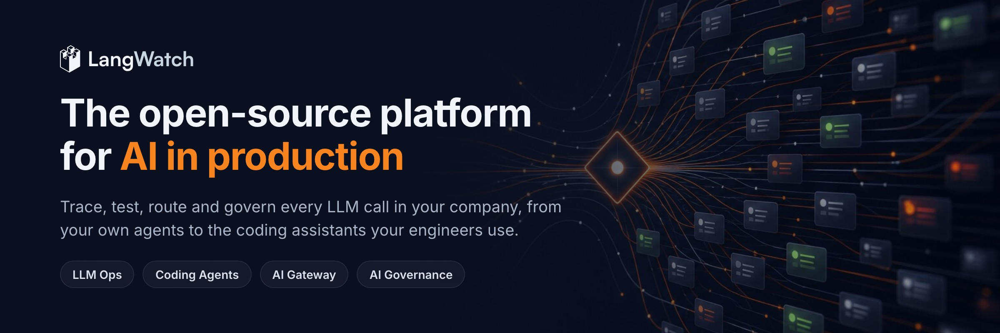
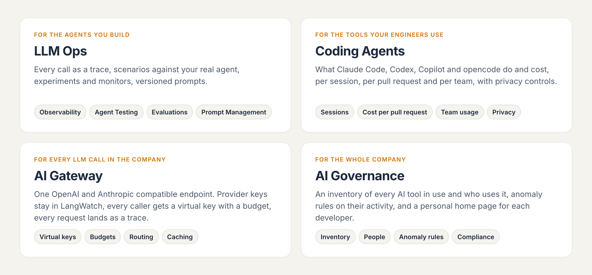

<p align="center">
<a href="https://discord.gg/kT4PhDS2gH" target="_blank"></a>
<a href="https://pypi.org/project/langwatch/" target="_blank"></a>
<a href="https://www.npmjs.com/package/langwatch" target="_blank"></a>
<a href="https://twitter.com/intent/follow?screen_name=langwatchai" target="_blank"></a>

</p>

<p align="center">
  <a href="https://langwatch.ai"></a>
</p>

LangWatch is the open-source platform for AI in production: trace, test, route and govern every LLM call in your company, from the agents you build to the coding assistants your engineers use. LangWatch is Apache 2.0. [View docs](https://langwatch.ai/docs/introduction).

## Get started

### LangWatch Cloud

<a href="https://app.langwatch.ai"></a>

### Track your coding agents

```bash
npx langwatch claude  # or codex, copilot, opencode, ...
```

### Self-host

```bash
npx @langwatch/server
```

Only Node.js required. For production, see [Self-hosting LangWatch](https://langwatch.ai/docs/self-hosting/overview).

## Demo

<video src="https://github.com/user-attachments/assets/b0dee97b-b5be-43f8-9d08-18ae1201d017" autoplay loop muted playsinline width="100%" style="display: block; aspect-ratio: 16 / 9;"></video>

## What you get

<p align="center">
  
</p>

- **[LLM Ops](https://langwatch.ai/docs/observability/overview)**: [Observability](https://langwatch.ai/docs/observability/overview) · [Agent Testing](https://langwatch.ai/docs/agent-testing/overview) · [Evaluations](https://langwatch.ai/docs/evaluations/overview) · [Prompt Management](https://langwatch.ai/docs/prompt-management/overview)
- **[Coding Agents](https://langwatch.ai/docs/coding-agents/overview)**: sessions, cost per pull request and per team, privacy controls
- **[AI Gateway](https://langwatch.ai/docs/ai-gateway/overview)**: one OpenAI and Anthropic compatible endpoint, virtual keys, budgets, routing
- **[AI Governance](https://langwatch.ai/docs/ai-governance/overview)**: every AI tool in the company, who uses it, anomaly rules

## Things you can do with LangWatch

1. Create [simulation tests](https://langwatch.ai/docs/agent-testing/overview) for evaluating or benchmarking your agents and [voice agents](https://langwatch.ai/docs/agent-testing/voice-agents)
2. Measure the [cost per PR](https://langwatch.ai/docs/coding-agents/pull-requests) and optimize your Claude Code usage to [get your weekly limits to last twice as long](https://langwatch.ai/docs/coding-agents/find-your-context-sweet-spot)
3. Create [virtual keys with budgets](https://langwatch.ai/docs/ai-gateway/virtual-keys) to hand out to your customers or employees
4. Find out that 40% of the [Copilot Studio subscriptions](https://langwatch.ai/docs/ai-governance/overview) are not actually being used at your company and cancel them

## Integrations

**Coding assistants:** [Claude Code](https://langwatch.ai/docs/coding-agents/claude-code) · [Codex](https://langwatch.ai/docs/coding-agents/openai-codex) · [GitHub Copilot](https://langwatch.ai/docs/coding-agents/github-copilot-cli) · [opencode](https://langwatch.ai/docs/coding-agents/opencode) · [Cursor](https://langwatch.ai/docs/ai-gateway/quickstart) · [MCP server](https://langwatch.ai/docs/integration/mcp) · more

**Frameworks:** [LangChain](https://langwatch.ai/docs/integration/python/integrations/langchain) · [LangGraph](https://langwatch.ai/docs/integration/python/integrations/langgraph) · [Vercel AI SDK](https://langwatch.ai/docs/integration/typescript/integrations/vercel-ai-sdk) · [Mastra](https://langwatch.ai/docs/integration/typescript/integrations/mastra) · [CrewAI](https://langwatch.ai/docs/integration/python/integrations/crew-ai) · [Google ADK](https://langwatch.ai/docs/integration/python/integrations/google-ai) · [DSPy](https://langwatch.ai/docs/integration/python/integrations/dspy) · [OpenTelemetry](https://langwatch.ai/docs/integration/opentelemetry/guide) · more

**Model providers:** [OpenAI](https://langwatch.ai/docs/integration/python/integrations/open-ai) · [Anthropic](https://langwatch.ai/docs/integration/python/integrations/anthropic) · [Azure OpenAI](https://langwatch.ai/docs/integration/python/integrations/open-ai-azure) · [Vertex AI](https://langwatch.ai/docs/integration/python/integrations/vertex-ai) · [Bedrock](https://langwatch.ai/docs/integration/python/integrations/aws-bedrock) · more

**Governance sources:** [Copilot Studio](https://langwatch.ai/docs/ai-governance/ingestion-sources/copilot-studio) · [Claude Cowork](https://langwatch.ai/docs/ai-governance/ingestion-sources/claude-cowork) · [Anthropic](https://langwatch.ai/docs/ai-governance/ingestion-sources/claude-compliance) and [OpenAI](https://langwatch.ai/docs/ai-governance/ingestion-sources/openai-compliance) compliance APIs · [Workato](https://langwatch.ai/docs/ai-governance/ingestion-sources/workato) · Databricks Genie · [OpenTelemetry and S3 audit feeds](https://langwatch.ai/docs/ai-governance/ingestion-sources/index) · more

**No-code platforms:** [LangFlow](https://langwatch.ai/docs/integration/langflow) · [Flowise](https://langwatch.ai/docs/integration/flowise) · [n8n](https://langwatch.ai/docs/integration/n8n) · more

## Contributing

Read [CONTRIBUTING.md](https://github.com/langwatch/langwatch/blob/main/CONTRIBUTING.md), then `make quickstart`. Bugs and feature requests go in [GitHub issues](https://github.com/langwatch/langwatch/issues), questions in [Discord](https://discord.gg/kT4PhDS2gH).

<a href="https://github.com/langwatch/langwatch/graphs/contributors"></a>

## License

Apache 2.0. The enterprise modules under [`platform/app/ee/`](platform/app/ee/) need a commercial license in production, and the SDKs are MIT. See [Editions and licensing](https://langwatch.ai/docs/self-hosting/licensing) and [`LICENSE.md`](LICENSE.md).

## Security

GDPR compliant and ISO 27001 certified. Report vulnerabilities to [security@langwatch.ai](mailto:security@langwatch.ai).
