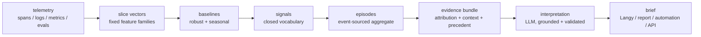

# ADR-084: Contextual slice interpretation

**Date:** 2026-07-30

**Status:** Proposed

**Behavioural contract:** [specs/analytics/slice-interpretation.feature](../../../specs/analytics/slice-interpretation.feature)

**Builds on:** [ADR-034](./034-event-sourced-analytics-materialization.md) (the slim + rollup analytics tables this reads),
[ADR-055](./055-canonical-otlp-metric-and-log-pipelines.md) (metric_data_points / log_records),
[ADR-051](./051-event-sourced-topic-clustering.md) (topic ids on the slim row),
[ADR-068](./068-windowed-clickhouse-reads.md) (every read here is windowed),
[ADR-052](./052-automations-on-process-manager-substrate.md) (the scheduler is a process manager, not new infra).

## Context

We hold metrics, logs, spans, evaluations and topics for every tenant, and today a human reads them by picking a chart, picking a filter, and eyeballing a line. That works when you already know what you're looking for. It does not answer the question people actually ask, which is "what happened to this customer last night, and does it matter".

Answering that needs 3 different things and they are usually mashed into one:

- **what happened** - statistics over a window, exact and cheap
- **why** - which sub-slice moved, and what changed around the same time
- **does it matter** - a judgement against who this customer is and what normal looks like for them

The tempting shape is to embed everything, stuff it in a vector store, and ask a model. That fails here for reasons we can name in advance: a vector over mixed telemetry has no meaningful distance, a claim built from it can not be attributed back to a row, and when the answer is wrong you can not tell which stage was wrong. We sell observability for LLM apps, shipping an unattributable LLM feature is not a good look, imo.

So the constraint is: deterministic wherever determinism is possible, learned only where patterns genuinely recur, generative only at the last mile and only over evidence that was already computed.

There is prior art in the repo to reuse rather than re-invent. The AnomalyDetector (specs/event-sourcing/anomaly-detection.feature) already does per-tenant baselines with a p95 over 7 days, a 1h baseline cache, a short-TTL "not enough data" verdict and a kill-switch flag, and every one of those exists because of a production lesson. The analytics read routing (`pickAnalyticsTable`) already knows which group-bys are parity-safe on which table. ADR-044's scheduled reports already own the delivery calendar.

## Decision

We will build a pipeline of 6 named stages, each with its own storage, its own failure mode and its own test level.

### 1. Slice vectors

**Addressing:** `SliceKey = (TenantId, EntityKind, EntityId, Grain, WindowStart)`. TenantId first, always, per the multitenancy rule. EntityKind is one of `project | customer | user | topic | model | prompt_version | origin | trace_name | conversation_cohort`. Grain is `5m | 1h | 1d`, aligned to UTC boundaries.

**Features come in families with a fixed, versioned schema.** A feature is declared as a name, a kind and an extractor, nothing else. The kind is load bearing, it decides both how the feature merges across windows and which statistical test applies:

| kind | examples | merges by | deviation test |
|------|----------|-----------|----------------|
| counter | trace count, error count, log count by severity | sum | rate ratio against a negative-binomial tail |
| gauge sketch | p95 duration, cost per trace, TTFT | t-digest merge | robust z on median + MAD |
| distribution | topic mix, model mix, error-class mix | vector add, then renormalise | Jensen-Shannon divergence against the baseline mix |
| text centroid | error-text centroid, output centroid | count-weighted mean + dispersion | cosine distance to the baseline centroid |

**Everything is mergeable, this is not decoration.** We compute once at 5m, and 1h and 1d are merges of the finer grain. Without that the cost is grain × entity × feature and it does not survive contact with a real tenant list.

**Where the families read from:** volume / cost / latency / error come off `trace_analytics` and `trace_analytics_rollup` via the existing router, quality off `evaluation_analytics`, severity and error-class off `log_records`, custom and infra series off `metric_data_points`, topic mix off the TopicId already stamped on the slim row. Reads go through `queryWindowed` (ADR-068), and group-bys go through `pickAnalyticsTable` rather than a hand-rolled query, so we inherit the parity rules instead of re-deriving them badly.

**Text centroids only ever embed already-redacted text**, respecting `PiiRedactionLevel` on the log record and the tenant egress rules (ADR-043 / ADR-053). The embedder id is stored on every vector, so a generation change partitions the index instead of silently degrading neighbour lookups.

### 2. Baselines

Per (entity, feature) robust baseline with an hour-of-week seasonal profile. Median + MAD, not mean + standard deviation, telemetry is heavy tailed and a single bad hour poisons a mean.

3 guards, each of which is the difference between useful and unusable:

- **a baseline excludes windows covered by an open episode.** otherwise a sustained regression becomes the new normal, the deviation decays to 0, and the system quietly heals its own alert while the customer is still broken. this is the single most common bug in this class of system
- **minimum support refuses rather than guesses.** below N observations the verdict is `insufficient_data`, cached with a short TTL so a ramping entity still gets a baseline within minutes. straight from the AnomalyDetector's lesson
- **multiplicity is controlled.** features × entities × windows is thousands of tests an hour, so at any per-test threshold you get a steady drip of pure noise. Benjamini-Hochberg across each (tenant, grain) tick, plus a hard per-entity daily signal budget spent on the largest magnitudes first. skip this and the feature is a spam machine that everyone mutes in week 1

### 3. Signals

A deviation that survives the guards becomes a typed Signal: `(SignalType, entity, feature, direction, magnitude, onset, support, evidenceRef)`. **The vocabulary is closed.** 4 things downstream reason over it - the LLM prompt, the precedent index, the automation trigger surface and the eval suite - and none of them are implementable over free text.

Onset comes from change-point detection on the feature's own series, not from "the current window is off". People want "started 03:10", not "it is bad now".

### 4. Episodes

Signals sharing an entity and overlapping in time collapse into an Episode, an event-sourced aggregate with a lifecycle: `open → confirmed → resolved | expired | dismissed`. Assembly is a process manager on the existing substrate (ADR-049 / ADR-051 / ADR-052).

Why an aggregate rather than a stream of alerts: one thing being wrong should be 1 episode and not 400 notifications, an interpretation needs a stable id so a brief can be revised in place rather than re-sent, a dismissal is a training label and needs somewhere to live, and a human needs a single object to mute.

### 5. Evidence bundle

Assembled deterministically, before any model is involved. 4 parts:

**Attribution.** When a top-line feature moves, decompose the delta across the dimensions available on the slim table - model, topic, origin, trace name, prompt version, customer - and sort the contributions. This is pure arithmetic and it is ~80% of "why", it is also exactly the 20 minutes of dashboard clicking an engineer does by hand, so it is the highest leverage thing in the whole design. Only decompose over dimensions the router says are parity-safe, ADR-034 documents why `metadata.model` on the rollup is not.

**Context events.** The half that turns description into explanation. Joined from the control plane by (tenant, time): prompt version published, model config or provider changed, evaluator enabled or disabled, monitor edited, key created or rotated, plan or limit changed, retention changed, SDK version first seen, experiment or dataset run started, plus the customer's own deploy markers if they send them. Ranked by proximity to the signal's **onset**, not to the window, a config change 4 minutes before onset is worth far more than one 4 hours before. This is the input that gets skipped, and it is the whole difference between "cost is up 40%" and "cost is up 40% since prompt v12 published at 03:08".

**Precedent.** Represent the episode as a vector - signal-set indicator, normalised magnitudes, top attribution dimensions, text centroid - and ANN lookup over past episodes. Within tenant first. Cross-tenant is allowed but only over **structural** features, never text and never entity ids, and only above a k-anonymity threshold, because a provider degradation looks identical in every tenant and that is real signal we should not throw away. If a near neighbour has a recorded resolution, it goes to the top of the bundle, "this shape happened on the 3rd, it was X, you fixed it with Y" beats anything a model can infer.

**Refusals.** What we could not compute and why. The bundle carries its own holes, so the interpretation can say "no baseline for this evaluator yet" instead of inventing around the gap.

### 6. Interpretation

The model receives a sealed bundle and returns a structured object, not prose:

| field | contents |
|-------|----------|
| claim | 1 sentence, the "means z" |
| confidence | high / medium / low, **with the reason it is not higher** |
| because[] | ordered, each item citing a signal id, attribution row or context event id |
| alternative | the honest second reading |
| action | from a closed catalogue: open filtered view, create monitor, roll back prompt version, add evaluator, notify, or nothing |

2 hard constraints on this stage.

**Grounding is validated mechanically.** Every number and entity id in the output must appear in the bundle. Fail → 1 retry → fall back to a deterministic template rendering of the signals and attribution. The fallback matters: the feature degrades to "the statistics, plainly stated", which is still worth reading, rather than degrading to fiction.

**No query access, but a bounded drill-down.** The model may request up to N pre-registered drill-downs from a closed catalogue - "sample 5 traces from the worst sub-slice", "error-class histogram for topic T" - each a parameterised query, results join the bundle, 1 round only. That keeps the useful part of agentic exploration without unbounded cost or an unreproducible run.

Cheap model by default, escalate only on high-severity episodes or a failed grounding check.

### Compute tiering

We can not compute every entity × window, so 3 tiers:

| tier | what | when |
|------|------|------|
| continuous | project-grain features at 1h | always, all tenants - nearly free off the existing rollup |
| implicated | fine-grained entity slices | only when a coarser signal names the entity, e.g. drill into the customers inside a project cost spike |
| subscribed | a watchlist entity (this customer, this prompt version) | on schedule, regardless of signal |

LLM spend is bounded by episodes, not slices. Slices are numerous, episodes should be rare, and if they are not then the multiplicity control is misconfigured and that is the bug to fix.

### Evaluating it

This is an LLM app, so it goes through our own product. Every interpretation is a trace, the bundle is the input, confirmations and dismissals are labels, and known past incidents are the regression set. 4 metrics:

- **episode precision** per signal type, dismissed over total. a signal type past a dismissal threshold gets auto-demoted to silent, which is what keeps the thing honest without a human curating thresholds forever
- **grounding violation rate**, which should sit near 0, it is a bug not a metric
- **time to detection** against the incident record
- **action rate**, did anyone click. the only one that really tells us the feature works

## Rationale / Trade-offs

**Splitting what / why / does-it-matter into separate stages** costs more moving parts than one model call over a context dump. We take it because each stage has a different failure mode and a different test level, and a bundled design gives you no way to tell which part was wrong when the output is wrong. It also means stage 1-5 ship without any model at all.

**Fixed feature families instead of embedding everything** gives up the ability to spot a pattern nobody declared a feature for. We take it because attributable arithmetic is worth more than unattributable similarity here, and because adding a feature is cheap - a name, a kind, an extractor.

**Mergeable sketches** constrain what a feature can be, e.g. an exact distinct count is out, a HLL is in. Worth it, it is the only reason multi-grain is affordable.

**Closed signal + action vocabularies** mean a new kind of finding needs a code change rather than a prompt change. That is deliberate, the alternative makes the precedent index, the trigger surface and the eval suite all unimplementable.

**Cross-tenant precedent** is the one place we deliberately let information cross a tenant boundary, structurally and above a k-anonymity threshold. Rejecting it entirely would be safer and would also throw away the clearest signal we have for provider-side degradation. If that trade is not acceptable it is a config flag away from being off, and everything else still works.

## Consequences

**Positive.** Attribution and context-event join alone answer most of the "why" questions people currently ask in Slack, and they ship before any model is involved. Episodes give us a dedup boundary the current trigger surface does not have. The evidence bundle is reusable as-is by Langy, by scheduled reports (ADR-044) and by the public API, so 3 surfaces render 1 object.

**Negative.** Cold start is real: a new customer has no baseline and no precedent, so the system is close to mute for their first few weeks, which is exactly when they want it most. Partial mitigation is cross-tenant structural precedent plus a population baseline over a same-shaped cohort, and we should say "not enough history yet" rather than paper over it. The text-centroid family is the weakest of the 4 and should land last.

**Neutral.** Correlation is not cause. Context-event proximity is suggestive and the copy must never assert more than the evidence carries, that is what the confidence field and the alternative reading are for.

**New storage.** A slice-vector table, a baseline store, an episode aggregate, and an ANN index for precedent. The first 3 are ordinary projections on the existing substrate. The ANN index is the only genuinely new piece of infrastructure and it can start as a brute-force scan over a bounded episode history before it needs to be anything cleverer.

### Build order

1. slice vectors + baselines + signals at project grain, no UI, just the table and a debug view. testable against historical replay
2. attribution + context events. still no LLM, and a purely deterministic brief is already useful enough to ship
3. episodes, lifecycle, dismissal
4. interpretation + grounding validator + template fallback
5. precedent index
6. text centroids, cross-tenant precedent

Phase 2 shipping with no model in it is the important part of that sequence. It de-risks the rest, and if the deterministic brief is not useful then no amount of LLM on top is going to save it.

## Open questions

- **entity cardinality** for the `user` and `conversation_cohort` kinds. bounded to top-K by volume plus watchlist, but K is unpicked and it wants a real tenant's distribution to choose
- **who owns the context-event feed.** the control-plane half is ours, customer deploy markers need a shape - OTLP event, webhook, or an SDK call
- **episode-to-incident relationship.** ADR-044 has condition-triggered incidents already, an episode is adjacent but not the same thing, and we should decide whether they merge or stay separate before phase 3
- **retention** on slice vectors. baselines want 7-30 days of history, the vectors themselves are small but there are a lot of them

## References

- Related ADRs: [034](./034-event-sourced-analytics-materialization.md), [044](./044-scheduled-reports-automation-kind.md), [049](./049-langy-projection-independent-reactions.md), [051](./051-event-sourced-topic-clustering.md), [052](./052-automations-on-process-manager-substrate.md), [053](./053-tenant-aware-egress-and-workload-isolation.md), [055](./055-canonical-otlp-metric-and-log-pipelines.md), [068](./068-windowed-clickhouse-reads.md)
- [specs/event-sourcing/anomaly-detection.feature](../../../specs/event-sourcing/anomaly-detection.feature) - the baseline / cache / kill-switch lessons this reuses
- [dev/docs/best_practices/clickhouse-queries.md](../best_practices/clickhouse-queries.md)
