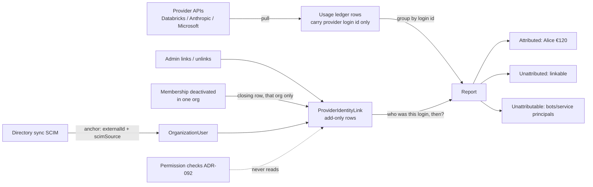
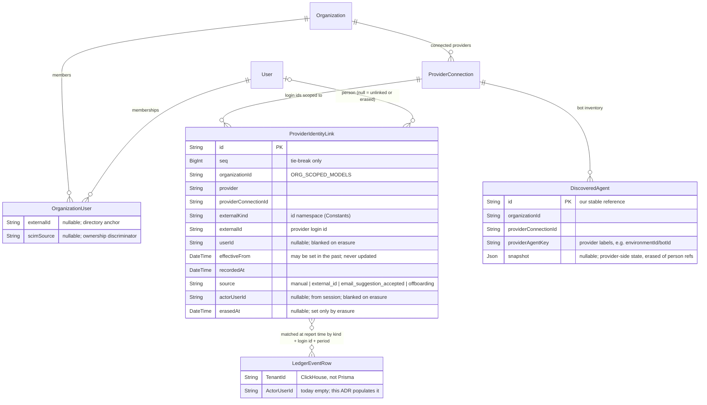

# ADR-094: Provider usage is attributed to people through an add-only login-to-person link list, resolved when reports run, never used for access decisions

**Date:** 2026-08-14

**Status:** Proposed

**Relates to:** ADR-088 (pulled usage becomes priced records in the shared usage ledger — this ADR supplies the *person* those records were deferred on, its Decision 4), ADR-092 (the authorization engine — this ADR's data is explicitly outside it), ADR-070 (package layout this ADR's shared piece follows). Prerequisite bugs filed separately: #6972–#6982.

> **One line:** every usage row we pull from a provider carries the provider's own **login id**; a small **link list** says which **person** each login id belongs to, rows are only ever **added** (never edited), the person's name is attached **when a report runs** (not when the row is stored), and nothing in this list ever decides what anyone is **allowed to do**.

**In plain terms.** Customers connect providers (Databricks, Anthropic, Microsoft) and we pull records of who used what and what it cost. Those records name people by the provider's internal ids, not by our accounts. This ADR adds the missing piece: a list that matches each provider login to a real person in the customer's organization, so a cost report can say "Alice spent €120 on Genie last month" instead of showing an opaque id. The list is a paper trail — every change is a new dated row, history never lies, and it is for *reporting only*: it never grants or removes access to anything.



## Context

- The pull pipeline and the priced ledger already exist (ADR-088, shipped on `feat/adr-088-pulled-usage-reporting`). ADR-088's Decision 4 explicitly deferred "named-person attribution" — this is that work.
- Usage rows in ClickHouse have an `ActorUserId String` column (migration 00026, DDL line 74) that is written as `""` today (`pullerWorker.ts:324`) and has no index. The join key exists but is never fed.
- The codebase already has a precedent for "this row is owned by the customer's directory": `Group.externalId` + `Group.scimSource` + `@@unique([organizationId, externalId])` (schema.prisma:2235ff), and shipped code discriminates directory ownership on `scimSource` (`role-binding.service.ts:961-968`).
- Production (2026-08-13): 7,151 organizations, 8,620 users, 207 people in more than one organization, 3 organizations using directory sync (SCIM). The change must be purely additive — new tables and optional columns only.
- Nine design revisions (v1–v8 dead, v9/v10 survived adversarial review) preceded this ADR. The death causes are listed under Rejected alternatives so they are not re-invented.

**Forcing function.** Customer requirements arriving with the Azure proof-of-concept; the ledger this attributes is merging now.

**Locked constraints (Phase 1, confirmed 2026-08-14 by Sergio):**

1. **Attribution never authorizes** — nothing in the link list participates in any permission decision.
2. **Add-only** — corrections and offboarding are new rows, never edits or deletes.
3. **Additive migration** — new tables and optional columns only; zero behavior change for organizations without a provider connection.
4. **Reuse the Group/SCIM precedent** — the directory anchor mirrors what `Group` already does; no parallel identity infrastructure.

## Decision

Each numbered choice names why, what it rejects, and which locked answer it traces to.

**1. One link table, ids typed by kind, keyed per connection.** *(Phase-1 scope lock: v10 baseline.)* A row says: in organization O, provider connection C, the login id of kind K with value V belongs to person P, effective from time T. The **kind** column exists because every provider exposes two or more id namespaces for the same person (Databricks: numeric workspace id / SCIM external id / email; Anthropic: member id / service account / API key / bare email; Microsoft: objectId / UPN / PUID) — a bare string invites a Databricks number colliding with an Anthropic email in the same lookup. The **connection** is in the key because a customer will legitimately hold two connections to the same provider with non-interchangeable id spaces (Anthropic Console vs Enterprise; Databricks workspace vs account). Rejects: one untyped id column (v9's shape, corrected in v10), and keying by provider alone.

**2. The person's name attaches when the report runs, not when the row is stored — and it attaches per time period, not once per login id.** *(Locked: fork round 1, question 1; narrowed by red-team 2026-08-14.)* Usage rows keep only the provider's login id. Reports sum usage in ClickHouse grouped by login id **and by time period**, then attach names in memory by asking, for each period, who owned that login id *then*. A login id reassigned mid-report (Alice's until February, Bob's from March) must never hand Alice's January money to Bob — one whole-range "who owns it now" lookup per login id does exactly that, so it is banned (red-team, correctness lens). Link changes are rare, so each login's timeline is short and the split is cheap.
Two spellings of "the same login id" are pinned down *(external review v4)*:
- **Lookups never cross connections.** Every ledger row already carries the id of the connection that pulled it (`SourceId`, written unconditionally at `pullerWorker.ts:319`); reports group by it alongside the login id, and each adapter writes exactly one declared kind per id namespace — so a Databricks numeric id can never meet an Anthropic email in one bucket.
- **A handover inside a reporting period splits the period at the link boundary.** Usage before the new link's `effectiveFrom` goes to the old owner, usage at or after it to the new one — never "whoever owned it at period end".
Consequences that make read-time the right default:
- A link added or corrected late fixes **all history retroactively, for free** — no restating of stored rows. Restating stored attribution is the failure class that killed v4 (last-write-wins) and v8 (retry data loss).
- Honest cost accounting — the report has two stages with different bills (red-team, scale lens):
  - **Summing in ClickHouse** grows with the organization's *usage volume* in the window: the ledger is sorted by tenant and event id, not by login id (migration 00026:107), so the whole window is read. That is the work ClickHouse is built for and it is fine today. If a heavy-usage organization ever makes it slow, the fix is a ClickHouse rollup keyed by login id — **a real ClickHouse schema change, named here, not hidden**.
  - **Attaching names** grows with *people in the report*: 10,000 people ≈ one indexed query (tens of ms) plus in-memory lookups. The Postgres lookup-table escape hatch below helps only this stage.
- The stated cliff for name-attach: platform-wide reports across all organizations, or organizations past ~100 k members. Neither exists. If one appears, a periodically refreshed lookup table can be added **without changing the link table** — recorded as the escape hatch, not chosen now.
Rejects: stamping the person into ClickHouse at ingest (fast reads, but every late link forces a restatement); one whole-range lookup per login id (mis-attributes reassigned logins — see above); the periodic lookup table now (adds a freshness lag and a second thing to keep honest, for a scale problem we don't have).

**3. Rows are only added, never edited.** *(Phase-1 constraint 2.)* A correction is a new row — appended later in sequence, though its `effectiveFrom` may sit earlier than the row it supersedes (that is what a backdated correction is; "later" is the append order, never a constraint on the effective time); an unlink is a new row whose person is empty. Ordering is `effectiveFrom` descending, then `seq` descending — `seq` is a database-assigned increasing number whose only job is breaking ties when two rows share a timestamp (precedent: `GatewayChangeEvent.revision`, schema.prisma:3410). The single named exception is erasure (Decision 9), which blanks identifying values in place and is the only update the storage layer exposes; every row it touches keeps a non-identifying audit trail (`erasedAt`), so the exception is visible in the data, not just in this document. Who writes, and how loudly *(red-team, operability lens)*: creating or closing links requires organization-admin rights; the actor comes from the session, never the request body. Backdating is allowed — it is how corrections work — but it is never silent: a new row whose `effectiveFrom` falls before the organization's most recent report export makes the next report carry an "attribution changed for already-reported periods" notice. Without that, an admin could quietly rewrite who spent last quarter's money and nobody would be told. Rejects: editable rows (history would lie about who spent the money).

**4. Offboarding closes links in the one organization where membership ended, from now on.** *(Locked: fork round 1, question 2.)* One hook, `onMembershipDeactivated(organizationId, userId, actorUserId?)`, called from all six deactivation entry points, appends closing rows **scoped to that organization**. Past attribution stays. A person's global account is deactivated only when their **last** active membership goes — 207 people belong to more than one organization, and today's global deactivate (`user.service.ts:142-152`, filed as #6976) lets one organization's directory toggle a person's account in another organization. Reactivation restores access but **never auto-restores links** — the admin relinks, and the documentation line that promises immediate restore (`docs/platform/scim.mdx:129`) gets one added sentence.
Two hard lessons from the red-team are part of this decision:
- **The closing row is written in the same database transaction as the membership change** *(failure lens)*. The SCIM delete path today commits the membership removal first and only then deactivates (`scim.service.ts:470-478`); a failure between the two would lose the closing row forever, and the SCIM retry returns 404 before ever reaching it. Append-after-commit is exactly the loss window — banned. A periodic sweep additionally flags any still-open link whose person has no active membership in that organization (idempotent, self-healing).
- **Every place that reads the global account flag is in scope, not just the six places that write it** *(second-order lens)*. Moving directory-driven deactivation onto per-organization membership makes checks that read only the global flag go stale. Known instance: the CLI token gate (`auth-cli.ts:458`) checks `deactivatedAt` and membership *existence* but never `disabledAt` — under this change, a person removed from org A by their directory would keep CLI access to org A. The PR that flips the write must fix the enumerated read sites and ship the two-org test (disable in A → CLI key fetch in A returns 403, org B unaffected). `api-key.repository.ts:143` is flagged for the same audit.
Rejects: global close (wrong for multi-org people); retroactive unlink (violates constraint 2 and rewrites history); append-after-commit (the loss window above).

**5. When no link matches, the report says so honestly — it never guesses.** *(Locked: fork round 1, question 3.)* Two named buckets, both counted in totals:
- **Unattributed** — a login id with no link yet. An admin can fix this by linking.
- **Unattributable** — actors that can never resolve to a person: service principals, applications (Copilot audit `UserType` 5/6), bots running with no per-user records. Shown as its own line so nobody chases links that cannot exist.
Which bucket a row can belong to is decided **at ingest, by the adapter**, from provider metadata (Copilot `UserType`, Databricks service-principal flags) — each row is marked person / service principal / bot when pulled *(external review v4)*. A person row without a link is unattributed; the rest are unattributable. The report never infers "unattributable" from the mere absence of a link — that would silently reclassify every not-yet-linked person as a bot.
Attributed + unattributed + unattributable always equals the ledger total; nothing is dropped. Rejects: falling back to email matching (email recycling killed v1 and poisoned v6 — a silent wrong guess in a money report); dropping unmatched rows (totals stop matching the ledger and the gap is invisible).

**6. Built as a shared building block from day one.** *(Locked: fork round 2 — Sergio's call, against the strategist recommendation of building it small first; dissent recorded in Revisions.)* The link list and its read function live in their own package following the repo's package layout (ADR-070; same shape as the access-control packages): a small package with the vocabulary and the read service over a storage interface, the Prisma implementation in the app. Two rules make "shared" safe:
- The public surface is **read-only resolution** ("who was login id X in organization O at time T?") plus the append operations. It exposes nothing shaped like a permission check.
- **Constraint 1 is structural, not policy:** the access-control packages must not depend on this package, enforced by a dependency test (see Gates). A future team that wants "who is this?" for permissions gets a build error, not a code-review comment.

**7. The directory anchor is the Group triple on `OrganizationUser`.** *(Phase-1 constraint 4.)* `externalId String?` + `scimSource String?` + `@@unique([organizationId, externalId])`, exactly mirroring `Group`. Directory ownership is discriminated on `scimSource` — the convention shipped code already keys on — not on "externalId is set". The six SCIM touch sites parse and echo `externalId` (#6974) and match on it in filters (#6973). Microsoft Entra precondition: its *default* mapping sends a mutable nickname as the external id; the anchor is only stable after the customer remaps objectId. Guard: **warn, don't reject**, when an inbound id isn't a GUID — Okta's immutable id isn't a GUID and works today. Rejects: a separate directory-identity table (parallel infrastructure, against constraint 4).

**8. Bots get our own row id plus the provider's labels as the recognition rule.** *(Locked: fork round 3, question 1 — "a combination of both".)* Each discovered bot/agent is one row whose primary id is ours (what everything else references, stable forever), with a uniqueness rule on `(organizationId, providerConnectionId, providerAgentKey)` where `providerAgentKey` is the provider's own labels joined per adapter (Copilot Studio: `environmentId/botId` — bot ids are only unique within an environment). Recognition across pulls is the uniqueness rule itself (insert, catch the duplicate, reuse the row) — there is no separate lookup that can drift. Provider-side state (quarantined, deleted) lands in the snapshot payload and never changes our promotion status. Rejects: provider labels as the primary key (renames/migrations would re-identify rows everywhere they're referenced); a made-up id with a maintained mapping table (the sync-drift bug class).

**9. Forgetting a person erases who they were — never which rows exist.** *(Re-locked 2026-08-14 after the red-team reversibility lens killed the original blank-everything plan; see Revisions v3.)* A right-to-be-forgotten request blanks the **person reference** (`userId`) on their link rows and deletes their directory anchor values — but the rows themselves stay in place with their login ids and dates. Every login's timeline keeps every row, so no superseded older link can silently come back into force and nobody else's attribution moves; the erased person's past spend stays in the totals as "former member (erased)" — display copy inside the **attributed** bucket, since the timeline still resolves, just to an erased person instead of a name; Decision 5's conservation equation is untouched. One special case: when the login id itself names the person (an email-kind id), the value is replaced with an opaque token **derived from the email with an organization-scoped keyed hash** *(mechanism amended in v4)* — deterministic, so every row that carried that email gets the same token, and the report can derive the identical token from the raw emails still sitting in ClickHouse and keep matching the erased timeline. A stored random token would break that join: ClickHouse retains raw provider events until their time-to-live expires — a stated limit, not a silent one — and until then the report joins on the raw email, so a token it cannot re-derive would dump every erased person into "unattributed" instead of "former member (erased)". The cost of the deterministic hash is named, not hidden: the per-organization key must be kept (server-side only) for as long as reports run, and anyone holding both the key and a guessed email could confirm that email once existed in the organization — the standard price of a pseudonymized join, accepted. And the key cannot be rotated for rows already erased: the email needed to re-derive their token is gone, so a leaked key is that oracle permanently — which is why the key lives in the secret store with the narrowest access, not in the database beside the tokens. Erasure also blanks `actorUserId` wherever it names the erased person, blanks person references inside `DiscoveredAgent.snapshot` payloads, and stamps every touched link and inventory row with `erasedAt` — so erasure ("person forgotten") and unlink ("admin closed the link": `userId` null, no `erasedAt`) stay distinguishable forever. The directory anchor gets no marker: it is a mutable pointer with no history, so blank-after-erasure and never-set look the same — acceptable, because the anchor carries no timeline to audit. `externalKind`, timestamps, and org/connection keys are not personal data and survive. Non-email provider ids (numeric ids, object ids, member ids) survive too — not because they are harmless, but because after erasure they are pseudonyms whose key we no longer hold: with `userId` blanked and the anchor gone, nothing on our side can turn them back into a person, and the only party that still could (the provider) already holds them. Rejects: blanking the login id (the v1 lock — reports find rows *by* login id, so blanked rows vanish from the timeline and the previous owner inherits the erased person's spend); deleting the rows (same resurrection bug, and published totals change after the fact).

**10. Attribution never authorizes — enforced, not promised.** *(Phase-1 constraint 1.)* No permission check reads this data, and Decision 6's dependency test makes that mechanical. The `RoleBinding`/authz path and this package share nothing but the database.

**11. The migration is additive only.** *(Phase-1 constraint 3.)* Two new tables, two optional columns on `OrganizationUser`, two uniqueness rules (the `OrganizationUser` anchor and the `DiscoveredAgent` recognition key), one ClickHouse index. No existing column changes type or meaning; organizations without a provider connection see zero behavior change. The new table registers in `ORG_SCOPED_MODELS` (`dbOrganizationIdProtection.ts:210`) so cross-organization reads are blocked by the existing guard.

## Constants

| Name | Value | Purpose |
|---|---|---|
| Link ordering | `effectiveFrom DESC, seq DESC` | one deterministic winner per login id per moment |
| `seq` | `BigInt @default(autoincrement())` | tie-break only; never business meaning |
| `externalKind` values | per-provider enums in code (Databricks: `numeric_id \| scim_external_id \| email`; Anthropic: `member_id \| service_account \| api_key \| email`; Microsoft: `entra_object_id \| upn \| puid`); DB column stays `String` | same posture as `provider` |
| `source` values | `manual \| external_id \| email_suggestion_accepted \| offboarding` | how the row came to exist |
| Bucket names | `unattributed` (fixable) vs `unattributable` (can never resolve) | report copy; never merged |
| Global deactivate trigger | active memberships = 0 | last membership out turns off the account |
| Erasure blanks | `userId` and `actorUserId` on link rows (and person references in `DiscoveredAgent.snapshot`); anchor `externalId` on `OrganizationUser`; email-kind `externalId` swapped for the keyed-hash token; `erasedAt` stamped on every touched link/inventory row (the mutable anchor gets no marker — Decision 9) | rows, non-email login ids, `externalKind`, timestamps, org/connection keys survive — no timeline row ever disappears |
| Erased-email token | keyed hash of the **canonical** email — trimmed, lowercased, UTF-8 bytes (providers disagree on case) — key scoped per organization, **one key version, rotation prohibited** (it is unrotatable for erased rows anyway, Decision 9), kept server-side for the life of reporting | reports derive the same token from ClickHouse's raw emails at read time, so erased timelines keep matching (Decision 9); test: stored token equals the report-derived token while raw rows are still queryable |
| Bot recognition key | `(organizationId, providerConnectionId, providerAgentKey)` unique | e.g. Copilot Studio `environmentId/botId` |
| ClickHouse changes | exactly 1 now: populate `ActorUserId` + bloom-filter index (sibling of `idx_actor_email`, migration 00026:100). The index serves per-person drill-down filters, **not** the report group-by; if heavy orgs make the group-by slow, the named follow-up is a rollup keyed by login id — a second ClickHouse change, priced then (Decision 2) | the join key reports group by |
| Freshness copy (revising providers) | "complete through watermark − 30 days" (Anthropic Enterprise) | honesty about provider-side restatement (#6978, ADR-088 restatement path) |

## Invariants

| Invariant | Meaning | How satisfied / test anchor |
|---|---|---|
| Totals conserve | attributed + unattributed + unattributable = ledger total, always | report resolver never filters rows out; test sums the three buckets against the raw ledger |
| Never authorizes | no permission decision reads link data | dependency test: authz packages import nothing from the identity-link package; grep-level CI check on the package boundary |
| Add-only | no update/delete on link rows — erasure is the single named exception (Decision 3) and marks itself with `erasedAt` | storage interface exposes `append*` + `eraseIdentifiers` only; test asserts no other mutator exists |
| Organization isolation | every read/write filtered by `organizationId`; the scope fields (`userId`, `actorUserId`, `providerConnectionId`) are plain ids with no database relations — the service validates ownership | `ORG_SCOPED_MODELS` registration + existing guard test; per-query org filter in the repository; test: creating a link with a `providerConnectionId` owned by another organization is rejected |
| Deterministic resolution | same inputs → same person, even with same-timestamp rows | ordering constant above; test inserts two rows with equal `effectiveFrom`, asserts `seq` wins consistently |
| Offboarding is scoped | closing org A leaves org B attributed | test: person in two orgs, deactivate in A, resolve in both |
| Anchor uniqueness | one directory subject per org per external id | `@@unique([organizationId, externalId])`; SCIM round-trip test creates, filters, echoes |
| Period-correct attribution | money goes to whoever owned the login id *during each period*, never blanket-assigned to the current owner | test: login owned by A Jan–Feb, B from Mar, links backfilled late; Q1 report puts Jan–Feb on A, Mar on B. Second test: handover on Mar 15 splits March at the boundary — pre-15th on A, 15th-onward on B |
| No orphan open links | membership gone ⇒ closing row exists | written in the same transaction as the membership change; test injects a failure between the membership write and the closing-row write and asserts the **whole transaction rolls back** — nothing half-committed. The sweep's separate test covers links left open by any path that slips through |
| Erasure is distinguishable and complete | an erased row is never mistaken for an unlink, and no personal identifier survives (non-email login ids stay by design, Decision 9) | `erasedAt` set on every touched link/inventory row; test erases a person who also authored link rows and asserts `userId`, `actorUserId`, and snapshot references are all blanked |
| Deactivation is read everywhere it is written | per-org disable actually blocks per-org access paths | two-org test at the `auth-cli.ts:458` gate: disable in A → 403 in A, org B unaffected |
| Closed periods never change silently | a backdated link before the last report export surfaces a notice | test: export, backdate a link, next report carries the change notice |

## Assumptions

| Assumption | What breaks if false |
|---|---|
| Provider login ids are stable and never recycled within a connection (Entra objectId immutable; Databricks workspace `user_id` immutable) | history silently points at the wrong person — the email-recycling failure (v1) in a new coat. Mitigation: ids are per-kind and per-connection; a provider that recycles an id kind must not be used as a link source |
| One directory per organization per connection | two IdPs writing one org collide on the anchor uniqueness rule; the second write fails loudly (acceptable: surfaces the misconfiguration) |
| Links per organization ≈ headcount (small multiples with history) | name-attach stops being cheap past ~100 k members or platform-wide reports; escape hatch: periodic lookup table (Decision 2), no link-table change. The ClickHouse summing stage is billed separately (next row) |
| Production's missing columns are deploy lag, not drift | the additive migration fails on divergent DDL; checked against prod schema 2026-08-13 (additive-safe) |
| The ClickHouse group-by over an org's window stays fast enough at current volumes (the ledger has no login-id index; sort key is tenant + event id) | heavy-usage orgs get slow reports; named follow-up: rollup keyed by login id — a real ClickHouse change (Decision 2). The bloom index does not help here; it serves drill-down filters |

## Gates

| Path | Reversible? | Blast radius | Gate |
|---|---|---|---|
| Prisma migration (tables, columns, unique) | forward-only — this repo never rolls a migration back; undo = a follow-up migration dropping the additions, plus a coordinated code deploy | large | human review + the follow-up "drop the additions" migration written alongside |
| Link create / unlink (tRPC) | yes — correction is a new row | large (money attribution) | automated: org-isolation test, determinism test, actor from session never request body, org-admin permission test, change-notice test for backdates before the last export |
| Offboarding hook (6 call sites) | yes — new rows | large | automated: scoped-close test (org A/org B), last-membership test, same-transaction test (failure injected after membership commit), sweep test, `auth-cli` two-org 403 test |
| SCIM anchor writes (6 sites) | yes | medium | automated: round-trip + filter-match tests; Entra GUID warn path tested |
| ClickHouse `ActorUserId` populate + index | yes — restatement path exists | large | automated: adapter tests; restatement idempotence per ADR-088 |
| Report read path (buckets) | yes | medium | automated: totals-conserve test. No human gate — none |
| Erasure blanking | **no** — destroys identifiers | large | human review, always + count-first dry run printed before execution |
| Package boundary (never-authorizes) | yes | large | automated: dependency test in CI, fails the build on violation |

## Rejected alternatives

- **Stamp the person at ingest** — every late/corrected link forces restating stored rows; the v4/v8 failure class.
- **Periodic lookup table now** — freshness lag + second source of truth for a scale problem that doesn't exist; kept as escape hatch.
- **One untyped id column** — cross-namespace collisions (Databricks number vs Anthropic email); v10's fix stands.
- **Global offboarding close** — wrong for the 207 multi-org people.
- **Retroactive unlink** — history lies about who spent the money; violates add-only.
- **Email fallback matching** — email recycling killed v1, poisoned v6; never in a money report.
- **Drop unmatched rows** — totals stop matching the ledger, invisibly.
- **Build small, governance-only** — strategist recommendation; overruled, see Revisions v1.
- **Provider labels as the bot primary key** — renames re-identify rows everywhere referenced.
- **Made-up bot id + mapping table** — the mapping drifts; sync-bug class.
- **Separate directory-identity table** — parallel infrastructure; the Group triple already is the precedent.
- **Delete rows on erasure** — published totals change after the fact, and removing a mid-timeline row puts a superseded link back in force.
- **Blank the login id on erasure** — the original v1 lock; killed by the red-team: reports find rows by login id, so blanked rows vanish from the timeline and the previous owner inherits the erased person's spend.
- **Editable link rows / last-write-wins** — v4's death.
- **Live authorization coupling** — v2's death; now structurally excluded (Decision 6, 10).

## Consequences

**Positive.** Cost reports name real people; late links heal history for free; multi-org people stop being collateral of one org's directory; the unresolvable is counted, not hidden; a second team can adopt the package without a refactor.

**Negative.** Every report pays a (small, bounded) name-resolution step; "shared from day one" spends design effort before a second caller exists and the interface may still bend when one arrives; add-only means the table only grows (mitigated by its ≈headcount scale); reactivated members stay unattributed until an admin relinks — a support-visible sharp edge we chose over silent relinking.

**Neutral.** Erasure keeps anonymous money rows; ClickHouse raw events expire by TTL only; Copilot Studio attributes activity but not spend (no public per-user credit API); Anthropic Enterprise numbers are complete only through watermark − 30 days.

## Open questions

| Question | Owner | Trigger / deadline |
|---|---|---|
| Materialize the lookup if scale cliff appears (>~100 k members per org, or platform-wide reports) | Sergio | first occurrence; no table change required |
| Account-level Databricks SCIM migration changes the id namespace — adapter keeps endpoint in one named constant | adapter owner (PR #6670 line) | when a customer migrates workspace → account SCIM |
| Same-money supersede rules (estimate → invoiced) | ADR-088 scope, not this ADR | per ADR-088 Decision 6 |
| Copilot Studio usage adapter (#6980) — until then that provider is inventory-only | adapter owner | when audit-API work is scheduled |

## Revisions

- **v1 — 2026-08-14 — captain: Sergio Esteban.** Initial lock from three question rounds. Round 1: read-time resolution (with 10 k-headcount math), org-scoped forward-only offboarding, honest buckets. Round 2: **build shared from day one — Sergio's call over the strategist's build-small recommendation**; dissent recorded: at one caller the interface is shaped by guesses; mitigated by read-only surface + dependency test. Round 3: bot identity = own id + provider-label recognition ("combination of both"), erasure blanks ids and keeps money, document lives in the repo. Constraints re-confirmed: never authorizes, add-only, additive migration, Group/SCIM precedent.
- **v2 — 2026-08-14 — six-lens red-team panel; captain: Sergio Esteban.** Every lens landed. Five findings folded, one decision reopened:
  - *Correctness:* one whole-range name lookup per login id hands a reassigned login's entire history to its latest owner. Decision 2 narrowed: resolution is per time period, never once per range.
  - *Scale:* the report's two stages billed separately; the ClickHouse summing stage grows with usage volume (ledger has no login-id index), and the escape hatch for that is a rollup — a real ClickHouse change, now named. Bloom index re-scoped to drill-down only.
  - *Failure:* append-after-commit loses the closing row forever on a mid-offboarding crash (`scim.service.ts:470-478`), and the SCIM retry 404s. Decision 4 narrowed: closing row in the same transaction + reconciliation sweep.
  - *Operability:* a backdated link silently rewrote already-exported reports. Decision 3 narrowed: org-admin permission named; backdates before the last export surface a change notice.
  - *Second-order:* read sites of the global flag are in scope, not just write sites — `auth-cli.ts:458` would regress (SCIM-removed user keeps CLI access in that org). Decision 4 narrowed: read-site fixes + two-org 403 test ship with the write flip.
  - *Reversibility:* **Decision 9 (erasure) died as specified** — blanking login ids mid-timeline resurrects superseded links, and blanking only one person's rows shifts the same bug to the previous owner. Fork reopened and re-asked, not silently re-decided. Migration gate rewritten to match this repo's forward-only rollback reality.
- **v3 — 2026-08-14 — erasure fork re-locked; captain: Sergio Esteban.** New answer: **erase the person, keep the row.** `userId` blanked, directory anchor deleted, email-kind login ids swapped for one consistent opaque token; rows, non-email login ids, and dates all stay. No timeline row ever disappears, so no superseded link can come back into force. Replaces the v1 blank-everything lock.

- **v4 — 2026-08-14 — external review folded (CodeRabbit, PR #6987); captain: Sergio Esteban.** Twelve findings; eleven accepted, none re-opens a locked fork.
  - **Decision 9 mechanism amended** (the one substantive change, sign-off: Sergio): v3's stored opaque token cannot match the raw emails ClickHouse keeps until TTL, so every erased person would have fallen into "unattributed". The token is now **derived with an org-scoped keyed hash** — at erasure for stored rows, at report time for ledger emails — so the erased timeline keeps matching. Added `erasedAt` (erasure vs unlink were previously indistinguishable, both `userId = null`), and erasure now also blanks `actorUserId` and person references in `DiscoveredAgent.snapshot`.
  - **Decision 5:** bucket membership (person / service principal / bot) is the adapter's ingest-time declaration from provider metadata, never inferred at report time from a missing link.
  - **Decision 2:** pinned two readings of "same login id" — grouping always includes the connection (`SourceId` is already on every ledger row), and a mid-period handover splits the period at the link's `effectiveFrom` boundary (invariant test added).
  - **Decision 3:** the erasure carve-out is now stated everywhere add-only is claimed, with `erasedAt` as its audit trail.
  - **Mechanics:** transaction-rollback test corrected (failure injected before commit, not after — post-commit failure is the sweep's test); `DiscoveredAgent.snapshot` promoted from comment to `Json?` column; `@@index([organizationId, userId])` added for erasure/offboarding lookups; ER edge for the stored `userId` relation made solid; "one uniqueness rule" corrected to two; `effectiveFrom` reworded from "backdatable" to "may be set in the past; never updated".
  - **Rejected:** the future-date flag — 2026-08-14 is the real date; the reviewer's clock artifact, not ours.

- **v5 — 2026-08-14 — second external pass folded (CodeRabbit incremental review, PR #6987); captain: Sergio Esteban.** Five threads, six findings; all accepted as tightened wording or completed contracts — no fork mechanism changed.
  - **Decision 3:** a correction is appended later but may carry an *earlier* `effectiveFrom` — "later" was always the append order, never the effective time; now said, so backdated corrections don't get rejected as misordered.
  - **Decision 9:** non-email provider ids re-labeled from "not personal data" (wrong — an object id still resolves to a person) to *pseudonyms whose key we no longer hold* after `userId` and the anchor are gone; "former member (erased)" pinned as display copy inside the **attributed** bucket, conservation equation untouched; `erasedAt` narrowed to link/inventory rows — the mutable anchor gets no marker, and the ADR now says why that is acceptable.
  - **Token contract completed:** canonical input bytes (trimmed, lowercased, UTF-8), one key version per organization, rotation prohibited outright, and a stored-vs-report-derived match test while raw rows are still queryable.
  - **Scope fields declared honestly:** `userId` / `actorUserId` / `providerConnectionId` are plain ids with no database relations; the service validates connection ownership, and a cross-organization rejection test joins the isolation invariant.

## Final ER model

Solid lines are database relations; dashed lines are resolved at report time, not stored.



```prisma
// Add-only list: which provider login belongs to which person, when, per connection.
// Reporting only — never read by any permission check (ADR-094 Decision 10).
model ProviderIdentityLink {
  id                   String   @id @default(nanoid())
  seq                  BigInt   @default(autoincrement()) // tie-break only (precedent: GatewayChangeEvent.revision, schema.prisma:3410)
  organizationId       String   // registered in ORG_SCOPED_MODELS
  provider             String
  providerConnectionId String   // in the key: two connections to one provider are legitimate; plain id, no relation — the service checks the connection belongs to organizationId before insert
  externalKind         String   // which id namespace this value lives in (see ADR-094 Constants)
  externalId           String   // the provider's login id (kept on erasure; email-kind values swapped for the keyed-hash token)
  userId               String?  // null = unlink row (blanked on erasure)
  effectiveFrom        DateTime // may be set in the past (that's how corrections work); never updated after insert
  recordedAt           DateTime @default(now())
  source               String   // manual | external_id | email_suggestion_accepted | offboarding
  actorUserId          String?  // who made the change (from session, never request body); blanked on erasure
  erasedAt             DateTime? // set only by erasure — distinguishes "person forgotten" from "admin unlinked"

  @@index([organizationId, provider, providerConnectionId, externalKind, externalId, effectiveFrom(sort: Desc)])
  @@index([organizationId, userId]) // erasure and offboarding find rows by person
}

// On OrganizationUser (mirrors Group, schema.prisma:2235ff):
//   externalId  String?  // the DIRECTORY's id for this member (unlike VirtualKey/GatewayBudget.externalId,
//                        // which mean "customer-supplied id" — different concept, same word)
//   scimSource  String?  // "scim" when directory-managed — the ownership discriminator shipped code keys on
//   @@unique([organizationId, externalId])

// Inventory of bots/agents seen in providers. Our id is the reference; the
// provider-label combination is the recognition rule (Decision 8).
model DiscoveredAgent {
  id                   String   @id @default(nanoid())
  organizationId       String
  providerConnectionId String
  providerAgentKey     String   // provider labels joined per adapter, e.g. "environmentId/botId"
  snapshot             Json?    // provider-side state (name, ownerUserId?, quarantined, …) — inventory data, never our status; person references inside are blanked on erasure (Decision 9)

  @@unique([organizationId, providerConnectionId, providerAgentKey])
}
```

ClickHouse: no new tables. Populate `ActorUserId` (today `""`, `pullerWorker.ts:324`) and add a bloom-filter index beside `idx_actor_email` (migration 00026).
