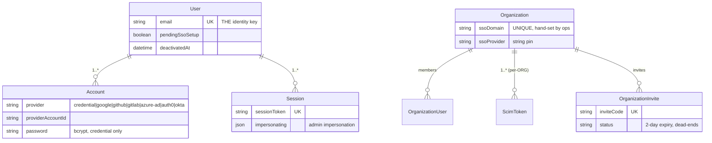
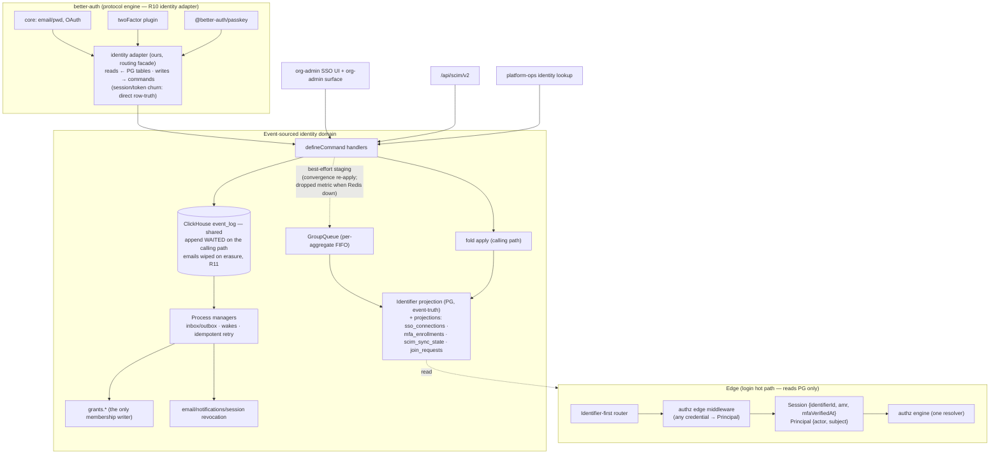
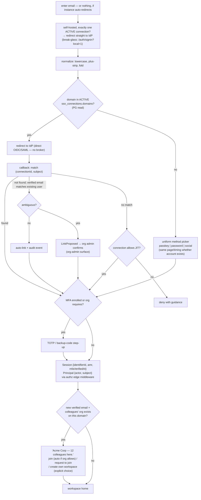

# Identity Platform Redesign — EPIC

Self-hosted auth, per-org SSO, MFA, passkeys, SCIM, join-requests — built on the unified authz engine.

**Status:** epic spec. Deliverable specs live in `dev/docs/identity-platform/D*.md`; sequencing and gates in `dev/docs/identity-platform/delivery-plan.md`.
**Working branch/worktree:** `feat/sso-thinking` (`.claude/worktrees/sso-thinking`)
**Precondition:** the unified authorization program (**ADR-092**, as reshaped by **ADR-110** — a grant is its own aggregate, one migration per organization, and finishing it IS the switch; #7358, #7404) has **landed on `main`** (checked 2026-08-23): `GrantsService.attach/offboard` is the membership writer, checks go through `.permission()` / `getApp().permissions`, and the engine gate reads the migration's `finalized` status and nothing else. This epic consumes that API; it does not build it. The authz program hands this one three ready-made pieces: ADR-007's Redis-loss doctrine amendment (doctrine, deliberately not a primitive; identity joins it in D02 — and deliberately does **not** adopt ADR-110's "Redis down ⇒ writes down" position, since sign-in is the one write path that must survive Redis loss, ADR-101 §Revision 2026-08-23), the `@langwatch/system-migrations` package (landed, #7079, #7337; carries D01's backfill and D04's grandfathering; cloud pacing is per-organization enrollment and nothing else), and the ADR-110 in-place rollout shape (new head born clean, adoption by ids stable across retries, a migration that states facts and checks once, `finalized` as the only switch for reads and writes, held tenants with outstanding facts named, rollback as a status change) this epic transplants wholesale, re-tenanted to users.
**Review history:** Notion round 1 (identifiers storage, Redis resilience, self-hosted single-SSO priority, join-requests + invitation resilience); corpus audit round 2 (`review-spec` against `specs/` + `dev/docs/adr/` — findings folded in below); restructure round 3 (RBAC assumed done; epic → deliverables → delivery plan).

# Overview

LangWatch's auth already migrated from NextAuth/Auth0-as-library to better-auth (done on `main`), but enterprise identity still runs through Auth0 as a broker: one auth method per deployment, enterprise SSO reduced to two strings on `Organization` set by hand, no SAML, no MFA, no passkeys, and SCIM writing membership tables directly. Support pain is structural — identity states exist that the product can't see and support can't fix without DB surgery.

This program makes identity first-class and self-service:

- An **identifiers** model: one user, many attach/detach-able verified identifiers (email, password, OAuth, OIDC/SAML, passkey), tombstoned forever. Storage = a **new pure event-truth Postgres `Identifier` projection**, born clean and backfilled grants-style; `Account` stays a 100% row-truth protocol table (see D01, ADR-101 rev. 2026-08-20).
- A first-class, event-sourced **SsoConnection** per organization with a guarded lifecycle, domain verification, and org-admin self-service onboarding. Self-hosted priority: single-SSO deployments auto-redirect straight to the IdP.
- **Domain join-requests** (ask-to-join with org-admin approval, or domain auto-join where the org opts in) and **resilient invitations** (identifier-aware acceptance, inviter one-click resend) — the fixes for the invitation dead-end support load and for the orphaned organizations sign-up keeps minting.
- A **first-party sign-in & sign-up UI** (D13): Auth0 owned the front-door screens; every unauthenticated screen is rebuilt in-product, and sign-up offers join-your-team **before** create-a-workspace.
- **MFA (TOTP + backup codes, never SMS)** and **passkeys**, using better-auth plugins for protocol while our domain model remains the record.
- SCIM scoped per connection, producing commands/events, writing membership exclusively through `grants.*`.
- **Two separate identity surfaces**: a platform-ops identity lookup (cross-org support tooling) and an org-admin surface inside org settings.
- **Sign-in never touches the event pipeline**: sessions and OAuth tokens are repository-written rows, never events (R12), so the hot path reads and writes Postgres only. Ceremony commands ride the standard pipeline on the one shared ClickHouse event log (R13); they complete on the calling path (append + apply, staging best-effort), so D02 only has to harden the seams for a Redis outage and degrade sessions to PG-only.
- Auth0 dies slowly: enterprise customers migrate one at a time onto direct OIDC; then Auth0 code, config, and spend are deleted.

Everything runs on the existing event-sourcing framework — commands → events → applies/projections, process managers — appending to the same ClickHouse `event_log` as every other pipeline (R13: one log, no identity-private event store). Postgres holds the projections and the row-truth values (emails, credentials, sessions); the sign-in hot path touches only Postgres because sessions and tokens never become events (R12). Authorization is expressed entirely in the unified authz API (`registry`, `authz.require`, `grants.*`, `useCan`) — no seams, no interim verbs.

# Requirements

Requirements are stated here at domain level; the normative, implementable version of each lives in the linked deliverable spec.

## Domain: Identifiers → D01

- A user has many identifiers; exactly one PRIMARY email identifier. Types: `email`, `password`, `oauth` (google/github/gitlab/azure-ad), `oidc`, `saml`, `passkey`.
- Storage: a new Postgres `Identifier` projection, pure event-truth, fold-written, replay-rebuilt whole-row — while `Account` stays a 100% row-truth protocol table (password hash, OAuth tokens; repository-written, never a projection, never in replay). No table mixes truths, so ADR-022/015 stand unamended. **One writer (R10, our adapter):** better-auth supplies protocol logic only — its database adapter reads from PG and routes every domain-significant write through an identity command behind a per-user write gate (grants-style, ships closed; opens as each user's backfill lands), so the pipeline is the only thing that writes identity state. Ships with D01's ADR (ADR-101 rev. 2026-08-20).
- Multiple verified email identifiers per user (aliases). Login works with any active credential; **login is never gated on email verification** — verification gates routing, linking, and join-matching. Notifications always to PRIMARY; `User.email` polyfilled from PRIMARY.
- Attach requires ceremony evidence, never bare input. Detach is guarded (≥1 remaining verified identifier + ≥1 recovery path). Tombstones forever.

## Domain: Sign-in routing & screens → D03, D13

- Identifier-first sign-in: email → route by verified ACTIVE connection domain → IdP redirect; otherwise a uniform method picker (no account-existence oracle).
- Self-hosted priority: exactly one ACTIVE connection ⇒ auto-redirect to the IdP; break-glass local login at `/auth/signin?local=1`.
- Cloud: multiple methods simultaneously (ends the `NEXTAUTH_PROVIDER` one-method invariant). Amends ADR-027's mechanism (hook → router policy); license-gate semantics preserved.
- The complete unauthenticated screen set is first-party (D13): sign-in, sign-up, method picker, password reset, email verification, deny/guidance states. D03 owns the routing contract; D13 renders it; both flip on one flag. Sign-up is verification-first and offers join-your-team before workspace creation.

## Domain: Join requests & invitations → D11, D12

- Resilient invitations (D11, needs only identifiers — pulled ahead of the router): identifier-aware acceptance (any verified method), inviter one-click resend, 14-day expiry, explicit states PENDING → ACCEPTED | EXPIRED | REVOKED.
- Join requests (D12, needs the router, the D13 interstitial hook + org-admin surface): verified email → see colleagues' org → request → org-admin approval (default role, no picker) — or immediate auto-join where the org sets `domainJoin = auto`. Modes `off | request | auto`; default `request` for cloud self-serve orgs; forced `off` for SSO-connected orgs and self-hosted; public email domains never match in any mode.
- Orphaned-organization prevention (D12 + D13): the join decision comes **before** workspace creation; an org is only created on explicit choice or no-match. Metric: orphaned-org creation rate.

## Domain: Resilience (Redis loss) → D02

- Sign-in must survive Redis being down. The hot path emits no commands (sessions and tokens are repository rows, R12); ceremony commands complete on the calling path by construction (durable append + fold apply, queue staging last and best-effort — D01's pinned dispatch order); better-auth session reads/writes degrade to PG-only on the secondary-storage seam under a bounded timeout (D02, per ADR-007's Redis-loss doctrine amendment — no in-memory processor exists or gets built); process managers and subscribers stall and drain by design; rate limiting fails open with logging for the window.

## Domain: Enterprise SSO connections → D04, D05

- `SsoConnection` aggregate per (org, IdP): OIDC + SAML, IdP metadata, verified domains, guarded lifecycle (DRAFT → CLAIMED → APPROVED → VERIFICATION_PENDING → VERIFIED → ACTIVE ⇄ SUSPENDED → TEARDOWN_PENDING → TORN_DOWN).
- Domain claim requires LangWatch ops manual approval (no blocklist); DNS TXT verification; license-bound ops token on self-hosted. First-verifier-owns, global on SaaS.
- Self-service onboarding in org Settings, gated by `sso:manage`; break-glass bindings with expiry and warning wakes.

## Domain: MFA → D06

- TOTP + hashed one-time backup codes; never SMS. Org policy `mfaRequired`; enforced at session mint and step-up. Sessions carry `identifierId`, `amr`, `mfaVerifiedAt`; per-identifier revocation; impersonation rides the authz `Principal {actor, subject}` — actor must be MFA-verified when policy demands.

## Domain: Passkeys → D07

- `@better-auth/passkey` for ceremonies; passkeys mirrored as `provider="passkey"` identifier rows; discoverable-credential sign-in.

## Domain: SCIM → D08

- Tokens scoped per connection; `User.externalId`; SCIM = command/event producer; membership writes only via `grants.attach`/`grants.offboard`; de-enroll is a replayable event with a proven postcondition.

## Domain: Authorization consumption (not construction)

- New permissions `sso:view`, `sso:manage`, `scim:view`, `scim:manage` are registered directly in `server/authz/registry.ts` (org-scope only). IT-admin custom role = `CustomRole` row holding only those permissions.
- All identity writes with authorization consequences go through `grants.*`. All UI gating uses `useCan`/`RequireCan`; all tRPC gating uses `.permission()`/`authz.require`.
- PATs need nothing from this program: they are already edge-resolved principals with owner-ceiling intersection.

## Domain: Identity surfaces (two, deliberately separate) → D05

1. **Platform-ops identity lookup** — cross-org, support tooling, platform-ops-gated; every action a guarded command. The designated replacement for DB surgery.
2. **Org-admin surface** — inside org Settings, org-scoped at the data layer; link confirmations, join-request approvals, invitation management, member-identifier view.

Shared command handlers; separate pages, routes, and queries. The ops tool must never become customer-reachable by accident of a shared surface.

## Domain: Auth0 retirement → D09, D10

- Per-customer migration to direct OIDC, driven by a **migration wizard** in org settings (assumed design — pending validation against the Notion frontend-flow comment; Open Q7), with both-connections-active grace; then detach and teardown. Customer-paced, per tenant: D10 (deletion) is a program exit criterion, not a scheduled milestone.
- A temporary **legacy callback shim** keeps customer-pinned `/api/auth/callback/auth0` redirect URIs working through grace (R9); deleted at D10.
- Final deletion of provider config, Management API password service, federated logout, SCIM webhook, env wiring, the shim, and the agents-box Playwright Auth0 login.

## Cross-cutting

- Event-sourced on the existing framework. Event payloads carry what the fact needs: opaque ids (`userId`, `accountId`, `connectionId`), enums, timestamps, email **domains**, `identifierHash = HMAC-SHA256(per-user key, normalized value)` for uniqueness and correlation (the key is a deletable PG row) — and the normalized **email itself where the fact is about one** (attach, verification, invite targeting). Secrets never appear in any event. Erasure (R11) wipes the email fields out of the affected events — a ClickHouse mutation, routine practice for PII in append-only logs — and deletes the HMAC key, so replay reproduces the erased state. The grants ledger stays fully pseudonymized (ADR-092 §13); identity carries emails because its facts *are* emails, and the difference is pinned in ADR-101.
- Type safety end-to-end: zod-derived command payloads, event unions with compile-enforced handlers, registry-derived `Permission` type, `Authorized<scope>` witnesses, discriminated identifier types.
- Every deliverable flag-gated, shadow-compared where it replaces routing, independently revertible (one deliberate exception: the session-shape cutover's forced re-login, D06).

# Out of Scope

- The unified authorization engine itself — ADR-092 as reshaped by ADR-110 (see Precondition; landed). This program only consumes it.
- Personal-workspace lifecycle (deletion, nav confusion) — owned by the navigation revamp. The authz blocker (lite-member as a role) was resolved by the authz program.
- Authorization for resources (resource tier / share grants) — authz ADR.
- Fleet-wide Redis decoupling — only the auth path joins ADR-007's Redis-loss doctrine.
- Magic-link sign-in — the identifier model accommodates it later as one more type.
- SMS as any factor — explicitly rejected.
- Automated domain-claim blocklists — replaced by ops approval.
- Rate-limiting infrastructure beyond better-auth's existing limiter (see Security Concerns).
- Cross-org relation graphs / external policy engines (OpenFGA etc.).
- SAML protocol engine choice (`@better-auth/sso` vs genericOAuth-with-SAML) — decided at D04/D05 design time; the domain model doesn't depend on it.

# Research

Investigation on `origin/main` (full detail carried in the deliverable specs):

- **Auth architecture:** better-auth v1.6.23 is the only auth library; zero next-auth imports; one provider per deployment via `NEXTAUTH_PROVIDER`; hooks port the old signIn logic (domain auto-join, `pendingSsoSetup`, invites). ADR-027 license gating.
- **Enterprise SSO today** (`platform/app/ee/sso/`): social + auth0/okta via genericOAuth; domain/provider string matching; no SAML; no per-org connection table; self-serve plugin PR #4416 closed unmerged.
- **SCIM today** (`platform/app/ee/scim/`): full SCIM v2 at `/api/scim/v2`, per-org `ScimToken`, direct writes to `OrganizationUser`/`RoleBinding` with unconditional MEMBER role, Auth0 log-stream webhook.
- **Data model:** `User` (email unique, `pendingSsoSetup`, no password), `Account`, `Session` (PG + Redis dual-write, `impersonating` JSON), `Organization.ssoDomain/ssoProvider`, `OrganizationInvite` (2-day expiry).
- **Event-sourcing framework** (`platform/app/src/server/event-sourcing/`): GroupQueue per-aggregate FIFO, CH `event_log` with idempotency dedup, PG state projections, process managers (inbox/outbox, revision-CAS, wakes, idempotent retry), in-memory stores for the test harness (no production no-Redis processor exists — ADR-007's Redis-loss amendment is doctrine, not machinery). Doctrine ADRs: 007 (pipeline model + process roles), 015 (replay coordination), 022 (event log source of truth), 049 (PG operational projections), 052 (PM substrate + content boundary), 066 (fold contract).
- **better-auth plugin reality:** `passkey` and `sso` are separate packages; `twoFactor` in core; `databaseHooks` don't fire for plugin tables — but the **database adapter sees every write from every plugin uniformly**, which is the structural argument for R10's own-adapter model over endpoint hooks; plugin migrations Kysely-only → hand-written Prisma models.
- **SaaS infra:** Auth0 is dashboard-only (not Terraform); `AUTH0_*` arrives via the opaque `langwatch_secrets` blob; agents-box Playwright QA logs in via Auth0 and breaks at cutover.
- **Support pain (production threads):** invited user with Google-linked account failing SSO (fixed by archiving the user); `unable_to_link_account` loop (fixed by DB reset; invite expired mid-debug); personal-workspace admins blocking lite-member conversion (resolved by the authz program). Root cause: invisible identity states + no guarded support actions.
- **Corpus audit (review-spec round 2):** existing specs that assert what this program changes are mapped per-deliverable in the delivery plan's spec-amendment table; ADR conflicts (007 process roles, 015/022 replay contract, 027 interception mechanism) are carried as explicit amendments in D01–D03.

Decisions settled in design discussion:

| # | Decision | Outcome |
|---|----------|---------|
| Q1 | Event-store mechanics | Existing framework as-is; no new outbox infrastructure |
| Q2 | Plugin vs domain state | better-auth handles protocol only; all reads and writes go through our adapter (R10) |
| Q3 | Domain-claim safety | No blocklist; LangWatch ops manual approval |
| Q4 | Ownership scope | Global first-verifier-owns on SaaS; per-instance self-hosted |
| Q5 | Identifier linking | Auto-link when unambiguous; org-admin confirmation when ambiguous |
| Q6 | Self-hosted verification | Ops-assisted, bound to the license system |
| Q8 | PII in events | Events carry the normalized email where the fact is about one; never secrets, never names beyond the value itself. Hashes are HMAC-keyed per user; erasure wipes emails out of the events and shreds the key (R11) |
| Q9 | Auth0 migration ownership | Engineering/CS-run playbook (wizard shape pending — Open Questions) |
| Q10 | Legacy sessions | One forced re-login at D06 (precedent: better-auth cutover) |
| R1 | Identifiers storage | A new pure event-truth Postgres `Identifier` projection, born clean, backfilled + rolled out grants-style (per-user latch, org-paced); `Account` stays 100% row-truth protocol. ADR-022/015 stand unamended (ADR-101, revised 2026-08-20) |
| R2 | Redis resilience | The sign-in hot path emits no commands (R12); ceremony commands complete on the calling path (durable append + fold apply; staging best-effort — no in-memory processor, per ADR-007's Redis-loss doctrine); sessions degrade to PG-only on better-auth's secondary-storage seam under bounded timeouts, PMs stall and drain, rate limiting fails open (ADR ships with D02) |
| R3 | Multi-method sign-in | Cloud priority; self-hosted = single SSO + auto-redirect + break-glass local path |
| R4 | Rate limiting | Nothing beyond better-auth's existing limiter |
| R5 | Join requests & invites | `domainJoin` modes `off \| request \| auto` (default `request` for cloud self-serve; forced `off` for SSO orgs/self-hosted; public domains never match); fixed default role; identifier-aware invites + one-click resend + 14-day expiry |
| R6 | RBAC relationship | **Hard precondition.** The unified authz engine is landed before this program starts; no seam, no parallel track. Registry entries and `grants.*` from day one |
| R7 | Identity surfaces | Two separate UIs; shared command handlers; separate pages/routes/queries |
| R8 | Aliases & verification | Multiple verified emails; login never gated on verification; ceremony = verification for OAuth/SSO; notifications to PRIMARY; `User.email` polyfilled |
| R9 | Legacy Auth0 callback URIs | Temporary redirect shim through the grace period with a per-org usage metric, deleted at D10 — customers are never forced to reconfigure their IdP mid-migration |
| R10 | better-auth integration | **Our own adapter**: better-auth is the protocol engine for *everything* (core, twoFactor, passkey, sso plugins), but it never writes the database — we implement its first-class `database` contract as a routing facade whose row engine is the stock prismaAdapter (the guarantees live in the facade — routing, gating, veto — not the engine). Reads query the pipeline-maintained PG tables through repositories; domain-significant writes become identity commands dispatched waited through the pipeline: guards → events appended to the shared ClickHouse log → applies feed the projections on the calling path — command → event → projection, never a projection write from a handler; the protocol values ride only on the command and land through the credentials repository (row-truth). Guards therefore veto *before* the write exists, plugin tables are covered uniformly (the `databaseHooks`-don't-fire gap disappears), and there is no enrich-after-write drift window for replay to disagree with. Endpoint `hooks.before` shrink to stamping ceremony context (which flow this write belongs to) onto request-scoped storage for the adapter to read. High-churn protocol writes (session rows, OAuth token refreshes) stay row-truth repository writes with no events (R12) — declared per (model, operation) in a routing table in D01 |
| R11 | Erasure vs the immutable log | Erasure is itself an event — and the one sanctioned mutation of the log. The erase command wipes the email fields out of the user's prior events (a ClickHouse mutation; ids, enums and hashes stay), deletes the PG value rows and protocol tables, shreds the per-user HMAC key (remaining hashes become unlinkable noise), and emits `user_erased`. Replay *reproduces the erased state* because the log itself no longer carries the value. Encrypting event PII under an org key was rejected: a key inside an immutable log cannot rotate |
| R12 | Sessions and tokens | Never events — session rows and OAuth token refreshes are better-auth protocol churn, written row-truth through repositories (`SessionRepository`, token columns via the credentials repository). No session lifecycle events either; the session inventory reads the table |
| R13 | Event-log storage | **One log.** Identity events append to the same ClickHouse `event_log` as every other pipeline — no Postgres event store, no outbox, no per-pipeline store split. Postgres holds projections and row-truth values (emails, credentials, sessions). Sign-in tolerates ClickHouse being down because the hot path emits no events (R12); a CH outage degrades ceremonies (sign-up, attach, connection admin) to a clear retryable error for the window |

# Architecture Overview

## Current state — data shapes and locations

The deployment env (`NEXTAUTH_PROVIDER`) is the hidden eighth table: it selects exactly one sign-in method per deployment. (Post-authz-program, the five RBAC resolvers and `TeamUser` are gone; one engine resolves `RoleBinding` + `CustomRole` + group grants.)

## Mapping — current to future

| Current | Future | Deliverable |
|---|---|---|
| `User.email` UNIQUE = identity key | `provider="email"` identifier row (PRIMARY); `User.email` = display default | D01 |
| `Account` rows | Stay pure protocol storage; the new `Identifier` projection carries lifecycle + widened provider vocabulary | D01 |
| (no passkey/MFA) | `Passkey` + `TwoFactor` plugin tables; passkey mirror rows | D06, D07 |
| `Organization.ssoDomain/ssoProvider` | `SsoConnection` aggregate + projection; grandfathered VERIFIED | D04 |
| `NEXTAUTH_PROVIDER` one-method | Identifier-first router; env = self-hosted default method set | D03 |
| `pendingSsoSetup` flag | Mismatch visible as data (events + states); column dropped | D03 |
| `Session.impersonating` JSON | authz `Principal {actor, subject}`; session + `identifierId`, `amr`, `mfaVerifiedAt` | D06 |
| `ScimToken` per-org, direct writes | Per-connection tokens; SCIM = command producer; `grants.*` only writer | D08 |
| Invites: 2-day, method-sensitive, ops-only resend | Identifier-aware, 14-day, one-click resend, explicit states | D11 |
| (no join path without invite) | Domain join-requests: admin approval or opt-in auto-join | D12 |
| Auth0-hosted front-door screens | Complete first-party sign-in/sign-up/reset/verification UI | D13 |
| Sign-up always mints a fresh org (orphans) | Join-before-create interstitial; org creation is an explicit choice | D12, D13 |
| (no support visibility) | Platform-ops lookup + org-admin surface | D05 |
| Redis hard dependency on auth | Redis-loss doctrine: calling-path ceremonies + PG-only sessions | D02 |
| super-admin hand-sets `ssoDomain` | Org-admin self-service + ops approval; `sso:manage`/`scim:manage` in registry | D05 |
| Auth0 broker + password service + webhook | Direct OIDC per customer; then deletion | D09, D10 |

## Final state — system overview

## Final state — identifier-first sign-in

Aggregate lifecycles (SsoConnection, identifier, MFA enrollment, SCIM sync, join request) live in their deliverable specs.

# Technical Plan

Thirteen deliverables, each independently shippable and flag-gated. Normative detail per deliverable; sequencing in the delivery plan.

| # | Deliverable spec | One-liner |
|---|---|---|
| D01 | `identity-platform/D01-identity-pipeline-and-identifiers.md` | ES pipeline skeleton + `Account` adaptation + backfill + lifecycle events |
| D02 | `identity-platform/D02-auth-path-circuit-breaker.md` | Redis-loss resilience for the auth path |
| D03 | `identity-platform/D03-identifier-first-signin-router.md` | Router, uniform picker, self-hosted auto-redirect, cutover |
| D04 | `identity-platform/D04-sso-connection-aggregate.md` | SsoConnection aggregate + grandfathering + routing parity |
| D05 | `identity-platform/D05-self-service-onboarding-and-surfaces.md` | Org-admin SSO UI, domain verification, both identity surfaces, registry permissions |
| D06 | `identity-platform/D06-mfa-and-session-shape.md` | TOTP MFA, session columns, Principal-aligned impersonation, forced re-login |
| D07 | `identity-platform/D07-passkeys.md` | WebAuthn via plugin + mirror rows |
| D08 | `identity-platform/D08-scim-per-connection.md` | Per-connection tokens, command-producer SCIM, grants offboard |
| D09 | `identity-platform/D09-auth0-customer-migrations.md` | Per-customer playbook with grace |
| D10 | `identity-platform/D10-auth0-deletion.md` | Code, config, infra, and QA-login deletion |
| D11 | `identity-platform/D11-resilient-invitations.md` | Identifier-aware acceptance, one-click resend, 14-day expiry |
| D12 | `identity-platform/D12-join-requests.md` | Domain join-requests: admin approval or opt-in auto-join; orphan-org prevention |
| D13 | `identity-platform/D13-signin-signup-screens.md` | The first-party sign-in & sign-up screens (flips with D03) |

Cross-deliverable conventions:

- Pipeline layout `platform/app/src/server/event-sourcing/pipelines/identity/` per the langy/automations doctrine (ADR-049/052); type identifiers in `schemas/typeIdentifiers.ts`.
- The **identity adapter** (R10): the `database` contract as a routing facade over the stock prismaAdapter row engine; reads pass through, domain-significant writes become commands dispatched waited — better-auth reads its own write back immediately because command → event → apply completes before the adapter returns. A small endpoint-hook plugin stamps ceremony context (flow, request metadata, actor) onto request-scoped storage so the adapter knows *why* a row is being written; protocol failures/`APIError`s still emit events (they feed the ops "why?" view).
- Testing: in-memory `EventSourcing` harness + `InMemoryProcessStore`; replay-parity tests for the `Identifier` projection.

# Milestones

See `identity-platform/delivery-plan.md` — dependency graph, flags, exit gates, rollbacks, spec-amendment table, ADRs to write, metrics pack.

# Security Concerns

- **Identifier-first enumeration**: uniform page/timing; domain-level SSO routing discoverable by design, user-level existence never.
- **Join-request privacy**: org existence/name revealed only after email verification, only on domain match, never for personal orgs; coarse member counts; admin gates every join — except deliberate org opt-in to `domainJoin = auto`, which still requires a verified non-public domain and notifies admins on every join.
- **Domain auto-join abuse**: public email domains structurally excluded from all domain features; auto mode is admin-set opt-in; every auto-join is an audited event.
- **Surface separation (R7)**: org-admin queries org-scoped at the data layer; ops lookup platform-ops-gated; no shared pages/routes.
- **Attach-without-proof**: every identifier attach requires ceremony evidence.
- **Wrong-human linking**: auto-link only when unambiguous; org-admin confirmation otherwise; before/after audit events on every link.
- **Domain claim abuse**: ops manual approval; DNS proof before routing; disputes resolved from event history.
- **Break-glass local path**: bound to break-glass bindings only, audited, rate-limited.
- **Teardown lockout**: invariant guard (no user left with only the torn-down connection's identifiers) + live break-glass binding with expiry warnings.
- **MFA bypass paths**: disable requires password+TOTP or audited org-admin action; impersonation requires an MFA-verified actor when policy demands; legacy sessions destroyed at D06 precisely because they can't prove `amr`.
- **PII in the log**: emails appear in events only where the fact needs them; erasure wipes those fields via ClickHouse mutation, deletes PG rows and protocol tables, and shreds the per-user HMAC key; secrets never appear in any event.
- **SCIM token scope**: per-connection; cross-org writes impossible; de-enroll failures are visible dead-letters.
- **Plugin protocol secrets**: TOTP secrets and backup codes live in plugin tables (encrypted/hashed), never in events.
- **Rate limiting**: better-auth's existing limiter only; one acceptance check that the router endpoint is covered. When the Redis breaker is open, rate limiting fails open (logged) — accepted for outage windows.
- **Forced re-login (D06)**: one-time, communicated; precedent set by the better-auth cutover.

# Open Questions

1. SAML protocol engine: `@better-auth/sso` (its `ssoProvider` table as protocol state only) vs genericOAuth-based SAML — decide at D04/D05 design time.
2. Who staffs the domain-approval queue day-to-day, and its SLA.
3. Env renames (`NEXTAUTH_SECRET` → better-auth-native names) during D10 cleanup, or keep for compatibility?
4. Passkey `amr` semantics: confirm `["phw"]` satisfies org MFA policy — product/security decision to record in the D06/D07 ADR.
5. IdP-initiated SSO (launch from Okta/Entra portal): in scope for enterprise? SAML-specific; affects the D04/D05 protocol decision.
6. Auto-redirect configuration: instance env only, or per-connection override as well? (Lean: env default true when exactly one ACTIVE connection, per-connection override for edge cases.)
7. Auth0 migration frontend flow: the Notion comment is still unpasted, so D09 now carries an **assumed design** — a migration wizard in org Settings (detect legacy connection → guided OIDC setup → test login → grace with %-linked progress → SCIM repoint → guarded teardown) plus nudges and an ops exception queue. Validate against the comment when it surfaces; adjust D09 scope if it contradicts.
8. Join-request matching threshold: ≥1 verified member on the domain, or ≥2 to avoid exposing solo orgs? (Lean: ≥1 — behind verification and admin approval anyway.)
9. **Password reset in cloud/SSO mode**: `specs/auth/password-reset.feature:144-148` currently rejects reset under SSO mode; the uniform picker presumably makes reset available to any user holding a password identifier. Confirm and amend.
10. ~~Legacy `/api/auth/callback/auth0` redirect URIs~~ — **resolved (R9)**: temporary translation shim with per-org usage metric through the grace period; removed at D10 once traffic is zero.
11. **License-gate timing**: `specs/licensing/sso-license-gating.feature:16-17` asserts startup-decided gating ("never mid-flight"). Per-method router policy naturally evaluates per-request. Keep restart semantics for self-hosted license changes, or accept mid-flight evaluation? (Lean: keep startup semantics for the license gate specifically.)
12. **Sign-up enumeration tension**: `signup-does-not-strand-an-account.feature:58-61` returns `email_already_registered`, in tension with the no-oracle stance on sign-up. Deliberate decision needed (sign-up enumeration is conventionally accepted; the no-oracle invariant is scoped to sign-in).
13. ~~Member-initiated invites (`WAITING_APPROVAL`)~~ — **resolved: retired**. The invite state model is PENDING → ACCEPTED | EXPIRED | REVOKED; D12's join requests carry the member-wants-a-colleague-in motivation from the joiner's side. D11's `update-pending-invitation.feature` amendment drops the WAITING_APPROVAL scenarios.
14. **Existing orphaned organizations**: D12/D13 stop new ones being minted, but production already carries a long tail of abandoned single-user orgs. Sweep them (delete empty orgs whose owner is active elsewhere on the same domain), build a merge tool, or leave them? Needs a product decision and a data pass to size the pool.
15. ~~Sessions in or out of the event flow~~ — **resolved (R12): out**. Session rows and OAuth token refreshes are row-truth repository writes; no coarse lifecycle events either — the session inventory reads the table.
16. **Ceremony-context stamping**: the identity adapter learns *why* a write happens from request-scoped context set by `hooks.before`. Better-auth internals that write outside a request (background token refresh, cron-ish cleanup) need a declared default context — enumerate those paths during D01 and decide whether any of them is domain-significant.
17. ~~Creating an organization while your domain matches one~~ — **resolved: soft notice**. Org creation stays available everywhere; on a matching domain the create screen shows the join affordance inline ("Acme Corp is already here — join instead?"), never a block.

# Still left to think about

- Email-change flow in the identifiers world (attach new + verify + markPrimary + detach old — needs a guided UI).
- A "manage emails / sign-in methods" self-serve screen (add/remove alias, switch PRIMARY) — R8 semantics support it; UI undesigned.
- Org-level `mfaRequired` rollout vs existing sessions (grace window vs immediate step-up).
- Join-request → invite interplay (convert a pending request into a formal invite with team assignments) — nice-to-have, not v1.
- How the org-admin surface and the authz Access surface read as one settings area — IA decision when both exist.
- Metrics/observability pack per deliverable (routing decisions, link proposals, ceremony success, SCIM dead-letters, breaker state, join funnel) — dashboards before flags flip.
