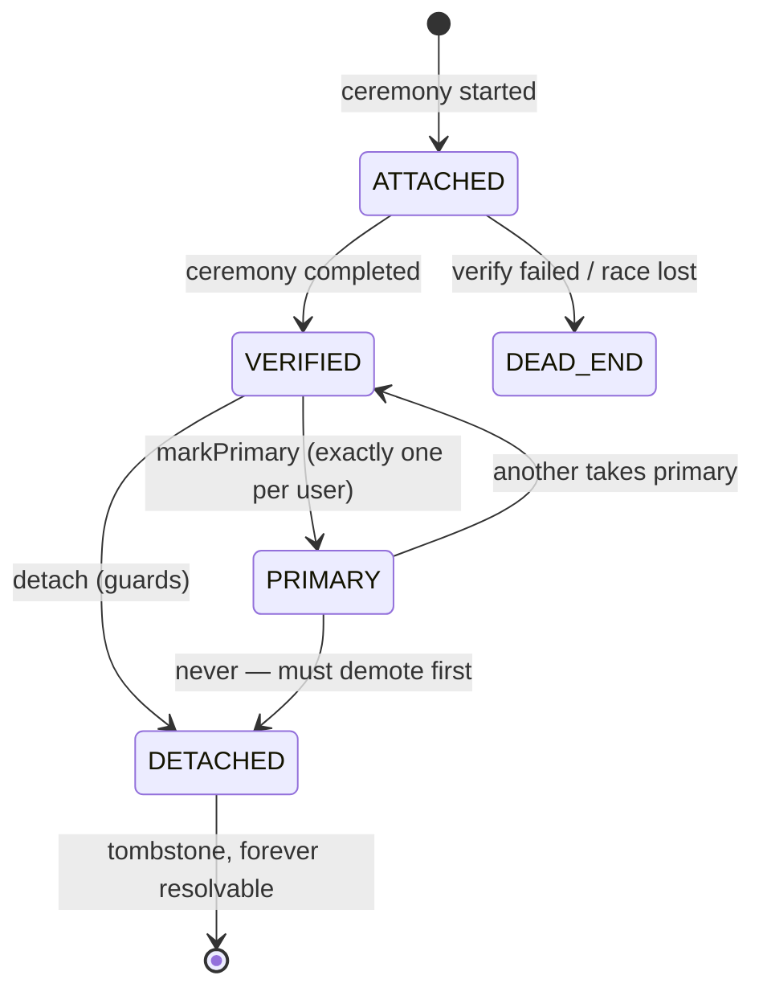

# D01 — Identity pipeline skeleton + identifiers

Epic: `../identity-platform-redesign.md` · Plan: `delivery-plan.md` · Wave 1 · Depends on: nothing (authz not needed)

# Overview

Two sealed pieces shipped together: (a) the event-sourced **identity pipeline** skeleton (commands → GroupQueue → CH `event_log` → applies/projections → process managers), and (b) the **identifiers model** — the existing `Account` table adapted in place with pipeline-owned lifecycle columns, backfilled from current state. No product behavior changes.

# Requirements

- Pipeline `platform/app/src/server/event-sourcing/pipelines/identity/` following the langy/automations doctrine:
  - Type identifiers in `schemas/typeIdentifiers.ts`: aggregates `user_identity` (more register in later deliverables), command/event type constants per module.
  - Events: zod schemas extending `EventSchema`, unioned as `IdentityEvent`; pseudonymized payloads (ids, hashes, enums, timestamps — never emails/secrets); `version` date strings; upcasters when schemas evolve.
  - Commands via `defineCommand` / class-based `CommandHandler`; dispatched through `mapCommands(pipeline.commands)`; per-aggregate FIFO via GroupQueue group key.
  - Process managers for durable/scheduled work (intents via typed `ctx.intents.<name>(key, payload)`; outbox handlers zod-parse, idempotent retry, `retryable: false` retires visibly).
  - Subscribers for best-effort notifications.
  - No-op command round-trip proving command → queue → event → apply → PM wake.
- `Account` additive migration:

```
+ state          enum     ATTACHED | VERIFIED | PRIMARY | DETACHED | DEAD_END
+ connectionId   string?  FK → sso_connections (null until D04)
+ verifiedAt     datetime?
+ attachedAt     datetime
+ detachedAt     datetime?
provider         widened: credential | email | passkey | google | github |
                          gitlab | azure-ad | oidc | saml | auth0-legacy | okta-legacy
```

- **Column-ownership rule** (ADR-1, enforced by lint/review):
  - Protocol columns (`password`, `access_token`, `refresh_token`, `id_token`, `providerAccountId`) — owned by better-auth's adapter; the row is the record of truth; **excluded from replay**.
  - Lifecycle columns (`state`, `connectionId`, `verifiedAt`, `attachedAt`, `detachedAt`) — owned by the pipeline; the event log is the record of truth; replay rebuilds them.
  - Nobody hand-edits lifecycle columns; nobody emits lifecycle events outside command handlers.
- Backfill (idempotency keys `backfill:<accountId>`): `provider="email"` rows from `User.email`; VERIFIED state for rows with established ceremonies; existing OAuth/credential rows get lifecycle state from their history.
- better-auth hooks emit identifier lifecycle events from here on; every new Account write produces its event.
- Identifier state machine:



- Verification semantics (R8): OAuth/SSO ceremonies arrive VERIFIED; `provider="email"` verifies via email link; password/passkey verified at creation (account control, not mailbox). **Login is never gated on email verification** — verification gates routing/linking/join-matching only.
- Uniqueness of verified values is a command-time guard re-checked inside the verify command (concurrent verifies → second fails to DEAD_END). No DB unique constraint — tombstones and replay make constraints lie.
- `User.email` polyfilled from the PRIMARY identifier; switching PRIMARY updates it. No UI changes.
- Normalization at attach: lowercase, plus-tag stripping, unicode-fold.

# Out of Scope

- Any routing/sign-in behavior change (D03).
- Passkey mirror rows (D07), MFA aggregates (D06), connection linkage (D04).
- The "manage emails" self-serve UI.

# Research

- Framework: `platform/app/src/server/event-sourcing/` — doctrine ADRs 007 (pipeline model), 015 (replay coordination), 022 (event log source of truth), 049 (PG projections), 052 (PM substrate + content boundary), 066 (fold contract). `specs/event-sourcing/pipeline-model.feature` is the doctrine anchor.
- **Corpus-audit finding this deliverable resolves:** ADR-022:24 ("`event_log` is the single durable source of truth") + ADR-015:41 ("replay's writes always win… canonical state from all events") assume single-ownership rows. The column-ownership rule is a carve-out: ADR-1 must amend 022/015 and the replay tooling must gain per-pipeline column scoping, or a naive replay clobbers better-auth's protocol columns.
- Pseudonymization precedent: ADR-052:74,212 (content never crosses into events/PG PM tables); ADR-029 §4 (purge tractability).
- `specs/auth/signup-does-not-strand-an-account.feature` — anti-dead-end anchor this model generalizes.

# Technical Plan

1. Scaffold pipeline module with a no-op command round-trip.
2. Prisma additive migration on `Account` (nullable/defaulted — zero-downtime).
3. Backfill command per user aggregate, batch-driven, idempotent.
4. Lifecycle apply: identity events upsert the lifecycle columns under per-key queue locks (same discipline as `.withProjection`, targeted at the adapted table).
5. Hook coverage: extend existing better-auth hooks + `databaseHooks` (user/session/account/verification fire today) to emit lifecycle commands.
6. Lint/review rule: lifecycle columns written only inside the pipeline module.
7. Tests: in-memory `EventSourcing` harness + `InMemoryProcessStore`; replay-parity (rebuild lifecycle columns from CH, diff vs live table); hook coverage test.

# Exit gate / rollback

- **Exit:** replay-parity test green; hook coverage test green; no-op round-trip demonstrated.
- **Rollback:** stop emitting; columns are additive, drop later. No dual-write drift window (single table, disjoint columns).

# Security Concerns

- Pseudonymized payloads from day one — erasure deletes PG/protocol rows; events keep ids/hashes only.
- Attach-without-proof is impossible: every lifecycle event derives from a ceremony hook.

# Open Questions

- None specific to D01. (Replay tooling's per-pipeline column scoping is an ADR-1 implementation detail, not a product question.)
