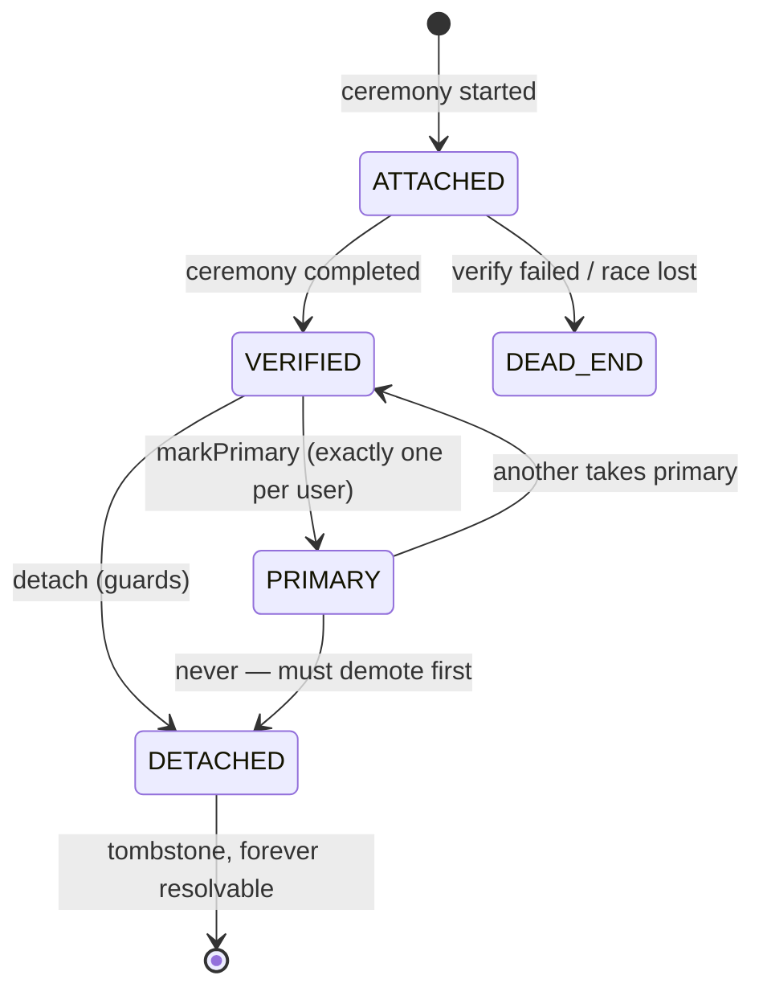

# D01 — Identity pipeline skeleton + identifiers

Epic: `../identity-platform-redesign.md` · Plan: `delivery-plan.md` · Wave 1 · Depends on: nothing (authz not needed)

# Overview

Two sealed pieces shipped together: (a) the event-sourced **identity pipeline** skeleton (commands → GroupQueue → CH `event_log` → applies/projections → process managers), and (b) the **identifiers model** — the existing `Account` table adapted in place with pipeline-owned lifecycle columns, backfilled from current state. No product behavior changes.

# Requirements

- Pipeline `platform/app/src/server/event-sourcing/pipelines/identity/` following the langy/automations doctrine:
  - Type identifiers in `schemas/typeIdentifiers.ts`: aggregates `user_identity` (more register in later deliverables), command/event type constants per module.
  - Events: zod schemas extending `EventSchema`, unioned as `IdentityEvent`; payloads carry ids, enums, timestamps, domains, HMAC hashes — and the normalized email where the fact is about one (erasure wipes it, R11); never secrets. `version` date strings; upcasters when schemas evolve.
  - Commands via `defineCommand` / class-based `CommandHandler`; dispatched through `mapCommands(pipeline.commands)`; per-aggregate FIFO via GroupQueue group key.
  - Process managers for durable/scheduled work (intents via typed `ctx.intents.<name>(key, payload)`; outbox handlers zod-parse, idempotent retry, `retryable: false` retires visibly).
  - Subscribers for best-effort notifications.
  - No-op command round-trip proving command → queue → event → apply → PM wake.
- `Account` additive migration:

```
+ state          enum     ATTACHED | VERIFIED | PRIMARY | DETACHED | DEAD_END
+ connectionId   string?  FK → sso_connections (null until D04)
+ verifiedAt     datetime?
+ attachedAt     datetime
+ detachedAt     datetime?
provider         widened: credential | email | passkey | google | github |
                          gitlab | azure-ad | oidc | saml | auth0-legacy | okta-legacy
```

- **Our own adapter (R10) — better-auth never writes the database.** better-auth's `database` option is a first-class contract (the stock Prisma adapter is just one implementation); we implement the **identity adapter** with better-auth's `createAdapter` factory — no wrapping, no interception, the sanctioned "you handle reading and writing" plug point, uniform across core and every plugin:
  - **Reads** pass straight through to PG (the tables *are* the projections; the hot path never touches CH or the queue).
  - **Domain-significant writes** (account create/delete, verification consumed, passkey add/remove, MFA enroll/disable, user create) become identity **commands**. The handler runs guards (vetoing *before* any row exists — better-auth surfaces the refusal through its own protocol flow), derives deterministic ids, appends the events to CH (**waited**); the apply then consumes those events on the calling path and writes the lifecycle/projection columns — command → event → projection, never a hand-written upsert in the handler — while the protocol values ride only on the command and land through the **credentials repository** (row-truth); the row is returned to better-auth. Read-your-writes holds; the queue fold re-applies the same events later and converges because applies are idempotent (the grants-ledger dispatch discipline, ADR-092 §13).
  - **High-churn protocol writes** (session rows, OAuth token refresh) stay row-truth repository writes with no events (R12) — `SessionRepository` for session rows, the credentials repository for token columns — declared in a per-(model, operation) **routing table** in this module. Nothing is implicitly captured or implicitly passed through — an unrouted write is a startup error.
  - A thin endpoint-hook plugin stamps ceremony context (flow, actor, request metadata) onto request-scoped storage so the adapter knows why a row is written (epic Open Q16 for non-request writes).
- **Column-truth rule** (ADR-101, enforced by lint/review):
  - *Value/secret* columns (`password`, `access_token`, `refresh_token`, `id_token`, `providerAccountId`, the raw identifier value) — row-truth: written through the credentials repository from command payloads, **excluded from replay**, deleted on erasure.
  - *Lifecycle* columns (`state`, `connectionId`, `verifiedAt`, `attachedAt`, `detachedAt`) — event-truth: the log is the record, replay rebuilds them.
  - Nobody hand-edits either kind; nobody emits identity events outside command handlers.
- **Backfill rides `@langwatch/system-migrations`** (landed with the grants ledger program, #7079) as its expected second rider: a `SystemMigration` named `identity-d01-identifier-backfill`, cohort-gated on cloud, everything-at-once on self-hosted, idempotent per tenant (event idempotency keys `backfill:<accountId>`), **self-proving** — `finalized` only when replaying the tenant's events rebuilds lifecycle columns identical to the live table; disagreements hold the tenant (`migrated`) with a diff report on the ops migrations page, failures park it. Content: `provider="email"` rows minted from `User.email`; VERIFIED state for rows with established ceremonies; existing OAuth/credential rows get lifecycle state from their history.
- From this deliverable on, every identity write produces its event — structurally, via the adapter, not by hook coverage.
- Identifier state machine:



- Verification semantics (R8): OAuth/SSO ceremonies arrive VERIFIED; `provider="email"` verifies via email link; password/passkey verified at creation (account control, not mailbox). **Login is never gated on email verification** — verification gates routing/linking/join-matching only.
- Uniqueness of verified values is a command-time guard re-checked inside the verify command (concurrent verifies → second fails to DEAD_END). No DB unique constraint — tombstones and replay make constraints lie.
- `User.email` polyfilled from the PRIMARY identifier; switching PRIMARY updates it. No UI changes.
- Normalization at attach: lowercase, plus-tag stripping, unicode-fold.

# Data structures

Conventions mirror the grants ledger (ADR-092 §13): calendar-versioned zod schemas extending the framework `EventSchema`, `occurredAt` = business time vs `createdAt` = ledger time, caller-minted `commandId` with per-event `idempotencyKey = <commandId>:<index>` (migrations derive commandIds from source rows: `backfill:<accountId>`). One deliberate divergence: the ledger's payloads are fully pseudonymized, while identity payloads carry the normalized email where the fact is about one — erasure owns the consequences (R11). `identifierHash = HMAC-SHA256(userHashKey, normalized value)`; `userHashKey` is a row-truth PG value minted at user creation and deleted on erasure, after which every remaining hash for that user is unlinkable noise.

**Tenancy of the aggregates** (every CH query filters TenantId first): `user_identity` uses `tenantId = userId` — the user is the tenant of their own identity history, which makes erasure/support lookup a single tenant scan (ADR-029 purge tractability). Org-rooted aggregates in later deliverables (`sso_connection`, `join_request`) use `tenantId = organizationId`.

Type identifiers (`schemas/typeIdentifiers.ts` / `schemas/constants.ts`):

```ts
export const IDENTITY_PIPELINE_NAME = "identity" as const;
export const USER_IDENTITY_AGGREGATE_TYPE = "user_identity" as const;

export const ATTACH_IDENTIFIER_COMMAND_TYPE = "lw.identity.attach_identifier" as const;
export const VERIFY_IDENTIFIER_COMMAND_TYPE = "lw.identity.verify_identifier" as const;
export const MARK_PRIMARY_COMMAND_TYPE      = "lw.identity.mark_primary" as const;
export const DETACH_IDENTIFIER_COMMAND_TYPE = "lw.identity.detach_identifier" as const;
export const ERASE_USER_COMMAND_TYPE        = "lw.identity.erase_user" as const;

export const IDENTIFIER_ATTACHED_EVENT_TYPE  = "lw.identity.identifier_attached" as const;
export const IDENTIFIER_VERIFIED_EVENT_TYPE  = "lw.identity.identifier_verified" as const;
export const IDENTIFIER_DEAD_ENDED_EVENT_TYPE = "lw.identity.identifier_dead_ended" as const;
export const PRIMARY_CHANGED_EVENT_TYPE      = "lw.identity.primary_changed" as const;
export const IDENTIFIER_DETACHED_EVENT_TYPE  = "lw.identity.identifier_detached" as const;
export const USER_ERASED_EVENT_TYPE          = "lw.identity.user_erased" as const;

export const IDENTITY_EVENT_VERSION_LATEST = "2026-08-17" as const;
```

A command — PII rides here, transiently (commands are dispatched and processed, never durably stored):

```jsonc
// lw.identity.attach_identifier — emitted by the identity adapter when
// better-auth creates an Account row inside a sign-up/link ceremony
{
  "tenantId": "user_2c9x…",
  "userId": "user_2c9x…",
  "commandId": "idcmd_2f8a…",            // caller-minted; retries reuse it
  "accountId": "acc_9k2p…",
  "provider": "google",                   // widened provider enum (D01)
  "value": "Alex.Doe+x@Acme.com",        // RAW — normalized by the handler, never stored in an event
  "ceremony": { "flow": "oauth-callback", "requestId": "req_…" },
  "actor": { "type": "user", "id": "user_2c9x…" }
}
```

The events it produces — the email is the fact and rides in the payload (erasure wipes it, R11); secrets never appear; the hash serves uniqueness guards, the domain serves routing/join-matching:

```jsonc
// envelope fields come from the framework EventSchema; data is the payload
{
  "id": "evt_…",                          // pure KSUID
  "aggregateId": "user_2c9x…",
  "aggregateType": "user_identity",
  "tenantId": "user_2c9x…",
  "type": "lw.identity.identifier_attached",
  "version": "2026-08-17",
  "occurredAt": 1755446400000,            // business time (backfill: legacy row's createdAt)
  "createdAt": 1755446400123,             // ledger-accepted time
  "idempotencyKey": "idcmd_2f8a…:0",
  "data": {
    "accountId": "acc_9k2p…",
    "userId": "user_2c9x…",
    "provider": "google",
    "email": "alex.doe@acme.com",         // normalized; the erase command wipes this field (R11)
    "identifierHash": "hmac:b1e4…",       // HMAC-SHA256(userHashKey, normalized value) — noise once the key is shredded
    "domain": "acme.com",                 // org-level fact; survives erasure
    "connectionId": null,                  // FK → sso_connections from D04 on
    "state": "VERIFIED",                   // OAuth ceremonies arrive verified (R8)
    "actor": { "type": "user", "id": "user_2c9x…" }
  }
}
```

```jsonc
// lw.identity.user_erased — erasure is itself an event (R11): the handler
// wipes the email fields out of the user's prior events (ClickHouse mutation),
// deletes the PG value columns, protocol rows and the userHashKey, and this
// event records that it happened. Replay reproduces the tombstone, never the data.
{ "type": "lw.identity.user_erased", "data": {
    "userId": "user_2c9x…",
    "erasedAccountIds": ["acc_9k2p…", "acc_1m3q…"],
    "actor": { "type": "system", "id": "ops:erasure-request" }
} }
```

The adapted `Account` row, by truth class:

```text
row-truth (handler-written from commands; excluded from replay; deleted on erasure)
  value/providerAccountId · password · access_token · refresh_token · id_token
event-truth (fold-written; replay rebuilds)
  state · connectionId · verifiedAt · attachedAt · detachedAt
row-truth, better-auth protocol bookkeeping (adapter routing table: direct write)
  none on Account today — sessions and token refreshes live on Session/plugin tables
```

# Out of Scope

- Any routing/sign-in behavior change (D03).
- Passkey mirror rows (D07), MFA aggregates (D06), connection linkage (D04).
- The "manage emails" self-serve UI.

# Research

- Framework: `platform/app/src/server/event-sourcing/` — doctrine ADRs 007 (pipeline model), 015 (replay coordination), 022 (event log source of truth), 049 (PG projections), 052 (PM substrate + content boundary), 066 (fold contract). `specs/event-sourcing/pipeline-model.feature` is the doctrine anchor.
- **Corpus-audit finding this deliverable resolves:** ADR-022:24 ("`event_log` is the single durable source of truth") + ADR-015:41 ("replay's writes always win… canonical state from all events") assume single-ownership rows. The column-truth rule is a carve-out: ADR-101 must amend 022/015 and the replay tooling must gain per-pipeline column scoping, or a naive replay clobbers handler-written value columns.
- Payload-content precedent: ADR-052:74,212 (content boundary — identity deviates deliberately for emails; R11/ADR-101 pin it); ADR-029 §4 (purge tractability).
- `specs/auth/signup-does-not-strand-an-account.feature` — anti-dead-end anchor this model generalizes.

# Technical Plan

1. Scaffold pipeline module with a no-op command round-trip.
2. Prisma additive migration on `Account` (nullable/defaulted — zero-downtime).
3. Backfill command per user aggregate, batch-driven, idempotent.
4. Lifecycle apply: identity events upsert the lifecycle columns under per-key queue locks (same discipline as `.withProjection`, targeted at the adapted table).
5. The identity adapter (`createAdapter`): read pass-through, the (model, operation) write routing table, ceremony-context read from request-scoped storage; better-auth wired to it for core and plugin models alike.
6. Lint/review rule: lifecycle columns written only inside the pipeline module.
7. Tests: in-memory `EventSourcing` harness + `InMemoryProcessStore`; replay-parity (rebuild lifecycle columns from CH, diff vs live table); adapter routing-table coverage test (every better-auth model+operation is explicitly routed; an unrouted write fails).

# Exit gate / rollback

- **Exit:** replay-parity test green; adapter routing-table coverage test green; no-op round-trip demonstrated.
- **Rollback:** stop emitting; columns are additive, drop later. No dual-write drift window (single table, disjoint columns).

# Security Concerns

- Erasure (R11) from day one: wipes email fields out of the user's events, deletes PG/protocol rows, shreds the userHashKey. Secrets never appear in any event.
- Attach-without-proof is impossible: every lifecycle event derives from a better-auth ceremony arriving through the adapter with stamped context.

# Open Questions

- None specific to D01. (Replay tooling's per-pipeline column scoping is an ADR-101 implementation detail, not a product question.)
