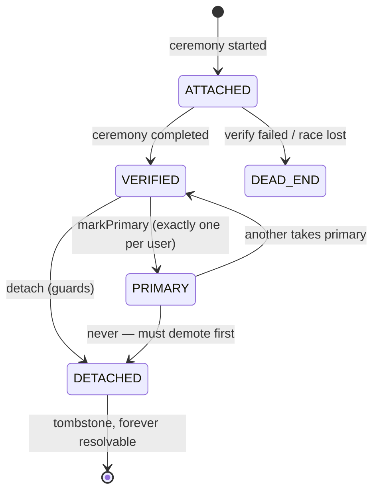

# D01 — Identity pipeline skeleton + identifiers

Epic: `../identity-platform-redesign.md` · Plan: `delivery-plan.md` · Wave 1 · Depends on: the landed authz program — ADR-110's migration state, `@langwatch/system-migrations`, and the shared `_shared/per-subject-cached-gate.ts` are all reused here (the authz *engine* itself is never consulted on an identity write)

# Overview

Two sealed pieces shipped together: (a) the event-sourced **identity pipeline** skeleton (commands → GroupQueue → CH `event_log` → applies/projections → process managers), and (b) the **identifiers model** — a new **Postgres `Identifier` table**, a pure event-truth projection born clean, backfilled from current `Account`/`User` state through `@langwatch/system-migrations` and rolled out grants-style: migration first, then reads, then writes, every release production-safe. `Account` keeps its job as the 100% row-truth protocol table (secrets, tokens) and is never a projection. No product behavior changes.

> Storage in one line: **events in ClickHouse `event_log`, the `Identifier` projection and every row-truth value in Postgres.** The sign-in hot path touches Postgres only.

# Requirements

- Pipeline `platform/app/src/server/event-sourcing/pipelines/identity/` following the langy/automations doctrine:
  - Type identifiers in `schemas/typeIdentifiers.ts`: aggregates `user_identity` (more register in later deliverables), command/event type constants per module.
  - Events: zod schemas extending `EventSchema`, unioned as `IdentityEvent`; payloads carry ids, enums, timestamps, domains, HMAC hashes — and the normalized email where the fact is about one (erasure wipes it, R11); never secrets. `version` date strings; upcasters when schemas evolve.
  - Commands via `defineCommand` / class-based `CommandHandler`; dispatched through `mapCommands(pipeline.commands)`; per-aggregate FIFO via GroupQueue group key.
  - **Dispatch order pinned (ADR-101 §2):** durable CH append (waited) → fold apply on the calling path → GroupQueue staging last, best-effort (staging is convergence, not the primary apply; a failed staging is a metric, never a failed ceremony).
  - Process managers for durable/scheduled work (intents via typed `ctx.intents.<name>(key, payload)`; outbox handlers zod-parse, idempotent retry, `retryable: false` retires visibly).
  - Subscribers for best-effort notifications.
  - No-op command round-trip proving command → queue → event → apply → PM wake.
- **New Prisma model `Identifier`** (Postgres — additive migration, no change to `Account`):

```prisma
model Identifier {
  id             String    @id // deterministic KSUID — every bit derived (ADR-092 grant-id discipline):
                               // timestamp = occurredAt, entropy = SHA-256(userId, provider,
                               // providerAccountId | valueHash) — backfill and live emission converge
  userId         String
  provider       String    // credential | email | passkey | google | github | gitlab
                           // | azure-ad | oidc | saml | auth0-legacy | okta-legacy
  value          String?   // normalized identifier value; erasure wipes it
  domain         String?   // org-level fact; survives erasure
  identifierHash String?   // HMAC-SHA256(userHashKey, normalized value); erasure wipes it
  accountId      String?   // link to the better-auth protocol row, when one exists
  state          String    // ATTACHED | VERIFIED | PRIMARY | DETACHED | DEAD_END
  connectionId   String?   // FK-shaped → sso_connections (null until D04)
  verifiedAt     DateTime?
  attachedAt     DateTime
  detachedAt     DateTime?
  createdAt      DateTime  @default(now())
  updatedAt      DateTime  @updatedAt

  @@index([userId])
  @@index([identifierHash])
  @@index([value])   // the D03 router's lookup
  @@index([domain])
}
```

  No DB unique constraint on the natural key — tombstones and replay make constraints lie; uniqueness of verified values is a command-time guard re-checked inside the verify command (concurrent verifies → second fails to DEAD_END). The table is an ordinary whole-row projection: replay rebuilds it entirely, ADR-022/015 stand unamended, identity is in replay discovery from the first release.

- **Our own adapter (R10) — better-auth never writes the database.** better-auth's `database` option is a first-class contract (the stock Prisma adapter is just one implementation); we implement the **identity adapter** as a routing facade whose row engine is the stock prismaAdapter — the sanctioned "you handle reading and writing" plug point, uniform across core and every plugin, with the guarantees (routing, gating, veto-before-write) in the facade rather than a reimplemented query layer:
  - **Reads** pass straight through to PG (protocol reads hit `Account`/`Session` as always; domain reads hit `Identifier` from D03 on; the hot path never touches CH or the queue).
  - **Domain-significant writes** (account create/delete, verification consumed, passkey add/remove, MFA enroll/disable, user create) check the **per-user write gate**: for a **latched** user (backfill `finalized`; `migrated` is held, ADR-110) they become identity **commands** — guards veto *before* any row exists, deterministic ids, events appended to CH (**waited**), the fold applies them to `Identifier` on the calling path, the protocol values ride only on the command and land through the **credentials repository** on `Account` (row-truth), the row is returned to better-auth. For an **unlatched** user, the protocol write happens identically and no events are emitted (yet) — the gate governs whether events *also* flow, never whether better-auth works. Read-your-writes holds; the queue fold re-applies the same events later and converges because applies are idempotent (ADR-092 §13).
  - **High-churn protocol writes** (session rows, OAuth token refresh) stay row-truth repository writes with no events (R12) — `SessionRepository` for session rows, the credentials repository for token columns — declared in a per-(model, operation) **routing table** in this module. Nothing is implicitly captured or implicitly passed through — an unrouted write is refused, loudly, naming itself, and the routing coverage test pins the full mounted surface in CI.
  - **The write gate** is the authz engine gate re-tenanted (ADR-110: finishing the migration IS the switch): reads the user's `identity-d01-identifier-backfill` row in `SystemMigrationTenantState` (tenant = the user), answers true for **`finalized` only** (`migrated` is held — the proof found the projection behind or disagreeing, and the next pass heals it), cached per subject via the shared `_shared/per-subject-cached-gate.ts` the engine gate also uses, fail-safe to the protocol-only path with a warn + metric. Both directions take effect within the cache TTL. Ships closed for everyone — deploying the adapter changes nothing on its own.
  - A thin endpoint-hook plugin stamps ceremony context (flow, actor, request metadata) onto request-scoped storage so the adapter knows why a row is written (epic Open Q16 for non-request writes).
- **Truth split (ADR-101 §3):** `Identifier` is pure event-truth (fold-written, replay-rebuilt, whole-row). `Account` is pure row-truth protocol storage (secrets/tokens, repository-written, not a projection, never in replay, deleted on erasure). No table mixes truths; no doctrine amendment exists.
- **Rollout rides `@langwatch/system-migrations`** (landed with the grants ledger program, #7079), re-tenanted for identity (ADR-101 §6):
  - A **user-rooted `TenantSource`** registers alongside the organization source — migration state, latch, and gates are per-user. (The generic engine is tenant-agnostic; this is app-composition surface only.)
  - **Enrollment is a switch (ADR-110)**: on cloud the ops page enrolls organizations — the one pacing lever — and a user is in the cohort when any organization they belong to is enrolled; there is no everyone-else cohort, no sampling, no ladder. A user outside every organization stays on the legacy path until they join one. Self-hosted runs what the release declares (`runsAutomaticallyOnSelfHosted`) for every user, silently.
  - `identity-d01-identifier-backfill` **does not wait**: each pass re-reads the user's rows, restates every fact (deterministic command ids `backfill:<accountId>`, backdated `occurredAt` from the source row's `createdAt` — restated facts dedupe at the store), detaches identifiers whose `Account` row is gone (`backfill:detach:<identifierId>:<accountId>`), and proves the fold-built `Identifier` rows against what the live `Account`/`User` rows imply. No `previous` record is consulted. Agreement ⇒ `finalized`; a missing or disagreeing row ⇒ held at `migrated` with the outstanding identifiers named on the ops migrations page; a thrown pass parks. Content: `provider="email"` rows minted from `User.email`; VERIFIED state for rows with established ceremonies; existing OAuth/credential rows get lifecycle state from their history.
  - Writes flip per user via the adapter's gate the moment their backfill finalizes; reads flip in D03 on the *same* status row (one source of truth for both forks). Rollback is a status change, effective within the gate's TTL.
- From this deliverable on, every latched user's identity write produces its event — structurally, via the adapter, not by hook coverage.
- Identifier state machine:



- Verification semantics (R8): OAuth/SSO ceremonies arrive VERIFIED; `provider="email"` verifies via the magic-link ceremony below; password/passkey verified at creation (account control, not mailbox). **Login is never gated on email verification** — verification gates routing/linking/join-matching only.
- `User.email` polyfilled from the PRIMARY identifier for latched users; switching PRIMARY updates it. No UI changes.
- Normalization at attach: lowercase, plus-tag stripping, unicode-fold.

# Verification ceremony — email (magic link + proof binding)

Verifying an email identifier must prove two distinct things: (a) the person controls the mailbox, and (b) the completion belongs to the ceremony that started it — a forwarded link, a mail-scanner prefetch, or a token minted for one identifier must never verify another.

```text
  initiating client                    server                        mailbox
        │  attach / request-verify        │                             │
        │────────────────────────────────►│                             │
        │  mints code_verifier (PKCE);    │ mints Verification record:  │
        │  keeps it local                 │  verificationId (verif_…)   │
        │  sends code_challenge =         │  identifierId + userId      │
        │  S256(code_verifier)            │  token — single-use,        │
        │                                 │  HASHED at rest, TTL 15m    │
        │                                 │  code_challenge (bound)     │
        │                                 │──── magic link ────────────►│
        │                                 │  …/verify?vid=verif_…&token │
        │                                 │                             │
        │   link opened (GET) — RENDERS ONLY, never verifies            │
        │   (scanner/prefetch-safe: completion is a POST)               │
        │                                 │                             │
        │  same device: POST with token + code_verifier                 │
        │────────────────────────────────►│ checks: hash(token) matches,│
        │                                 │  unexpired, unconsumed,     │
        │                                 │  S256(verifier)==challenge, │
        │                                 │  verificationId → EXACTLY   │
        │                                 │  this identifierId+userId   │
        │                                 │ ⇒ verify_identifier command │
        │                                 │                             │
        │  cross-device: link shows a short one-time code to type       │
        │  into the initiating context (which holds the verifier) —     │
        │  completion still happens where the ceremony started          │
```

- **PKCE binding**: the initiating context mints `code_verifier` and sends only its S256 challenge; completion requires the verifier. Possession of the emailed link alone is insufficient — it cannot complete the ceremony from a context that didn't start it. Cross-device is served by the short-code echo back into the initiating context, not by weakening the binding.
- **Identity binding ("verify some kind of id")**: the `Verification` record pins `verificationId → (identifierId, userId)` at mint time; the completion path verifies the consumed record targets exactly the identifier being verified. A token can never be replayed against a different identifier, user, or a re-attached successor (the identifier id is deterministic but the verification record is single-use and id-pinned).
- **Token hygiene**: single-use (consumed transactionally before the verify command dispatches), hashed at rest (row-truth on the better-auth `Verification` protocol table, routed like every protocol model through the adapter's routing table), 15-minute TTL, invalidated by any newer verification mint for the same identifier.
- **Events**: `identifier_verified` carries `verificationId` and `method: "magic-link" | "oauth" | "saml" | "creation"` in the payload — the proof trail is queryable history; the token and verifier never appear in any event (payload rule).
- better-auth's own magic-link/verification plumbing supplies the protocol flow; the PKCE binding and id-pinning are ceremony guards in our command handlers — better-auth still never writes the database.

# Data structures

Conventions mirror the grants ledger (ADR-092 §13, as reshaped by ADR-110): calendar-versioned zod schemas extending the framework `EventSchema`, `occurredAt` = business time vs `createdAt` = ledger time, caller-minted `commandId` with per-event `idempotencyKey = <commandId>:<index>` (migrations derive commandIds from source rows: `backfill:<accountId>`). One deliberate divergence: the ledger's payloads are fully pseudonymized, while identity payloads carry the normalized email where the fact is about one — erasure owns the consequences (R11). `identifierHash = HMAC-SHA256(userHashKey, normalized value)`; `userHashKey` is a row-truth PG value minted at user creation and deleted on erasure, after which every remaining hash for that user is unlinkable noise.

**Tenancy of the aggregates** (every CH query filters TenantId first): `user_identity` uses `tenantId = userId` — the user is the tenant of their own identity history, which makes erasure/support lookup a single tenant scan (ADR-029 purge tractability). The event store treats tenant ids as opaque (the ledger already appends under the reserved `"platform"` tenant). Org-rooted aggregates in later deliverables (`sso_connection`, `join_request`) use `tenantId = organizationId`.

Type identifiers (`schemas/typeIdentifiers.ts` / `schemas/constants.ts`):

```ts
export const IDENTITY_PIPELINE_NAME = "identity" as const;
export const USER_IDENTITY_AGGREGATE_TYPE = "user_identity" as const;

export const ATTACH_IDENTIFIER_COMMAND_TYPE = "lw.identity.attach_identifier" as const;
export const VERIFY_IDENTIFIER_COMMAND_TYPE = "lw.identity.verify_identifier" as const;
export const MARK_PRIMARY_COMMAND_TYPE      = "lw.identity.mark_primary" as const;
export const DETACH_IDENTIFIER_COMMAND_TYPE = "lw.identity.detach_identifier" as const;
export const ERASE_USER_COMMAND_TYPE        = "lw.identity.erase_user" as const;

export const IDENTIFIER_ATTACHED_EVENT_TYPE  = "lw.identity.identifier_attached" as const;
export const IDENTIFIER_VERIFIED_EVENT_TYPE  = "lw.identity.identifier_verified" as const;
export const IDENTIFIER_DEAD_ENDED_EVENT_TYPE = "lw.identity.identifier_dead_ended" as const;
export const PRIMARY_CHANGED_EVENT_TYPE      = "lw.identity.primary_changed" as const;
export const IDENTIFIER_DETACHED_EVENT_TYPE  = "lw.identity.identifier_detached" as const;
export const USER_ERASED_EVENT_TYPE          = "lw.identity.user_erased" as const;

export const IDENTITY_EVENT_VERSION_LATEST = "2026-08-20" as const;
```

A command — PII rides here, transiently (commands are dispatched and processed, never durably stored):

```jsonc
// lw.identity.attach_identifier — emitted by the identity adapter when
// better-auth creates an Account row inside a sign-up/link ceremony
{
  "tenantId": "user_2c9x…",
  "userId": "user_2c9x…",
  "commandId": "idcmd_2f8a…",            // caller-minted; retries reuse it
  "accountId": "acc_9k2p…",
  "provider": "google",                   // widened provider enum (D01)
  "value": "Alex.Doe+x@Acme.com",        // RAW — normalized by the handler, never stored in an event
  "ceremony": { "flow": "oauth-callback", "requestId": "req_…" },
  "actor": { "type": "user", "id": "user_2c9x…" }
}
```

The events it produces — the email is the fact and rides in the payload (erasure wipes it, R11); secrets never appear; the hash serves uniqueness guards, the domain serves routing/join-matching:

```jsonc
// envelope fields come from the framework EventSchema; data is the payload
{
  "id": "evt_…",                          // pure KSUID
  "aggregateId": "user_2c9x…",
  "aggregateType": "user_identity",
  "tenantId": "user_2c9x…",
  "type": "lw.identity.identifier_attached",
  "version": "2026-08-20",
  "occurredAt": 1755446400000,            // business time (backfill: legacy row's createdAt)
  "createdAt": 1755446400123,             // ledger-accepted time
  "idempotencyKey": "idcmd_2f8a…:0",
  "data": {
    "identifierId": "idf_9k2p…",          // deterministic — the Identifier row's id
    "accountId": "acc_9k2p…",
    "userId": "user_2c9x…",
    "provider": "google",
    "email": "alex.doe@acme.com",         // normalized; the erase command wipes this field (R11)
    "identifierHash": "hmac:b1e4…",       // HMAC-SHA256(userHashKey, normalized value) — noise once the key is shredded
    "domain": "acme.com",                 // org-level fact; survives erasure
    "connectionId": null,                  // FK → sso_connections from D04 on
    "state": "VERIFIED",                   // OAuth ceremonies arrive verified (R8)
    "actor": { "type": "user", "id": "user_2c9x…" }
  }
}
```

```jsonc
// lw.identity.user_erased — erasure is itself an event (R11): the handler
// wipes the email fields out of the user's prior events (ClickHouse mutation),
// wipes Identifier value columns, deletes protocol rows and the userHashKey,
// and this event records that it happened. Replay reproduces the tombstone.
{ "type": "lw.identity.user_erased", "data": {
    "userId": "user_2c9x…",
    "erasedIdentifierIds": ["idf_9k2p…", "idf_1m3q…"],
    "actor": { "type": "system", "id": "ops:erasure-request" }
} }
```

The truth split, by table (both Postgres):

```text
Identifier — pure event-truth projection (fold-written; replay rebuilds whole-row)
  id · userId · provider · value · domain · identifierHash · accountId
  · state · connectionId · verifiedAt · attachedAt · detachedAt
Account — pure row-truth protocol table (repository-written; NOT a projection;
  never in replay; deleted on erasure)
  password · access_token · refresh_token · id_token · providerAccountId · …
```

# Out of Scope

- Any routing/sign-in behavior change (D03).
- Passkey mirror rows (D07), MFA aggregates (D06), connection linkage (D04).
- The "manage emails" self-serve UI.

# Research

- Framework: `platform/app/src/server/event-sourcing/` — doctrine ADRs 007 (pipeline model), 015 (replay coordination), 022 (event log source of truth), 049 (PG projections), 052 (PM substrate + content boundary), 066 (fold contract). `specs/event-sourcing/pipeline-model.feature` is the doctrine anchor.
- Rollout precedent this deliverable transplants: ADR-110's shape as shipped — new native head born clean (`Grant`/`Role`), adoption by ids stable across retries (`authz-engine.migration.ts`), one migration whose `finalized` status is the switch for reads and writes alike (`engine-gate.ts` over `_shared/per-subject-cached-gate.ts`), held tenants with their outstanding facts named, `specs/migration/authz-grants-rollout.feature`.
- Payload-content precedent: ADR-052:74,212 (content boundary — identity deviates deliberately for emails; R11/ADR-101 pin it); ADR-029 §4 (purge tractability).
- `specs/auth/signup-does-not-strand-an-account.feature` — anti-dead-end anchor this model generalizes.

# Technical Plan

1. Scaffold pipeline module with a no-op command round-trip.
2. Prisma additive migration: the new `Identifier` table (+ `userHashKey` on `User`) — zero-downtime, nothing reads it yet.
3. Fold projection: identity events upsert `Identifier` rows under per-key queue locks (`.withProjection`, cursor-guarded); in replay discovery from day one.
4. The identity adapter (routing facade over prismaAdapter): read pass-through, the (model, operation) write routing table, the per-user write gate (ships closed), ceremony-context read from request-scoped storage; better-auth wired to it for core and plugin models alike.
5. Verification ceremony guards: PKCE challenge storage on the Verification protocol row, verifier check + id-pinning in the verify command handler, GET-renders/POST-completes route shape.
6. User-rooted `TenantSource` + `identity-d01-identifier-backfill` rider + org-driven enrollment pacing (PR 2).
7. Tests: in-memory `EventSourcing` harness + `InMemoryProcessStore`; replay-parity (rebuild `Identifier` from CH, diff vs live table); backfill parity (fold-built rows vs what `Account`/`User` imply); adapter routing-table coverage test (every better-auth model+operation is explicitly routed; an unrouted write fails); verification ceremony tests (scanner GET does not verify; wrong-identifier token refused; verifier mismatch refused).

# Exit gate / rollback

- **Exit:** replay-parity test green; backfill parity self-proving per user; adapter routing-table coverage green; no-op round-trip demonstrated; verification ceremony guards green.
- **Rollback:** the write gate is data — un-enroll / roll back the migration state and the adapter stops emitting for those users while protocol writes continue untouched; the `Identifier` table is additive and nothing reads it until D03. No deploy needed.

# Security Concerns

- Erasure (R11) from day one: wipes email fields out of the user's events, wipes `Identifier` value columns, deletes protocol rows, shreds the userHashKey. Secrets never appear in any event.
- Attach-without-proof is impossible: every lifecycle event derives from a better-auth ceremony arriving through the adapter with stamped context.
- Magic-link verification is scanner-proof (GET renders, POST completes), replay-proof (single-use hashed token), context-bound (PKCE verifier), and identifier-pinned (verificationId → identifierId binding checked at completion).

# Open Questions

- None specific to D01.
