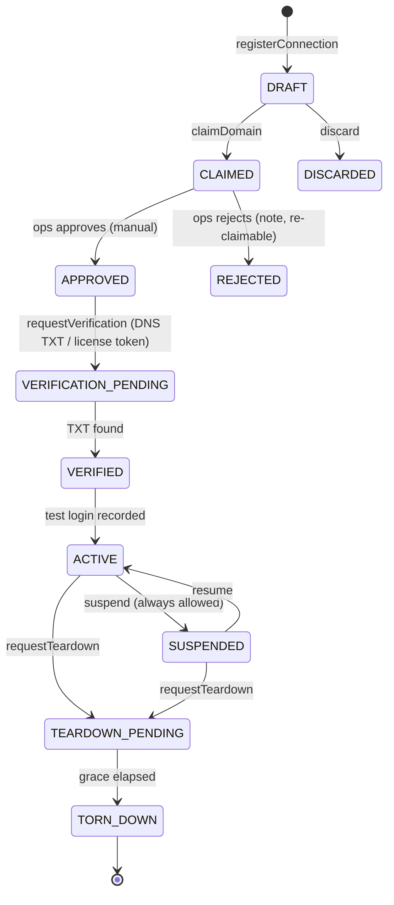

# D04 — SsoConnection aggregate + routing parity

Epic: `../identity-platform-redesign.md` · Plan: `delivery-plan.md` · Wave 2 · Depends on: D03 · Flag: `SSOCONN_ROUTING` (shadow → enforce)

# Overview

Enterprise SSO stops being two hand-set strings on `Organization` and becomes a first-class event-sourced aggregate: `SsoConnection` per (org, IdP), with domains, IdP metadata, and a guarded lifecycle. Existing orgs are grandfathered in; the router's domain lookup flips from strings to the projection behind a shadow flag. Super-admin/backoffice parity only — self-service UI is D05.

# Requirements

- Projection table (Prisma model `SsoConnection`):

```
id              string PK
organizationId  string FK → Organization
type            enum   oidc | saml
domains         string[]           (verified ones; claims tracked by events)
idpMetadata     jsonb              (endpoints, clientId, secretRef, certRefs)
state           enum               (lifecycle states below)
createdBy       string
createdAt       datetime
```

- Lifecycle (aggregate `sso_connection` in the identity pipeline):



- Guards evaluated against folded state in the command handler: `activate` needs ≥1 verified domain + ≥1 live break-glass binding (interim ops-granted until D05); `verifyDomain` refuses domains owned by another ACTIVE connection (global on SaaS, per-instance self-hosted); `requestTeardown` refuses while any user holds only this connection's identifiers.
- Domain claims need LangWatch ops manual approval — no automated blocklist. Disputes resolved from event history.
- Grandfathering rides `@langwatch/system-migrations` as a `SystemMigration` named `identity-d04-connection-grandfather`: existing `Organization.ssoDomain/ssoProvider` orgs get backfill events producing VERIFIED/ACTIVE connections (event payloads note `legacy-grandfathered` source); legacy `auth0`/`okta` Account rows re-pointed (`connectionId`) to the grandfathered connections. Proof for `finalized`: the connection-based routing decision matches the string-based one for every domain the org carries — the same comparison `SSOCONN_ROUTING` shadow mode runs, evaluated per tenant.
- Router integration: `SSOCONN_ROUTING` shadow-compares connection-based routing vs string-based routing on every login; then enforce; then `ssoDomain` writes stop and the columns become derived/legacy.
- Backoffice edits connections (parity with today's super-admin string-setting).

# Data structures

Aggregate `sso_connection`; `tenantId = organizationId`, `aggregateId = connectionId`. Payload rules per D01: ids, domains, enums, hashes — IdP client secrets and DNS tokens never appear (secrets live in the projection's `idpMetadata.secretRef`, events carry the reference; the DNS ceremony stores the token's hash):

```jsonc
// lw.identity.connection_registered
{ "data": {
    "connectionId": "ssoc_…",
    "organizationId": "org_…",
    "type": "oidc",
    "idp": { "issuer": "https://login.acme.okta.com", "clientIdRef": "cred_…" },
    "actor": { "type": "user", "id": "user_…" }
} }

// lw.identity.domain_claimed        { connectionId, domain: "acme.com", actor }
// lw.identity.domain_claim_approved { connectionId, domain, actor: { type: "user", id: <ops user> } }
// lw.identity.verification_requested{ connectionId, domain, method: "dns-txt" | "license-token", tokenHash: "sha256:…" }
// lw.identity.domain_verified       { connectionId, domain, method }
// lw.identity.connection_activated  { connectionId, testLoginAccountId, actor }
// lw.identity.connection_suspended / _resumed / teardown_requested / connection_torn_down
//   — all { connectionId, actor, reason? }; grandfathered orgs' events carry "source": "legacy-grandfathered"
```

Projection `SsoConnection` (Prisma model above) is fold-written; the router reads it and nothing else on the hot path.

# Out of Scope

- Org-admin self-service UI, DNS TXT ceremony UX, break-glass binding management, connection-scoped SCIM tokens (all D05).
- SAML protocol engine adoption (the decision is recorded here but implemented in D05's onboarding; see Open Questions).

# Research

- Today: `platform/app/ee/sso/` — `providers.ts` (social + auth0/okta via genericOAuth), `matching.ts` (domain/provider string matching). No SAML, no per-org table. Self-serve plugin PR #4416 closed unmerged — worth re-reading for pitfalls before designing D05.
- Corpus-audit spec impact: `sso-wrong-provider-recovery.feature` ports from string-matching to connection-based (Background assumptions change; scenarios mostly survive).

# Technical Plan

1. Aggregate + events (`ConnectionRegistered`, `DomainClaimed`, `DomainClaimApproved/Rejected`, `VerificationRequested`, `DomainVerified`, `ConnectionActivated/Suspended/Resumed`, `TeardownRequested`, `ConnectionTornDown`, …) + projection.
2. Grandfather backfill (idempotency keys `grandfather:<orgId>`).
3. Process managers: teardown grace timer; break-glass expiry warnings (14/7/1-day wakes) once bindings exist.
4. Router domain lookup switches to projection behind `SSOCONN_ROUTING`; shadow bake; flip.
5. Backoffice connection CRUD via commands (never raw table edits).
6. SAML engine evaluation: `@better-auth/sso@1.6.23` (its `ssoProvider` table treated as protocol state only) vs genericOAuth-with-SAML; record the decision in ADR-3.

# Exit gate / rollback

- **Exit:** routing parity silent over bake; `ssoDomain` writes stopped, columns derived/legacy; grandfathered orgs sign in unchanged.
- **Rollback:** flag off — strings still dual-written until the flip.

# Security Concerns

- First-verifier-owns with global scope makes the ops approval step the abuse boundary — every claim decision is an audited event.
- Grandfathered connections must not weaken guards: they get VERIFIED state from history, but activation guards (break-glass binding) still apply to any *state change*.

# Open Questions

- (Epic 1) SAML engine choice — decided here, implemented in D05.
- (Epic 5) IdP-initiated SSO scope — input to the engine choice.
- (Epic 2) domain-approval queue staffing/SLA.
