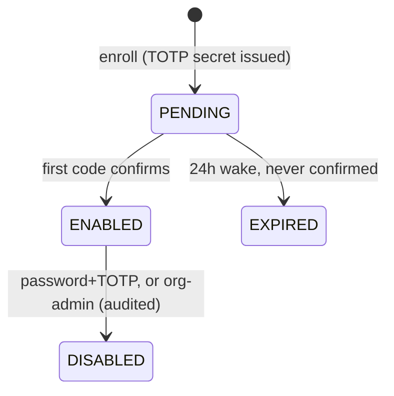

# D06 — MFA (TOTP) + session shape + Principal-aligned impersonation

Epic: `../identity-platform-redesign.md` · Plan: `delivery-plan.md` · Wave 3 · Depends on: D03 · Flag: `MFA_ENROLLMENT_OPEN` · Specs: `specs/identity/mfa-and-session-shape.feature`

# Overview

Adds MFA (TOTP + backup codes, never SMS) with an event-sourced enrollment aggregate, extends sessions with identifier/MFA claims, and moves impersonation off the legacy `Session.impersonating` JSON onto the authz `Principal {actor, subject}`.

**MFA belongs to the account, not the organization** (decided 2026-08-24, superseding the per-session policy this document originally described). This matches what better-auth actually models: `TwoFactor` is keyed on `userId` and `twoFactorEnabled` is a column on `User`. There is **one enrollment per person**, full stop.

The consequence is what collapses the complexity: if MFA is enabled on an account, every sign-in for that account is challenged, so **a session for an MFA-enabled user that never answered a challenge cannot exist**. There is nothing to step up, because nothing got in without answering. So:

- `Organization.mfaRequired` is a **membership condition** — "every member of this organization can prove a second factor" — not a per-session policy evaluated at mint and at step-up.
- **There is no per-org step-up screen.** Enrollment is a **gate**: when an admin turns `mfaRequired` on, members who cannot yet prove a factor are prompted to enroll and are held out of **that organization** until they do. Everything else they use is untouched, so nobody's personal workspace is stranded by their employer's decision — and enrolling for the employer protects the personal one too.
- The "which org wins when a person belongs to a strict one and a lax one" question is **void**. There is no per-org session trust to reconcile: a person either can prove a factor or cannot.

**Nobody is signed out.** The session columns land **nullable** and nothing here revokes a session — not the deploy, and not an admin turning `mfaRequired` on (turning it on ends *zero* sessions; it opens a gate). The only deploy-time revoke is the legacy `impersonating` sessions, below.

The only deploy-time revoke is sessions holding a non-null legacy `impersonating` value: LangWatch operators only, a handful of rows, and the payload is being deleted underneath them. They re-impersonate in one click. **D06 is therefore no longer a one-way door**, and its rollback is the flag like every other deliverable's.

# Requirements

- `twoFactor` plugin (in better-auth core) for protocol; hand-written Prisma model matching the plugin schema: `TwoFactor` (secret, backupCodes, userId, verified, failedVerificationCount, lockedUntil) + `User.twoFactorEnabled boolean @default(false)`.
- `MfaEnrollment` aggregate in the identity pipeline. The `twoFactor` plugin's table writes arrive through the identity adapter (R10) like every other model, with ceremony context stamped by the two-factor endpoints (`/two-factor/enable`, `/verify-totp`, `/disable`, `/generate-backup-codes`, `/verify-backup-code`); protocol failures emit events too:



- Backup codes one-time-use (consumption is an event). **At rest they are whatever the plugin does with them, and in better-auth 1.6.23 that is symmetric encryption, not a hash** (`two-factor/backup-codes`: `symmetricEncrypt`/`symmetricDecrypt`). Do not write a test asserting a hash; the invariant that actually holds and is worth pinning is that no read returns a usable code and no event carries one.
- `Organization.mfaRequired boolean` as a **membership condition**, evaluated when a member reaches that organization's data — not at session mint, and never as a step-up. An **enrollment gate** screen, and an org-admin view of which members cannot yet prove a factor.
- **Three ways a member satisfies it**, and the org does not care which: an enrollment on their account; a passkey (D07, `phw`); or an identity provider that asserted a factor at sign-in (see below). A provider that asserts nothing satisfies nothing, and the org admin is told so.
- **Disabling while an org requires it is refused** (`identity_mfa_required_by_organization`), over the alternative of letting it quietly cost them access — a person who turns it off and silently loses their employer's data has been handed a bug, and a state a member can walk into at will turns the gate from a step into a place to live. The two named ways out: leave that organization, or ask an admin to reset it (which starts a fresh setup, it does not remove the requirement).
- Session additive columns, both **nullable**: `identifierId`, `amr string[]`. Per-identifier session revocation (ops surface action from D05 consumes this). Nothing in this deliverable revokes a session.
- **`mfaVerifiedAt` is dropped.** It existed to date a step-up so a policy could ask how fresh it was; with the requirement on the account there is no step-up and nothing reads a freshness timestamp, so the column would ship dead. `amr` survives, and its one load-bearing job is the SSO case: it is how a session records the factor the identity provider asserted.
- Impersonation: sessions carry `{actor, subject}` into the authz Principal; when the subject's org requires MFA, the **actor's own account** must have it enabled — under account-level MFA this reduces to a boolean on the operator, with no freshness question. Both recorded on every decision (engine behavior — this deliverable supplies the claims). Legacy `Session.impersonating` JSON path deleted.
- Plugin protocol secrets (TOTP secrets, backup codes) live in plugin tables, encrypted/hashed, never in events.

# Data structures

Session, additive columns (row-truth — sessions never enter the event flow, R12):

```text
Session
  + identifierId   string    which Account row minted this session
  + amr            string[]  authentication method references, e.g. ["pwd","otp"] · ["saml"] · ["phw"]
  impersonating (JSON)       deleted — {actor, subject} ride the authz Principal
```

`MfaEnrollment` events (`tenantId = userId`; TOTP secrets and backup codes never appear — they live hashed/encrypted in the `TwoFactor` plugin table, row-truth):

```jsonc
// lw.identity.mfa_enrolled        { userId, enrollmentId, method: "totp" }         → PENDING
// lw.identity.mfa_confirmed       { userId, enrollmentId }                          → ENABLED
// lw.identity.mfa_enrollment_expired { userId, enrollmentId }                       → 24h PM wake
// lw.identity.mfa_disabled        { userId, enrollmentId, actor, via: "password+totp" | "org-admin" }
// lw.identity.backup_code_consumed { userId, enrollmentId, codeIndex }              → one-time-use proof
// lw.identity.mfa_verification_failed { userId, enrollmentId, failedCount }         → lockout evidence
```

# Out of Scope

- Passkeys (D07). Open Q4 is **decided**: `amr: ["phw"]` satisfies `mfaRequired` — see D07 for the reasoning. An org-level "hardware-bound keys only" refinement is out of scope until somebody asks.
- SMS anything. WebAuthn as an MFA second factor (passkeys are first-factor here).
- MFA as an *organization-owned* factor (a per-org enrollment). One enrollment per person is the model; an org only enforces that the person has one.
- A freshness window on a proof, and any form of step-up. Both are structurally absent, not deferred.

# Research

- better-auth 1.6.23: `twoFactor` is built in; plugin migrations are Kysely-only ⇒ hand-written Prisma models; `databaseHooks` don't fire for plugin tables — moot under R10: the identity adapter sees plugin-table writes uniformly.
- Session today: PG + Redis dual-write, 30-day TTL, `impersonating` JSON. Two things to fix while in there: the Prisma column is `impersonating Json?` while better-auth's config declares the same field `{ type: "string" }` (`src/server/better-auth/index.ts`) — they disagree today, and the disagreement dies with the column. And `storeSessionInDatabase: true` is currently justified *by* impersonation reading the DB row directly; re-justify or drop it when the JSON path goes.
- The `twoFactor` plugin's own table already carries `failedVerificationCount` and `lockedUntil`, so lockout is the plugin's, not ours to build. Its error vocabulary distinguishes `INVALID_CODE` from `INVALID_BACKUP_CODE`; our boundary deliberately collapses both to one `identity_mfa_code_invalid` so the endpoint is not an oracle for which check failed.
- Corpus-audit spec impacts: `phase-1-better-auth-config.feature:150-168` (locks in legacy impersonating — retire, replace with `{actor, subject}` scenarios). **The line range this document originally cited, `:119-137`, is wrong** — that block is the `DIFFERENT_EMAIL_NOT_ALLOWED` guard and the SSO domain-join scenarios. Note also `:166`, inside the same block: "only genericOAuth is present in the plugins array" — registering `twoFactor` breaks it, so it retires with the pair. `sessions-and-devices.feature` (inventory gains `identifierId`/`amr`; `maxSessionDurationDays` is the precedent for policy-tightening revocation, not a conflict with it); anchors that survive: `impersonation-banner.feature`, `dejaview-impersonation-access.feature` (already conceptually actor/subject), `backoffice-user-impersonation-reason.feature` (reason requirement inherited), `password-reset.feature:90-93` (revoke-all on reset — consistent with per-identifier revocation).

# Technical Plan

1. Prisma models + plugin registration; adapter routing entries for the twoFactor models + ceremony-context stamps on the two-factor endpoints.
2. MfaEnrollment aggregate + `mfa_enrollments` projection; 24h expiry wake via process manager.
3. The enrollment gate: the membership-condition check on the way into an org's data, the gate screen, and the org-admin view of who cannot yet prove a factor.
4. Session migration (two additive nullable columns — no session revoked, ever, by anything in this deliverable). The `amr` read path for members signing in through a connection.
5. Impersonation rewrite: mint sessions with `{actor, subject}` claims; delete the `impersonating` JSON path; banner/stop endpoints repointed.
6. ADR-4: `amr` semantics (Open Q4 answered: `["phw"]` satisfies the policy), and why no fleet-wide revoke is needed.
7. Gherkin specs — **written 2026-08-24**: `specs/identity/mfa-and-session-shape.feature`, 49 scenarios, `@unimplemented` until bound (setting it up, backup codes, the challenge at every sign-in, the organization's condition and its enrollment gate, members signing in through a connection, lockout, what the session carries, impersonation, failure copy, the flag).

# Exit gate / rollback

- **Exit:** enroll → challenge → backup-code → disable round-trips; the enrollment gate holds and releases correctly and ends no session; a connection-asserted factor satisfies the condition and an asserting-nothing connection does not; disable refused under a requirement; lockout verified; every authz decision records actor+subject; turning the requirement on is observably session-neutral.
- **Rollback:** `MFA_ENROLLMENT_OPEN` off. Nothing here is irreversible: the columns are additive and nullable, and the only deploy-time revoke is the legacy impersonating sessions, which is one re-click for the operators it touches.

# Security Concerns

- Disable requires password+TOTP, or org-admin action with audit event.
- Impersonation cannot bypass MFA policy — the actor's own account must have MFA enabled when the subject's org requires it.
- Legacy sessions are not destroyed, and never need to be: the requirement is a condition on an account, so an old session simply meets the gate on its way into the requiring org.
- **The SSO hole is closed explicitly.** A member signing in through a connection has no enrollment here, so "account has MFA" cannot be their test. A session whose `amr` carries a provider-asserted factor satisfies the condition; a provider that asserts nothing satisfies nothing, the member is held at the gate like anyone else, and nothing infers a factor that was not asserted.
- Lockout parameters (`failedVerificationCount`, `lockedUntil`) tuned and tested.

# Open Questions

- ~~(Epic 4) does passkey `amr: ["phw"]` satisfy org MFA policy?~~ — **decided 2026-08-24: yes.** A passkey is possession-based and phishing-resistant, which is strictly stronger than TOTP against the attack `mfaRequired` exists to stop. A synced software passkey is weaker than a hardware-bound one and still at least as strong as a typed code, so it does not change the answer. Reasoning and scenarios live in `specs/identity/passkeys.feature`; the deferred "hardware-bound keys only" org refinement is noted there as out of scope.
- ~~How often a proven session is asked again (a freshness window on `mfaVerifiedAt`)~~ — **void.** There is no step-up and no freshness timestamp; the column is dropped.
