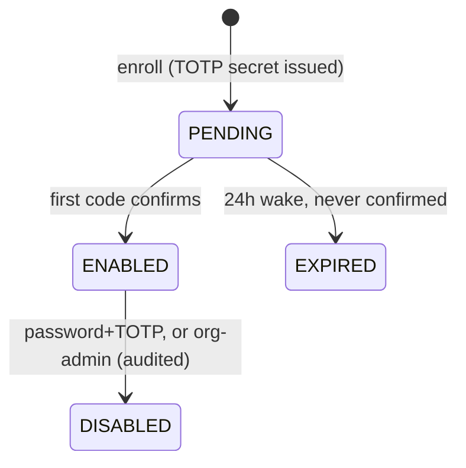

# D06 — MFA (TOTP) + session shape + Principal-aligned impersonation

Epic: `../identity-platform-redesign.md` · Plan: `delivery-plan.md` · Wave 3 · Depends on: D03 · Flags: `MFA_ENROLLMENT_OPEN` + deploy-time session revoke (**one-way door**)

# Overview

Adds MFA (TOTP + backup codes, never SMS) with an event-sourced enrollment aggregate, extends sessions with identifier/MFA claims, and moves impersonation off the legacy `Session.impersonating` JSON onto the authz `Principal {actor, subject}`. All existing sessions are revoked at deploy — they can't prove `amr`, so they can't be trusted under MFA policy.

# Requirements

- `twoFactor` plugin (in better-auth core) for protocol; hand-written Prisma model matching the plugin schema: `TwoFactor` (secret, backupCodes, userId, verified, failedVerificationCount, lockedUntil) + `User.twoFactorEnabled boolean @default(false)`.
- `MfaEnrollment` aggregate in the identity pipeline. The `twoFactor` plugin's table writes arrive through the identity adapter (R10) like every other model, with ceremony context stamped by the two-factor endpoints (`/two-factor/enable`, `/verify-totp`, `/disable`, `/generate-backup-codes`, `/verify-backup-code`); protocol failures emit events too:



- Backup codes hashed, one-time-use (consumption is an event).
- `Organization.mfaRequired boolean`; policy evaluated at session mint and at step-up. Step-up screen.
- Session additive columns: `identifierId`, `amr string[]`, `mfaVerifiedAt datetime`. Per-identifier session revocation (ops surface action from D05 consumes this).
- Impersonation: sessions carry `{actor, subject}` into the authz Principal; actor must hold `mfaVerifiedAt` when the subject's org policy demands; both recorded on every decision (engine behavior — this deliverable supplies the claims). Legacy `Session.impersonating` JSON path deleted.
- Plugin protocol secrets (TOTP secrets, backup codes) live in plugin tables, encrypted/hashed, never in events.

# Data structures

Session, additive columns (row-truth — sessions never enter the event flow, R12):

```text
Session
  + identifierId   string    which Account row minted this session
  + amr            string[]  authentication method references, e.g. ["pwd","otp"] · ["saml"] · ["phw"]
  + mfaVerifiedAt  datetime? set by TOTP/backup-code step-up; policy checks read it
  impersonating (JSON)       deleted — {actor, subject} ride the authz Principal
```

`MfaEnrollment` events (`tenantId = userId`; TOTP secrets and backup codes never appear — they live hashed/encrypted in the `TwoFactor` plugin table, row-truth):

```jsonc
// lw.identity.mfa_enrolled        { userId, enrollmentId, method: "totp" }         → PENDING
// lw.identity.mfa_confirmed       { userId, enrollmentId }                          → ENABLED
// lw.identity.mfa_enrollment_expired { userId, enrollmentId }                       → 24h PM wake
// lw.identity.mfa_disabled        { userId, enrollmentId, actor, via: "password+totp" | "org-admin" }
// lw.identity.backup_code_consumed { userId, enrollmentId, codeIndex }              → one-time-use proof
// lw.identity.mfa_verification_failed { userId, enrollmentId, failedCount }         → lockout evidence
```

# Out of Scope

- Passkeys (D07) — though the `amr: ["phw"]` policy question is shared (Open Q4).
- SMS anything. WebAuthn as an MFA second factor (passkeys are first-factor here).
- `mfaRequired` rollout UX niceties (grace window vs immediate step-up — "still left to think about").

# Research

- better-auth 1.6.23: `twoFactor` is built in; plugin migrations are Kysely-only ⇒ hand-written Prisma models; `databaseHooks` don't fire for plugin tables — moot under R10: the identity adapter sees plugin-table writes uniformly.
- Session today: PG + Redis dual-write, 30-day TTL, `impersonating` JSON.
- Corpus-audit spec impacts: `phase-1-better-auth-config.feature:119-137` (locks in legacy impersonating — retire, replace with `{actor, subject}` scenarios); `sessions-and-devices.feature` (inventory gains `identifierId`/`amr`; `maxSessionDurationDays` × forced re-login interplay); anchors that survive: `impersonation-banner.feature`, `dejaview-impersonation-access.feature` (already conceptually actor/subject), `backoffice-user-impersonation-reason.feature` (reason requirement inherited), `password-reset.feature:90-93` (revoke-all on reset — consistent with per-identifier revocation).

# Technical Plan

1. Prisma models + plugin registration; adapter routing entries for the twoFactor models + ceremony-context stamps on the two-factor endpoints.
2. MfaEnrollment aggregate + `mfa_enrollments` projection; 24h expiry wake via process manager.
3. Step-up screen + policy check at session mint.
4. Session migration (additive columns) + **all sessions revoked at deploy** (one forced re-login; comms precedent = better-auth cutover).
5. Impersonation rewrite: mint sessions with `{actor, subject}` claims; delete the `impersonating` JSON path; banner/stop endpoints repointed.
6. ADR-4: `amr` semantics (incl. Open Q4 on `["phw"]`), the forced re-login decision.
7. New Gherkin specs: enrollment, step-up, backup codes, lockout, org policy, impersonation-under-MFA.

# Exit gate / rollback

- **Exit:** enroll → challenge → backup-code → disable round-trips; org policy enforced at mint and step-up; lockout verified; every authz decision records actor+subject.
- **Rollback:** `MFA_ENROLLMENT_OPEN` off. The session kill is irreversible — hence comms and a low-traffic deploy window.

# Security Concerns

- Disable requires password+TOTP, or org-admin action with audit event.
- Impersonation cannot bypass MFA policy — the actor's `mfaVerifiedAt` is checked when policy demands.
- Legacy sessions are destroyed precisely because they can't prove `amr`.
- Lockout parameters (`failedVerificationCount`, `lockedUntil`) tuned and tested.

# Open Questions

- (Epic 4) does passkey `amr: ["phw"]` satisfy org MFA policy? Product/security decision, recorded in ADR-4.
