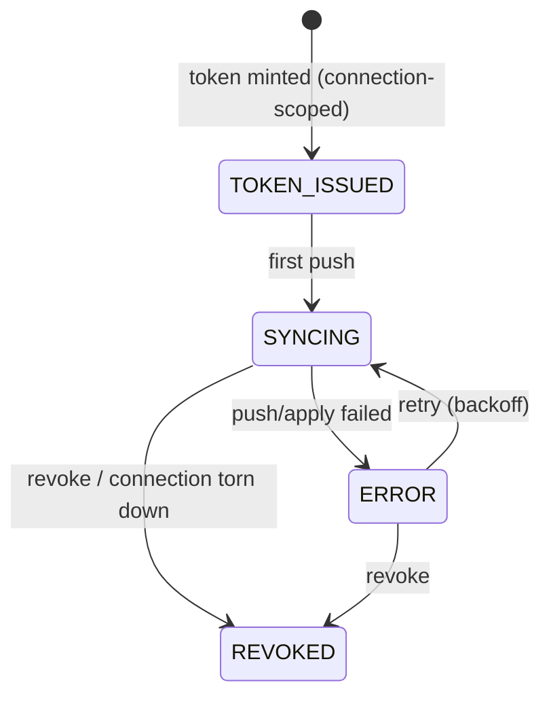

# D08 — SCIM per-connection + grants integration

Epic: `../identity-platform-redesign.md` · Plan: `delivery-plan.md` · Wave 3 · Depends on: D05 (connection-scoped tokens) + **authz precondition checklist (hard)** · Flag: `SCIM_V2_GRANTS`

> **Amendment 2026-09-03:** `platform/app` is deleted. SCIM now lives in
> `packages/enterprise/features/scim/{contract,server,web}`; the service this
> note refers to is
> `packages/enterprise/features/scim/server/src/services/scim.service.ts`.
> Verify current shape against that tree before treating paths below as live.

# Overview

SCIM stops writing membership tables directly. Tokens become scoped per SSO connection, a `(connectionId, externalId) → userId` mapping gives IdP-stable identity per connection, and every membership consequence flows through `grants.*` — SCIM becomes a command/event producer in the identity pipeline. De-enroll is a replayable event with a proven postcondition: no effective permissions remain.

# Requirements

- `ScimToken.connectionId` (issued in D05); tokens are per-connection — a token for connection A cannot write org B.
- IdP-stable identity is **per connection**: a `(connectionId, externalId) → userId` mapping with a composite uniqueness constraint on `(connectionId, externalId)` (survives email changes; one user may carry different `externalId`s across connections). Every SCIM lookup and write keys on both — never on `externalId` alone.
- `ScimSync` aggregate + `scim_sync_state` projection:



- All membership writes via `grants.attach` / `grants.offboard` — no direct `OrganizationUser`/`RoleBinding` writes. De-enroll calls `grants.offboard` (the service, whose proof runs), **not** the ledger writer's `offboardMember` the current code calls; the empty-proof postcondition is asserted in an integration test. Marking a user inactive is a de-enroll, not a flag — today it revokes nothing.
- `GrantsService` must be able to say a directory made the write. Its actor parameter is a user id today, which is why SCIM writes through the ledger writer instead. The seam is being built on `feat/authz-grant-provenance` (system actors from the closed `SYSTEM_ACTORS` registry); D08 consumes it rather than building it.
- **Deactivation is a deprovision, with the same proof.** `active: false` today sets `deactivatedAt` and revokes nothing. Deactivation does block sign-in and API-key verification, so the retained grants are latent rather than an open door — but reactivation then silently restores every permission the person held on the day they left, with nobody deciding it. **Reactivation is re-entry, not undo**: coming back restores nothing on its own, and the directory's next push is what re-attaches whatever it still asserts. Access an administrator granted by hand before the removal stays gone until an administrator grants it again.
- Failed applies are visible dead-letters via the pipeline's existing process-manager mechanism (handlers zod-parse, retry idempotently, `retryable: false` retires visibly — nothing new is introduced; the pipeline itself has no outbox, ADR-101/R13), never silent drift.
- Group → role-binding mapping UI stays; its writes also go through `grants.attach`. SCIM-managed group provenance guards (no rename/member edits outside SCIM) survive.
- Connection teardown revokes its SCIM tokens (lifecycle event → PM intent).

# Data structures

```text
ScimToken
  + connectionId  string  FK → sso_connections; the token's entire write authority
ScimExternalId           new mapping table: (connectionId, externalId) → userId
  connectionId    string  FK → sso_connections
  externalId      string  the IdP's stable identifier (survives email changes)
  userId          string  FK → User
  @@unique([connectionId, externalId])
```

`ScimSync` events (`tenantId = organizationId`, `aggregateId = scimSyncId`; SCIM payload PII stays out per the D01 rule — user references are `userId`/`externalId`):

```jsonc
// lw.identity.scim_user_pushed    { scimSyncId, connectionId, userId, externalId, op: "create" | "update" | "deactivate" }
// lw.identity.scim_group_mapped   { scimSyncId, connectionId, groupId, roleKey }
// lw.identity.scim_apply_failed   { scimSyncId, connectionId, op, errorCode }       → dead-letter evidence
// lw.identity.scim_token_revoked  { scimSyncId, connectionId, cause: "revoke" | "teardown" }
```

Membership consequences are grants-ledger events, not SCIM events: the reconciler dispatches `grants.attach`/`grants.offboard`, whose `grant_attached`/`grant_revoked` facts carry `source: "scim"`.

**The actor is not the connection.** An earlier draft of this deliverable had membership facts carry `actor: { "type": "system", "id": "<connectionId>" }`. That is not buildable and has been dropped: `packages/actor/src/index.ts` defines system actors as a **closed registry of named principals**, and its own comment forbids call sites inventing `system:...` strings — a connection id is a per-customer value, so it can never be a registered name. The actor therefore stays the single global `system:scim`, and **which connection pushed a change lives on the `ScimSync` event**, which already carries `connectionId`. Nothing is lost: cross-organization safety comes from the token's connection scope at the API boundary, not from the actor stamp. `platform/app/ee/scim/scim.service.ts` carries a stale comment saying the actor "becomes the connection id" — it should be corrected when this deliverable is implemented.

# Out of Scope

- SCIM protocol surface changes (v2 Users+Groups already complete). Seat/billing classification (license system owns it; lite-member-as-role was the authz program).

# Research

- Today: `platform/app/ee/scim/` — full SCIM v2 at `/api/scim/v2`, per-org bearer tokens (`ScimToken` has no `connectionId`; the hash lookup is global and the organization is _derived_ from the row), Auth0 log-stream webhook (dies at D10; customers repoint at D09). **Grants already flow through the ledger**: `scim-grants.reconciler.ts` diffs desired-against-current and calls `GrantsLedgerWriter.attachBindings({ source: "scim" })` / `revokeBindings`, so decision 18's reconciler shape is landed. What is still a direct write is the `OrganizationUser` row (`role: "MEMBER"`, unconditional) alongside it — that, not the grants, is what D08 removes.
- Three gaps the current code carries into this deliverable: `ScimService.deleteUser` calls the low-level `GrantsLedgerWriter.offboardMember`, **not** `GrantsService.offboard`, so the empty-proof postcondition and the `needsHumanDecision` manifest are never exercised (`.offboard(` has no production call site anywhere in the tree); a `PATCH`/`PUT` setting `active: false` deactivates the user and **revokes no grants at all**; and the SCIM resource id for a Group resolves to our internal `Group.id` rather than the IdP's `externalId`, which is written only on create.
- `GrantsService.attach` cannot express a system actor at all — its `Actor` is `{ userId: string }` and its serializer stamps `{ type: "user", … }` unconditionally. Routing SCIM through `GrantsService` (rather than the ledger writer directly) needs that seam widened first; it is an authz-package change, so it is a **breaking change to this program** under the risk register and belongs on the precondition checklist.
- Doctrine anchor: `specs/event-sourcing/pipeline-model.feature` (pipelines own their commands/events/projections); content-boundary precedent ADR-052.
- Corpus-audit spec impacts: `scim-group-mapping.feature` — most scenarios are `@unimplemented`, so amending the deprovisioning framing from "direct RoleBinding records removed" to the proved-empty postcondition is cheap now. `groups-rest-api.feature` — the SCIM-managed provenance guards are anchors that survive. `specs/organizations/scim-tokens-rest-api.feature` — the REST mint/revoke contract gains connection scoping (create names a connection); the secret-shown-once and no-secrets-in-list anchors survive. All three amended 2026-08-24 alongside the new `specs/identity/scim-connection-sync.feature`.

# Technical Plan

1. `ScimToken.connectionId` migration + backfill (org's first connection; D05 issues new tokens scoped).
2. `ScimExternalId` mapping migration (composite-unique on `(connectionId, externalId)`) + SCIM payload mapping keyed on both.
3. ScimSync aggregate, events, projection; SCIM endpoints become command producers (same external API) — every membership consequence is a command landing an event, and the hand-written `OrganizationUser` insert with its unconditional `MEMBER` role goes with it.
4. Process manager: de-enroll → `GrantsService.offboard` with postcondition check, on BOTH removal paths (delete and `active: false`); retry with backoff; dead-letter visibility in the ops surface, covering a deactivate that cannot be applied.
5. Group mapping UI write path repointed to `grants.attach`.
6. Amend `scim-group-mapping.feature` and `scim-tokens-rest-api.feature`; integration test asserting the offboard postcondition. **Written 2026-08-24:** `specs/identity/scim-connection-sync.feature` (ScimSync lifecycle, token scoping, directory identity, offboard postcondition, dead-letter visibility), `@unimplemented` until bound.

# Exit gate / rollback

- **Exit:** push/group/deactivate round-trip; token scoping enforced (cross-connection write rejected); offboard postcondition asserted in integration test; dead-letters visible.
- **Rollback:** legacy direct-write path behind `SCIM_V2_GRANTS` flag until bake completes.

# Security Concerns

- Token scope: per-connection; cross-org and cross-connection writes impossible by construction. This — not the actor stamp — is the whole isolation story.
- De-enroll is the highest-stakes SCIM operation — replayable event + proven postcondition + visible failure, never silent.
- SCIM events carry ids/externalIds and the email where the fact is about one, never tokens or secrets (D01 payload rules).

# Open Questions

- ~~Does `GrantsService` grow a system-actor seam, or does SCIM keep writing through `GrantsLedgerWriter`?~~ **Settled 2026-08-24: `GrantsService`, and the seam is being built.** `feat/authz-grant-provenance` is widening the service to carry a system actor from the closed `SYSTEM_ACTORS` registry, so `system:scim` becomes expressible through it. SCIM therefore writes through the **service**, never the ledger writer — which is what makes the offboard proof run at all. Specs are written assuming the seam exists.
- (Role-mapping semantics for the unified engine — e.g. unconditional-MEMBER replacement — were settled by the authz program's roleKey model; SCIM maps seat → roleKey per that program.)
