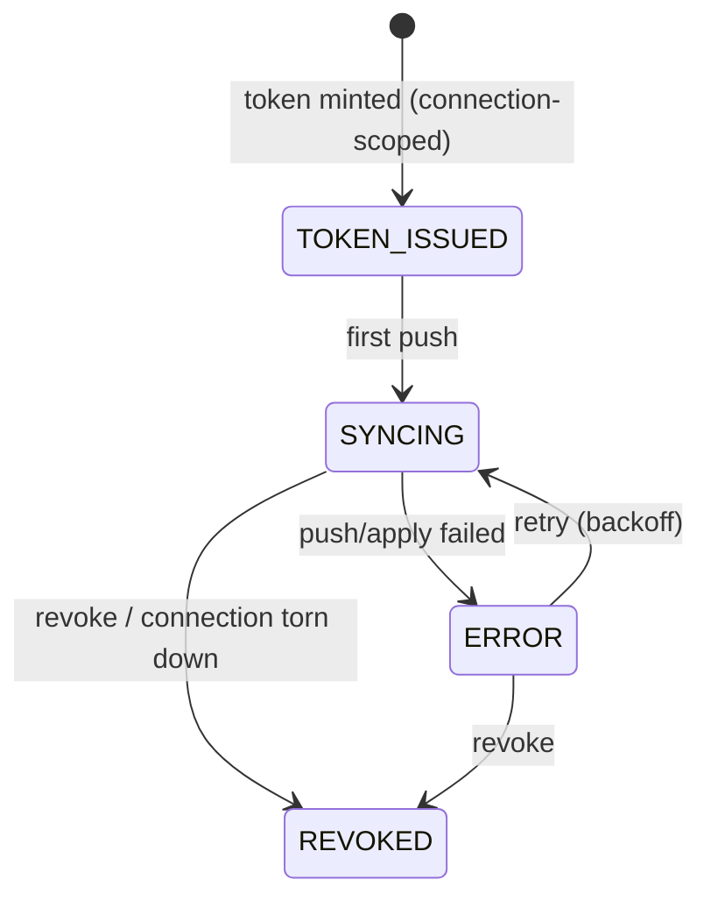

# D08 — SCIM per-connection + grants integration

Epic: `../identity-platform-redesign.md` · Plan: `delivery-plan.md` · Wave 3 · Depends on: D05 (connection-scoped tokens) + **authz precondition checklist (hard)** · Flag: `SCIM_V2_GRANTS`

# Overview

SCIM stops writing membership tables directly. Tokens become scoped per SSO connection, `User.externalId` gives IdP-stable identity, and every membership consequence flows through `grants.*` — SCIM becomes a command/event producer in the identity pipeline. De-enroll is a replayable event with a proven postcondition: no effective permissions remain.

# Requirements

- `ScimToken.connectionId` (issued in D05); tokens are per-connection — a token for connection A cannot write org B.
- `User.externalId` for IdP-stable identity (survives email changes).
- `ScimSync` aggregate + `scim_sync_state` projection:

- All membership writes via `grants.attach` / `grants.offboard` — no direct `OrganizationUser`/`RoleBinding` writes. De-enroll calls `grants.offboard`; the empty-proof postcondition is asserted in an integration test.
- Failed applies are visible dead-letters (process-manager outbox, `retryable: false` retires visibly), never silent drift.
- Group → role-binding mapping UI stays; its writes also go through `grants.attach`. SCIM-managed group provenance guards (no rename/member edits outside SCIM) survive.
- Connection teardown revokes its SCIM tokens (lifecycle event → PM intent).

# Out of Scope

- SCIM protocol surface changes (v2 Users+Groups already complete). Seat/billing classification (license system owns it; lite-member-as-role was the authz program).

# Research

- Today: `platform/app/ee/scim/` — full SCIM v2 at `/api/scim/v2`, per-org bearer tokens, direct writes with unconditional MEMBER role, Auth0 log-stream webhook (dies at D10; customers repoint at D09).
- Doctrine anchor: `specs/event-sourcing/pipeline-model.feature` (pipelines own their commands/events/projections); content-boundary precedent ADR-052.
- Corpus-audit spec impacts: `scim-group-mapping.feature` — 20/24 scenarios `@unimplemented`; amend deprovisioning (:170-178) from "direct RoleBinding records removed" to the grants-offboard framing now, while it's cheap. `groups-rest-api.feature` — provenance guards (:83-87, :120-123, :140-143) are anchors that survive.

# Technical Plan

1. `ScimToken.connectionId` migration + backfill (org's first connection; D05 issues new tokens scoped).
2. `User.externalId` migration + SCIM payload mapping.
3. ScimSync aggregate, events, projection; SCIM endpoints become command producers (same external API).
4. Process manager: de-enroll → `grants.offboard` with postcondition check; retry with backoff; dead-letter visibility in the ops surface.
5. Group mapping UI write path repointed to `grants.attach`.
6. Amend `scim-group-mapping.feature`; integration test asserting the offboard postcondition.

# Exit gate / rollback

- **Exit:** push/group/deactivate round-trip; token scoping enforced (cross-connection write rejected); offboard postcondition asserted in integration test; dead-letters visible.
- **Rollback:** legacy direct-write path behind `SCIM_V2_GRANTS` flag until bake completes.

# Security Concerns

- Token scope: per-connection; cross-org writes impossible by construction.
- De-enroll is the highest-stakes SCIM operation — replayable event + proven postcondition + visible failure, never silent.
- SCIM payload PII stays out of events (pseudonymization rule, D01).

# Open Questions

- None specific. (Role-mapping semantics for the unified engine — e.g. unconditional-MEMBER replacement — were settled by the authz program's roleKey model; SCIM maps seat → roleKey per that program.)
