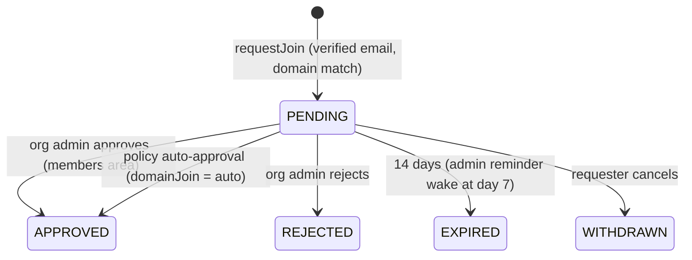

# D12 — Join requests + domain auto-join (Anthropic-Teams-style)

Epic: `../identity-platform-redesign.md` · Plan: `delivery-plan.md` · Wave 3 · Depends on: D03 (router) + D13 (sign-up interstitial hook) · Flag: `JOIN_REQUESTS`

> **D05 is not a dependency.** Approvals land in the existing `/settings/members` UI beside D11's invitation management, which D05 later absorbs anyway. They need no new permission either: every invite procedure in `platform/app/src/server/api/routers/organization.ts` is already gated on `organization:manage`, an existing registered permission, and answering a request is the same authority pointed the other way. Nothing from the authz precondition checklist is required.

# Overview

Sign up with a work email, see that your colleagues already have an org, and get in — either by requesting (an admin approves in-app) or, where the org has opted in, by walking straight in on a verified domain match. No invitation needed. The request path is admin-gated, which is what makes it safe without any SSO machinery: worst case is a stranger's request sitting in an admin's inbox. The auto-join path is org opt-in, verified-email-only, and never available on public email domains.

Because this decision now happens **before** workspace creation (D13's interstitial), it is also the fix for orphaned organizations: today every sign-up mints a fresh org, including the thousands of solo workspaces people abandon the moment they join their real one.

# The journey (the case this must cover, end to end)

1. I sign up for LangWatch with `me@acme.com` and verify the email.
2. Before any workspace is created, I see that Acme Corp already exists here ("12 of your colleagues"), with **Join Acme Corp** as the primary action and "create a new organization" as the secondary one.
3. Depending on Acme's `domainJoin` setting:
   - **`request`** — I ask to join; my manager (any org admin) gets an email + in-app notification and approves or rejects; I get notified and land in the org with the default role.
   - **`auto`** — I'm in immediately with the default role; admins are notified it happened.
   - **`off`** — I see nothing about Acme at all; sign-up proceeds to workspace creation as today.
4. At no point has a throwaway organization been created for me unless I explicitly chose "create a new organization" (or no match existed).

# Requirements

Aggregate `join_request` in its OWN pipeline (`join-requests`) beside the identity one; projection `join_requests` (`id, userId, organizationId, domain, state, createdAt, resolvedAt, resolvedByType, resolvedById`):



Auto-join reuses the same lifecycle: the request is created and immediately approved by policy (`resolvedBy = policy:domain-auto`), so the audit trail and metrics are identical to the admin path.

- **Org setting `domainJoin`: `off` | `request` | `auto`.** Default `request` for cloud self-serve orgs; forced `off` for SSO-connected orgs (their connection's JIT handles it). `auto` is opt-in only, admin-set.
- **The license gate holds `auto` and lets `request` through.** Auto-join is federation — the deployment decides who counts as a colleague and admits them with nobody in the loop — which is exactly what `sso-license-gating.feature` has always counted as SSO. Request-to-join is not: an administrator approves every one, no identity provider is involved, and gating it would recreate "my company is invisible" on precisely the self-hosted deployments that have no other way out. The privacy rules carry that path instead (verified email, domain match, no public email domains). `sso-license-gating.feature`'s vocabulary was amended to name **auto**-join specifically; its `:182` enforced scenario is unchanged and still holds.
- **Matching** (post-verification only): orgs with ≥1 member holding a VERIFIED identifier on the requester's domain, excluding orgs with ACTIVE SSO connections (the projection's ACTIVE state, and the legacy `Organization.ssoDomain` string too — until `SSOCONN_ROUTING` flips, the string is what actually admits people), excluding orgs with `domainJoin = off`. **Public email domains (gmail.com, outlook.com, …) never match** — maintained deny-list; no domain feature exists for them in any mode. **`auto` needs more than `request` does** (Open Q8, settled in the spec): an administrator must have named that domain when turning `auto` on, *and* ≥2 members must hold verified identifiers on it. Nobody gates the automatic path, so one colleague with a company-looking address is not evidence a company owns a domain; the administrator saying so, plus corroboration, is. A domain matching more than one `auto` org auto-joins neither and falls back to asking.
- **Privacy:** org existence/name revealed only after the requester's email is verified, only on domain match; member counts coarse ("12 of your colleagues").
- **No personal-org exclusion, and that is a decision** (settled during implementation). The schema has no personal ORGANIZATION: `Team.isPersonal` / `Project.isPersonal` are per-member workspaces *inside* an org, and `organization.prisma.repository.ts:561` gives every org a shared team, so any such predicate is permanently false — a scenario that reads green while proving nothing. The privacy it reached for is held by the other rules: consumer domains are structurally excluded, `auto` needs an admin-named domain **and** ≥2 verified members (which one person cannot be), and `request` ends with an admin free to ignore it. What remains is the solo *work* org, and offering it is the orphan-organization fix working: the asker learns only that somebody at a domain they have already proved they hold uses LangWatch, and that person decides.
- **No role picker:** approval — admin or policy — always grants the org's default role (MEMBER); admins upgrade later. Least privilege by construction.
- **Orphan-org prevention:** the interstitial runs **before** workspace creation (D13's sign-up flow); "join" is the primary action on a match and org creation is the explicit secondary choice. A user with a pending request lands on a "request pending" screen and may still create a workspace deliberately — but never gets one minted silently. Metric: orphaned-organization creation rate (orgs created by users who join another org on the same domain within 30 days).
- **Anti-abuse:** one pending request per (user, org); requests rate-limited like auth endpoints; rejection is silent-ish ("not approved", no reason required); auto-join notifies all org admins after the fact (email + in-app) so a surprising join is visible immediately.
- **Process manager per request:** `JoinRequested` → notify org admins (email + in-app); day-7 reminder wake; day-14 `JoinExpired`. Approval intent (admin or policy) → `grants.attach` → notify requester (email + in-app).
- **Approvals are auditable, and stay that way.** `NON_AUDITABLE_SOURCES` holds only `migration` and `read-through-mint`, so a join approval reaches the customer's audit page by default. Nothing here opts out — an auto-join in particular must be as visible as an approval somebody clicked.
- **Interplay with invitations (D11):** one panel, two directions. An admin looking at a pending join request approves it as-is (default role); they may instead answer it with a formal invite sent through the existing D11 flow, which owns the role/team picker — the invite supersedes: sending it resolves the request as APPROVED with `resolvedBy` the invite. D12 wires only that resolution; a dedicated convert-to-invite flow inside the panel stays out of scope (below). In the other direction, accepting any org invite auto-withdraws the same user's pending join request for that org — a user never holds both. Duplicate suppression: a pending request blocks a second request (one per user+org), never blocks an invite.
- **Existing users can always create another organization** (org switcher → create), whether or not their domain matches one; the interstitial only orders the choices. On a matching domain the create screen shows a soft notice with the join affordance inline ("Acme Corp is already here — join instead?"), never a block (epic Q17).
- **UI:** the sign-up interstitial ("Acme Corp — 12 of your colleagues are here. Join / Request to join" alongside "create a new organization"), also shown post-login for existing users, once per domain per user, dismissible (hook point left by D13/D03); approvals live in the existing `/settings/members` area beside pending invitations, one panel with two directions (D05's org-admin surface absorbs it later); the `domainJoin` setting lives in org Settings next to the SSO configuration.

# Data structures

Aggregate `join_request` in its own pipeline (`join-requests`), NOT inside the identity pipeline; `tenantId = organizationId` (admins query by org), `aggregateId = joinRequestId`. The reason is the KEY, not the entity kind — distinct kinds can share an aggregate type where they share a key (`trace-processing` stamps `aggregateType: "trace"` on seven command families), but the identity aggregate is keyed and tenanted by USER while this is keyed by request and tenanted by org, and the aggregate id is what the queue shards on. Events carry ids, the domain, and enums — the requester's email never needs to appear; the domain is the fact (D01 payload rules):

```jsonc
// lw.identity.join_requested
{ "data": {
    "joinRequestId": "jreq_…",
    "userId": "user_…",
    "organizationId": "org_…",
    "domain": "acme.com",
    "matchedVia": "verified-identifier-domain"
} }

// lw.identity.join_approved — same shape for the policy path
{ "data": {
    "joinRequestId": "jreq_…",
    "resolvedBy": { "type": "user", "id": "user_admin…" }   // or { "type": "policy", "id": "domain-auto" }
                                                             // or { "type": "invite", "id": "inv_…" } (D11 interplay)
} }

// lw.identity.join_rejected { joinRequestId, resolvedBy }         — no reason field; rejection is silent-ish
// lw.identity.join_expired  { joinRequestId }                      — day-14 PM wake
// lw.identity.join_withdrawn { joinRequestId, cause: "user" | "invite-accepted" }
```

Projection `join_requests` (PG, fold-written): `id · userId · organizationId · domain · state · createdAt · resolvedAt · resolvedByType · resolvedById`. Membership itself is never written here — approval dispatches `grants.attach` (the ledger's `grant_attached` with `source: "invite"`-class provenance carries the authorization fact).

# Out of Scope

- Converting a pending request into a formal invite with team assignments (nice-to-have later). SSO JIT provisioning (belongs to the connection, D04). Cleanup of the orphaned organizations that already exist (Open Q14 — this deliverable stops the bleeding, it doesn't drain the pool).

# Research

- Greenfield for the lifecycle — no existing spec coverage. **Written 2026-08-24** (`@unimplemented` until bound): `specs/identity/join-requests.feature` (lifecycle, anti-abuse, D11 interplay), `specs/identity/join-matching-and-privacy.feature` (matching rules and reveal discipline), `specs/identity/domain-auto-join.feature` (the automatic path and the license line), `specs/identity/join-before-create.feature` (the sign-up interstitial and the orphan invariant). One corpus touchpoint, amended in the same change: `specs/licensing/sso-license-gating.feature` — its vocabulary now names domain **auto**-join specifically, and two scenarios record that requesting is ungated.
- Motivation: the invitation dead-end support threads — users who should have found their org instead landed in "create personal workspace" flows they couldn't escape. The same flow is why production carries a long tail of orphaned single-user organizations: sign-up creates one unconditionally, and joining your real org later doesn't remove it.

# Technical Plan

1. Projection + events (`JoinRequested`, `JoinApproved`, `JoinRejected`, `JoinExpired`, `JoinWithdrawn`) + matching query over VERIFIED identifiers; policy auto-approval path with `resolvedBy = policy:domain-auto`.
2. Process manager: notifications (incl. after-the-fact admin notification on auto-join), day-7 reminder, day-14 expiry; approval intent → `grants.attach`.
3. Interstitial content into D13's sign-up hook (join-before-create) + post-login variant; org-admin surface approvals panel + `domainJoin` setting.
4. Orphaned-organization metric (creation rate + the 30-day join-elsewhere signal), on the dashboard before the flag flips.
5. ~~New Gherkin specs for the lifecycle, matching rules, privacy, anti-abuse, auto-join, and join-before-create.~~ Written 2026-08-24 — see Research.

# Exit gate / rollback

- **Exit:** request → approve → member round-trip; auto-join round-trip on an opted-in org (and refused on a public email domain); reminder/expiry wakes verified; matching/privacy specs green; orphaned-organization creation rate visibly down.
- **Rollback:** `JOIN_REQUESTS` off.

# Security Concerns

- Request ≠ access — an admin gates every join, except where the org has deliberately opted into `auto`; that path still requires a verified email on a matching non-public domain and notifies admins immediately.
- Public email domains are excluded from every mode — a gmail.com "domain match" must be structurally impossible, not just unlikely.
- Reveal discipline: post-verification only, domain match only, coarse counts.

# Open Questions

- ~~(Epic 8) matching threshold ≥1 vs ≥2 verified members on the domain.~~ **Settled 2026-08-24** in `specs/identity/join-matching-and-privacy.feature`: `request` needs ≥1 (verification plus admin approval carry it), `auto` needs the admin to have named the domain *and* ≥2 verified members on it.
- (Epic 14) the orphaned organizations that already exist: sweep, merge tool, or leave them?
