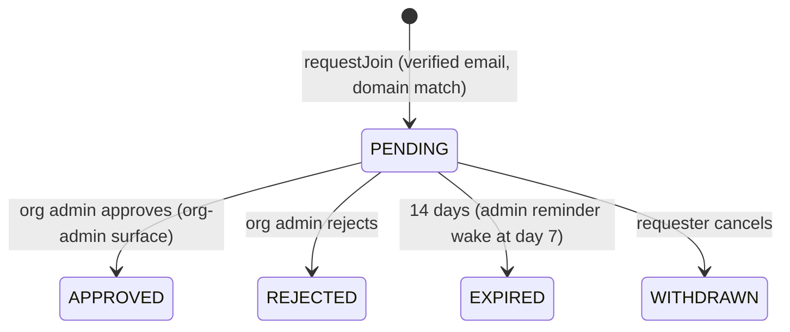

# D12 — Join requests (auto-invite, Anthropic-Teams-style)

Epic: `../identity-platform-redesign.md` · Plan: `delivery-plan.md` · Wave 3 · Depends on: D03 (router interstitial hook) + D05 (org-admin surface hosts approvals) · Flag: `JOIN_REQUESTS`

# Overview

Sign up with a work email, see that your colleagues already have an org, request to join, admin approves in-app — no invitation needed. Admin-gated rather than domain-verification-gated, which is what makes it safe without any SSO machinery: worst case is a stranger's request sitting in an admin's inbox.

# Requirements

Aggregate `join_request` in the identity pipeline; projection `join_requests` (`id, userId, organizationId, domain, state, createdAt, resolvedAt, resolvedByUserId`):

- **Matching** (post-verification only): orgs with ≥1 member holding a VERIFIED identifier on the requester's domain (threshold Open Q8), excluding personal orgs, excluding orgs with ACTIVE SSO connections (their auto-join handles it), excluding orgs with `domainJoinRequests = false`.
- **Privacy:** org existence/name revealed only after the requester's email is verified, only on domain match, never for personal orgs; member counts coarse ("12 of your colleagues").
- **No role picker:** approval always grants the org's default role (MEMBER); admins upgrade later. Least privilege by construction.
- **Org setting** `domainJoinRequests`: default on for cloud self-serve orgs; forced off for SSO-connected orgs and self-hosted (per-org override).
- **Anti-abuse:** one pending request per (user, org); requests rate-limited like auth endpoints; rejection is silent-ish ("not approved", no reason required).
- **Process manager per request:** `JoinRequested` → notify org admins (email + in-app); day-7 reminder wake; day-14 `JoinExpired`. Approval intent → `grants.attach` → notify requester (email + in-app).
- **UI:** post-signup/post-login interstitial ("Acme Corp — 12 of your colleagues are here. Request to join" alongside "create your own workspace"), shown once per domain per user, dismissible (hook point left by D03); approvals live on the org-admin surface (badge + approvals row).

# Out of Scope

- Converting a pending request into a formal invite with team assignments (nice-to-have later). Auto-approve policies (domain-verified auto-join belongs to the SSO machinery).

# Research

- Greenfield — no existing spec coverage; new `.feature` files to write.
- Motivation: the invitation dead-end support threads — users who should have found their org instead landed in "create personal workspace" flows they couldn't escape.

# Technical Plan

1. Projection + events (`JoinRequested`, `JoinApproved`, `JoinRejected`, `JoinExpired`, `JoinWithdrawn`) + matching query over VERIFIED identifiers.
2. Process manager: notifications, day-7 reminder, day-14 expiry; approval intent → `grants.attach`.
3. Interstitial UI + org-admin surface approvals panel.
4. New Gherkin specs for the lifecycle, matching rules, privacy, and anti-abuse.

# Exit gate / rollback

- **Exit:** request → approve → member round-trip; reminder/expiry wakes verified; matching/privacy specs green.
- **Rollback:** `JOIN_REQUESTS` off.

# Security Concerns

- Request ≠ access — an admin gates every join.
- Reveal discipline: post-verification only, domain match only, never personal orgs, coarse counts.

# Open Questions

- (Epic 8) matching threshold ≥1 vs ≥2 verified members on the domain. (Lean: ≥1 — behind verification and admin approval anyway.)
