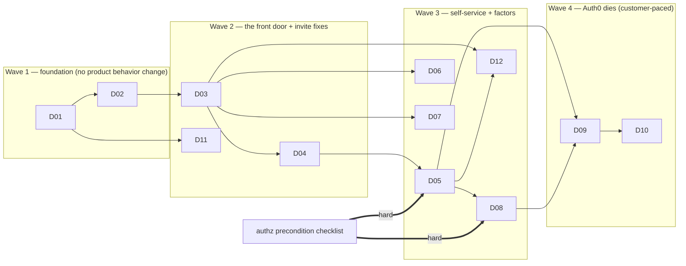

# Identity Platform — Delivery Plan

The final spec: how the twelve deliverables (`D01`–`D12`, see `../identity-platform-redesign.md` for the epic) sequence, gate, and roll back. Each deliverable is a sealed goal: independently shippable, flag-gated, measurable exit, stated rollback.

# Precondition — authz program landed

This program starts only when the unified authz engine is on `main`. Ready-to-start checklist (the minimal API contract we consume):

- [ ] `server/authz/registry.ts` accepts new org-scope permission entries; registry-derived `Permission` type exported.
- [ ] `grants.attach` / `grants.offboard` callable server-side with actor context; offboard carries the empty-proof postcondition.
- [ ] `authz.require` / `.permission()` for tRPC; `useCan` / `RequireCan` for UI.
- [ ] Edge middleware: any credential → `Principal {actor, subject}` (authz stage D3), extensible with session claims.
- [ ] `CustomRole` supports org-scope permission keys (for the IT-admin role).
- [ ] `rbac.ts` monolith and `TeamUser` deleted or behind an enforcing flag with a dated deletion — identity code must never call them.

If the authz program slips, D01–D04 and D11 can start (they need nothing from authz); D05 and D08 hard-block on the checklist.

# Sequencing

Rationale:

- **D02 before D03** (decision: pulled ahead) — the cutover milestone should not also be the milestone that discovers Redis-loss takes down sign-in. Cost is touching dispatch before real load exists; acceptable.
- **D03 is the highest-risk deliverable** — every human's front door. It lands only after D01's replay parity and D02's Redis-kill test are green.
- **D11 (resilient invitations) was pulled out of the old combined deliverable and moved to Wave 2**: identifier-aware acceptance and one-click resend need only D01's identifiers — they fix the loudest support pain and shouldn't wait for the router. Resend UI lands in the existing members/invitations area; the org-admin surface absorbs it at D05.
- **D06/D07/D08/D12 are mutually independent** after D03/D05; staff in whatever order capacity allows. Suggested: D06 → D07 → D08; D12 (join requests) needs D03's interstitial hook and D05's org-admin surface.
- **D09 is customer-paced, per tenant, slow by design** — no fleet deadline. **D10 is a program exit criterion, not a schedulable milestone**: it starts when the last legacy connection tears down; Auth0 spend and the agents-box login survive until then, and that's fine.

# Deliverable gates

| # | Flag(s) | Exit gate | Rollback | Risk |
|---|---|---|---|---|
| D01 | — (additive) | Replay rebuilds lifecycle columns from CH and matches live table; hook coverage test: every Account write emits its event | Stop emitting; columns additive, drop later | Low |
| D02 | `AUTH_REDIS_BREAKER` | Dev-compose Redis-kill: sign-in + attach + detach + session refresh pass; breaker metrics emitted | Breaker off = today's behavior | Medium (touches dispatch) |
| D03 | `IDENTITY_ROUTER_V2` (shadow → enforce) | Zero unexplained shadow mismatches over bake; sign-in success ≥ baseline | Flag off | **Highest** |
| D04 | `SSOCONN_ROUTING` (shadow → enforce) | Routing parity silent vs `ssoDomain` strings; string writes stopped | Flag off, strings still dual-written | Medium |
| D05 | `SELF_SERVE_SSO` (per-org) | New enterprise customer onboards with exactly one LangWatch action (approval click); ops surface resolves a real support case | Per-org flag off | Medium |
| D06 | `MFA_ENROLLMENT_OPEN` + deploy-time session revoke | Enroll → challenge → backup-code → disable round-trips; org policy enforced; lockout verified | Flag off; session kill is irreversible (comms!) | **One-way door** |
| D07 | `PASSKEYS_ENABLED` | Register / sign-in / no-email sign-in / delete round-trips, platform + cross-platform authenticators | Flag off | Low |
| D08 | `SCIM_V2_GRANTS` | Push/group/deactivate round-trip; token scoping enforced; offboard postcondition asserted in integration test | Legacy write path behind flag | Medium |
| D09 | per-customer | Per customer: all active users linked, quiet grace, shim hits at zero, teardown event. Program: zero ACTIVE legacy connections | Both-connections-active grace IS the rollback | Customer-facing |
| D10 (program exit criterion — customer-paced) | — | `grep -ri auth0 platform/app` → changelog only; deploy pipeline green | None needed (nothing left to break) | Low |
| D11 | invite changes additive | Round-trips: invite → wrong-method → accepted; expiry → resend → accepted; Slack invite cases replay green | Additive; old flow flag-restorable during bake | Low |
| D12 | `JOIN_REQUESTS` | request → approve → member round-trip; reminder/expiry wakes verified; matching/privacy specs green | `JOIN_REQUESTS` off | Low |

# ADRs to write (before or with the gated deliverable)

Plain design docs, written before the code they cover:

1. **Identity platform + identifiers** (D01) — the column-ownership rule; **explicitly amends ADR-022/015** (replay excludes protocol columns; replay tooling gains per-pipeline column scoping). Carries the pseudonymization rule (generalizes ADR-052's content boundary).
2. **Auth-path resilience** (D02) — the circuit breaker; **explicitly amends ADR-007's process-role rule** for the identity pipeline only, with the failure-semantics analysis.
3. **Sign-in router + SSO self-service** (D03–D05) — identifier-first routing, auto-link rules; **explicitly amends ADR-027** (hook → per-method router policy; carries over the constants table and the route-table canary; answers the license-timing question, Open Q11).
4. **MFA + session shape** (D06) — `amr` semantics incl. the passkey/`phw` decision (Open Q4); the forced re-login.

Gherkin specs to write fresh (no existing coverage): join-request lifecycle (D12), org-admin surface panels (D05), ops lookup actions (D05), MFA enrollment/step-up (D06), connection self-service lifecycle (D05). Use `/write-spec` per deliverable.

# Spec-amendment table (existing corpus)

| Existing spec | Action | Deliverable |
|---|---|---|
| `specs/auth/phase-1-better-auth-config.feature` | Retire `NEXTAUTH_PROVIDER` matrix (:19-45), `ssoProvider` matching (:51-73), `pendingSsoSetup` (:112-117); keep better-auth/bcrypt anchors | D03 |
| 〃 `:119-137` (legacy `Session.impersonating`) | Retire; replace with `{actor, subject}` scenarios | D06 |
| `specs/auth/auth-signin-flows.feature` | Port credentials/Google flows to router; Auth0 flow retired at D10 (legacy callback kept working by the shim, R9, until then) | D03, D09/D10 |
| `specs/auth/password-reset.feature` | Flip cloud/SSO-mode rejection per Open Q9; keep no-oracle + revoke-all anchors | D03 |
| `specs/auth/sso-wrong-provider-recovery.feature` | Port from `ssoDomain` strings to `SsoConnection`; most scenarios survive | D04 |
| `specs/auth/sso-orphan-user-linking.feature` | Generalize into the auto-link/admin-confirm rule; reconcile "unverified orphan" with R8 | D03 |
| `specs/auth/signup-does-not-strand-an-account.feature` | Anchor (keep); resolve enumeration tension (Open Q12) | D03 |
| `specs/settings/change-password-auth0.feature` | Retire Auth0 Management API scenarios; rewrite as identifier-model password change | D10 |
| `specs/members/update-pending-invitation.feature` | 48h → 14 days; states → PENDING/ACCEPTED/EXPIRED/REVOKED (WAITING_APPROVAL fate = Open Q13); add resend scenarios | D11 |
| `specs/licensing/enforcement-members.feature` (expired-invite counting only) | Align to new invite states | D11 |
| `specs/licensing/sso-license-gating.feature` | Amend mechanism (hook → router policy); settle restart semantics (Open Q11); behavioral invariants survive | D03 |
| `specs/features/scim-group-mapping.feature` | Amend deprovisioning to grants-offboard framing (20/24 scenarios `@unimplemented` — cheap now) | D08 |
| `specs/groups/groups-rest-api.feature` | Keep provenance anchors (SCIM-managed guards survive) | D08 |
| `specs/ai-gateway/governance/sessions-and-devices.feature` | Session inventory gains `identifierId`/`amr`; `maxSessionDurationDays` × forced re-login interplay | D06 |
| `specs/auth/impersonation-banner.feature`, `specs/ops/dejaview-impersonation-access.feature`, `specs/features/backoffice-user-impersonation-reason.feature` | Anchors — survive; mechanism swaps underneath | D06 |
| `specs/features/user-deactivation.feature:134-143` | Stale "NextAuth signIn callback" wording sweep; behavior anchor survives | D03 |
| `specs/event-sourcing/pipeline-model.feature` | Doctrine anchor for D01 — no change | D01 |
| `specs/rbac/*`, `specs/api-keys/*`, `specs/members/member-role-team-restrictions.feature` | Owned by the authz program, not this one — listed for visibility | — |

# Flag inventory

`AUTH_REDIS_BREAKER` (D02) · `IDENTITY_ROUTER_V2` (D03) · `SSOCONN_ROUTING` (D04) · `SELF_SERVE_SSO` per-org (D05) · `MFA_ENROLLMENT_OPEN` (D06) · `PASSKEYS_ENABLED` (D07) · `SCIM_V2_GRANTS` (D08) · invite changes additive (D11) · `JOIN_REQUESTS` (D12) · deploy-time session revoke (D06, one-way).

House discipline: dashboards before flags flip. Metrics pack per deliverable: routing decisions by outcome, link proposals auto vs confirmed, ceremony success rates, SCIM dead-letters, breaker state transitions, join-request funnel, invite resend/expiry rates, per-customer migration progress + shim hits, sign-in success vs baseline.

# Risk register

| Risk | Where | Mitigation |
|---|---|---|
| Cutover breaks sign-in fleet-wide | D03 | Shadow bake with zero-mismatch gate; flag off = instant revert; D02 already landed |
| Replay clobbers protocol columns | D01 | ADR-1 amends replay contract; replay-parity test in exit gate; lint rule on lifecycle-column writes |
| Inline processing overloads web role during Redis outage | D02 | Identity volume is hundreds/day; breaker metrics; half-open probes; ADR-2 records the analysis |
| Session revoke-all strands users mid-work | D06 | Comms + precedent (better-auth cutover); schedule low-traffic window |
| Customer IdP apps pin legacy Auth0 callback URI | D09 | Resolved (R9): temporary shim with per-org usage metric through grace; removed at D10 |
| Auth0 retirement stalls on stragglers | D09/D10 | By design: per-tenant, no deadline; D10 is an exit criterion, not a milestone; nudge/escalation ladder in the wizard |
| Authz API drift while we build against it | D05/D08 | Precondition checklist is a contract; any authz API change is a breaking change to this program |
| Domain-approval queue becomes the new bottleneck | D05 | Staffing/SLA is Open Q2; measure queue latency from day one |

# Staffing notes

- D01–D03 are strictly sequential, same owner ideally (they share the pipeline + dispatch path).
- D06/D07 pair naturally (both touch session shape + better-auth plugins).
- D09 is engineering + CS per customer; the wizard and playbook are engineering's deliverable, execution is shared and deliberately slow.
- D02 and D11 (invitations) are the best parallelization candidates for a second engineer; D11 needs only D01 and can start immediately after it.
