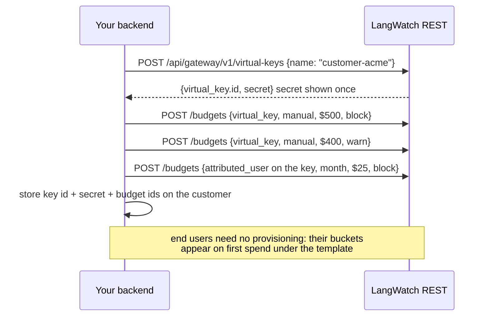

This cookbook is for a platform whose customers consume LLMs through it. Your backend provisions one virtual key per customer through the management API, the LangWatch AI Gateway enforces the caps and meters every request, and signed spend events feed your billing ledger. Your product keeps no metering code of its own, and your customers never see a provider credential.

<Card title="The runnable reference: agent-billing-demo" icon="github" href="https://github.com/langwatch/agent-billing-demo">
  An open-source agent-platform SaaS that implements every step below in both TypeScript and Python: sign-up provisions a real tenant key and real caps, chat goes through the gateway, and the meters on screen come from the signed events its own receiver ingests. The webhook receiver, ledger, reconciliation loop and provisioning are written to be copied from.
</Card>

## What you need

- An Enterprise plan or license. Webhook endpoints and the spend APIs are Enterprise features.
- Two credentials, because the two surfaces need different permissions. A LangWatch API key with `virtualKeys:manage` and `gatewayBudgets:manage` for provisioning, and an organization API key with `webhookEndpoints:manage` and `gatewaySpend:view` for the billing and webhook surfaces. The commands below show which one each call takes. See [RBAC](/ai-gateway/rbac).
- A provider credential configured once at organization scope under **Settings > Model Providers**. Tenants never see it.

Vocabulary used on this page: a **tenant** is your customer and has one **virtual key**; an **end user** is a person inside a tenant, attributed per request with no provisioning; a **spend event** is the metering record for one request; an **envelope** is how events arrive at your webhook receiver.

## The shape

```
End user's app
      |
      v
Your backend  --provisions keys and budgets-->  LangWatch management API (/api/gateway/v1/*)
      |
      |  hands the key to the tenant's runtime
      v
Tenant runtime  --/v1/chat/completions-->  LangWatch AI Gateway  -->  the provider, on your credential
```

Pick the unit of tenancy once:

| Unit | One virtual key per | Budget scope | When to use |
|---|---|---|---|
| Customer | tenant | `virtual_key` | Most SaaS products: one account is one key. |
| Seat | LangWatch user | `principal` | Internal platforms where every seat is a LangWatch member. |
| Team | team in your organization | `team` | Customers modelled as LangWatch teams with their own projects. |

The rest of this page uses one key per customer. `principal` budgets target LangWatch member accounts, which your external customers are not, so for a reseller the per-customer unit is the virtual key itself.

## 1. Provision a tenant

Signing up a customer is four calls from your backend: mint the key, attach a hard cap and a soft cap, add the per-end-user allowance. Store the key id, the secret (shown once) and the budget ids on your customer row.



```bash
# The tenant key, with the models it may use and a request rate cap
curl -sS $LW/api/gateway/v1/virtual-keys \
  -H "Authorization: Bearer $LANGWATCH_API_KEY" -H "Content-Type: application/json" \
  -H "Idempotency-Key: signup-acme-4171" \
  -d '{"name": "customer-acme", "external_id": "acme-4171",
       "config": {"modelsAllowed": ["openai/gpt-5-mini", "anthropic/claude-haiku-4-5"],
                  "rateLimits": {"rpm": 60}}}'
# -> {"virtual_key": {"id": "vk_..."}, "secret": "vk-lw-..."}  persist both

# Hard cap: blocks at the limit
curl -sS $LW/api/gateway/v1/budgets \
  -H "Authorization: Bearer $LANGWATCH_API_KEY" -H "Content-Type: application/json" \
  -d '{"scope": {"kind": "virtual_key", "virtual_key_id": "vk_..."}, "external_id": "acme-4171",
       "name": "acme hard cap", "window": "manual", "limit_usd": "500", "on_breach": "block"}'

# Soft cap: warns without blocking (a second, lower budget)
curl -sS $LW/api/gateway/v1/budgets \
  -H "Authorization: Bearer $LANGWATCH_API_KEY" -H "Content-Type: application/json" \
  -d '{"scope": {"kind": "virtual_key", "virtual_key_id": "vk_..."}, "external_id": "acme-4171",
       "name": "acme soft cap", "window": "manual", "limit_usd": "400", "on_breach": "warn"}'

# Per-end-user allowance: one template covers every end user, current and new
curl -sS $LW/api/gateway/v1/budgets \
  -H "Authorization: Bearer $LANGWATCH_API_KEY" -H "Content-Type: application/json" \
  -d '{"scope": {"kind": "attributed_user", "anchor_virtual_key_id": "vk_..."}, "external_id": "acme-4171",
       "name": "acme per-user cap", "window": "month", "limit_usd": "25", "on_breach": "block"}'
```

Decisions to make on purpose:

- **Stamp your own id and retry safely.** Put your customer id in `external_id` on the key and on every budget, and send an `Idempotency-Key` header on each create. A signup that times out halfway and replays with the same key and body gets the original response back instead of a second key, and `GET /api/gateway/v1/virtual-keys?external_id=acme-4171` finds the tenant without a mapping table.
- **`manual` windows for tenant caps** put period close in your hands: the budget accrues until your billing cycle resets it (step 6). Use a calendar window (`month`, aligned to UTC) if you bill on calendar months, or set `cycle_anchor_at` to the signup moment so the period rolls on the customer's anniversary.
- **The hard and soft caps are two budgets.** `block` at the real ceiling, `warn` below it. Crossing 80 percent of either emits `gateway.budget.threshold_crossed`; reaching a limit emits `gateway.budget.breached`. See [Budgets](/ai-gateway/budgets).
- **The attributed-user template** is one rule: each distinct end user on this key gets $25 per month. A bucket appears on the user's first spend; you create and delete no per-user budgets.
- **`modelsAllowed` and `rateLimits`** on the key are the only two fields of `config` a tenant key usually needs. `rateLimits.rpm` and `rateLimits.rpd` are enforced at the gateway; a tenant over the limit gets `429 rate_limited`. See [Rate limits](/ai-gateway/rate-limits).

## 2. Register your webhook endpoint (once)

Your billing ledger is fed by [webhook endpoints](/features/webhooks). Register your receiver once for the organization, subscribed to the spend stream and the budget signals:

```bash
curl -sS $LW/api/webhooks/v1/endpoints \
  -H "Authorization: Bearer $LANGWATCH_ORG_API_KEY" -H "Content-Type: application/json" \
  -d '{"url": "https://billing.example.com/webhooks/langwatch",
       "enabled_events": ["gateway.request.completed", "gateway.request.settled",
                          "gateway.budget.threshold_crossed", "gateway.budget.breached"]}'
```

The `201` response includes the signing `secret`, shown once. Give it to your receiver, then call `POST /api/webhooks/v1/endpoints/{id}/test` to prove the path before real traffic. The test delivery carries `X-LangWatch-Test-Fire: true`.

## 3. The request path

Your application calls the gateway with the tenant's key and two attribution fields:

```python
from openai import OpenAI

client = OpenAI(
    base_url="https://gateway.langwatch.ai/v1",
    api_key=tenant.langwatch_vk_secret,          # the tenant's virtual key
)

response = client.chat.completions.create(
    model="openai/gpt-5-mini",
    messages=[...],
    user=end_user.id,                            # attribution: who inside the tenant
    extra_headers={
        "X-LangWatch-Metadata": json.dumps({     # echoed on every spend event
            "tenant": tenant.id, "plan": tenant.plan,
        }),
    },
)
```

That is the whole integration on the request side. The `user` field, or the `X-LangWatch-End-User-Id` header which wins over the body, is what the per-user template enforces on and what `end_user_id` carries on every spend event. The metadata echo is how your billing joins events back to your own records without lookups.

<Warning>
With an attributed-user template active, a request that carries no end-user id is rejected with `400` and `error.code = "end_user_required"`. Send the id from day one.
</Warning>

The gateway, on every request: authenticates the key, checks the tenant's and the end user's budgets, applies `modelsAllowed`, sends the request to the provider on your credential, records the spend against both budgets, and writes a trace into the key's trace project.

## 4. Receive, verify, ingest

```mermaid
sequenceDiagram
    participant App as Your app
    participant GW as LangWatch AI Gateway
    participant LW as LangWatch
    participant RX as Your webhook receiver
    participant L as Your billing ledger
    App->>GW: POST /v1/chat/completions (VK secret, user: end-user id)
    GW-->>App: response + X-LangWatch-Gateway-Request-Id
    LW->>RX: POST {"batch": [gateway.request.completed, ...]} signed t=,v1=
    RX->>RX: verify HMAC over the raw body (5 min tolerance)
    RX->>L: upsert by event id (dedup), replace settled on supersession
    App->>GW: traffic continues until a cap is reached
    GW-->>App: 402 budget_exceeded {meta.budget_scope: attributed_user or virtual_key}
    LW->>RX: gateway.budget.threshold_crossed, then gateway.budget.breached
    App->>LW: POST /api/gateway/v1/budgets/:id/reset   period close
    Note over LW: reset moves the period boundary only;<br/>recorded spend and emitted events never change
    App->>GW: traffic admits again
```

Your receiver does three things, in order:

1. **Verify the signature.** The `X-LangWatch-Signature` header is `t=<unix seconds>,v1=<hex>`; the HMAC-SHA256 is computed over `<t>.<raw body>` with your endpoint secret. Reject a timestamp older than 300 seconds. For 24 hours after you roll the secret, the header carries two `v1=` values and either one is valid. Copy the verifier from the [webhooks reference](/features/webhooks#verifying-signatures) or from the demo repository.
2. **Dedup by envelope `id`** and ingest. Delivery is at least once and ids are stable, so an upsert keyed on `id` is enough; retries and replays become no-ops. Each delivery also carries `X-LangWatch-Delivery-Id` and `X-LangWatch-Delivery-Attempt`.
3. **Handle the settled pair.** A `gateway.request.settled` event books a request whose outcome never arrived, 30 minutes after admission, with `needs_reconciliation: true`. If a `gateway.request.completed` later arrives for the same `gateway_request_id`, replace the settled row with it. Never sum the pair. Field-by-field payload docs: [Billing & spend events](/ai-gateway/billing-events#the-spend-event).

Money discipline: store `cost.nano_usd` as an integer, sum integers, round once at invoice time. The `usage` object on a delivered event has five fields: `input_tokens`, `output_tokens`, `cache_read_input_tokens`, `cache_creation_input_tokens` and `reasoning_tokens`. Reasoning tokens are reported for display and are never priced separately.

A delivery that fails is retried after 1 minute, 5 minutes, 30 minutes, 2 hours, 6 hours, 12 hours, then every 12 hours, 11 attempts in total. A `Retry-After` header on your response is honoured as a floor.

## 5. Reconcile

Nightly, or at period close, reconcile in two grains against the ledger (details: [reconciliation](/ai-gateway/billing-events#reconciliation-two-grains-one-ledger)):

```bash
# Fast path: per-tenant checksums for the closed period
curl -sS "$LW/api/gateway/v1/spend-summaries?group_by=virtual_key&from=$FROM_MS&to=$TO_MS" \
  -H "Authorization: Bearer $LANGWATCH_ORG_API_KEY"
# compare event_count and cost.nano_usd per key against your ledger
```

Matching totals mean no aggregate divergence. They do not prove both systems hold the same set of `gateway_request_id`, because a different set can sum to the same amount, so a biller that needs request-level certainty walks the events regardless.

On divergence, walk `spend-events` for that key and window by cursor and compare the count per `gateway_request_id`. One request dropped and another booked twice leaves the id sets looking close and the money wrong; the ids whose counts disagree are your drops and duplicates. If every count agrees and the totals still differ, compare `cost.nano_usd` per id. Both reads take the same filters, so you can narrow the walk to what the checksum covered.

For a delivery gap (receiver outage, endpoint auto-disabled), [replay](/ai-gateway/billing-events#replay) the gap window to your endpoint and let your dedup absorb the duplicates.

### Narrowing and grouping

Repeat a filter to widen it and name two filters to narrow. Both reads accept `project_id`, `team_id`, `external_id`, `virtual_key_id`, `end_user_id`, `principal_user_id`, `model`, `provider_key`, `request_type`, `label`, `metadata` and `status`. Only `status=admitted` differs: the summaries refuse it, because a rollup sums the cost of requests past admission and an in-flight request has none. Ask `spend-events` for those.

```bash
# Two models, one customer tier, one team, in one call
curl -sS "$LW/api/gateway/v1/spend-summaries?group_by=model,end_user\
&from=$FROM_MS&to=$TO_MS\
&model=openai/gpt-5-mini&model=anthropic/claude-opus-4-1\
&metadata=customer_tier:gold\
&team_id=$TEAM_ID" \
  -H "Authorization: Bearer $LANGWATCH_ORG_API_KEY"
```

`metadata` is written `key:value` and splits on the first colon, so a value may contain colons of its own. Repeating a key widens that key: `metadata=tier:gold&metadata=tier:silver` matches either.

`group_by` takes one or two of `virtual_key`, `end_user`, `project`, `model`, `provider`, `principal` and `request_type`, and `bucket=hour|day` adds a time column in the `timezone` you name. `key` stays the first dimension's value, so an integration written against the single-dimension response keeps working; read `group` to tell two dimensions apart.

<Warning>
Grouping by `model` or `provider`, or into time buckets, is refused with `400 gateway_spend_group_by_unstable` on a window recent enough that outcomes can still arrive. Until a request settles, the model and provider recorded against it are the ones that were asked for, and they are replaced by the ones that served it. A page walk over a group that can move counts some requests twice and misses others.

Reconcile closed periods and this never fires. For a live dashboard where an approximate shape is enough, send `allow_unstable=true`. The refusal carries `meta.settles_at`, so a scheduler can wait for that time instead of guessing.
</Warning>

## 6. Breach handling and period close

When a cap is reached, the gateway rejects the request with `402` and names the budget in `meta`:

```json
{
  "error": {
    "type": "budget_exceeded",
    "code": "budget_exceeded",
    "message": "The end user spending limit (per month) for this request has been reached. Contact your LangWatch admin to raise it.",
    "meta": {"budget_id": "bgt_...", "budget_scope": "attributed_user", "budget_window": "month"},
    "tips": ["Contact your LangWatch admin to raise the end user spending limit",
             "Switch to a cheaper model or reduce request volume to stay within the limit"],
    "docs_url": "https://docs.langwatch.ai/ai-gateway/budgets",
    "trace_id": "..."
  }
}
```

`meta.budget_scope` is the branch your product copy needs: `attributed_user` means the end user's allowance ran out (show them an upgrade path), `virtual_key` means the tenant's cap ran out (route to the tenant admin). The same moment emits `gateway.budget.breached` to your endpoint, so your backend learns about it without polling. On `warn` budgets the request still passes and the response carries the `X-LangWatch-Budget-Warning` header instead.

Test the `402` path in your app before go-live. An unhandled `402` is the most common way a tenant's flow breaks on the day a cap is reached.

At period close, reset the tenant's `manual` budgets:

```bash
# Whole tenant: a new period starts now
curl -sS -X POST "$LW/api/gateway/v1/budgets/$HARD_CAP_ID/reset" \
  -H "Authorization: Bearer $LANGWATCH_API_KEY" -H "Content-Type: application/json" \
  -d '{"reason": "invoice 2026-08 issued"}'

# One end user's bucket only (their own cycle), template period untouched
curl -sS -X POST "$LW/api/gateway/v1/budgets/$TEMPLATE_ID/reset?end_user_id=u_123" \
  -H "Authorization: Bearer $LANGWATCH_API_KEY" -H "Content-Type: application/json" -d '{}'
```

Reset moves the period boundary and recomputes the next reset. It never changes recorded spend: the ledger and every emitted event are immutable, so reconciliation is unaffected by resets. The `reason` is written to the audit log with the reset.

To change a tenant's cap when their plan changes, `PATCH /api/gateway/v1/budgets/{id}` with the new `limit_usd`. To raise the per-user allowance, patch the template; every bucket follows.

## 7. Suspend, rotate, revoke

**Non-payment or abuse.** Stop a tenant reversibly:

```bash
curl -sS -X POST "$LW/api/gateway/v1/virtual-keys/$VK_ID/disable" \
  -H "Authorization: Bearer $LANGWATCH_API_KEY" -H "Content-Type: application/json" \
  -d '{"reason": "payment overdue"}'
```

Requests on the key are rejected with `403 virtual_key_disabled` until you call `/enable`. Budgets, scopes, key material and any running rotation grace stay intact. The gateway picks the change up on its next change-feed poll, a long poll of about 10 seconds. Both transitions emit `gateway.virtual_key.disabled` and `gateway.virtual_key.enabled` events.

**The customer resets their API key in your UI.** `POST /api/gateway/v1/virtual-keys/{id}/rotate` returns a new secret; send it to the customer once. The old secret keeps authenticating for 24 hours, so a client you have not reached yet does not fail mid-rollout. The event is `gateway.virtual_key.rotated`.

**The customer is gone for good.** `POST /api/gateway/v1/virtual-keys/{id}/revoke`. The next request returns `403 virtual_key_revoked`. Revoke is one-way; for a cancellation grace period, disable now and revoke after the grace.

**Audit.** Every write through your backend credential is recorded with the action, the target and the before and after values, attributed to the key's owning member. Filter the audit log on the `virtual_key` target for a per-customer provisioning history. See [Audit](/ai-gateway/audit).

## Rendering budget bars in your UI

The pair every tenant dashboard wants, current spend against the cap:

- Per tenant: `GET /api/gateway/v1/budgets?scope_type=virtual_key&external_id=acme-4171` returns each budget with live `spent_usd` and `limit_usd`. `spend_available: false` means spend could not be totalled server-side; hold billing until it recovers rather than invoicing a zero.
- Per tenant, one number: `GET /api/gateway/v1/virtual-keys/{id}/spend` returns `{virtual_key_id, spent_usd, requests, window: {from, to}}` for the current UTC month by default, or the `from` and `to` you pass. The same value is shown on the key in the Virtual Keys page, so what you invoice matches what you see.
- Per end user: `GET /api/gateway/v1/end-users/{id}/spend` (organization key) returns the user's rolling-window usage and every applicable template cap at its current-period spend, in one call. See [per-end-user spend](/ai-gateway/billing-events#per-end-user-spend).

Rating stays in your billing system: you define the markup over the gateway-reported cost, or bill passthrough plus a fee, and events carry `rate_version` so cost is re-derivable.

## Gotchas

- Never let a tenant see your backend API key. It holds `virtualKeys:manage`; they could provision keys charged to you.
- Name keys after your tenant id (`customer-<id>`) and set `external_id`. Those are your join keys for spend read-back and audit history; `principal_user_id` is only for LangWatch members.
- Rotate the key when an end user leaves the tenant's organization. Until then the ex-user keeps spend access until the budget resets.
- Budgets scoped to `virtual_key` are the right level for per-customer enforcement; `principal` and `team` scopes are for members and teams of your own LangWatch organization.

**Also check:** [Billing & spend events](/ai-gateway/billing-events) for every payload field, money rules, reconciliation and replay; [Webhooks](/features/webhooks) for signatures, retries, auto-disable and delivery controls; [Budgets](/ai-gateway/budgets) for scopes, windows and thresholds; [Virtual keys](/ai-gateway/virtual-keys) for the key lifecycle; [The demo agent platform](/ai-gateway/demo-agent-platform) for the reference repository.
