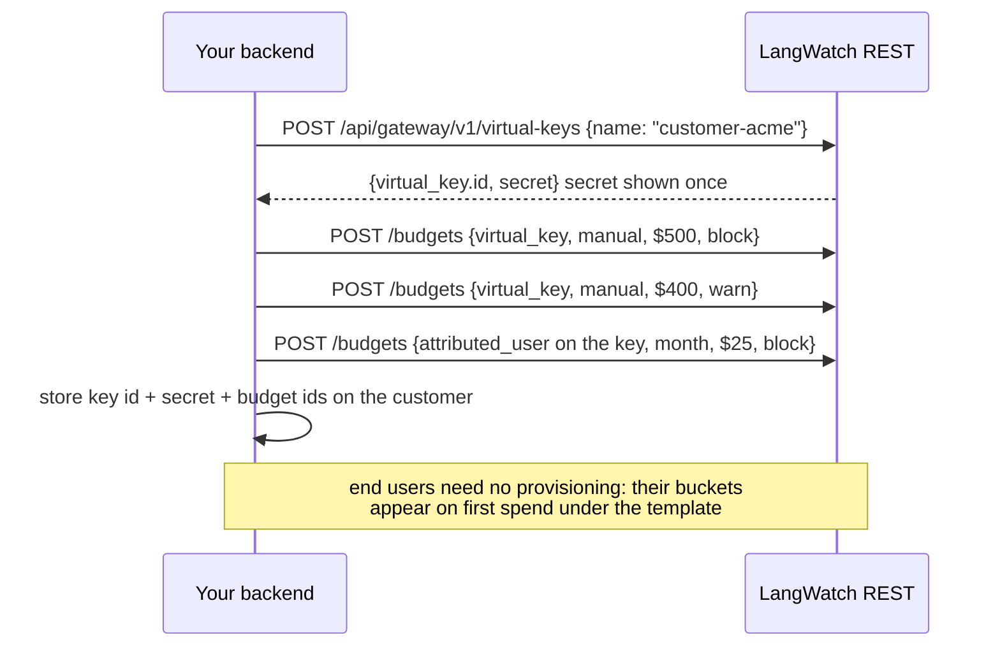

You run a platform whose customers consume LLMs through you, and you bill them for what they use. This cookbook wires that end to end on LangWatch: one virtual key per tenant, caps for the tenant and for each of their end users, signed spend events into your billing ledger, reconciliation, breach handling, and period close. Your product keeps zero metering code of its own.

<Card title="The runnable reference: agent-billing-demo" icon="github" href="https://github.com/langwatch/agent-billing-demo">
  A tiny open-source agent-platform SaaS implementing every step below: sign-up provisions a real tenant key and real caps, chat rides the gateway, and the meters on screen are driven by the signed events its own receiver ingests. The webhook receiver, ledger, reconciliation loop, and provisioning exist in **both TypeScript and Python**. Point your coding agent at that repo as the canonical integration example; every file is written to be copied from.
</Card>

## What you need

- An Enterprise plan or license (webhooks and the billing APIs gate on it).
- **Two credentials**, because the surfaces are deliberately separated. A gateway key for provisioning (`virtualKeys:*`, `gatewayBudgets:*`), and an **organization** API key for the billing and webhook surfaces (`webhookEndpoints:manage`, `gatewaySpend:view`), whose permissions only an organization-scoped role can grant. The curls below show which one each call takes. See [RBAC](/ai-gateway/rbac).
- A provider credential configured once at organization scope (**Settings > Model Providers**). Tenants never see it.

The vocabulary used throughout: a **tenant** is your customer (one **virtual key** each); an **end user** is a person inside a tenant (no provisioning, attributed per request); a **spend event** is the metering record; an **envelope** is how events arrive at your webhook receiver.

## 1. Provision a tenant

Signing up a customer is four calls from your backend: mint the key, attach a hard cap and a soft cap, add the per-end-user allowance. Store the key id, the secret (shown once), and the budget ids on your customer row.



```bash
# The tenant key
curl -sS $LW/api/gateway/v1/virtual-keys \
  -H "Authorization: Bearer $LANGWATCH_API_KEY" -H "Content-Type: application/json" \
  -d '{"name": "customer-acme"}'
# -> {"virtual_key": {"id": "vk_..."}, "secret": "vk-lw-live_..."}  persist both

# Hard cap: blocks at the limit
curl -sS $LW/api/gateway/v1/budgets \
  -H "Authorization: Bearer $LANGWATCH_API_KEY" -H "Content-Type: application/json" \
  -d '{"scope": {"kind": "virtual_key", "virtual_key_id": "vk_..."},
       "name": "acme hard cap", "window": "manual", "limit_usd": "500", "on_breach": "block"}'

# Soft cap: warns without blocking (a second, lower budget)
curl -sS $LW/api/gateway/v1/budgets \
  -H "Authorization: Bearer $LANGWATCH_API_KEY" -H "Content-Type: application/json" \
  -d '{"scope": {"kind": "virtual_key", "virtual_key_id": "vk_..."},
       "name": "acme soft cap", "window": "manual", "limit_usd": "400", "on_breach": "warn"}'

# Per-end-user allowance: ONE template covers every current and future end user
curl -sS $LW/api/gateway/v1/budgets \
  -H "Authorization: Bearer $LANGWATCH_API_KEY" -H "Content-Type: application/json" \
  -d '{"scope": {"kind": "attributed_user", "anchor_virtual_key_id": "vk_..."},
       "name": "acme per-user cap", "window": "month", "limit_usd": "25", "on_breach": "block"}'
```

Choices worth making deliberately:

- **`manual` windows for tenant caps** put period close in your hands: the budget accrues until your billing cycle resets it (step 6). Use calendar windows (`month`, aligned UTC) instead if you bill on calendar months and want automatic resets. The two combine freely.
- **The hard and soft caps are two budgets**, not one field: `block` at the real ceiling, `warn` below it. Crossing 80 percent of either emits `gateway.budget.threshold_crossed`; hitting a limit emits `gateway.budget.breached`. See [Budgets](/ai-gateway/budgets).
- **The attributed-user template** is one rule, "each distinct end user on this key: $25 per month". Buckets appear lazily on first spend; there is nothing to create or delete per user. Non-uniform caps are additional templates on other anchors.

## 2. Register your webhook endpoint (once)

Your billing ledger is fed by [webhook endpoints](/features/webhooks). Register your receiver once, org-wide, subscribed to the spend stream (and the budget signals if you want them):

```bash
curl -sS $LW/api/webhooks/v1/endpoints \
  -H "Authorization: Bearer $LANGWATCH_ORG_API_KEY" -H "Content-Type: application/json" \
  -d '{"url": "https://billing.example.com/webhooks/langwatch",
       "enabled_events": ["gateway.request.completed", "gateway.request.settled",
                          "gateway.budget.threshold_crossed", "gateway.budget.breached"]}'
```

The `201` response includes the signing `secret`, shown once. Give it to your receiver, then use the endpoint's **test fire** to prove the path before real traffic.

## 3. The request path

Your application calls the gateway with the tenant's key and two attribution fields:

```python
from openai import OpenAI

client = OpenAI(
    base_url="https://gateway.langwatch.ai/v1",
    api_key=tenant.langwatch_vk_secret,          # the tenant's virtual key
)

response = client.chat.completions.create(
    model="gpt-5-mini",
    messages=[...],
    user=end_user.id,                            # attribution: who inside the tenant
    extra_headers={
        "x-langwatch-metadata": json.dumps({     # echoed verbatim on every spend event
            "tenant": tenant.id, "plan": tenant.plan,
        }),
    },
)
```

That is the whole integration on the request side. The `user` field (or the `x-langwatch-end-user-id` header, which wins over the body) is what the per-user template enforces on and what `end_user_id` carries on every spend event. The metadata echo is how your billing joins events back to your own records without lookups.

<Warning>
With an attributed-user template active, a request that carries **no** end-user id is rejected with `error.code = "end_user_required"` rather than passing uncapped. A cap evadable by omitting a field is not a cap. Send the id from day one.
</Warning>

## 4. Receive, verify, ingest

```mermaid
sequenceDiagram
    participant App as Your app
    participant GW as AI Gateway
    participant LW as LangWatch
    participant RX as Your webhook receiver
    participant L as Your billing ledger
    App->>GW: POST /v1/chat/completions (VK secret, user: end-user id)
    GW-->>App: response + X-LangWatch-Gateway-Request-Id
    LW->>RX: POST {"batch": [gateway.request.completed, ...]} signed t=,v1=
    RX->>RX: verify HMAC over the raw body (5 min tolerance)
    RX->>L: upsert by event id (dedup), replace settled on supersession
    App->>GW: traffic continues until a cap is reached
    GW-->>App: 402 budget_exceeded {budget_scope: attributed_user or virtual_key}
    LW->>RX: gateway.budget.threshold_crossed, then gateway.budget.breached
    App->>LW: POST /api/gateway/v1/budgets/:id/reset   period close
    Note over LW: reset moves the period boundary only;<br/>recorded spend and emitted events never change
    App->>GW: traffic admits again
```

Your receiver does three things, in order:

1. **Verify the signature** over the exact raw request bytes with your endpoint secret, rejecting stale timestamps. Copy the verifier from the [webhooks reference](/features/webhooks#verifying-signatures) or from the demo repo (`ts/src/verify-signature.ts`, `python/verify_signature.py`).
2. **Dedup by envelope `id`** and ingest. At-least-once delivery plus stable ids means an upsert keyed on `id` is enough; retries and replays become no-ops.
3. **Handle the settled pair**: a `gateway.request.settled` event books the request with unknown cost and `needs_reconciliation`; if a `gateway.request.completed` later arrives for the same `gateway_request_id`, **replace** the settled row with it. Never sum the pair. Field-by-field payload docs: [Billing & spend events](/ai-gateway/billing-events#the-spend-event).

Money discipline: store `cost.nano_usd` as an integer, sum integers, round once at invoice time.

## 5. Reconcile

Nightly, or at period close, reconcile in two grains against the ledger (details: [reconciliation](/ai-gateway/billing-events#reconciliation-two-grains-one-ledger)):

```bash
# Fast path: per-tenant checksums for the closed period
curl -sS "$LW/api/gateway/v1/spend-summaries?group_by=virtual_key&from=$FROM_MS&to=$TO_MS" \
  -H "Authorization: Bearer $LANGWATCH_ORG_API_KEY"
# compare event_count and cost.nano_usd per key against your ledger
```

Matching checksums end it. On divergence, walk `spend-events` for that key and window by cursor and diff by `gateway_request_id`; the missing or duplicated ids are your fix list. For a delivery gap (receiver outage, endpoint auto-disabled), [replay](/ai-gateway/billing-events#replay) the gap window to your endpoint, honoring your downstream biller's dedup window.

## 6. Breach handling and period close

When a cap is hit, the request is rejected with `402` and machine-readable meta:

```json
{
  "error": {
    "type": "budget_exceeded",
    "code": "budget_exceeded",
    "message": "The end-user spending limit (per month) has been reached. Contact your LangWatch admin to raise it.",
    "meta": {"budget_id": "bgt_...", "budget_scope": "attributed_user", "budget_window": "month"}
  }
}
```

`budget_scope` is the branch your product copy needs: `attributed_user` means "your allowance ran out" (show the end user an upgrade path), `virtual_key` means "your organization's cap ran out" (route to the tenant admin). The same moment emits `gateway.budget.breached` to your endpoint, so your backend learns about it without polling. On `warn` budgets the request still passes and the response carries the `X-LangWatch-Budget-Warning` header instead.

At period close, reset the tenant's `manual` budgets:

```bash
# Whole tenant: new period starts now
curl -sS -X POST "$LW/api/gateway/v1/budgets/$HARD_CAP_ID/reset" \
  -H "Authorization: Bearer $LANGWATCH_API_KEY" -H "Content-Type: application/json" -d '{}'

# One end user's bucket only (their own cycle), template period untouched
curl -sS -X POST "$LW/api/gateway/v1/budgets/$TEMPLATE_ID/reset?end_user_id=u_123" \
  -H "Authorization: Bearer $LANGWATCH_API_KEY" -H "Content-Type: application/json" -d '{}'
```

Reset moves the period boundary and recomputes the next reset. It **never mutates recorded spend**: the ledger and every emitted event are immutable, so reconciliation is unaffected by resets. On calendar windows a mid-period reset truncates the running period and the next boundary stays calendar.

## 7. The kill switch

For non-payment or abuse, stop a tenant reversibly:

```bash
curl -sS -X POST "$LW/api/gateway/v1/virtual-keys/$VK_ID/disable" \
  -H "Authorization: Bearer $LANGWATCH_API_KEY" -H "Content-Type: application/json" \
  -d '{"reason": "payment overdue"}'
```

Requests on the key are rejected with the distinct `virtual_key_disabled` error (`403`) until you call `/enable`. Budgets, scopes, key material, and any running rotation grace stay intact, and the change propagates to the gateway in seconds through the change feed. Both transitions emit `gateway.virtual_key.disabled` and `gateway.virtual_key.enabled` events. Reserve `/revoke` for the terminal goodbye; see [Virtual keys](/ai-gateway/virtual-keys#disable-and-enable-the-reversible-stop).

## Rendering budget bars in your UI

The pair every tenant dashboard wants, current spend against the cap:

- Per tenant: `GET /api/gateway/v1/budgets?scope_type=virtual_key` returns each budget with live `spent_usd` and `limit_usd`.
- Per end user: `GET /api/gateway/v1/end-users/:id/spend` (organization key) returns the user's rolling-window usage and every applicable template cap at its current-period spend, in one call. See [per-end-user spend](/ai-gateway/billing-events#per-end-user-spend).

## Where to go deeper

- [Billing & spend events](/ai-gateway/billing-events): every payload field, money rules, reconciliation, replay.
- [Webhooks](/features/webhooks): signatures, retries, auto-disable, health, delivery controls.
- [Budgets](/ai-gateway/budgets): scopes, windows including `manual`, thresholds, the breach error catalog.
- [Multi-tenant SaaS reseller pattern](/ai-gateway/cookbooks/multi-tenant-reseller): the provisioning-side cookbook this billing loop plugs into.
- [The demo agent platform](/ai-gateway/demo-agent-platform): what the reference repo shows and how to run it.
