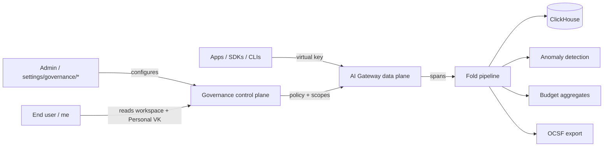

The **LangWatch AI Governance** layer adds the org-wide controls that make a multi-team LangWatch deployment auditable, attributable, and compliance-ready. Where the [AI Gateway](/ai-gateway/overview) is the data plane in the path of every LLM call, AI Governance is the **control plane** that decides who can use it, what they can spend, where their telemetry lands, and how regulators see it.

<Info>**Pairs with:** [AI Gateway → Overview](/ai-gateway/overview). The gateway emits the spans; governance reactors fold them into anomaly detection, budget aggregates, OCSF exports, and per-user workspaces.</Info>

## Two personas

LangWatch governance is shaped around two people who never need the same screen:

- **End user** — a developer or analyst who needs a Personal Virtual Key, wants to see their own usage and budget at `/me`, and sometimes switches between Personal / Team / Project workspaces. They never see the admin surface.
- **Admin** — an org-level operator who configures [Ingestion Sources](/ai-governance/ingestion-sources/index), publishes [Routing Policies](/ai-gateway/governance/routing-policies), defines [Anomaly Rules](/ai-governance/anomaly-rules), and signs off on the [OCSF/SIEM export](/ai-governance/compliance-architecture). They never see the end-user `/me` chrome.

The persona-aware chrome (single-chip header on `/me`, full sidebar on `/settings/governance/*`) keeps both surfaces clean — neither has to navigate around the other.

## Admin prerequisites

<Warning>**Publish a default routing policy before users sign in via CLI.**

The first time an end user runs `langwatch login`, the CLI provisions a Personal Virtual Key and binds it to your org's **default routing policy**. If no default policy exists, the CLI returns:

```
HTTP 409 — error: "no_default_routing_policy"
Ask your admin to publish a default routing policy at Settings → Routing Policies.
```

Publish at least one routing policy and mark it as `default` before opening CLI sign-in to your team. Cover details in [CLI debug → Error catalog](/ai-governance/cli-debug#error-catalog).</Warning>

## What it gives you

- **Personal Virtual Keys + Workspaces** — every signed-in user gets a Personal VK and a Personal workspace at `/me`. No admin ticket required, governed by the same policy + budget engine. See [AI Gateway → Personal IDE keys](/ai-gateway/governance/personal-keys).
- **Ingestion Sources** — a unified substrate for any telemetry that should land in a project's LangWatch workspace: gateway spans, OTLP collectors, Workato webhooks, S3 NDJSON drops, Microsoft Copilot Studio, and OpenAI/Anthropic compliance API exports. See [Ingestion Sources](/ai-governance/ingestion-sources/index).
- **Anomaly Rules** — admin-defined detectors (spend-spike, geo-mismatch, off-hours) that fold from the same event stream as compliance and budget aggregates. See [Anomaly Rules](/ai-governance/anomaly-rules).
- **Compliance & SIEM export** — every event is OCSF-mapped and replayable to a downstream SIEM with deterministic retention windows. See [Compliance Architecture](/ai-governance/compliance-architecture).
- **Control plane / data plane split** — the Next.js control plane owns governance state (Postgres) and runs the fold reactors; the Go AI Gateway owns the request path. See [Control Plane](/ai-governance/control-plane).
- **CLI debug** — `auth-cli budget-status`, anomaly-fold inspection, OCSF probe, and the `langwatch login` error catalog. See [CLI Debug](/ai-governance/cli-debug).

## How it sits with AI Gateway



- **Gateway** is the synchronous request path — sub-millisecond overhead, OpenAI/Anthropic compatible, every call carries a virtual key.
- **Fold pipeline** is the asynchronous reactor topology that turns spans into the governance views (anomaly state, budget aggregates, OCSF events).
- **Governance control plane** owns the configuration surface — IngestionSources, AnomalyRules, RoutingPolicies, Personal/Team/Project workspaces, RBAC.

Same compose stack, same Helm chart — no separate service to deploy.

## Where to next

- **Set up your first source** — [Ingestion Sources index](/ai-governance/ingestion-sources/index)
- **Detect spend spikes or off-hours usage** — [Anomaly Rules](/ai-governance/anomaly-rules)
- **Export to your SIEM** — [Compliance Architecture → OCSF](/ai-governance/compliance-architecture)
- **Debug an end-user CLI sign-in failure** — [CLI Debug → Error catalog](/ai-governance/cli-debug#error-catalog)
- **Self-host the stack** — [AI Gateway Self-Hosting](/ai-gateway/self-hosting/helm) (the same chart deploys both planes)
