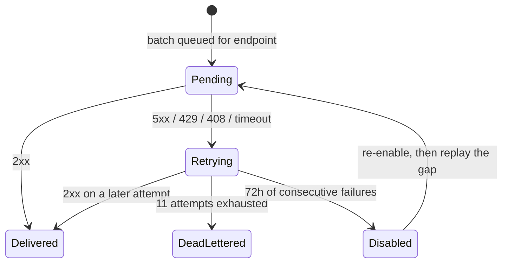

Webhook endpoints stream LangWatch events to your systems as they happen. You register a URL, pick the event types you want, and LangWatch delivers signed batches with at-least-once semantics, a multi-day retry ladder, a per-attempt delivery log, and a health view whose headline number is how stale your feed could be.

The first consumers are billing integrations: platforms that rebill their own customers ingest [spend events](/ai-gateway/billing-events) through a webhook endpoint. The platform itself is general: every event family delivers through the same endpoints, envelopes, signatures, and retries.

<Note>
Webhook endpoints are an **Enterprise** feature (the `webhookEndpointsEnabled` plan flag). On other plans the API answers `403` and the settings page shows an upgrade state. Self-hosted enterprise licenses include it.
</Note>

## The model

An endpoint belongs to your **organization** and carries:

| Field | Meaning |
|---|---|
| `url` | Where batches are POSTed. HTTPS required (see [self-hosted egress](/self-hosting/webhooks) for the local-development exception). |
| `enabled_events` | The subscription: exact types (`gateway.request.completed`), a family wildcard (`gateway.*`), or `*` for everything. An endpoint receives only what it subscribed to. |
| `status` | `ACTIVE` or `DISABLED`. Disabled endpoints receive nothing; sources keep accruing. |
| Signing secret | Shown **once** at creation. Roll it to get a new one. Every delivery is signed with it. |
| Delivery controls | `max_batch_size`, `max_batch_delay_ms`, `max_in_flight` (bounds below). |

Manage endpoints under **Settings > Webhooks** (`/settings/webhooks`) or over REST with an organization API key:

```
POST   /api/webhooks/v1/endpoints                    webhookEndpoints:manage
GET    /api/webhooks/v1/endpoints                    webhookEndpoints:view
GET    /api/webhooks/v1/endpoints/:id                webhookEndpoints:view
PATCH  /api/webhooks/v1/endpoints/:id                webhookEndpoints:manage
DELETE /api/webhooks/v1/endpoints/:id                webhookEndpoints:manage   (archive)
POST   /api/webhooks/v1/endpoints/:id/roll-secret    webhookEndpoints:manage
POST   /api/webhooks/v1/endpoints/:id/test           webhookEndpoints:manage
GET    /api/webhooks/v1/endpoints/:id/deliveries     webhookEndpoints:view
GET    /api/webhooks/v1/endpoints/:id/health         webhookEndpoints:view
GET    /api/webhooks/v1/event-types                  webhookEndpoints:view
GET    /api/webhooks/v1/events                       webhookEndpoints:view
```

Create an endpoint subscribed to the billing stream:

```bash
curl -sS https://app.langwatch.ai/api/webhooks/v1/endpoints \
  -H "Authorization: Bearer $LANGWATCH_ORG_API_KEY" \
  -H "Content-Type: application/json" \
  -d '{
    "url": "https://billing.example.com/webhooks/langwatch",
    "enabled_events": ["gateway.request.completed", "gateway.request.settled"]
  }'
```

The `201` response carries the endpoint plus `secret`, returned only this once. Store it where your receiver can verify signatures.

<Warning>
The `webhookEndpoints` and `gatewaySpend` permissions are **organization-exclusive**: only an ORGANIZATION-scoped role binding can grant them, never a team- or project-scoped one. Endpoints carry signing secrets and stream org-wide events out of the platform, so by default only org admins hold them. See [RBAC](/ai-gateway/rbac).
</Warning>

## The envelope

Every delivery is one POST with a JSON body of the form `{"batch": [envelope, ...]}`. Each envelope is one real-world occurrence:

```json
{
  "id": "01K1D3H8ZQ4M9X2C7V5B1N6P8T:completed",
  "type": "gateway.request.completed",
  "created": "2026-07-27T14:03:11.482Z",
  "schema_version": "1",
  "data": { /* typed payload for this event type */ }
}
```

- `id` is the **idempotency key**: stable across retries and replays. Dedup on it. For spend events it is the gateway request id with a type suffix (`<gateway_request_id>:completed`, `<gateway_request_id>:settled`), so the settled and completed events for one request never collide in your dedup layer while `data.gateway_request_id` joins them.
- `created` is when the event **occurred**, never when it was delivered. Late deliveries land in the right period.
- `schema_version` versions the `data` payload per type.

Batches contain up to `max_batch_size` envelopes, possibly of mixed types within your subscription. Ordering is best-effort: rely on `created` and your own dedup, not arrival order.

## Event catalog

`GET /api/webhooks/v1/event-types` returns the live catalog. Types are grouped by family (the first dotted segment), which is also what the settings UI renders as checkbox groups and what the `gateway.*` wildcard matches.

### Family: `gateway`

| Type | When it fires |
|---|---|
| `gateway.request.completed` | One event per gateway request that finished, success or provider error. The money stream: token classes, rated cost, attribution. |
| `gateway.request.settled` | A request that was admitted but whose confirmation never arrived inside the settlement window. Quantities and cost are `null`. A later `completed` for the same `gateway_request_id` supersedes it. |
| `gateway.budget.threshold_crossed` | A budget crossed its 80 percent warn threshold inside the current period. Once per crossing per period. |
| `gateway.budget.breached` | A budget reached its cap. Fires on `warn` budgets too; only `block` budgets also reject requests. Once per crossing per period. |
| `gateway.virtual_key.created` | A virtual key was created. |
| `gateway.virtual_key.disabled` | A virtual key was disabled (reversible). |
| `gateway.virtual_key.enabled` | A previously disabled virtual key was re-enabled. |
| `gateway.virtual_key.revoked` | A virtual key was revoked (terminal). |

The spend payloads (`gateway.request.*`) are documented field by field on [Billing and spend events](/ai-gateway/billing-events). The governance payloads:

**`gateway.budget.threshold_crossed` and `gateway.budget.breached`** (`data`):

```json
{
  "event_id": "bgt_01H...:vk_01H...:breached:1753574400000",
  "event_type": "gateway.budget.breached",
  "organization_id": "org_01H...",
  "budget_id": "bgt_01H...",
  "scope_type": "VIRTUAL_KEY",
  "bucket_scope_id": "vk_01H...",
  "end_user_id": null,
  "window": "MONTH",
  "period_started_at": "2026-07-01T00:00:00.000Z",
  "limit_usd": "25",
  "spent_usd": "25.1042",
  "on_breach": "block",
  "occurred_at": "2026-07-27T14:03:11.482Z"
}
```

The envelope id embeds the budget, the bucket, the kind, and the period start, which is what makes "once per crossing per period" hold end to end: a re-crossing in the same period dedups away, a crossing in the next period is a new event. For attributed-user budgets, `bucket_scope_id` is `<anchor_id>:<end_user_id>` and `end_user_id` is set, so your platform can tell "this user's cap" from "the tenant cap".

**`gateway.virtual_key.*`** (`data`):

```json
{
  "event_id": "vk_01H...:disabled:1753574591482",
  "event_type": "gateway.virtual_key.disabled",
  "organization_id": "org_01H...",
  "virtual_key_id": "vk_01H...",
  "name": "customer-acme",
  "display_prefix": "vk-lw-01HZX9",
  "reason": "payment overdue",
  "occurred_at": "2026-07-27T14:03:11.482Z"
}
```

## Verifying signatures

Every delivery carries:

```
Content-Type: application/json
X-LangWatch-Event-Id: <dispatch id, stable across retries of this batch>
X-LangWatch-Signature: t=<unix seconds>,v1=<hex hmac-sha256(secret, "<t>.<raw body>")>
X-LangWatch-Delivery-Attempt: <n, 1-based>
```

Verify by recomputing the HMAC over the **exact raw bytes** you received (parsing and re-serializing the JSON first breaks the digest), and reject timestamps outside a 5-minute tolerance. Compare digests in constant time.

<CodeGroup>

```typescript verify-signature.ts
import { createHmac, timingSafeEqual } from "node:crypto";

const TOLERANCE_SECONDS = 5 * 60;

export function verifySignature(params: {
  rawBody: string | Buffer;       // exactly as received
  signatureHeader: string | undefined;
  secret: string;                 // shown once at endpoint creation
}): boolean {
  if (!params.signatureHeader) return false;

  const parts = new Map<string, string>();
  for (const piece of params.signatureHeader.split(",")) {
    const eq = piece.indexOf("=");
    if (eq > 0) parts.set(piece.slice(0, eq).trim(), piece.slice(eq + 1).trim());
  }
  const timestamp = parts.get("t");
  const signature = parts.get("v1");
  if (!timestamp || !signature) return false;

  const timestampSeconds = Number(timestamp);
  if (!Number.isFinite(timestampSeconds)) return false;
  if (Math.abs(Date.now() / 1000 - timestampSeconds) > TOLERANCE_SECONDS) return false;

  const expected = createHmac("sha256", params.secret)
    .update(`${timestamp}.`)
    .update(params.rawBody)
    .digest();
  let received: Buffer;
  try {
    received = Buffer.from(signature, "hex");
  } catch {
    return false;
  }
  return received.length === expected.length && timingSafeEqual(received, expected);
}
```

```python verify_signature.py
import hashlib
import hmac
import time

TOLERANCE_SECONDS = 5 * 60


def verify_signature(raw_body: bytes, signature_header: str | None, secret: str) -> bool:
    if not signature_header:
        return False

    parts: dict[str, str] = {}
    for piece in signature_header.split(","):
        key, eq, value = piece.partition("=")
        if eq:
            parts[key.strip()] = value.strip()
    timestamp = parts.get("t")
    signature = parts.get("v1")
    if not timestamp or not signature:
        return False

    try:
        timestamp_seconds = float(timestamp)
    except ValueError:
        return False
    if abs(time.time() - timestamp_seconds) > TOLERANCE_SECONDS:
        return False

    expected = hmac.new(
        secret.encode(), f"{timestamp}.".encode() + raw_body, hashlib.sha256
    ).hexdigest()
    return hmac.compare_digest(expected, signature)
```

</CodeGroup>

Both snippets, wired into working receivers, live in the [agent-billing-demo](https://github.com/langwatch/agent-billing-demo) reference repo.

After a `roll-secret`, deliveries sign with the new secret immediately. Deploy the new secret to your receiver before rolling, or accept a brief window of verification failures that the retry ladder will re-deliver.

## Delivery, retries, and auto-disable

Your receiver acks with any `2xx`. The delivery classifier:

- `5xx`, `429`, and `408` are **retryable**. A `Retry-After` header on those is honored as a floor on the next attempt.
- Any other non-2xx status is **terminal** for that batch: retrying a misconfigured endpoint just spams it. Redirects are never followed, so a `3xx` is terminal too.

Retries follow a multi-day ladder: **1m, 5m, 30m, 2h, 6h, 12h, then every 12h**, 11 attempts in total, keeping the last retry inside 72 hours of the first failure. Batches retry independently per endpoint, so one dead endpoint never delays another.

After **72 hours of unbroken failures** the endpoint flips to `DISABLED` with `disabled_reason: "auto_failures_72h"` and delivery stops. Sources keep accruing the whole time: disabling delivery never loses events.

To recover:

1. Fix the receiver.
2. Re-enable: `PATCH /endpoints/:id {"status": "ACTIVE"}`.
3. Re-enabling does **not** re-send the gap. Replay it explicitly: for spend events, [`POST /api/gateway/v1/spend-events/replay`](/ai-gateway/billing-events#replay) with the gap window and this endpoint's id.



## Delivery controls

Three per-endpoint knobs, validated server-side against fixed bounds; out-of-range values are rejected with the bound named in the error:

| Control | Bounds | What it does |
|---|---|---|
| `max_batch_size` | 1 to 100 | Ceiling on envelopes per POST. 100 is the wire contract's batch cap. |
| `max_batch_delay_ms` | 0 to 60000 | How long to coalesce before flushing a partial batch. It is added feed lag; past a minute, scale your receiver instead of buffering. |
| `max_in_flight` | 1 to 8 | Parallel POSTs to your endpoint. Your receiver must tolerate concurrent deliveries either way. |

## Health and the lag number

`GET /endpoints/:id/health`:

```json
{
  "data": {
    "status": "ACTIVE",
    "disabled_reason": null,
    "failing_since": null,
    "last_success_at": "2026-07-27T14:02:58.000Z",
    "last_failure_at": null,
    "oldest_undelivered_age_ms": 1840,
    "dlq_depth": 0,
    "sends_per_minute": 12.4,
    "success_rate": 1,
    "p95_latency_ms": 220
  }
}
```

The headline is **`oldest_undelivered_age_ms`**: the age of the oldest envelope still buffered or retrying for this endpoint. It is your feed's staleness, the number that tells a billing operator how far behind their invoice data could be. Zero or small is healthy; growing means your receiver is failing or slow. `sends_per_minute` and `success_rate` aggregate the last hour; `p95_latency_ms` is sampled over the same window. `dlq_depth` counts dead-lettered batches awaiting manual attention.

## The delivery log

`GET /endpoints/:id/deliveries` lists recent attempts, newest first (default 50, max 200): the attempt number, envelope count, outcome, **your endpoint's HTTP status**, latency, and the error text when transport failed. Your receiver's responses are recorded, so debugging a rejecting endpoint starts here rather than in your own logs. Delivery log rows are retained for 30 days.

## Test fire

`POST /endpoints/:id/test` sends one signed `test.ping` envelope through the full delivery path, including SSRF checks and signing, plus an `X-LangWatch-Test-Fire: true` header so your receiver can tell it apart. The route answers `200` whenever the test itself ran; read `data.delivered` and `data.response_status` for what your receiver did. Test fires appear in the delivery log too.

## The events log

`GET /api/webhooks/v1/events?type=&from=&to=&cursor=&limit=` is the organization's emitted-events log: cursor-paged, newest first, filterable by type and `created` range (unix milliseconds). Webhooks are push over this log, never the only copy of it, so a consumer that missed deliveries can list what was emitted and recover.

For **billing reconciliation**, do not reconcile against this log: read the spend ledger surfaces instead ([`spend-summaries` and `spend-events`](/ai-gateway/billing-events#reconciliation-two-grains-one-ledger)), which include settled rows and carry the 13-month retention contract. The events log is for delivery recovery and debugging.

## What events never carry

No prompts, no completions, no conversation content, ever. Envelopes carry ids, quantities, classes, states, and your own metadata echo. If you need content downstream, that is the traces API, a separate surface with its own access control.

## See also

- [Billing and spend events](/ai-gateway/billing-events): the spend payloads, the money contract, reconciliation, replay.
- [Metering and rebilling your customers](/ai-gateway/cookbooks/metering-and-rebilling): the end-to-end integration cookbook.
- [Self-hosting webhooks](/self-hosting/webhooks): egress policy, local receivers, license flag.
- [Budgets](/ai-gateway/budgets): what threshold_crossed and breached mean and when they fire.
