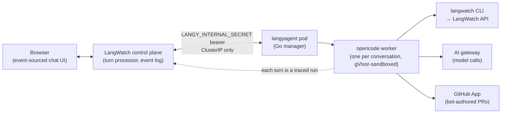

A Go manager pod spawns and supervises one [opencode](https://github.com/anomalyco/opencode) worker per conversation. That worker does the actual reading, testing, and code editing, and it shells out to `langwatch` CLI commands rather than calling an MCP server or an internal data API.

Model calls leave the worker only through the LangWatch AI gateway. Code changes leave only as bot-authored GitHub pull requests.

Every turn a worker takes is itself a traced run in your LangWatch project.

<Info>
  **Pairs with:** [Security and the sandbox](/langy/security/sandbox), [Self-hosting overview](/langy/self-hosting/overview)
</Info>

## The architecture

The pieces, from the browser inward:

- **Browser.** The chat panel. Its state is event-sourced, so a refresh resumes the conversation and a turn already in flight keeps streaming.
- **Control plane.** The TypeScript turn processor in LangWatch. It admits and dispatches each turn, re-types every shell tool call the worker makes into a typed capability for the event log, and persists conversation state. It reaches the agent pod over cluster DNS on a ClusterIP-only service, authenticated with the `LANGY_INTERNAL_SECRET` bearer token. The agent is never exposed outside the cluster.
- **langyagent pod.** A single Go manager process that spawns one opencode worker per conversation. It runs one replica by design; scale it vertically, not horizontally.
- **opencode worker.** The coding agent for a single conversation, running in the gVisor sandbox. It holds that conversation's credentials, its cloned repo, and its skills, and nothing durable survives the worker: an idle worker is reaped after about 10 minutes and its home is wiped.

The worker has exactly three ways out:

- **The `langwatch` CLI**, its only interface to your LangWatch data. Commands like `langwatch trace search`, `langwatch analytics query`, `langwatch scenario create`, and `langwatch experiment run` run inside the worker's shell. There is no LangWatch MCP server and no `search_traces` or `get_analytics` tool for the model to call; if a skill mentions one, the model runs the CLI instead. Traces are scoped by `--origin`, and Langy excludes its own `langy`-origin traces by default.
- **The AI gateway** for every model call. Langy does not call model providers directly. Its LLM traffic points at the LangWatch AI gateway, so every call is traced, rate-limited, and policy-checked like any other, and your bring-your-own-key or Codex credentials are enforced there. See [Models](/langy/models) and [Codex](/langy/codex).
- **The GitHub App** for code changes, and only as pull requests. See [Pull requests](/langy/pull-requests).

## The session loop

<Steps>
  <Step title="You ask">
    You send a turn in plain language. The control plane admits it and dispatches it to the manager, which spawns (or reuses a warm) worker for that conversation with the turn's credentials bound at spawn.
  </Step>
  <Step title="Langy reads the traces and evals">
    The worker runs `langwatch` CLI commands to pull the traces, analytics, and evals your question points at. Each command streams back into the conversation as an activity card, so you see what it searched.
  </Step>
  <Step title="It writes a failing Scenario test or evaluation">
    When the answer is a code change, Langy writes a Scenario multi-turn simulation or an evaluation that captures the problem, so the fix has something to prove against.
  </Step>
  <Step title="It drafts a fix and opens a pull request">
    Langy clones the installed repo inside the worker, drafts the change, and opens a bot-authored pull request. The clone lives only in the worker's home and is wiped when the worker is reaped.
  </Step>
  <Step title="Your CI runs the tests it wrote">
    The Scenario tests Langy wrote run in your CI on that PR. The PR card returns with the result, so the receipts are the diff plus the check status.
  </Step>
  <Step title="A human reviews and merges">
    You read the PR and merge it. Langy never merges its own PR.
  </Step>
</Steps>

<Note>
  Every turn Langy takes re-enters LangWatch as its own traced, costed run in your project. You debug Langy with the same traces and evals you use to debug your own agents.
</Note>

For how the sandbox isolates each worker and exactly what it can and cannot reach on the network, see [Security and the sandbox](/langy/security/sandbox). For running this stack yourself, see the [self-hosting overview](/langy/self-hosting/overview).
