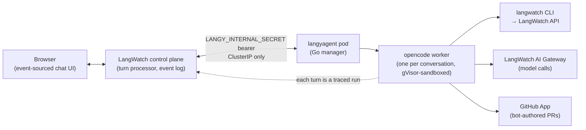

Langy runs on [opencode](https://github.com/anomalyco/opencode) as a separate service, `langyagent`, next to the LangWatch app. The app dispatches each chat turn to it; `langyagent` keeps one opencode process per conversation and reaps it when the conversation goes idle.

The worker does the actual reading, testing, and code editing. Every tool call it makes streams back into the chat as a typed activity, and every turn is a traced run in your project.

<Info>
  **Also check:** [Security and the sandbox](/langy/security/sandbox), [Self-hosting
  overview](/self-hosting/langy/overview)
</Info>

## The architecture

| Piece           | What it does                                                                                                                                                    |
| --------------- | --------------------------------------------------------------------------------------------------------------------------------------------------------------- |
| Browser         | The chat panel. Event-sourced: a refresh resumes the conversation, an in-flight turn keeps streaming.                                                           |
| Control plane   | The turn processor in the LangWatch app. Admits each turn, dispatches it to the agent, logs every tool call as a typed event.                                   |
| `langyagent`    | The agent service. Spawns one opencode worker per conversation. Single replica; scale vertically.                                                               |
| opencode worker | The coding agent itself, inside the gVisor sandbox, holding that conversation's credentials, repo clone, and skills. Reaped after ~10 minutes idle, home wiped. |

The agent service is cluster-internal only, never exposed outside; auth and networking details are on the [self-hosting overview](/self-hosting/langy/overview).

The worker has exactly three ways out:

- **The `langwatch` CLI** for your LangWatch data: `trace search`, `analytics query`, `scenario create`, `experiment run`. No MCP server, no internal API.
- **The LangWatch AI Gateway** for every model call, never a provider directly, so each call is traced, rate-limited, and policy-checked on your own keys or Codex. See [Models](/langy/models) and [Codex](/langy/codex).
- **The GitHub App** for code changes, only as pull requests. See [Pull requests](/langy/pull-requests).

## The session loop

<Steps>
  <Step title="You ask">
    You send a turn in plain language. The control plane admits it and dispatches it to
    the manager, which spawns (or reuses a warm) worker for that conversation with the
    turn's credentials bound at spawn.
  </Step>
  <Step title="Langy reads the traces and evals">
    The worker runs `langwatch` CLI commands to pull the traces, analytics, and evals your
    question points at. Each command streams back into the conversation as an activity
    card, so you see what it searched.
  </Step>
  <Step title="It writes a failing Scenario test or evaluation">
    When the answer is a code change, Langy writes a Scenario multi-turn simulation or an
    evaluation that captures the problem, so the fix has something to prove against.
  </Step>
  <Step title="It drafts a fix and opens a pull request">
    Langy clones the installed repo inside the worker, drafts the change, and opens a
    bot-authored pull request. The clone lives only in the worker's home and is wiped when
    the worker is reaped.
  </Step>
  <Step title="Your CI runs the tests it wrote">
    The Scenario tests Langy wrote run in your CI on that PR. The PR card returns with the
    result, so you see the diff and the check status together.
  </Step>
  <Step title="A human reviews and merges">
    You read the PR and merge it. Langy never merges its own PR.
  </Step>
</Steps>

<Note>
  Every turn Langy takes re-enters LangWatch as its own traced, costed run in your
  project. You debug Langy with the same traces and evals you use to debug your own
  agents.
</Note>

For how the sandbox isolates each worker and exactly what it can and cannot reach on the network, see [Security and the sandbox](/langy/security/sandbox). For running this stack yourself, see the [self-hosting overview](/self-hosting/langy/overview).
