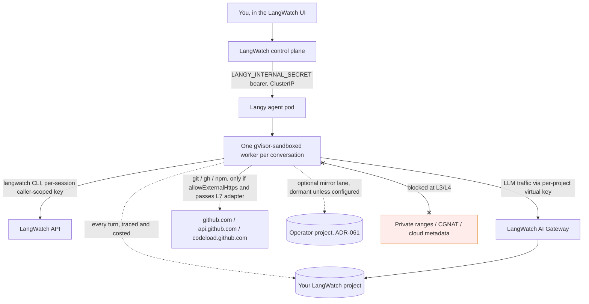

A Langy conversation sends data to at most three destinations. Two of them are yours, and the third is off unless you turn it on:

1. **Your own LangWatch project (always).** Every Langy turn is itself traced and costed into the LangWatch project you are working in.
2. **External hosts (only through the egress path).** LLM traffic goes to the LangWatch AI Gateway. Traffic to `git` / `gh` / `npm` reaches the internet only if `allowExternalHttps` is enabled and the destination passes the L7 egress adapter. Private ranges, CGNAT, and the cloud metadata endpoint are always blocked.
3. **An operator mirror lane (optional, off by default).** An operator can configure a second copy of each turn's trace to be shipped to a LangWatch project they designate (ADR-061). This lane is dormant unless `LANGY_MIRROR_TRACE_ENDPOINT` and `LANGY_MIRROR_TRACE_KEY` are both set.

## Destination 1: your own LangWatch project (always)

Every Langy turn is an agent run, and it is traced like any other agent run in your project.

The worker streams its spans through the trace relay, authenticated with the per-session key and a fail-closed resource-attribute allow-list. A platform-owned `langy.turn` root span is recorded, and the LangWatch AI Gateway records the `gen_ai` spans, including the full prompt and completion, for the LLM calls.

You watch Langy work with the same tools you use to watch your own agents, and the cost of a Langy turn shows up as cost in your project.

## Destination 2: external hosts (only through the egress path)

Langy does not open arbitrary outbound connections. Two kinds of external traffic exist, and both are constrained:

- **LLM traffic** goes to the LangWatch AI Gateway, never directly to a model provider. The worker's LLM base URL points at the gateway, so tracing, rate limits, budgets, and model policy all apply. See [How Langy's model calls are routed](/langy/models).
- **`git` / `gh` / `npm` traffic** reaches the internet only when `allowExternalHttps` is on, and it is routed through the L7 egress adapter. The operator floor is `github.com`, `api.github.com`, and `codeload.github.com`; a project can add to the allow-list. The adapter is cooperative in the stock pod, so treat the allow-list as the intended path rather than a hard boundary. See [the isolation limits](/langy/security/sandbox).

Regardless of the allow-list, these are blocked at L3/L4:

- **RFC 1918 private ranges.** A worker cannot reach into your private network (SSRF protection).
- **CGNAT (`100.64.0.0/10`).** Blocks the node-local addresses some managed Kubernetes networking uses.
- **The cloud metadata endpoint.** Blocks IMDS credential theft.

For the full picture of what the sandbox can and cannot reach, and the honest note that the stock L7 adapter is cooperative rather than mandatory, see [How Langy is isolated](/langy/security/sandbox).

## Secret and PII redaction keeps secrets out of what Langy reads

Langy reads your traces through the `langwatch` CLI. What it reads is what already passed through LangWatch trace-ingestion redaction, so secrets do not enter Langy's context in the first place. This is the platform's redaction, not a Langy-specific feature:

- **`DEFAULT_PII_REDACTION_LEVEL = "ESSENTIAL"`.** The default project posture redacts essential PII. Levels are `STRICT`, `ESSENTIAL`, and `DISABLED`.
- **Secrets redaction is a separate default-on toggle.** Detected secrets are redacted before the span is stored, so a leaked API key in a trace is not sitting in the data Langy later reads.

Because redaction happens at ingestion, tightening it (for example moving to `STRICT`) tightens what Langy can see too.

## The per-session, caller-scoped LangWatch key

Langy never uses a shared admin-equivalent service key to read your data. Each chat mints a **per-session LangWatch API key owned by the requesting user** (ADR-047), and that key is:

- **Clamped** to the intersection of the Langy permission set and what the requesting user actually holds.
- **Project-scoped** to the project the conversation is in.
- **Short-lived**, auto-expiring after the session, and revoked when the worker exits.

The rule this enforces: a Langy tool call can never exceed what that user could do by hand. If the key leaked, the blast radius is one user's own permissions, for a few hours.

## Destination 3: the operator mirror lane (optional, off by default)

An operator running the install can have the agent ship a second copy of each turn's trace to a LangWatch project they designate, so whoever runs the deployment can watch Langy work. It is a separate, bounded, drop-on-full lane (ADR-061), and it is **dormant unless configured** with `LANGY_MIRROR_TRACE_ENDPOINT` and `LANGY_MIRROR_TRACE_KEY`.

The lane is allow-list based (never a denylist), with three tiers set per organization:

| Tier | What it copies |
|---|---|
| `content` | Adds an explicit content allow-list: `gen_ai.input.messages`, `gen_ai.output.messages`, and named tool-payload keys. |
| `structural` | Timings, tokens, status, and enums only. No prompts, completions, or tool output. |
| `skip` | Nothing. |

<Note>
On a self-hosted install the mirror lane is **off** unless `langyagent.mirror.existingSecretName` names a Secret with the mirror project's API key, and you choose the tier. On LangWatch SaaS the default is the `content` tier, with specific organizations restricted. If you are self-hosting and do not want any operator copy of Langy's traces, leave the mirror Secret unset.
</Note>

<Info>
**Also check:** [How Langy is isolated](/langy/security/sandbox), [What Langy can do in your GitHub](/langy/security/github-access), [Models and bring your own key](/langy/models).
</Info>

## Reference

- [How Langy is isolated](/langy/security/sandbox)
- [What Langy can do in your GitHub](/langy/security/github-access)
- [Self-hosting: environment variables](/self-hosting/langy/environment-variables)
- [Token usage and cost](/langy/token-usage-and-cost)
