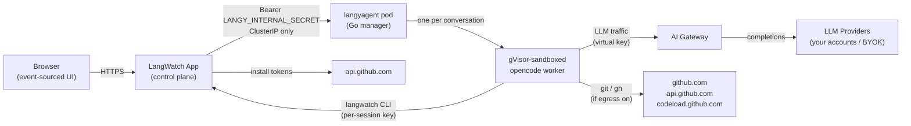

Langy runs as a separate Kubernetes Deployment, the `langyagent` pod, that ships in the LangWatch umbrella Helm chart but is **off by default**. To run Langy self-hosted you enable that pod and satisfy its one hard infrastructure requirement, a `gvisor` RuntimeClass. Once the pod is running, Langy is available. The GitHub App and outbound network egress are both optional and off until you configure them.

The `langyagent` pod is a single Go "manager" process that spawns one gVisor-sandboxed [opencode](/langy/how-langy-works) worker per conversation. It never talks to your data stores directly; each worker reaches LangWatch only through the `langwatch` CLI, over the per-session credentials the control plane mints for that turn.

<Info>
**Pairs with:** [Enable Langy via Helm](/langy/self-hosting/helm), [Environment variables](/langy/self-hosting/environment-variables), [Networking and egress](/langy/self-hosting/networking-and-egress), [The sandbox](/langy/security/sandbox).
</Info>

<Note>
**Turning Langy off.** Langy's availability is a deployment toggle, not a runtime feature flag. To disable it, set `langyagent.chartManaged: false` (its default) or unset `OPENCODE_AGENT_URL` on the app: the backend has nothing to connect to, so the panel opens no turns. On LangWatch Cloud, availability is managed for you.
</Note>

## At a glance

| | |
|---|---|
| Deployment | Separate `langyagent` Deployment + ConfigMap + Service + NetworkPolicy in the umbrella chart |
| Default state | Off (`langyagent.chartManaged: false` at the umbrella level) |
| Replicas | 1 (render-time guard blocks more until conversation-sticky routing exists) |
| Update strategy | `Recreate`, no HPA. Scale vertically. |
| Sandbox | gVisor (`runtimeClassName: gvisor`), required; render-time guard |
| Sizing | ~5 to 15 concurrent sessions at 500m to 2 CPU / 1 to 4Gi |
| Shared secret | `LANGY_INTERNAL_SECRET`, created out-of-band (the chart does not materialise it) |
| GitHub App | Optional, for bot-authored pull requests |
| Outbound egress | Off by default (`networkPolicy.allowExternalHttps: false`) |

## Hard requirements

- **A `gvisor` RuntimeClass must already exist in the cluster.** The pod runs under gVisor (`runsc`), a user-space kernel that shrinks the pod-to-host escape surface, because the workload is LLM-driven arbitrary shell (workers spawn `git`, `gh`, and `npm`). With `chartManaged=true` and an empty `runtimeClassName`, the chart refuses to render. Without the RuntimeClass in the cluster, pods fail to schedule with `FailedCreatePodSandBox ... runtimeclasses.node.k8s.io "gvisor" not found`. Install it with the gVisor operator or a RuntimeClass manifest before you enable Langy. You can opt out with `runtimeClassName: ""`, which is documented as **not recommended**: you lose pod-to-host sandboxing but keep the in-pod per-worker isolation. See [The sandbox](/langy/security/sandbox).
- **A separate pod and service.** The agent is its own Deployment, ConfigMap, ClusterIP Service, and NetworkPolicy (plus an optional PodDisruptionBudget and CiliumNetworkPolicy). It runs a single replica with `strategy: Recreate` and no HPA, sized for roughly 5 to 15 concurrent sessions at 500m to 2 CPU and 1 to 4Gi. Scale it vertically, not horizontally.
- **The shared internal secret.** The app and the agent authenticate to each other with a bearer token, `LANGY_INTERNAL_SECRET`, held in a Secret the chart does **not** create. You create it out-of-band before enabling the pod. See [Enable Langy via Helm](/langy/self-hosting/helm).

## Optional components

- **GitHub App** for bot-authored pull requests. Register a GitHub App and set the `GITHUB_LANGY_*` env vars. If the private key is unset, the GitHub feature is silently off and Langy returns findings without opening PRs. See [Register the Langy GitHub App](/langy/self-hosting/github-app).
- **Outbound HTTPS egress** for `git`, `gh`, and `npm`. `networkPolicy.allowExternalHttps` is `false` by default; the pod cannot reach GitHub until you enable egress. See [Networking and egress](/langy/self-hosting/networking-and-egress).
- **Operator mirror lane** to copy Langy's own turn traces into a LangWatch project you designate, so whoever runs the install can watch Langy work. Dormant unless `LANGY_MIRROR_TRACE_ENDPOINT` and `LANGY_MIRROR_TRACE_KEY` are set. See [Environment variables](/langy/self-hosting/environment-variables).

## Architecture

The control plane reaches the agent over cluster DNS at `http://<release>-langyagent:80` (`OPENCODE_AGENT_URL`), authenticated with `LANGY_INTERNAL_SECRET`. The Service is ClusterIP only; a render-time guard blocks any other type, so the agent is never exposed outside the cluster. Each worker's only path to LangWatch data is the `langwatch` CLI, and its only path to the internet is the [L7 egress adapter](/langy/self-hosting/networking-and-egress). LLM traffic goes through the [AI Gateway](/ai-gateway/self-hosting/helm), never direct to providers, so every Langy LLM call is traced, budgeted, and policed like any other.

## Where to go next

<CardGroup cols={2}>
  <Card title="Enable Langy via Helm" icon="ship" href="/langy/self-hosting/helm">
    Create the shared secret and opt the agent in with `chartManaged=true`.
  </Card>
  <Card title="Register the GitHub App" icon="github" href="/langy/self-hosting/github-app">
    Register the app, set the `GITHUB_LANGY_*` env vars, and install it on the repos Langy may touch.
  </Card>
  <Card title="Environment variables" icon="rectangle-list" href="/langy/self-hosting/environment-variables">
    The full `LANGY_*` and `GITHUB_LANGY_*` reference with defaults.
  </Card>
  <Card title="Networking and egress" icon="network-wired" href="/langy/self-hosting/networking-and-egress">
    The NetworkPolicy, the FQDN floor, and the cooperative-vs-mandatory egress limit.
  </Card>
  <Card title="The sandbox" icon="shield-halved" href="/langy/security/sandbox">
    What the gVisor sandbox can and cannot reach, and where the boundaries sit.
  </Card>
  <Card title="Platform self-hosting" icon="server" href="/self-hosting/overview">
    Deploy the rest of the LangWatch stack that Langy runs alongside.
  </Card>
</CardGroup>
