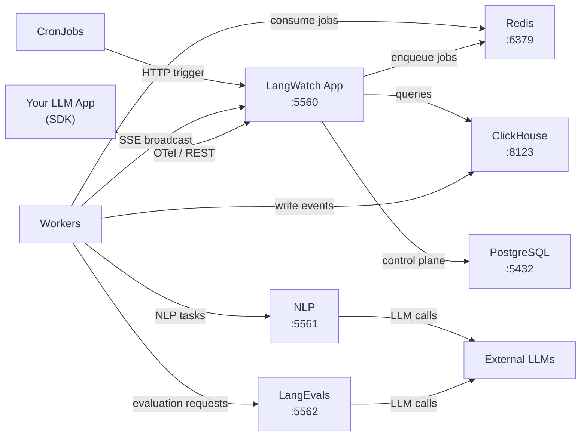

LangWatch is distributed as three Docker images, each serving a distinct role in the platform.

## Images

### langwatch/langwatch

The main application image. Used for both LangWatch App and LangWatch Workers. Handles the web UI, REST API, OTel trace ingestion, and authentication.

| | |
|---|---|
| **Port** | 5560 |
| **Base** | `node:24-alpine` |
| **Entrypoint** | `pnpm start` |
| **Workers** | In Kubernetes, Workers run as a separate Deployment using the same image with `pnpm start:workers`. |

**What it does:**
- Serves the LangWatch web UI (Next.js)
- Exposes REST and OTel APIs for trace ingestion from SDKs
- Handles authentication (NextAuth.js with email or SSO providers)
- Queries ClickHouse for analytics, dashboards, and trace search
- Manages the control plane via PostgreSQL (Prisma ORM)
- Broadcasts real-time updates via Server-Sent Events (SSE)

### langwatch/langwatch_nlp

Python service for natural language processing tasks.

| | |
|---|---|
| **Port** | 5561 |
| **Base** | Python |
| **Callbacks** | Calls back to the app at the URL configured via `LANGWATCH_ENDPOINT` |

**What it does:**
- Runs Optimization Studio workflows
- Executes topic clustering algorithms
- Handles custom evaluator execution
- Processes NLP tasks (embeddings, text analysis)

### langwatch/langevals

Python service providing the built-in evaluator library.

| | |
|---|---|
| **Port** | 5562 |
| **Base** | Python |
| **Memory** | Higher memory requirements due to model loading (default: 6Gi request, 8Gi limit) |

**What it does:**
- LLM-as-a-Judge evaluators (boolean, category, score)
- RAG evaluators (faithfulness, context precision, context recall, answer relevancy)
- Safety evaluators (content safety, jailbreak detection, PII detection)
- Quality evaluators (summarization, query resolution, semantic similarity)
- Custom evaluators (exact match, BLEU/ROUGE scores, format validation)

<Note>
LangEvals calls external LLM providers (OpenAI, Azure OpenAI, Google) to run model-based evaluations. Ensure your evaluator pods have network access to these providers, or configure your own provider credentials via the Helm chart.
</Note>

### Additional Images

The Helm chart also deploys:

- `langwatch/clickhouse-serverless` — Performance-tweaked ClickHouse image optimized for LangWatch's event ingestion and analytical query patterns

## Service Communication



## Image Tags

| Tag | Description |
|-----|-------------|
| `latest` | Latest stable release |
| `x.y.z` (e.g. `3.0.0`) | Specific version (recommended for production) |
| `local` | Built locally via `make images` (development only) |

<Tip>
Pin to a specific version tag in production to prevent unexpected changes during upgrades. Update deliberately using the [Upgrade Guide](/self-hosting/upgrade).
</Tip>

## Private Registries

For air-gapped or private environments, mirror the images to your own registry:

```bash
# Pull from Docker Hub
docker pull langwatch/langwatch:3.0.0
docker pull langwatch/langwatch_nlp:3.0.0
docker pull langwatch/langevals:3.0.0

# Tag for your registry
docker tag langwatch/langwatch:3.0.0 registry.example.com/langwatch/langwatch:3.0.0
docker tag langwatch/langwatch_nlp:3.0.0 registry.example.com/langwatch/langwatch_nlp:3.0.0
docker tag langwatch/langevals:3.0.0 registry.example.com/langwatch/langevals:3.0.0

# Push
docker push registry.example.com/langwatch/langwatch:3.0.0
docker push registry.example.com/langwatch/langwatch_nlp:3.0.0
docker push registry.example.com/langwatch/langevals:3.0.0
```

Then configure the Helm chart:

```yaml
images:
  app:
    repository: registry.example.com/langwatch/langwatch
    tag: "3.0.0"
  langwatch_nlp:
    repository: registry.example.com/langwatch/langwatch_nlp
    tag: "3.0.0"
  langevals:
    repository: registry.example.com/langwatch/langevals
    tag: "3.0.0"

imagePullSecrets:
  - name: registry-credentials
```
