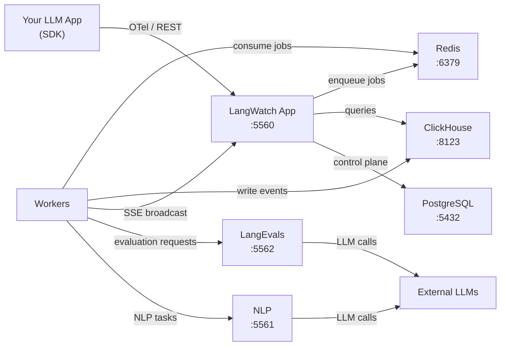

LangWatch is distributed as three Docker images, each serving a distinct role in the platform.

## Images

### langwatch/langwatch

The main application image. Used for both LangWatch App and LangWatch Workers. Handles the web UI, REST API, OTel trace ingestion, and authentication.

| | |
|---|---|
| **Port** | 5560 |
| **Base** | `node:24-alpine` |
| **Entrypoint** | `pnpm start` |
| **Workers** | In Kubernetes, Workers run as a separate Deployment using the same image with `pnpm start:workers`. |

**What it does:**
- Serves the LangWatch web UI
- Exposes REST and OTel APIs for trace ingestion from SDKs
- Handles authentication (email or SSO providers)
- Queries ClickHouse for analytics, dashboards, and trace search
- Manages the control plane via PostgreSQL (Prisma ORM)
- Broadcasts real-time updates via Server-Sent Events (SSE)

### langwatch/langwatch_nlp

Go service (`nlpgo`) that runs workflows. The image keeps a Python interpreter only for code blocks.

| | |
|---|---|
| **Port** | 5561 |
| **Base** | `gcr.io/distroless/python3-debian12` |
| **Callbacks** | Calls back to the app at the URL configured via `LANGWATCH_ENDPOINT` |

**What it does:**
- Runs Optimization Studio workflows
- Handles custom evaluator execution
- Runs Python code blocks in a sandboxed process
- Proxies LLM calls from the playground and prompts

### langwatch/langevals

Python service providing the built-in evaluator library.

| | |
|---|---|
| **Port** | 5562 |
| **Base** | Python |
| **Memory** | Higher memory requirements due to model loading (default: 6Gi request, 8Gi limit) |

**What it does:**
- LLM-as-a-Judge evaluators (boolean, category, score)
- RAG evaluators (faithfulness, context precision, context recall, answer relevancy)
- Safety evaluators (content safety, jailbreak detection, PII detection)
- Quality evaluators (summarization, query resolution, semantic similarity)
- Custom evaluators (exact match, BLEU/ROUGE scores, format validation)

<Note>
LangEvals calls external LLM providers (OpenAI, Azure OpenAI, Google) to run model-based evaluations. Ensure your evaluator pods have network access to these providers, or configure your own provider credentials via the Helm chart.
</Note>

### Additional Images

The Helm chart also deploys:

- `langwatch/clickhouse-serverless`, Performance-tweaked ClickHouse image optimized for LangWatch's event ingestion and analytical query patterns
- `langwatch/ai-gateway`, the AI Gateway (`gateway.image.repository`, on by default)
- `langwatch/langyagent`, the Langy assistant (`langyagent.image.repository`, on by default)
- `postgres`, `redis` and the Prometheus server image, when the chart runs those services

## Service Communication


```mermaid
graph LR
    SDK["Your LLM App<br/>(SDK)"] -->|OTel / REST| App["LangWatch App<br/>:5560"]
    App -->|enqueue jobs| Redis["Redis<br/>:6379"]
    Workers["Workers"] -->|consume jobs| Redis
    Workers -->|write events| CH["ClickHouse<br/>:8123"]
    Workers -->|SSE broadcast| App
    Workers -->|evaluation requests| Evals["LangEvals<br/>:5562"]
    Workers -->|NLP tasks| NLP["NLP<br/>:5561"]
    Evals -->|LLM calls| LLMs["External LLMs"]
    NLP -->|LLM calls| LLMs
    App -->|queries| CH
    App -->|control plane| PG["PostgreSQL<br/>:5432"]
```

## Image Tags

| Tag | Description |
|-----|-------------|
| `latest` | Latest stable release |
| `x.y.z` | A specific release, recommended for production: pick one from [Releases](https://github.com/langwatch/langwatch/releases) |
| `local` | Built locally via `make images` (development only) |

<Tip>
Pin to a specific version tag in production to prevent unexpected changes during upgrades. Update deliberately using the [Upgrade Guide](/self-hosting/upgrade).
</Tip>

## Private Registries

For air-gapped or private environments, mirror the images to your own registry:

```bash
# The release you are mirroring. Every tag below follows it, so set it once.
# Pick the version from https://github.com/langwatch/langwatch/releases
VERSION=3.20.1 # x-release-please-version
REGISTRY=registry.example.com

for image in langwatch langwatch_nlp langevals; do
  docker pull "langwatch/$image:$VERSION"
  docker tag "langwatch/$image:$VERSION" "$REGISTRY/langwatch/$image:$VERSION"
  docker push "$REGISTRY/langwatch/$image:$VERSION"
done
```

Then configure the Helm chart, giving every tag the version you mirrored:

```yaml
images:
  app:
    repository: registry.example.com/langwatch/langwatch
    tag: "3.20.1" # x-release-please-version
  langwatch_nlp:
    repository: registry.example.com/langwatch/langwatch_nlp
    tag: "3.20.1" # x-release-please-version
  langevals:
    repository: registry.example.com/langwatch/langevals
    tag: "3.20.1" # x-release-please-version
```

Mirror and override the bundled services the same way: `gateway.image.repository`, `langyagent.image.repository`, `clickhouse.image.repository`, `postgresql.image.repository`, `redis.image.repository`, `prometheus.server.image.repository`, `cronjobs.image.repository` and `app.storedObjects.localFilesystem.serializeUpgradesImage` (the image the stored-objects upgrade hooks run).

The chart has no chart-wide `imagePullSecrets` value. If your registry needs credentials, attach the pull secret to the ServiceAccount the pods run as. The NLP, LangEvals, gateway, Langy, PostgreSQL and Redis pods use the namespace `default` ServiceAccount. The app and workers use it too, unless `global.serviceAccount.create` or `global.serviceAccount.name` gives them their own, in which case patch that one as well:

```bash
kubectl -n langwatch patch serviceaccount default \
  -p '{"imagePullSecrets": [{"name": "registry-credentials"}]}'
```

Three workloads run under their own ServiceAccount and take the pull secret as a value instead:

```yaml
clickhouse:
  imagePullSecrets:
    - name: registry-credentials
lwql:
  imagePullSecrets:
    - name: registry-credentials
app:
  storedObjects:
    localFilesystem:
      serializeUpgradesPullSecrets:
        - name: registry-credentials
```

The ClickHouse preflight Job (`clickhouse.preflight.enabled`, off by default in this chart) runs `clickhouse.preflight.image` under its own ServiceAccount and has no pull secret value. If you turn it on, mirror that image to a registry that needs no credentials.
