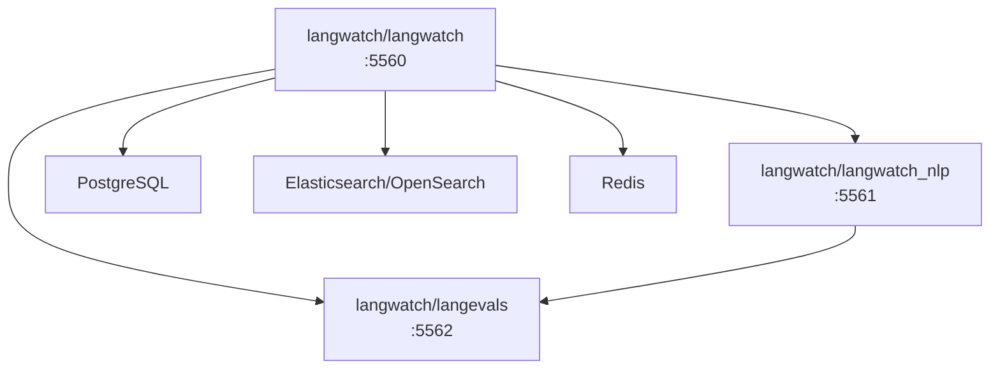

# LangWatch Docker Images

LangWatch is composed of three main Docker images that work together to provide the complete LLM observability platform. Each image serves a specific purpose and exposes different endpoints for various functionalities.

## Image Overview

### 1. `langwatch/langwatch` - Main Application

The primary LangWatch application that provides the web interface and core functionality.

**Purpose:**
- Web-based user interface for LangWatch
- API endpoints for trace collection and management
- User authentication and session management
- Dashboard and analytics interface
- Background workers for processing traces and evaluations (deployed as a separate pod in Helm by default)

**Key Features:**
- Trace collection and storage
- Real-time monitoring dashboard
- User management and authentication
- API endpoints for SDK integration
- Background job processing

### 2. `langwatch/langwatch_nlp` - NLP Backend Service

The NLP backend service that handles advanced language processing tasks and optimization studio workflows.

**Purpose:**
- Optimization studio workflows
- Advanced NLP processing
- Topic clustering and analysis

**Key Features:**
- Optimization studio backend
- Topic clustering service
- Advanced NLP processing

### 3. `langwatch/langevals` - Evaluation Service

The dedicated evaluation service that provides built-in evaluators and evaluation processing capabilities.

**Purpose:**
- Built-in evaluator execution
- Evaluation result processing
- Model-based evaluations
- Safety and quality checks
- Evaluation API endpoints

**Key Features:**
- Comprehensive evaluator library
- LLM-as-a-judge evaluations
- Safety evaluators (content safety, jailbreak detection)
- Quality evaluators (relevance, accuracy, etc.)
- RAG-specific evaluators

## Service Communication

The three services communicate with each other through HTTP endpoints:

## Running from a docker image

For detailed instructions on how to deploy LangWatch using Docker or Kubernetes, see our deployment guides:

<CardGroup cols={2}>
<Card title="Docker Compose" icon="docker" href="/self-hosting/docker-compose">
  Easily get started with LangWatch using Docker Compose.
</Card>

<Card title="Helm Chart" icon="dharmachakra" href="/self-hosting/kubernetes-helm">
  Run LangWatch on Kubernetes with our pre-configured Helm chart.
</Card>
</CardGroup>
