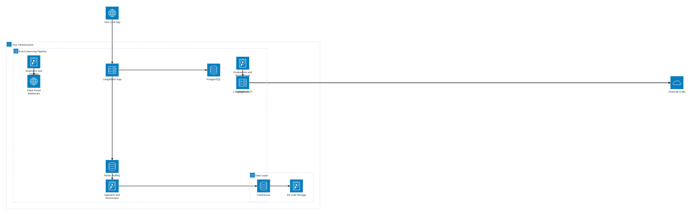
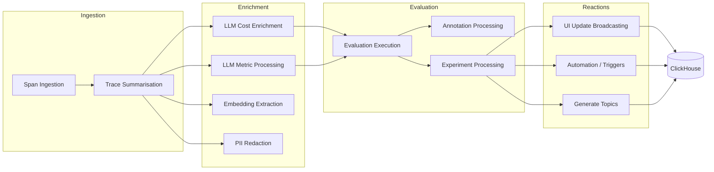
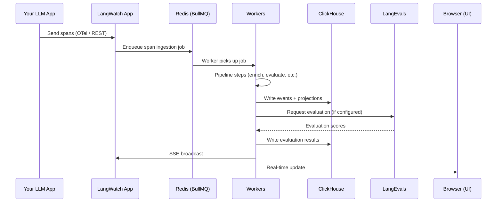

This page explains what you're deploying when you self-host LangWatch — the components, how they connect, and how data moves through the system. Understanding this will help you size, operate, and debug your deployment.

## System Overview

<CardGroup cols={3}>
<Card title="API Layer" icon="globe">
**LangWatch App** (:5560)

Web UI, REST API, OTel ingestion, authentication, SSE real-time updates. The only externally-exposed component.
</Card>
<Card title="Processing" icon="microchip">
**LangWatch Workers**

Event sourcing pipeline via BullMQ — span ingestion, trace summarisation, cost enrichment, evaluations, PII redaction, and more.
</Card>
<Card title="Services" icon="flask">
**LangWatch NLP** (:5561) and **LangEvals** (:5562)

NLP workflows, topic clustering, built-in evaluators, guardrails. Call external LLMs for model-based operations.
</Card>
<Card title="Control Plane" icon="database">
**PostgreSQL**

Users, teams, projects, configurations, prompt versions. Managed via Prisma with auto-migrations.
</Card>
<Card title="Data Plane" icon="chart-bar">
**ClickHouse**

All traces, spans, evaluations, experiments, analytics. Hot storage on SSD, cold storage on S3. Auto-tuned via the clickhouse-serverless subchart.
</Card>
<Card title="Queue & Storage" icon="layer-group">
**Redis** — BullMQ job queue, caching, sessions.

**S3** — ClickHouse cold storage, backups, datasets.
</Card>
</CardGroup>

## Components

### LangWatch App (port 5560)

Next.js server — the single external entry point for all traffic:

- **Web UI** — dashboards, trace explorer, prompt management, experiment views
- **REST API + OTel ingestion** — receives spans from LangWatch SDKs
- **Authentication** — NextAuth.js (email, Google, GitHub, GitLab, Azure AD, Cognito, Okta)
- **SSE** — pushes real-time updates to connected browser clients
- **Analytics queries** — reads from ClickHouse
- **Control plane** — manages users, teams, projects via PostgreSQL

### LangWatch Workers

Same `langwatch/langwatch` image, started with `pnpm start:workers`. Consumes jobs from a BullMQ queue in Redis and runs the event sourcing pipeline (see below).

- Deployed as a separate Kubernetes Deployment
- Stateless — scale by adding replicas

### LangWatch NLP (port 5561)

Python service for:

- Optimization Studio workflow execution
- Topic clustering algorithms
- Custom evaluator execution

### LangEvals (port 5562)

Built-in evaluator library (Python):

- LLM-as-a-Judge (boolean, categorical, scored)
- Safety (content safety, jailbreak detection, prompt shield)
- Quality (faithfulness, relevancy, correctness, summarization)
- RAG (context precision, context recall, context relevancy)
- Format (exact match, BLEU, ROUGE, semantic similarity)

Both NLP and LangEvals make outbound calls to external LLM providers for model-based operations.

### PostgreSQL — Control Plane

Stores users, teams, projects, configurations, prompt versions, evaluator definitions. Managed via Prisma ORM with auto-migrations on startup.

### ClickHouse — Data Plane

Stores all high-volume data: traces, spans, evaluations, experiments, analytics, and event sourcing events/projections.

| Mode | Replicas | Engine | Use Case |
|------|----------|--------|----------|
| Standalone | 1 | MergeTree | Dev, small production |
| Replicated | 3+ (odd) | ReplicatedMergeTree + Keeper | HA production |

The `clickhouse-serverless` subchart auto-tunes internal parameters from two inputs: `cpu` and `memory`.

The `langwatch/clickhouse-serverless` Docker image is a performance-tweaked ClickHouse build optimized for LangWatch's traffic patterns — high-throughput event ingestion with concurrent analytical queries.

**Tiered storage**: hot data on local SSD, cold data on S3 after a configurable TTL (default 49 days). Native `BACKUP`/`RESTORE` to S3.

### Redis

- **BullMQ job queue** — connects the App to Workers with guaranteed delivery, retry, and backpressure
- **Caching** — frequently accessed config and lookup data
- **Sessions** — user session storage

### S3 / Object Storage

- ClickHouse cold storage (tiered after TTL)
- ClickHouse backups (full + incremental)
- Dataset storage (optional)

## Event Sourcing Pipeline

LangWatch v3 uses an event-sourcing model for data processing. Understanding this helps with debugging and capacity planning.

When a span arrives from your SDK, it enters a pipeline of independent steps running on the Workers:

Each step reads from the queue, does its work, and writes results to ClickHouse. Steps are independent — if one is slow (e.g., evaluation waiting on an LLM call), others continue processing.

### How Data is Organized

The pipeline produces three types of output:

**Events** — immutable records of what happened. Stored in ClickHouse and never modified.

| Event | Produced By | What It Contains |
|-------|------------|------------------|
| SpanIngested | Span Ingestion | Raw span data from SDK |
| TraceSummarised | Trace Summarisation | Aggregated trace with input/output |
| CostEnriched | LLM Cost Enrichment | Token costs per model |
| MetricsExtracted | LLM Metric Processing | Latency, token counts, model info |
| EmbeddingsGenerated | Embedding Extraction | Vector embeddings for similarity |
| PIIRedacted | PII Redaction | Redacted fields and detection metadata |
| EvaluationCompleted | Evaluation Execution | Evaluator scores and results |
| ExperimentResultRecorded | Experiment Processing | Run results for A/B tests |

**Projections** — derived tables that dashboards and APIs read from. Built from events.

| Projection | Built From | Used By |
|-----------|-----------|---------|
| Traces | SpanIngested + TraceSummarised | Trace explorer, search |
| Spans | SpanIngested | Span detail views |
| Evaluations | EvaluationCompleted | Quality scores, monitors |
| ExperimentRuns | ExperimentResultRecorded | Experiment result tables |
| Analytics | All events | Dashboard aggregations |
| Topics | TraceSummarised + clustering | Conversation topic groups |

**Reactions** — side effects triggered during processing.

| Reaction | Triggered By | Effect |
|----------|-------------|--------|
| SSE Update | Any event | Real-time UI refresh in browser |
| Alert / Trigger | EvaluationCompleted | Slack, email, webhook notification |
| Dataset Append | Automation rules | Auto-add traces to datasets |

<Note>
If Worker queue depth grows in Redis, it means processing is falling behind ingestion. The fix is to add more Worker replicas — each one is stateless and consumes jobs independently.
</Note>

## Data Flow

Additionally, Kubernetes CronJobs trigger periodic tasks via HTTP on the App:
- **Topic clustering** — daily at midnight, via the NLP service
- **Alert triggers** — every 3 minutes, evaluates monitor conditions
- **Retention cleanup** — daily at 01:00, removes data past retention period

## Network Topology

Only the App is exposed externally. Everything else is cluster-internal:

| Component | Service Type | External |
|-----------|-------------|----------|
| App | Ingress / LoadBalancer | Yes |
| Workers | None (no Service needed) | No |
| NLP | ClusterIP | No |
| LangEvals | ClusterIP | No |
| PostgreSQL | ClusterIP | No |
| ClickHouse | ClusterIP | No |
| Redis | ClusterIP | No |

<Note>
LangEvals and NLP make outbound calls to external LLM providers (OpenAI, Azure, etc.). Ensure these pods have network egress to the relevant endpoints.
</Note>

## Docker Images

| Image | Port | Purpose |
|-------|------|---------|
| `langwatch/langwatch` | 5560 | App + Workers (same image, different entrypoint) |
| `langwatch/langwatch_nlp` | 5561 | NLP, workflows, topic clustering |
| `langwatch/langevals` | 5562 | Evaluators, guardrails |

## OpenTelemetry Integration

LangWatch is deeply integrated with OpenTelemetry. The platform both **consumes** and **exports** telemetry data:

**Ingestion**: The LangWatch App accepts spans via the OpenTelemetry protocol (OTLP over HTTP). Any OTel-instrumented application can send traces to LangWatch without a vendor-specific SDK.

**Export**: LangWatch exports its own operational metrics, logs, and traces via OpenTelemetry for infrastructure debugging:

- **Metrics** — Prometheus-compatible metrics from the App and Workers (request latency, queue depth, error rates)
- **Logs** — Structured application logs from all components
- **Traces** — Distributed traces of internal request processing

This means you can monitor LangWatch itself using the same observability stack you use for the rest of your infrastructure — Grafana, Datadog, New Relic, or any OTel-compatible backend.

LangWatch ships with off-the-shelf Grafana dashboards for monitoring the platform. See [Observability & Monitoring](/self-hosting/configuration/observability) for setup details.

## Deployment Models

### Self-Managed

Everything on your infrastructure. You deploy the Helm chart and manage all components.

### Cloud Enterprise

LangWatch manages the control plane in a dedicated, single-tenant environment. Exclusive data instances in your preferred region.

### Hybrid (Bring Your Own Storage)

LangWatch manages compute (App, Workers, NLP, LangEvals). You bring your own ClickHouse + S3 in your VPC.

For Cloud Enterprise or Hybrid, [contact the LangWatch team](https://langwatch.ai/schedule-demo).
