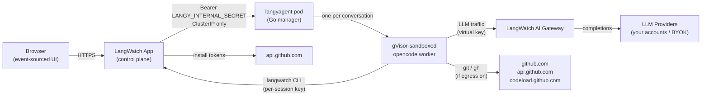

Langy runs as a separate Kubernetes Deployment, the `langyagent` pod, and ships **enabled**: a plain `helm install` deploys it, materialises the shared secret, wires the app and workers to it, and opens Langy to everyone in the install.

The default pins the pod to a `gvisor` RuntimeClass. On a cluster without one, only the agent pod waits (Pending) while the rest of the install runs; provide a sandboxed runtime or accept running without one. See [Setup](/self-hosting/langy/setup).

The GitHub App and outbound network egress are both optional and off until you configure them.

The `langyagent` pod is a single Go "manager" process that spawns one gVisor-sandboxed [opencode](/langy/how-langy-works) worker per conversation. It never talks to your data stores directly; each worker reaches LangWatch only through the `langwatch` CLI, over the per-session credentials the control plane mints for that turn.

<Info>
  **Also check:** [Setup](/self-hosting/langy/setup), [Environment
  variables](/self-hosting/langy/environment-variables), [Networking and
  egress](/self-hosting/langy/networking-and-egress), [The sandbox](/langy/security/sandbox).
</Info>

<Note>
  **Turning Langy off.** Set `langyagent.chartManaged: false`: the agent pod and every reference to
  it are removed on the next upgrade, and nothing else in the install changes. For opening Langy to
  a few projects before everyone, see [staged rollout](/self-hosting/langy/setup#staged-rollout). On
  LangWatch Cloud, availability is managed for you.
</Note>

## At a glance

|                 |                                                                                                                               |
| --------------- | ----------------------------------------------------------------------------------------------------------------------------- |
| Deployment      | Separate `langyagent` Deployment + ConfigMap + Service + NetworkPolicy in the umbrella chart                                  |
| Default state   | On (`langyagent.chartManaged: true`); disable with `chartManaged: false`                                                      |
| Access          | Everyone in the install (`enableForAllUsers: true`); staged rollout via the flag instead                                      |
| Replicas        | 1 (render-time guard blocks more until conversation-sticky routing exists)                                                    |
| Update strategy | `Recreate`, no HPA. Scale vertically.                                                                                         |
| Sandbox         | `runtimeClassName: gvisor` by default; unsandboxed only via explicit `acceptUnsandboxedRuntime: true`                         |
| Sizing          | ~5 to 15 concurrent sessions at 500m to 2 CPU / 1 to 4Gi                                                                      |
| Shared secret   | `LANGY_INTERNAL_SECRET`, materialised in the app Secret by the chart; add it to your own Secret when `autogen.enabled: false` |
| GitHub App      | Optional, for bot-authored pull requests                                                                                      |
| Outbound egress | Off by default (`networkPolicy.allowExternalHttps: false`)                                                                    |

## Hard requirements

- **A sandboxed runtime.** The workload is LLM-driven arbitrary shell (workers spawn `git`, `gh`, and `npm`), so the default pins the pod to gVisor. GKE ships the RuntimeClass managed (GKE Sandbox; Autopilot schedules `gvisor` pods directly). On AKS, point `runtimeClassName` at your Kata VM isolation class; any sandboxed RuntimeClass works. EKS has no managed option: install gVisor on the node group, or accept unsandboxed explicitly with `runtimeClassName: ""` plus `acceptUnsandboxedRuntime: true`. On a cluster without the RuntimeClass, the pod waits with a `RuntimeClass not found` event and the install notes explain the choice. See [The sandbox](/langy/security/sandbox).
- **A separate pod and service.** The agent is its own Deployment, ConfigMap, ClusterIP Service, and NetworkPolicy (plus an optional PodDisruptionBudget and CiliumNetworkPolicy). It runs a single replica with `strategy: Recreate` and no HPA, sized for roughly 5 to 15 concurrent sessions at 500m to 2 CPU and 1 to 4Gi. Scale it vertically, not horizontally.
- **The shared internal secret.** The app and the agent authenticate to each other with a bearer token, `LANGY_INTERNAL_SECRET`. The chart materialises it in the app Secret when `autogen.enabled` is on; with your own Secret, add the key yourself and the install checks for it before starting. See [Setup](/self-hosting/langy/setup#bringing-your-own-secrets).

## Optional components

- **GitHub App** for bot-authored pull requests. Register a GitHub App and set the `GITHUB_LANGY_*` env vars. If the private key is unset, the GitHub feature is silently off and Langy returns findings without opening PRs. See [Register the Langy GitHub App](/self-hosting/langy/github-app).
- **Outbound HTTPS egress** for `git`, `gh`, and `npm`. `networkPolicy.allowExternalHttps` is `false` by default; the pod cannot reach GitHub until you enable egress. See [Networking and egress](/self-hosting/langy/networking-and-egress).
- **Operator mirror lane** to copy Langy's own turn traces into a LangWatch project you designate, so whoever runs the install can watch Langy work. Off until `langyagent.mirror.existingSecretName` names a Secret holding the mirror project's API key. See [Watching Langy work](/self-hosting/langy/setup#watching-langy-work).

## Architecture

The control plane reaches the agent over cluster DNS at `http://<release>-langyagent:80` (`OPENCODE_AGENT_URL`), authenticated with `LANGY_INTERNAL_SECRET`. The Service is ClusterIP only; a render-time guard blocks any other type, so the agent is never exposed outside the cluster. Each worker's only path to LangWatch data is the `langwatch` CLI, and its only path to the internet is the [L7 egress adapter](/self-hosting/langy/networking-and-egress). LLM traffic goes through the [LangWatch AI Gateway](/ai-gateway/self-hosting/helm), never direct to providers, so every Langy LLM call is traced, budgeted, and policed like any other.

## Where to go next

<CardGroup cols={2}>
  <Card title="Setup" icon="ship" href="/self-hosting/langy/setup">
    Deployed by default; the sandboxed runtime per cloud, egress, mirror, and staged rollout.
  </Card>
  <Card title="Register the GitHub App" icon="github" href="/self-hosting/langy/github-app">
    Register the app, set the `GITHUB_LANGY_*` env vars, and install it on the repos Langy may
    touch.
  </Card>
  <Card
    title="Environment variables"
    icon="rectangle-list"
    href="/self-hosting/langy/environment-variables"
  >
    The full `LANGY_*` and `GITHUB_LANGY_*` reference with defaults.
  </Card>
  <Card
    title="Networking and egress"
    icon="network-wired"
    href="/self-hosting/langy/networking-and-egress"
  >
    The NetworkPolicy, the FQDN floor, and the cooperative-vs-mandatory egress limit.
  </Card>
  <Card title="The sandbox" icon="shield-halved" href="/langy/security/sandbox">
    What the gVisor sandbox can and cannot reach, and where the boundaries sit.
  </Card>
  <Card title="Platform self-hosting" icon="server" href="/self-hosting/overview">
    Deploy the rest of the LangWatch stack that Langy runs alongside.
  </Card>
</CardGroup>
