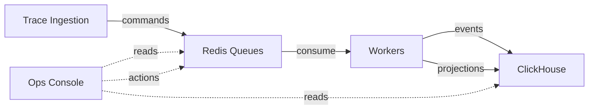

The **Ops Console** (`/ops`) is a platform-wide operations interface built for teams running LangWatch on their own infrastructure. It gives operators real-time visibility into the event-sourcing pipeline — queue health, processing throughput, error clusters — and the tools to act on problems without touching the database or restarting pods.

<Frame>

</Frame>

## When to Use Ops

| Scenario | Where to go |
|---|---|
| Traces aren't appearing in the UI | [Dashboard](/self-hosting/ops/dashboard) — check Staged/s and Failed/s rates |
| Processing is stuck | [Queue Management](/self-hosting/ops/queue-management) — inspect blocked groups and error clusters |
| A deployment broke a projection | [Projection Replay](/self-hosting/ops/projection-replay) — replay affected projections from a known-good date |
| Need to debug a specific trace or aggregate | [Deja View](/self-hosting/ops/dejaview) — time-travel through the event stream |
| Want to test trace ingestion against a project | [The Foundry](/self-hosting/ops/foundry) — build and send synthetic traces |
| Failed jobs need reprocessing | [Queue Management](/self-hosting/ops/queue-management) — redrive from the DLQ |

## Feature Overview

<CardGroup cols={2}>
  <Card title="Dashboard" icon="gauge" href="/self-hosting/ops/dashboard">
    Real-time throughput, latency, error rates, and pipeline health at a glance. Powered by Server-Sent Events with automatic polling fallback.
  </Card>
  <Card title="Queue Management" icon="layer-group" href="/self-hosting/ops/queue-management">
    Error groups, blocked queues, dead letter queue redriving, draining, and pipeline pause/unpause controls.
  </Card>
  <Card title="Projection Replay" icon="rotate" href="/self-hosting/ops/projection-replay">
    Rebuild projection state by replaying events from ClickHouse. Supports bulk replay across tenants, single-aggregate debugging, and dry runs.
  </Card>
  <Card title="Deja View" icon="clock-rotate-left" href="/self-hosting/ops/dejaview">
    Time-travel debugger for event-sourced aggregates. Inspect the full event history and compute any projection's state at any point in time.
  </Card>
  <Card title="The Foundry" icon="hammer" href="/self-hosting/ops/foundry">
    Interactive trace playground for building, visualizing, and sending synthetic traces to any project. Useful for testing ingestion pipelines and reproducing issues.
  </Card>
</CardGroup>

## Access Control

The Ops Console uses two dedicated permissions, separate from project-level RBAC:

| Permission | Grants |
|---|---|
| `ops:view` | Read-only access to all dashboards, metrics, and search |
| `ops:manage` | Write access — unblock groups, drain queues, pause pipelines, start replays, redrive DLQ |

These are platform-wide permissions, not scoped to a specific project. Users without `ops:view` are redirected away from `/ops` routes.

See [Access Control (RBAC)](/platform/rbac) for details on assigning permissions.

## Architecture Context

The Ops Console sits on top of LangWatch's event-sourcing pipeline:

- **Commands** enter Redis queues from the ingestion API
- **Workers** consume commands, emit events, and update projections in ClickHouse
- The **Ops Console** reads queue state from Redis and event history from ClickHouse, and can issue control actions (unblock, drain, pause, replay) back to the queues
