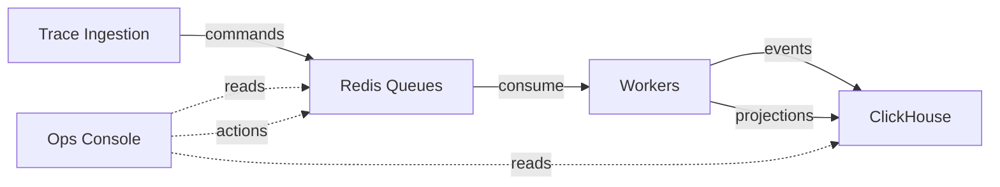

The **Ops Console** (`/ops`) is a platform-wide operations interface built for teams running LangWatch on their own infrastructure. It gives operators real-time visibility into the event-sourcing pipeline, queue health, processing throughput, error clusters, and the tools to act on problems without touching the database or restarting pods.

<Frame>
  
</Frame>

## When to Use Ops

| Scenario                                       | Where to go                                                                                                  |
| ---------------------------------------------- | ------------------------------------------------------------------------------------------------------------ |
| Traces aren't appearing in the UI              | [Dashboard](/self-hosting/ops/dashboard): check Staged/s and Failed/s rates                                  |
| Processing is stuck                            | [Queue Management](/self-hosting/ops/queue-management): inspect blocked groups and error clusters            |
| A deployment broke a projection                | [Projection Replay](/self-hosting/ops/projection-replay): replay affected projections from a known-good date |
| Need to debug a specific trace or aggregate    | [Deja View](/self-hosting/ops/dejaview): time-travel through the event stream                                |
| Want to test trace ingestion against a project | [The Foundry](/self-hosting/ops/foundry): build and send synthetic traces                                    |
| SSO setup or directory sync needs investigation | The identity and directory Backoffice pages below                                                            |
| An upgrade is waiting on an organization migration | `/ops/migrations`: inspect its result and report                                                          |
| Failed jobs need reprocessing                  | [Queue Management](/self-hosting/ops/queue-management): redrive from the DLQ                                 |

## Feature Overview

<CardGroup cols={2}>
  <Card title="Dashboard" icon="gauge" href="/self-hosting/ops/dashboard">
    Real-time throughput, latency, error rates, and pipeline health at a glance. Powered by
    Server-Sent Events with automatic polling fallback.
  </Card>
  <Card title="Queue Management" icon="layer-group" href="/self-hosting/ops/queue-management">
    Error groups, blocked queues, dead letter queue redriving, draining, and pipeline pause/unpause
    controls.
  </Card>
  <Card title="Projection Replay" icon="rotate" href="/self-hosting/ops/projection-replay">
    Rebuild projection state by replaying events from ClickHouse. Supports bulk replay across
    tenants, single-aggregate debugging, and dry runs.
  </Card>
  <Card title="Deja View" icon="clock-rotate-left" href="/self-hosting/ops/dejaview">
    Time-travel debugger for event-sourced aggregates. Inspect the full event history and compute
    any projection's state at any point in time.
  </Card>
  <Card title="The Foundry" icon="hammer" href="/self-hosting/ops/foundry">
    Interactive trace playground for building, visualizing, and sending synthetic traces to any
    project. Useful for testing ingestion pipelines and reproducing issues.
  </Card>
</CardGroup>

## Who can use Ops

Ops access comes from the deployment's `ADMIN_EMAILS` allow-list. Set it to a
comma-separated list of trusted operator email addresses:

```bash
ADMIN_EMAILS=operator@yourcompany.com,backup-operator@yourcompany.com
```

These operators have platform-wide access. Being an organization Admin, or
creating a custom role with `ops:view` or `ops:manage`, does not grant Ops
access. The console uses those permission names to distinguish reads and
changes, but the current allow-list grants the operator both.

The Backoffice pages also check the platform-admin allow-list. Use
[organization roles](/platform/rbac) for customer access to teams, projects and
organization settings.

## Identity and directory support

Organization administrators manage their own provider in **Settings >
Authentication**, and people and assignments in **Settings > Directory**.
Use the Backoffice pages when an installation operator needs to investigate
across organizations.

| Page in your installation | Use it for |
| --- | --- |
| `/ops/backoffice/identity-lookup` | Find an account, inspect its identity state and sign it out everywhere when required. |
| `/ops/backoffice/sso-connections` | Inspect connection state and domain evidence, investigate setup, or pause and resume a connection. |
| `/ops/backoffice/directory-sync` | Inspect SCIM sync failures, provisioning attempts and external user mappings. Retry a retired apply after fixing its cause. |
| `/ops/migrations` | Inspect migration progress and reports, or run a targeted migration for an organization. |

Pausing SSO stops new sign-ins through the connection. It leaves existing
sessions and SCIM provisioning in place. Removing a connection also stops
SCIM requests immediately and later revokes that connection's tokens. It does
not remove members or end their sessions. To offboard a person, use Directory
or the identity provider's SCIM deactivation before removing the connection.
See [SSO removal](/platform/sso#disable-or-remove-a-connection).

For a migration, read the per-organization result. **Held** means the work ran
but its parity checks found differences. **Parked** means the attempt failed
and will be retried. **Finalized** means the organization completed that
migration. A run that is waiting for an earlier migration has not changed the
organization yet. Do not treat starting a migration as proof it finished.

For an identity and access upgrade, follow the
[two-stage migration checklist](/self-hosting/upgrade#complete-identity-and-access-migrations-first)
before deploying the new version. Check every required migration, including
users as well as organizations. Credential repair is recurring and does not
finalize; the one-time backfills must finalize.

## Architecture Context

The Ops Console sits on top of LangWatch's event-sourcing pipeline:


```mermaid
graph LR
    Ingest["Trace Ingestion"] -->|"commands"| Redis["Redis Queues"]
    Redis -->|"consume"| Workers["Workers"]
    Workers -->|"events"| CH["ClickHouse"]
    Workers -->|"projections"| CH
    Ops["Ops Console"] -.->|"reads"| Redis
    Ops -.->|"reads"| CH
    Ops -.->|"actions"| Redis
```

- **Commands** enter Redis queues from the ingestion API
- **Workers** consume commands, emit events, and update projections in ClickHouse
- The **Ops Console** reads queue state from Redis and event history from ClickHouse, and can issue control actions (unblock, drain, pause, replay) back to the queues
