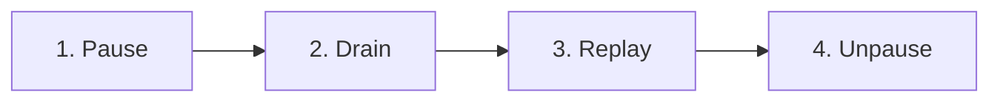

**Projection Replay** (`/ops/projections`) lets operators rebuild derived state by reprocessing events from ClickHouse through one or more projections. This is the primary tool for recovering from projection bugs, backfilling new projections, or rebuilding state after a data migration.

<Frame>

</Frame>

## How Replay Works

LangWatch uses event sourcing: every state change is stored as an immutable event in ClickHouse. Projections are functions that fold events into derived state (e.g., analytics aggregations, trace summaries). When a projection has a bug or needs to be rebuilt, replay reprocesses the raw events.

A full replay follows four phases:

1. **Pause** — Freeze the selected projections so new events don't interfere
2. **Drain** — Wait for in-flight jobs to complete
3. **Replay** — Reread events from ClickHouse and reprocess them through the projections
4. **Unpause** — Resume normal processing

## Bulk Replay Wizard

The main interface is a three-step wizard:

### Step 1: Select Tenants

Choose which tenants (projects) to replay:
- Select individual tenants from a searchable multi-select
- Or check **"All tenants"** to replay across the entire platform

### Step 2: Choose Date Range

Set the **"Replay events since"** date — only events after this date are reprocessed. Quick-select buttons are available for common ranges (1, 2, 3, or 6 months).

Once tenants and date are selected, the system automatically **discovers aggregates** — querying ClickHouse to find how many aggregates match each projection.

### Step 3: Select Projections

A table shows all available projections with:
- **Projection name** and **pipeline**
- **Aggregate count** — how many aggregates have data in the selected range
- Projections with no matching data are disabled

Select individual projections or use **"Select all with data"** to check everything.

### Review & Start

Before starting, a summary shows:
- Total aggregates, projections, and tenants selected
- A description field for audit logging

Two action options:
- **Start Full Replay** — runs the four-phase replay process
- **Dry Run** — processes 5 sample aggregates in memory without writing, to verify the projection logic is correct

## Monitoring Progress

When a replay starts, a **progress drawer** slides open showing real-time metrics:

- **Current phase** (pause, drain, replay, unpause)
- **Current projection** being processed
- **Aggregates processed** — progress bar with count and percentage
- **Events processed** — total events replayed
- **Throughput** — events per second
- **Elapsed time** — wall clock since start
- **Projection badges** — highlighting the currently active projection

## Replay History

Below the wizard, a **history table** shows all past replay runs with:

| Column | Description |
|---|---|
| **Status** | Running, completed, failed, or cancelled |
| **Description** | User-provided description |
| **Projections** | Number of projections replayed |
| **Duration** | Total wall-clock time |
| **Aggregates** | Total aggregates processed |
| **Events** | Total events replayed |
| **When** | Start timestamp |

Click any row to navigate to its detailed status page (`/ops/projections/{runId}`).

## Single Aggregate Replay

For debugging, an **Advanced** section (collapsed by default) allows replaying a specific aggregate:

1. Enter the **Aggregate ID** (e.g., `trace_abc123`)
2. Enter the **Tenant ID**
3. Select which projections to replay
4. Click **"Replay Single"**

This is useful when a single aggregate's projection state is incorrect and you want to rebuild it without replaying the entire tenant.

## Common Workflows

### Backfilling a new projection

1. Deploy the new projection code
2. Open Projection Replay → select "All tenants"
3. Set the date range to cover all relevant history
4. Select only the new projection
5. Start a **Dry Run** first to verify correctness
6. If the dry run looks good, **Start Full Replay**

### Fixing a projection bug

1. Deploy the fix
2. Select the affected projection(s)
3. Set the date to when the bug was introduced (or earlier to be safe)
4. Select affected tenants (or all)
5. Start replay — the fixed projection code reprocesses all events

### Debugging a single trace

1. Expand the **Advanced: Single Aggregate Replay** section
2. Enter the aggregate ID and tenant ID
3. Select the projection you're investigating
4. Replay — then check [Deja View](/self-hosting/ops/dejaview) to inspect the result
