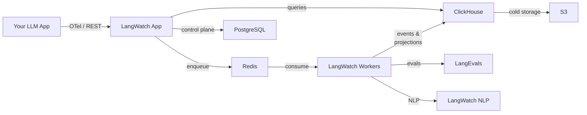

LangWatch is an open-source LLM Ops platform for evaluation, observability, and optimization of AI agents and pipelines. You can self-host LangWatch for full data sovereignty, regulatory compliance (GDPR, SOC 2), or air-gapped environments. The self-hosted edition runs the same software that powers LangWatch Cloud -- there is no separate "community" or "enterprise" build.

<Tip>
**Get the entire LangWatch platform running with a single Helm install:**

```bash
helm repo add langwatch https://langwatch.github.io/langwatch
helm repo update
helm pull langwatch/langwatch --untar
helm install langwatch ./langwatch \
  --namespace langwatch --create-namespace \
  -f langwatch/examples/values-local.yaml
```

See [Kubernetes (Helm)](/self-hosting/deployment/kubernetes-helm) for full setup instructions.
</Tip>

<Note>
  Looking for a managed solution? [LangWatch Cloud](https://langwatch.ai) is fully maintained by the LangWatch team and is the fastest way to get started.
</Note>

## Architecture at a Glance



See [Architecture & Infrastructure](/self-hosting/infrastructure/architecture) for a detailed breakdown of networking, scaling, and storage tiers.

## Deployment Models

<CardGroup cols={2}>
<Card title="LangWatch Cloud" icon="cloud">
Fully managed by the LangWatch team. No infrastructure to manage — sign up and start sending traces in minutes.

[Sign up at langwatch.ai](https://langwatch.ai)
</Card>

<Card title="Self-Managed" icon="server" href="/self-hosting/deployment/kubernetes-helm">
Deploy the complete LangWatch stack on your own infrastructure — AWS, Azure, GCP, or bare metal. You manage everything: compute, databases, and storage. Full data sovereignty.
</Card>

<Card title="Cloud Enterprise" icon="building">
LangWatch manages the application. Your data lives on exclusive, dedicated instances deployed in your preferred cloud region. The convenience of managed, with the isolation of self-hosted.

[Contact sales](https://langwatch.ai/schedule-demo)
</Card>

<Card title="Hybrid" icon="arrows-split-up-and-left" href="/hybrid-setup/overview">
LangWatch manages the control plane (App, Workers, NLP, LangEvals). You provide the data plane — ClickHouse and S3 in your VPC. Your trace data never leaves your network.
</Card>
</CardGroup>

### At a Glance

| | **Cloud** | **Self-Managed** | **Cloud Enterprise** | **Hybrid** |
|---|:---:|:---:|:---:|:---:|
| You manage infrastructure | | Yes | | |
| You manage data storage | | Yes | Yes | Yes |
| LangWatch manages app | Yes | | Yes | Yes |
| Data stays in your network | | Yes | Yes | Yes |
| Setup time | Minutes | Hours | Days | Days |

## Quick Start

Choose the deployment method that fits your environment.

<CardGroup cols={3}>
  <Card
    title="Docker Compose"
    icon="docker"
    href="/self-hosting/deployment/docker-compose"
  >
    Quick local setup with Docker. Coming soon for v3 — currently available for v2.
  </Card>
  <Card
    title="Kubernetes (Helm)"
    icon="dharmachakra"
    href="/self-hosting/deployment/kubernetes-helm"
  >
    Production deployment on any Kubernetes cluster.
  </Card>
  <Card
    title="Local Kubernetes"
    icon="laptop-code"
    href="/self-hosting/deployment/kubernetes-local"
  >
    Test the Helm chart locally with Kind.
  </Card>
</CardGroup>

## What's New in v3

<Tip>
  LangWatch v3 is a major architecture upgrade. If you are migrating from v2, review the deployment guides for updated requirements.
</Tip>

- **ClickHouse replaces Elasticsearch** as the primary data store, delivering faster analytical queries and lower operational overhead.
- **Event-sourcing architecture** ensures reliable, ordered processing of traces, evaluations, and experiment runs.
- **S3 cold storage tiering** moves older data to object storage automatically, reducing ClickHouse disk costs.
- **Native ClickHouse backup/restore** simplifies disaster recovery without third-party tooling.
- **Auto-tuned ClickHouse** via the `clickhouse-serverless` subchart adapts resource allocation to your workload.
- **Composable Helm chart overlays** let you customize deployments without forking the chart.
- **Deep OpenTelemetry integration** — ingest traces via OTLP, export platform metrics and logs via OTel for infrastructure monitoring

## Enterprise

For Cloud Enterprise or Hybrid deployments, [contact the LangWatch team](https://langwatch.ai/schedule-demo) to discuss your requirements.

Enterprise capabilities include:

- **SSO / SCIM** -- integrate with your identity provider for seamless user provisioning
- **Role-based access control** -- fine-grained permissions across projects and teams
- **Audit logs** -- full visibility into who did what and when
- **Priority support** -- dedicated engineering assistance and SLA-backed response times
