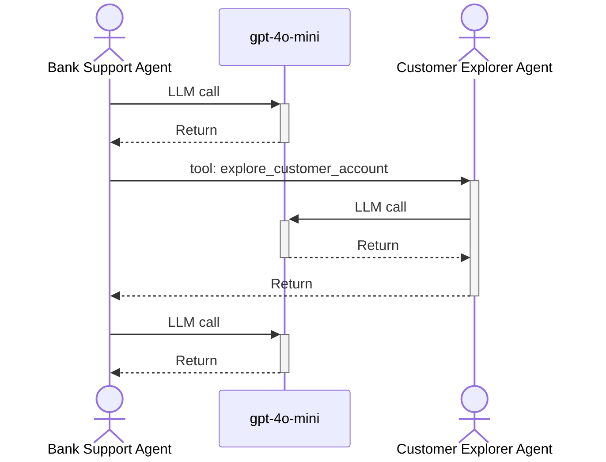

# Sequence Diagram Visualization for Agent Traces

## Overview

The sequence diagram feature provides a traditional UML sequence diagram view of agent and LLM interactions within traces. This visualization is particularly useful for understanding the flow of multi-agent conversations and tool usage patterns.

## Implementation

### Location
- **Component**: `src/components/traces/SequenceDiagram.tsx`
- **Tests**: `src/components/traces/__tests__/SequenceDiagram.test.ts`
- **Integration**: Added as "Sequence" tab in `TraceDetails.tsx`

### Architecture

#### Core Function: `generateMermaidSyntax`
Transforms span tree data into Mermaid.js sequence diagram syntax following these principles:

1. **Actor Identification**:
   - `agent` spans → `actor` keyword in Mermaid (stick figures)
   - `llm` spans → `participant` keyword in Mermaid (rectangles)
   - Deduplication by `name` (agents) or `model` (LLMs)

2. **Interaction Mapping**:
   - Parent-child relationships → sequence arrows (`->>`)
   - Chronological ordering by span timestamps
   - Tool calls are labeled on arrows when present
   - Error states are indicated with "(error)" suffix

3. **Mermaid Rendering**:
   - Uses dynamic import to avoid SSR issues
   - Custom styling with minimal, professional theme
   - Proper error handling with fallback display

### Key Features

#### 1. Traditional Sequence Diagram Layout
- Clean white boxes for participants at the top
- Proper lifelines and activation boxes
- Single-headed arrows for message flow
- Minimal, colorless design following UML conventions

#### 2. Agent-Specific Semantics
- **Actors**: Agent spans rendered as stick figures
- **Participants**: LLM spans rendered as rectangles
- **Messages**: Clear labeling with span types and tool calls
- **Chronological Flow**: Interactions ordered by timestamps

#### 3. Activation Boxes and Call Stack
- **Activation Syntax**: Uses Mermaid's `+` and `-` notation for proper activation boxes
- **Call Stack Visualization**: Shows vertical rectangles representing active method calls
- **Return Messages**: Automatic return arrows (`-->>-`) to close activations
- **Stacked Activations**: Supports multiple calls to the same participant (e.g., recursive tool calls)

#### 4. Tool Call Handling
The implementation correctly handles complex tool call scenarios with proper activations:

```
BankSupportAgent ->>+ gpt-4o-mini: LLM call
gpt-4o-mini -->>- BankSupportAgent: Return
BankSupportAgent ->>+ CustomerExplorerAgent: agent call (via tool)
CustomerExplorerAgent ->>+ gpt-4o-mini: LLM call
gpt-4o-mini -->>- CustomerExplorerAgent: Return
CustomerExplorerAgent -->>- BankSupportAgent: Return
```

#### 5. Error States
- Failed spans are marked with "(error)" in the message label
- Visual indicators help identify problematic interactions

### Example Generated Syntax



## Usage

### User Interface
1. Navigate to any trace with agent/LLM interactions
2. Click the "Sequence" tab in the trace details panel
3. View the sequence diagram with interactive elements
4. Debug mode shows generated Mermaid syntax (development only)

### Empty States
- **No agents/LLMs**: "No agent or LLM spans found in this trace"
- **No interactions**: Shows actor count but explains no interactions exist
- **Rendering errors**: Displays error message with details

## Technical Considerations

### Performance
- Mermaid.js loaded dynamically to reduce bundle size
- Efficient span processing with single-pass tree building
- Minimal re-renders with proper memoization

### Browser Compatibility
- Works in all modern browsers supporting SVG
- Graceful degradation for rendering failures
- No external dependencies beyond Mermaid.js

### Maintenance
- Comprehensive unit test coverage (7 test cases)
- Type-safe implementation with proper TypeScript types
- Clear separation of concerns between data transformation and rendering

## Future Enhancements

### Potential Improvements
1. **Interactive Elements**: Click spans to highlight in tree view
2. **Timeline Markers**: Show absolute timestamps on interactions
3. **Performance Metrics**: Display duration and cost information
4. **Export Options**: Save diagrams as SVG or PNG
5. **Filtering**: Hide/show specific agent types or interactions

### Known Limitations
1. Very wide diagrams may require horizontal scrolling
2. Complex nested tool calls might create visual complexity
3. Large traces (>50 interactions) may impact readability

## Testing

The feature includes comprehensive test coverage:
- Basic syntax generation
- Empty state handling
- Name sanitization
- Chronological ordering
- Complex tool call scenarios
- Error state handling

Run tests: `npm run test:unit -- SequenceDiagram --watch false`

## Dependencies

- **Mermaid.js**: `^10.x` - Sequence diagram rendering
- **@types/mermaid**: Development dependency for TypeScript support
- **React**: Standard hooks for state management and effects
- **Chakra UI**: UI components for layout and styling
