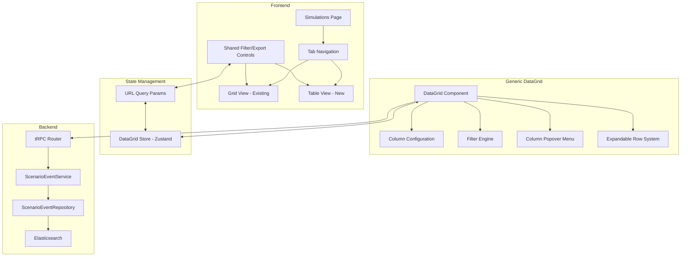
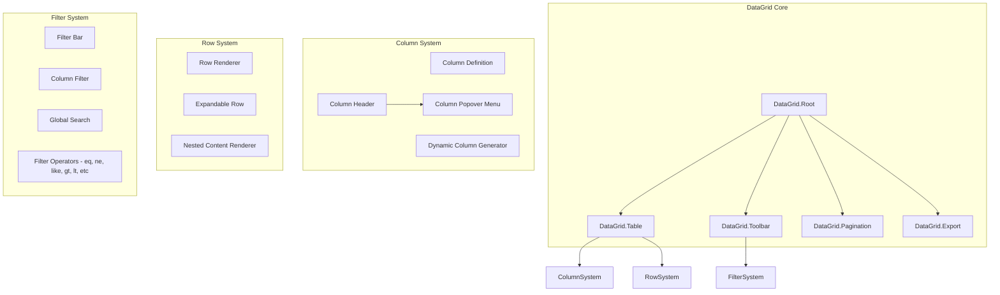
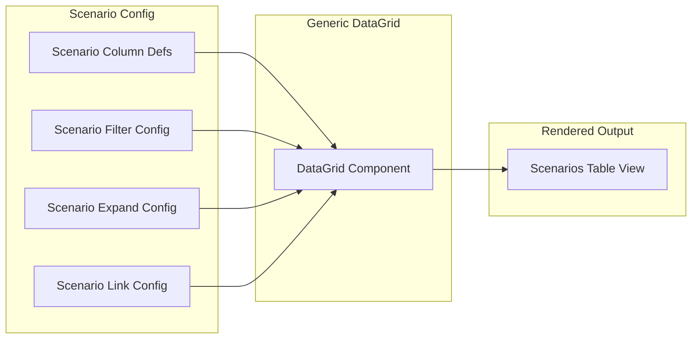

# Scenarios Table View - Architecture Plan (Revised)

> **Note**: The BDD feature specification has been extracted to `langwatch/specs/scenarios-table-view.feature`. That file is the source of truth for the feature specification.

## Overview

This document outlines the architecture for a new table-based view of Scenarios/Simulations data, enabling users to filter, sort, search, and export scenario execution results with a powerful, generic DataGrid component.

## Problem Statement

As Scenarios become a key component of customers' workflows, users need better tools to:
- Filter and sort scenarios by success/failure status
- Search by free text in conversation content
- Filter by scenario handle and scenario set
- Filter by trace metadata (e.g., metadata.user_id = "test-user")
- View recent runs with pass/fail results
- Export data as CSV for reporting
- Navigate between table view and visual grid view

## Key Design Decisions (Based on Feedback)

1. **Expandable Rows**: Each row represents a run, expandable to reveal all traces associated with that run
2. **Dynamic Columns**: Standard columns + auto-generated columns from trace metadata
3. **Linked IDs**: Set ID, Run ID, etc. are clickable links to existing pages
4. **Column Popover Menus**: Per-column filtering/sorting/grouping with LIKE comparators
5. **Generic DataGrid**: Reusable component with domain-specific configuration
6. **Shared Controls**: Table controls visible on both table and grid views
7. **Single Phase**: All features implemented together

## Solution Architecture

### High-Level Architecture



### Generic DataGrid Component Architecture



### Scenario-Specific Configuration



## Data Model

### Row Structure with Expandable Traces

```typescript
// Main row = Scenario Run
interface ScenarioRunRow {
  // Core identifiers
  scenarioRunId: string;
  scenarioId: string;
  scenarioSetId: string;
  batchRunId: string;

  // Display fields
  name: string | null;
  description: string | null;
  status: ScenarioRunStatus;
  verdict: Verdict | null;
  timestamp: number;
  durationInMs: number;

  // Results
  metCriteria: string[];
  unmetCriteria: string[];

  // Expandable: Associated traces
  traces: TraceRow[];

  // Inherited metadata from traces - flattened for filtering
  // These are auto-generated columns
  [key: `metadata.${string}`]: any;
}

// Nested row = Trace
interface TraceRow {
  traceId: string;
  timestamp: number;
  input: string;
  output: string;

  // All trace metadata - becomes columns
  metadata: Record<string, any>;

  // Spans info
  spanCount: number;
  totalTokens: number;
  totalCost: number;
}
```

### Column Definition System

```typescript
// Generic column definition
interface DataGridColumnDef<T> {
  id: string;
  header: string;
  accessorKey?: keyof T | string; // Supports nested paths like 'metadata.user_id'

  // Display
  cell?: (props: CellContext<T>) => React.ReactNode;
  width?: number;
  minWidth?: number;
  maxWidth?: number;

  // Visibility
  defaultVisible?: boolean;
  pinned?: 'left' | 'right' | false;

  // Filtering
  filterable?: boolean;
  filterType?: 'text' | 'number' | 'date' | 'enum' | 'boolean';
  filterOperators?: FilterOperator[];
  enumValues?: string[]; // For enum filters

  // Sorting
  sortable?: boolean;
  defaultSort?: 'asc' | 'desc';

  // Grouping
  groupable?: boolean;

  // Links
  linkTo?: (row: T) => string; // URL to navigate to
}

// Filter operators - simplified for initial implementation
// - 'contains' for text columns (LIKE search)
// - 'eq' for enum columns (exact match with dropdown)
type FilterOperator =
  | 'eq'      // equals - for enum columns
  | 'contains'; // contains (LIKE %value%) - for text columns
```

### Scenario-Specific Column Configuration

```typescript
// Standard columns for scenarios
const scenarioStandardColumns: DataGridColumnDef<ScenarioRunRow>[] = [
  {
    id: 'expand',
    header: '',
    width: 40,
    cell: ExpandToggleCell,
    filterable: false,
    sortable: false,
  },
  {
    id: 'name',
    header: 'Scenario Name',
    accessorKey: 'name',
    cell: ({ row }) => row.original.name || row.original.scenarioId,
    filterable: true,
    filterType: 'text',
    filterOperators: ['like', 'eq', 'ne'],
    sortable: true,
    defaultVisible: true,
  },
  {
    id: 'scenarioSetId',
    header: 'Scenario Set',
    accessorKey: 'scenarioSetId',
    linkTo: (row) => `/${projectSlug}/simulations/${row.scenarioSetId}`,
    filterable: true,
    filterType: 'enum',
    sortable: true,
    defaultVisible: true,
  },
  {
    id: 'batchRunId',
    header: 'Batch Run',
    accessorKey: 'batchRunId',
    linkTo: (row) => `/${projectSlug}/simulations/${row.scenarioSetId}/${row.batchRunId}`,
    filterable: true,
    filterType: 'enum',
    sortable: true,
    defaultVisible: true,
  },
  {
    id: 'status',
    header: 'Status',
    accessorKey: 'status',
    cell: StatusBadgeCell,
    filterable: true,
    filterType: 'enum',
    enumValues: Object.values(ScenarioRunStatus),
    sortable: true,
    defaultVisible: true,
  },
  {
    id: 'verdict',
    header: 'Verdict',
    accessorKey: 'verdict',
    cell: VerdictBadgeCell,
    filterable: true,
    filterType: 'enum',
    enumValues: Object.values(Verdict),
    sortable: true,
    defaultVisible: true,
  },
  {
    id: 'timestamp',
    header: 'Run Time',
    accessorKey: 'timestamp',
    cell: ({ value }) => formatRelativeTime(value),
    filterable: true,
    filterType: 'date',
    filterOperators: ['gt', 'lt', 'gte', 'lte'],
    sortable: true,
    defaultSort: 'desc',
    defaultVisible: true,
  },
  {
    id: 'durationInMs',
    header: 'Duration',
    accessorKey: 'durationInMs',
    cell: ({ value }) => formatDuration(value),
    filterable: true,
    filterType: 'number',
    filterOperators: ['gt', 'lt', 'gte', 'lte'],
    sortable: true,
    defaultVisible: true,
  },
  {
    id: 'metCriteria',
    header: 'Met Criteria',
    accessorKey: 'metCriteria',
    cell: ({ value }) => value?.join(', ') || '-',
    filterable: true,
    filterType: 'text',
    filterOperators: ['like'],
    defaultVisible: false,
  },
  {
    id: 'unmetCriteria',
    header: 'Unmet Criteria',
    accessorKey: 'unmetCriteria',
    cell: ({ value }) => value?.join(', ') || '-',
    filterable: true,
    filterType: 'text',
    filterOperators: ['like'],
    defaultVisible: false,
  },
];

// Dynamic columns generated from trace metadata
function generateDynamicColumns(
  metadataKeys: string[]
): DataGridColumnDef<ScenarioRunRow>[] {
  return metadataKeys.map(key => ({
    id: `metadata.${key}`,
    header: key,
    accessorKey: `metadata.${key}`,
    filterable: true,
    filterType: 'text',
    filterOperators: ['eq', 'ne', 'like', 'exists'],
    sortable: true,
    defaultVisible: false, // Hidden by default
  }));
}
```

## Column Popover Menu Design

Each column header has a popover menu with powerful filtering/sorting/grouping options:

```
┌─────────────────────────────────────┐
│  Status                         [▼] │
├─────────────────────────────────────┤
│  Sort                               │
│  ┌─────────────────────────────────┐│
│  │ ○ None  ○ Asc  ○ Desc          ││
│  └─────────────────────────────────┘│
├─────────────────────────────────────┤
│  Filter                             │
│  ┌─────────────────────────────────┐│
│  │ Operator: [equals        ▼]    ││
│  │ Value:    [SUCCESS       ▼]    ││
│  │                    [+ Add]     ││
│  └─────────────────────────────────┘│
│  Active Filters:                    │
│  • equals SUCCESS              [x] │
│  • equals FAILED               [x] │
├─────────────────────────────────────┤
│  Group by this column          [ ] │
├─────────────────────────────────────┤
│  [Hide Column]  [Pin Left]         │
└─────────────────────────────────────┘
```

### Filter Operators by Type (Simplified)

| Type | Available Operators |
|------|---------------------|
| text | contains (LIKE search) |
| enum | equals (dropdown selection) |
| number | equals (for now) |
| date | equals (for now) |
| boolean | equals (true/false) |

> **Note**: Additional operators (greater than, less than, between, etc.) can be added later as needed.

## URL Query Parameters

```typescript
interface DataGridURLParams {
  // View mode
  view?: 'grid' | 'table';

  // Filters - encoded as JSON
  filters?: string; // JSON encoded FilterState[]

  // Sorting
  sortBy?: string;
  sortOrder?: 'asc' | 'desc';

  // Pagination
  page?: number;
  pageSize?: number;

  // Column visibility
  columns?: string; // Comma-separated visible column IDs

  // Grouping
  groupBy?: string;

  // Search
  search?: string;

  // Expanded rows
  expanded?: string; // Comma-separated row IDs
}

interface FilterState {
  columnId: string;
  operator: FilterOperator;
  value: any;
}

// Example URL:
// /simulations?view=table&filters=[{"columnId":"status","operator":"eq","value":"FAILED"}]&sortBy=timestamp&sortOrder=desc
```

## Zustand Store Structure

```typescript
interface DataGridState<T> {
  // Data
  rows: T[];
  totalCount: number;
  isLoading: boolean;
  error: string | null;

  // Column state
  columns: DataGridColumnDef<T>[];
  visibleColumns: Set<string>;
  columnOrder: string[];
  pinnedColumns: { left: string[]; right: string[] };

  // Filter state
  filters: FilterState[];
  globalSearch: string;

  // Sort state
  sorting: { columnId: string; order: 'asc' | 'desc' } | null;

  // Grouping state
  groupBy: string | null;

  // Pagination state
  page: number;
  pageSize: number;

  // Selection state
  selectedRows: Set<string>;

  // Expansion state
  expandedRows: Set<string>;

  // UI state
  isExporting: boolean;

  // Actions
  setRows: (rows: T[]) => void;
  setFilters: (filters: FilterState[]) => void;
  addFilter: (filter: FilterState) => void;
  removeFilter: (columnId: string, index: number) => void;
  clearFilters: () => void;
  setSorting: (sorting: { columnId: string; order: 'asc' | 'desc' } | null) => void;
  setGroupBy: (columnId: string | null) => void;
  setPage: (page: number) => void;
  setPageSize: (pageSize: number) => void;
  toggleColumnVisibility: (columnId: string) => void;
  setColumnOrder: (order: string[]) => void;
  toggleRowSelection: (rowId: string) => void;
  selectAllRows: () => void;
  clearSelection: () => void;
  toggleRowExpansion: (rowId: string) => void;
  expandAllRows: () => void;
  collapseAllRows: () => void;
  setGlobalSearch: (search: string) => void;
  setIsExporting: (isExporting: boolean) => void;
}
```

## Backend API Changes

### New tRPC Endpoints

```typescript
export const scenarioRouter = createTRPCRouter({
  // ... existing endpoints

  // Get paginated scenario runs with advanced filtering
  getFilteredScenarioRuns: protectedProcedure
    .input(z.object({
      projectId: z.string(),
      filters: z.array(z.object({
        columnId: z.string(),
        operator: z.enum(['eq', 'ne', 'like', 'nlike', 'gt', 'gte', 'lt', 'lte', 'in', 'nin', 'exists', 'nexists', 'regex']),
        value: z.any(),
      })).optional(),
      sorting: z.object({
        columnId: z.string(),
        order: z.enum(['asc', 'desc']),
      }).optional(),
      pagination: z.object({
        page: z.number().min(1).default(1),
        pageSize: z.number().min(1).max(100).default(20),
      }).optional(),
      search: z.string().optional(),
      includeTraces: z.boolean().default(false),
    }))
    .use(checkProjectPermission('scenarios:view'))
    .query(async ({ input }) => {
      // Returns { rows, totalCount, metadataKeys }
    }),

  // Get available metadata keys for dynamic columns
  getAvailableMetadataKeys: protectedProcedure
    .input(projectSchema)
    .use(checkProjectPermission('scenarios:view'))
    .query(async ({ input }) => {
      // Returns unique metadata keys from traces
    }),

  // Get filter options for enum columns
  getFilterOptions: protectedProcedure
    .input(z.object({
      projectId: z.string(),
      columnId: z.string(),
    }))
    .use(checkProjectPermission('scenarios:view'))
    .query(async ({ input }) => {
      // Returns unique values for the column
    }),

  // Export scenarios as CSV
  exportScenariosCsv: protectedProcedure
    .input(z.object({
      projectId: z.string(),
      filters: z.array(filterSchema).optional(),
      columns: z.array(z.string()),
      includeTraces: z.boolean().default(false),
    }))
    .use(checkProjectPermission('scenarios:view'))
    .mutation(async ({ input }) => {
      // Returns CSV data
    }),
});
```

### Repository Changes

```typescript
class ScenarioEventRepository {
  // Advanced search with filters
  async searchScenarioRuns({
    projectId,
    filters,
    sorting,
    pagination,
    search,
    includeTraces,
  }: AdvancedSearchParams): Promise<{
    runs: ScenarioRunRow[];
    totalCount: number;
    metadataKeys: string[];
  }> {
    // Build Elasticsearch query
    const query = this.buildFilterQuery(filters);

    // Add full-text search if provided
    if (search) {
      query.bool.must.push({
        multi_match: {
          query: search,
          fields: ['metadata.name', 'messages.content'],
        },
      });
    }

    // Execute search with aggregations for metadata keys
    // Join with traces if includeTraces is true
  }

  // Build filter query from filter states
  private buildFilterQuery(filters: FilterState[]): any {
    const must: any[] = [];
    const mustNot: any[] = [];

    for (const filter of filters) {
      const field = this.mapColumnToField(filter.columnId);

      switch (filter.operator) {
        case 'eq':
          must.push({ term: { [field]: filter.value } });
          break;
        case 'ne':
          mustNot.push({ term: { [field]: filter.value } });
          break;
        case 'like':
          must.push({ wildcard: { [field]: `*${filter.value}*` } });
          break;
        case 'gt':
          must.push({ range: { [field]: { gt: filter.value } } });
          break;
        // ... other operators
      }
    }

    return { bool: { must, must_not: mustNot } };
  }

  // Get unique metadata keys
  async getUniqueMetadataKeys({
    projectId,
  }: { projectId: string }): Promise<string[]> {
    // Aggregation query to get all unique metadata field names
  }
}
```

## File Structure

```
langwatch/src/
├── components/
│   ├── ui/
│   │   └── datagrid/                       # NEW: Generic DataGrid (in ui/ for reusability)
│   │       ├── index.ts                    # Exports
│   │       ├── DataGrid.tsx                # Main component
│   │       ├── DataGridTable.tsx           # Table renderer
│   │       ├── DataGridToolbar.tsx         # Toolbar with filters
│   │       ├── DataGridPagination.tsx      # Pagination controls
│   │       ├── DataGridExport.tsx          # Export button
│   │       ├── ColumnHeader.tsx            # Column header with popover
│   │       ├── ColumnPopover.tsx           # Filter/sort/group popover
│   │       ├── ExpandableRow.tsx           # Expandable row component
│   │       ├── FilterBar.tsx               # Active filters display
│   │       ├── cells/                      # Cell renderers
│   │       │   ├── LinkCell.tsx
│   │       │   ├── StatusBadgeCell.tsx
│   │       │   ├── DateCell.tsx
│   │       │   └── ExpandToggleCell.tsx
│   │       └── types.ts                    # Type definitions
│   │
│   └── simulations/
│       ├── index.ts                        # Existing exports
│       ├── SimulationsTabs.tsx             # NEW: Tab navigation
│       ├── ScenariosTableView.tsx          # NEW: Table view using DataGrid
│       ├── scenarioColumns.ts              # NEW: Scenario column config
│       ├── ScenarioExpandedContent.tsx     # NEW: Expanded row content
│       └── SharedControls.tsx              # NEW: Shared filter/export controls
│
├── hooks/
│   ├── datagrid/                           # NEW: DataGrid hooks
│   │   ├── index.ts
│   │   ├── useDataGridStore.ts             # Zustand store factory
│   │   ├── useDataGridURLSync.ts           # URL param synchronization
│   │   └── useDataGridExport.ts            # Export logic
│   │
│   └── simulations/
│       ├── index.ts                        # Existing exports
│       └── useScenariosDataGrid.ts         # NEW: Scenario-specific hook
│
└── pages/
    └── [project]/
        └── simulations/
            └── index.tsx                   # MODIFY: Add tabs and table view
```

## UI/UX Design

### Table View Layout

```
┌─────────────────────────────────────────────────────────────────────────────┐
│  Simulations                                                                │
├─────────────────────────────────────────────────────────────────────────────┤
│  [Grid View]  [Table View]                                                  │
├─────────────────────────────────────────────────────────────────────────────┤
│  Filters: [+ Add Filter]  Search: [________________]        [Export CSV]    │
│  Active: status = FAILED [x]  |  scenarioSetId = auth-set [x]  [Clear All] │
├─────────────────────────────────────────────────────────────────────────────┤
│  [▼]│ Name [▼]    │ Set [▼]     │ Batch [▼]  │ Status [▼]│ Time [▼]│ Dur  │
├────┼─────────────┼─────────────┼────────────┼───────────┼─────────┼──────┤
│  ▶ │ Login Test  │ auth-set    │ batch-123  │ ✓ Pass    │ 2h ago  │ 1.2s │
├────┼─────────────┼─────────────┼────────────┼───────────┼─────────┼──────┤
│  ▼ │ Signup Flow │ auth-set    │ batch-123  │ ✗ Fail    │ 2h ago  │ 3.4s │
│    ├─────────────────────────────────────────────────────────────────────┤
│    │  Traces:                                                            │
│    │  ┌────────────┬──────────────┬─────────────┬──────────────────────┐│
│    │  │ Trace ID   │ Input        │ Output      │ metadata.user_id     ││
│    │  ├────────────┼──────────────┼─────────────┼──────────────────────┤│
│    │  │ trace-abc  │ Hello...     │ Hi there... │ user-123             ││
│    │  │ trace-def  │ Sign up...   │ Error...    │ user-456             ││
│    │  └────────────┴──────────────┴─────────────┴──────────────────────┘│
├────┼─────────────┼─────────────┼────────────┼───────────┼─────────┼──────┤
│  ▶ │ Chat Test   │ chat-set    │ batch-456  │ ✓ Pass    │ 3h ago  │ 0.8s │
├─────────────────────────────────────────────────────────────────────────────┤
│  Showing 1-20 of 156 results              [< Prev] [1] [2] [3] [Next >]     │
└─────────────────────────────────────────────────────────────────────────────┘
```

### Column Popover Menu

```
┌─────────────────────────────────┐
│  Status                     [▼] │
├─────────────────────────────────┤
│  ▲ Sort Ascending               │
│  ▼ Sort Descending              │
│  ─ Clear Sort                   │
├─────────────────────────────────┤
│  Filter by Status               │
│  ┌─────────────────────────────┐│
│  │ [equals          ▼]        ││
│  │ [SUCCESS         ▼]        ││
│  │              [Apply]       ││
│  └─────────────────────────────┘│
│                                 │
│  Current Filters:               │
│  • equals FAILED           [x] │
├─────────────────────────────────┤
│  ☐ Group by Status              │
├─────────────────────────────────┤
│  👁 Hide Column                  │
│  📌 Pin to Left                  │
│  📌 Pin to Right                 │
└─────────────────────────────────┘
```

## CSV Export Format

### Export Options

```typescript
interface ExportOptions {
  // Which columns to include
  columns: string[];

  // Include expanded trace data
  includeTraces: boolean;

  // Apply current filters
  applyFilters: boolean;

  // Format options
  dateFormat: 'iso' | 'locale' | 'unix';
  delimiter: ',' | ';' | '\t';
}
```

### Export Columns

| Column | Description |
|--------|-------------|
| scenario_run_id | Unique run identifier |
| scenario_id | Scenario handle |
| scenario_set_id | Parent scenario set |
| batch_run_id | Batch run identifier |
| name | Scenario name |
| status | Run status |
| verdict | Pass/Fail verdict |
| timestamp | Execution timestamp |
| duration_ms | Execution duration |
| met_criteria | Comma-separated list |
| unmet_criteria | Comma-separated list |
| trace_ids | Comma-separated trace IDs |
| metadata.* | Dynamic metadata columns |

## Testing Strategy

### Unit Tests

- DataGrid component rendering
- Column popover interactions
- Filter operator logic
- URL param serialization/deserialization
- Export CSV generation
- Zustand store actions

### Integration Tests

- tRPC endpoint responses
- Elasticsearch query building
- Filter combinations
- Sorting with filters
- Pagination with filters

### E2E Tests

- Tab navigation
- Column popover filter application
- Row expansion
- Link navigation
- Export functionality
- URL sharing

## Implementation Checklist

### Generic DataGrid Component

- [ ] Create DataGrid.tsx root component
- [ ] Create DataGridTable.tsx with TanStack Table
- [ ] Create DataGridToolbar.tsx with filter bar
- [ ] Create DataGridPagination.tsx
- [ ] Create DataGridExport.tsx
- [ ] Create ColumnHeader.tsx with popover trigger
- [ ] Create ColumnPopover.tsx with filter/sort/group UI
- [ ] Create ExpandableRow.tsx
- [ ] Create FilterBar.tsx for active filters
- [ ] Create FilterOperatorSelect.tsx
- [ ] Create cell renderers (LinkCell, StatusBadgeCell, etc.)
- [ ] Create useDataGridStore.ts Zustand store factory
- [ ] Create useDataGridURLSync.ts hook
- [ ] Create useDataGridExport.ts hook

### Scenario-Specific Implementation

- [ ] Create SimulationsTabs.tsx
- [ ] Create ScenariosTableView.tsx
- [ ] Create scenarioColumns.ts configuration
- [ ] Create ScenarioExpandedContent.tsx
- [ ] Create SharedControls.tsx
- [ ] Create useScenariosDataGrid.ts hook
- [ ] Update simulations index page

### Backend

- [ ] Add getFilteredScenarioRuns endpoint
- [ ] Add getAvailableMetadataKeys endpoint
- [ ] Add getFilterOptions endpoint
- [ ] Add exportScenariosCsv endpoint
- [ ] Implement searchScenarioRuns in repository
- [ ] Implement buildFilterQuery helper
- [ ] Implement getUniqueMetadataKeys in repository

### Testing

- [ ] Unit tests for DataGrid components
- [ ] Unit tests for filter logic
- [ ] Unit tests for URL sync
- [ ] Integration tests for endpoints
- [ ] E2E tests for table view workflow

## Dependencies

### New Dependencies

```json
{
  "@tanstack/react-table": "^8.x"
}
```

### Existing Dependencies Used

- `zustand` - State management
- `papaparse` - CSV generation
- `@chakra-ui/react` - UI components
- `date-fns` - Date formatting

## Security Considerations

1. **Permission Checks**: All endpoints use `checkProjectPermission('scenarios:view')`
2. **Data Isolation**: All queries scoped to project ID
3. **Export Limits**: Limit export size to prevent abuse
4. **Input Validation**: All inputs validated with Zod schemas
5. **Regex Safety**: Validate regex patterns to prevent ReDoS

## Performance Considerations

1. **Server-side Operations**: Filtering, sorting, pagination done server-side
2. **Debounced Search**: Debounce search input to reduce API calls
3. **Virtual Scrolling**: Consider for very large result sets
4. **Lazy Loading**: Load expanded row content on demand
5. **Caching**: Use React Query caching for filter options
6. **Index Optimization**: Ensure Elasticsearch indexes support filter queries

---

## BDD Feature Specification

The following Gherkin specification should be extracted to `langwatch/specs/scenarios-table-view.feature` when switching to Code mode:

```gherkin
@wip
Feature: Scenarios Table View with Generic DataGrid
  As a LangWatch user
  I want to view my scenario execution results in a powerful table format
  So that I can filter, sort, search, group, and export scenario data efficiently

  Background:
    Given I am logged in as a user with scenarios:view permission
    And I have a project with scenario execution data
    And scenarios have associated traces with metadata

  # ============================================================================
  # View Navigation
  # ============================================================================

  @e2e
  Scenario: Switch between Grid View and Table View
    Given I am on the simulations page
    When I click on the Table View tab
    Then I see the scenarios displayed in a table format
    And the URL contains view=table parameter

  @e2e
  Scenario: Navigate to scenario set via linked ID
    Given I am on the simulations page in Table View
    When I click on a scenario set ID link
    Then I am navigated to the scenario set page
    And I see the grid view for that scenario set

  @e2e
  Scenario: Navigate to batch run via linked ID
    Given I am on the simulations page in Table View
    When I click on a batch run ID link
    Then I am navigated to the batch run page
    And I see the grid view for that batch run

  # ============================================================================
  # Expandable Rows
  # ============================================================================

  @integration
  Scenario: Expand row to see associated traces
    Given I am on the simulations page in Table View
    And there is a scenario run with multiple traces
    When I click the expand button on a row
    Then I see a nested table with all traces for that run
    And each trace shows its trace ID, input, output, and metadata

  @integration
  Scenario: Collapse expanded row
    Given I am on the simulations page in Table View
    And I have expanded a row
    When I click the expand button again
    Then the nested trace table is hidden

  @integration
  Scenario: Inherited metadata columns from traces
    Given I am on the simulations page in Table View
    And traces have metadata fields like user_id and session_id
    Then I see dynamic columns for metadata.user_id and metadata.session_id
    And these columns are hidden by default
    And I can show them via column visibility settings

  # ============================================================================
  # Column Popover Menu
  # ============================================================================

  @integration
  Scenario: Open column popover menu
    Given I am on the simulations page in Table View
    When I click on the Status column header dropdown
    Then I see a popover menu with sort, filter, and group options

  @integration
  Scenario: Sort column via popover
    Given I am on the simulations page in Table View
    And I open the Status column popover
    When I click Sort Ascending
    Then the table is sorted by status in ascending order
    And the URL contains sortBy=status and sortOrder=asc

  @integration
  Scenario: Filter column with equals operator
    Given I am on the simulations page in Table View
    And I open the Status column popover
    When I select equals operator and FAILED value
    And I click Apply
    Then I only see scenarios with FAILED status
    And the filter appears in the active filters bar

  @integration
  Scenario: Filter column with LIKE operator
    Given I am on the simulations page in Table View
    And I open the Name column popover
    When I select contains operator and enter login
    And I click Apply
    Then I only see scenarios whose name contains login

  @integration
  Scenario: Add multiple filters to same column
    Given I am on the simulations page in Table View
    And I have filtered Status to FAILED
    When I add another filter for Status equals ERROR
    Then I see scenarios with either FAILED or ERROR status

  @integration
  Scenario: Remove filter from popover
    Given I am on the simulations page in Table View
    And I have a filter on Status column
    When I open the Status column popover
    And I click the remove button on the filter
    Then the filter is removed
    And all scenarios are displayed

  @integration
  Scenario: Group by column
    Given I am on the simulations page in Table View
    And I open the Status column popover
    When I check Group by Status
    Then the table rows are grouped by status
    And I see group headers for each status value

  @integration
  Scenario: Hide column via popover
    Given I am on the simulations page in Table View
    And I open the Status column popover
    When I click Hide Column
    Then the Status column is no longer visible
    And I can restore it via column visibility settings

  @integration
  Scenario: Pin column to left
    Given I am on the simulations page in Table View
    And I open the Name column popover
    When I click Pin to Left
    Then the Name column is pinned to the left side
    And it stays visible when scrolling horizontally

  # ============================================================================
  # Filter Bar
  # ============================================================================

  @integration
  Scenario: Add filter via filter bar
    Given I am on the simulations page in Table View
    When I click Add Filter button
    And I select Status column, equals operator, and FAILED value
    And I click Apply
    Then I only see scenarios with FAILED status

  @integration
  Scenario: Clear all filters
    Given I am on the simulations page in Table View
    And I have multiple filters applied
    When I click Clear All in the filter bar
    Then all filters are removed
    And all scenarios are displayed

  @integration
  Scenario: Global search
    Given I am on the simulations page in Table View
    When I enter login error in the search box
    Then I see scenarios whose name or content contains login error

  # ============================================================================
  # Dynamic Columns
  # ============================================================================

  @integration
  Scenario: Auto-generate columns from trace metadata
    Given I am on the simulations page in Table View
    And traces have metadata fields: user_id, session_id, environment
    Then the column visibility menu shows metadata.user_id, metadata.session_id, metadata.environment
    And these columns are available for filtering and sorting

  @integration
  Scenario: Filter by dynamic metadata column
    Given I am on the simulations page in Table View
    And I have enabled the metadata.user_id column
    When I filter metadata.user_id equals test-user
    Then I only see scenarios whose traces have user_id = test-user

  # ============================================================================
  # URL Parameter Synchronization
  # ============================================================================

  @integration
  Scenario: Load table view with filters from URL
    Given I have a URL with filter parameters:
      | Parameter | Value |
      | view | table |
      | filters | status eq FAILED |
      | sortBy | timestamp |
      | sortOrder | desc |
    When I navigate to that URL
    Then I see the Table View
    And the status filter shows FAILED
    And the table is sorted by timestamp descending

  @integration
  Scenario: Share filtered view via URL
    Given I am on the simulations page in Table View
    And I have applied filters and sorting
    When I copy the current URL
    And another user navigates to that URL
    Then they see the same filtered and sorted view

  # ============================================================================
  # CSV Export
  # ============================================================================

  @e2e
  Scenario: Export filtered scenarios as CSV
    Given I am on the simulations page in Table View
    And I have applied a status filter for FAILED scenarios
    When I click the Export CSV button
    Then a CSV file is downloaded
    And the CSV contains only the filtered FAILED scenarios

  @integration
  Scenario: Export with selected columns
    Given I am on the simulations page in Table View
    And I have hidden some columns
    When I export scenarios as CSV
    Then the CSV contains only the visible columns

  @integration
  Scenario: Export with expanded trace data
    Given I am on the simulations page in Table View
    When I export scenarios as CSV with Include Traces option
    Then the CSV contains trace-level rows
    And each trace row includes its metadata

  # ============================================================================
  # Pagination
  # ============================================================================

  @integration
  Scenario: Paginate through results
    Given I am on the simulations page in Table View
    And there are more than 20 scenario runs
    When I click on the next page button
    Then I see the next set of scenario runs
    And the page parameter in the URL is updated

  @integration
  Scenario: Change page size
    Given I am on the simulations page in Table View
    When I change the page size to 50
    Then I see up to 50 scenario runs per page
    And the pageSize parameter in the URL is updated

  # ============================================================================
  # Shared Controls
  # ============================================================================

  @integration
  Scenario: Shared controls visible on both views
    Given I am on the simulations page in Grid View
    Then I see the filter and export controls
    When I switch to Table View
    Then I see the same filter and export controls
    And filters applied in one view persist in the other

  # ============================================================================
  # Error Handling
  # ============================================================================

  @integration
  Scenario: Handle empty results gracefully
    Given I am on the simulations page in Table View
    And I apply filters that match no scenarios
    Then I see an empty state message
    And the message suggests adjusting filters

  @integration
  Scenario: Handle API errors gracefully
    Given I am on the simulations page in Table View
    When the API returns an error
    Then I see an error message
    And I can retry the request
```
