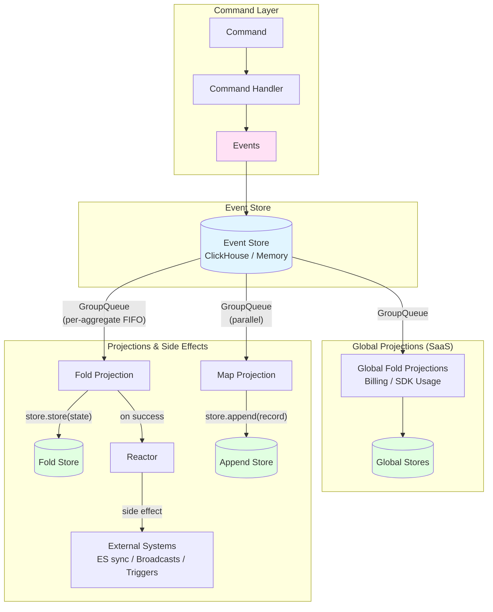

# Event Sourcing - Architecture

A high-level overview of the event sourcing system's core concepts, architecture, and design decisions. For implementation details and code patterns, see [README.md](./README.md).

## Core Philosophy

Event sourcing stores **immutable events** rather than mutable state. Current state is derived by applying events through **projections** (computed views). This enables:

- **Audit trail**: Complete history of all changes
- **Multiple views**: Different projections from the same events
- **Debugging**: See exactly what happened and when
- **Decoupled side effects**: Reactors and map projections fire independently

## Core Concepts

### Events

Events are immutable facts representing something that happened. They are the source of truth.

**Key properties:**

- `id`: Unique identifier
- `aggregateId`: The aggregate this event belongs to
- `tenantId`: Multi-tenant isolation
- `timestamp`: When it occurred
- `type`: Event type string for routing
- `data`: Event-specific payload

See: [`domain/types.ts`](./domain/types.ts)

### Commands

Commands represent **intent** to perform an action. Command handlers validate the intent and produce events.

**Flow:** Command --> Command Handler --> Events --> Event Store --> Projections + Reactors

See: [`commands/command.ts`](./commands/command.ts)

### Projection Primitives

The system has three projection primitives, each with different characteristics:

#### Fold Projection (stateful, ordered)

Reduces a stream of events into accumulated state for a single aggregate. Processes events one at a time in FIFO order per aggregate via **GroupQueue**.

**Lifecycle:**

1. `store.get(aggregateId)` -- load current state (or `init()` if none exists)
2. `apply(state, event)` -- pure function producing new state
3. `store.store(state)` -- persist updated state

The fold state is the implicit checkpoint. If a fold fails at step 3, the event will be retried. No separate checkpoint store is needed because the persisted state tells the system exactly where it left off.

See: [`projections/foldProjection.types.ts`](./projections/foldProjection.types.ts), [`projections/foldProjectionExecutor.ts`](./projections/foldProjectionExecutor.ts)

#### Map Projection (stateless, parallel)

Transforms individual events into records and appends them to a store. Stateless -- each event is processed independently with no ordering guarantees. Dispatched through the global **GroupQueue**.

**Lifecycle:**

1. `map(event)` -- pure function producing a record (or `null` to skip)
2. `store.append(record)` -- append to storage

See: [`projections/mapProjection.types.ts`](./projections/mapProjection.types.ts), [`projections/mapProjectionExecutor.ts`](./projections/mapProjectionExecutor.ts)

#### Reactor (post-fold side effects)

A reactor is tied to a specific fold projection. It fires **after** the fold's `apply + store` succeeds. If the fold fails, the reactor never fires. This guarantees the reactor always sees consistent, persisted state.

**Lifecycle:**

1. Fold completes successfully (state stored)
2. Reactor's `handle(event, { foldState, tenantId, aggregateId })` is invoked
3. Reactor performs side effects (trigger evaluations, broadcast updates, sync to Elasticsearch, etc.)

Reactors fire on every fold completion (no `eventTypes` filter). Downstream deduplication is handled via `makeJobId` + `delay` in reactor options.

See: [`reactors/reactor.types.ts`](./reactors/reactor.types.ts)

## Architecture Overview

**Key flow:**

1. Commands are sent and processed by command handlers
2. Command handlers produce events
3. Events are stored in the event store (immutable, append-only)
4. Events are dispatched to fold projections (ordered per aggregate), map projections (parallel), and reactors (after fold success)
5. Fold projections reduce events into accumulated state
6. Map projections transform individual events into appended records
7. Reactors fire side effects after fold state is persisted

## Queue System

### GroupQueue (for folds)

Fold projections require **per-aggregate FIFO ordering** -- event N must be fully processed before event N+1. The `GroupQueue` achieves this using BullMQ's `group` parameter combined with custom Lua staging scripts.

Each aggregate gets its own virtual queue. A worker picks up the next job for each group, processes it, and only then allows the next job in that group to proceed. This serializes processing within an aggregate while allowing different aggregates to be processed in parallel across workers.

See: [`queues/groupQueue/groupQueue.ts`](./queues/groupQueue/groupQueue.ts)

### Global Queue (unified)

All projections (folds, maps, and reactors) are dispatched through a single global `GroupQueue`. Map projections and reactors share the same queue infrastructure; they simply use different group keys and do not rely on per-aggregate ordering.

### Memory Queue (for testing / no Redis)

When Redis is unavailable, both queue types fall back to an in-memory implementation that processes jobs synchronously.

See: [`queues/memory.ts`](./queues/memory.ts)

## Process Roles

The system supports two process roles, configured via the `processRole` option:

- **`web`**: Dispatches commands and enqueues events. Does **not** start BullMQ workers. The web process can create events and dispatch commands but never processes queue jobs.
- **`worker`**: Starts all BullMQ workers (fold, map, reactor, command queues). Processes events from queues.

This separation allows horizontal scaling -- multiple web instances dispatch work while dedicated worker instances process it.

## No Checkpoints Needed

Unlike traditional event sourcing systems that use checkpoint stores to track processing progress, this system does not need them:

- **GroupQueue provides ordering**: BullMQ's group mechanism ensures per-aggregate FIFO without a sequence number tracker.
- **Fold state is the implicit checkpoint**: The last persisted fold state tells the system where it is. If processing fails, the event is retried via BullMQ's retry mechanism and the fold re-applies from current state.
- **Map projections are stateless**: Each event is independently appended -- no position tracking needed.
- **Reactors are idempotent**: They fire after fold success. If they fail, BullMQ retries them. Deduplication is handled via `makeJobId`.

## Global Projection Registry

In SaaS mode, the system registers **global fold projections** that span all pipelines. These projections (billing events, SDK usage) are registered in a virtual `global_projections` pipeline and receive events from all pipelines.

See: [`projections/global/`](./projections/global/) for SaaS-only projections, [`projections/projectionRegistry.ts`](./projections/projectionRegistry.ts) for the registry.

## Tenant Isolation

All operations are scoped to `tenantId`. Events, projections, and stores enforce tenant isolation:

- All event queries are scoped to `tenantId + aggregateId + aggregateType`
- The event store validates `tenantId` before any operations
- Events from different tenants are never mixed

## Failure Handling

- **Fold failures**: BullMQ retries the job. On retry, the fold loads current state and re-applies the event. If state was already stored, the fold is effectively idempotent.
- **Map failures**: BullMQ retries the job. Append stores should be idempotent or tolerate duplicates.
- **Reactor failures**: BullMQ retries the reactor independently. The fold state is already persisted, so the reactor can safely retry.

## Key Implementation Files

| Component | Path |
|-----------|------|
| Core types | [`domain/types.ts`](./domain/types.ts) |
| Commands | [`commands/command.ts`](./commands/command.ts), [`commands/commandHandlerClass.ts`](./commands/commandHandlerClass.ts) |
| Static builder | [`pipeline/staticBuilder.ts`](./pipeline/staticBuilder.ts) |
| Central class | [`eventSourcing.ts`](./eventSourcing.ts) |
| Composition root | [`pipelineRegistry.ts`](./pipelineRegistry.ts) |
| Service | [`services/eventSourcingService.ts`](./services/eventSourcingService.ts) |
| Fold executor | [`projections/foldProjectionExecutor.ts`](./projections/foldProjectionExecutor.ts) |
| Map executor | [`projections/mapProjectionExecutor.ts`](./projections/mapProjectionExecutor.ts) |
| Projection router | [`projections/projectionRouter.ts`](./projections/projectionRouter.ts) |
| Reactor types | [`reactors/reactor.types.ts`](./reactors/reactor.types.ts) |
| GroupQueue | [`queues/groupQueue/groupQueue.ts`](./queues/groupQueue/groupQueue.ts) |
| Event store (interface) | [`stores/eventStore.types.ts`](./stores/eventStore.types.ts) |
| Event store (ClickHouse) | [`stores/eventStoreClickHouse.ts`](./stores/eventStoreClickHouse.ts) |
| Event store (Memory) | [`stores/eventStoreMemory.ts`](./stores/eventStoreMemory.ts) |
| Utilities | [`utils/event.utils.ts`](./utils/event.utils.ts) |

## Next Steps

- **Implementation guide:** See [README.md](./README.md) for code examples and patterns
- **Pipeline implementations:** See [`pipelines/`](./pipelines/) for trace, evaluation, experiment-run, and simulation pipelines
