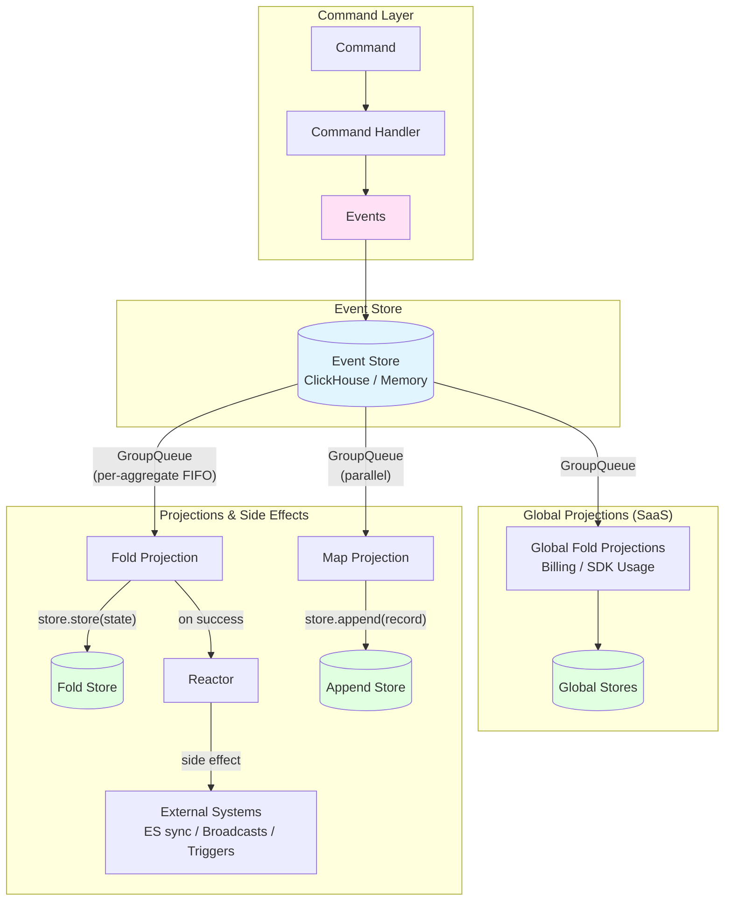

# Event Sourcing - Architecture

A high-level overview of the event sourcing system's core concepts, architecture, and design decisions. For implementation details and code patterns, see [README.md](./README.md).

## Core Philosophy

Event sourcing stores **immutable events** rather than mutable state. Current state is derived by applying events through **projections** (computed views). This enables:

- **Audit trail**: Complete history of all changes
- **Multiple views**: Different projections from the same events
- **Debugging**: See exactly what happened and when
- **Decoupled side effects**: Reactors and map projections fire independently

## Core Concepts

### Events

Events are immutable facts representing something that happened. They are the source of truth.

**Key properties:**

- `id`: Unique identifier
- `aggregateId`: The aggregate this event belongs to
- `tenantId`: Multi-tenant isolation
- `timestamp`: When it occurred
- `type`: Event type string for routing
- `data`: Event-specific payload

See: [`domain/types.ts`](./domain/types.ts)

### Commands

Commands represent **intent** to perform an action. Command handlers validate the intent and produce events.

**Flow:** Command --> Command Handler --> Events --> Event Store --> Projections + Reactors

See: [`commands/command.ts`](./commands/command.ts)

### Projection Primitives

The system has three projection primitives, each with different characteristics:

#### Fold Projection (stateful, ordered)

Reduces a stream of events into accumulated state for a single aggregate. Processes events one at a time in FIFO order per aggregate via **GroupQueue**.

**Lifecycle:**

1. `store.get(aggregateId)` -- load current state (or `init()` if none exists)
2. `apply(state, event)` -- pure function producing new state
3. `store.store(state)` -- persist updated state

The fold state is the implicit checkpoint. If a fold fails at step 3, the event will be retried. No separate checkpoint store is needed because the persisted state tells the system exactly where it left off.

See: [`projections/foldProjection.types.ts`](./projections/foldProjection.types.ts), [`projections/foldProjectionExecutor.ts`](./projections/foldProjectionExecutor.ts)

#### Map Projection (stateless, parallel)

Transforms individual events into records and appends them to a store. Stateless -- each event is processed independently with no ordering guarantees. Dispatched through the global **GroupQueue**.

**Lifecycle:**

1. `map(event)` -- pure function producing a record (or `null` to skip)
2. `store.append(record)` -- append to storage

See: [`projections/mapProjection.types.ts`](./projections/mapProjection.types.ts), [`projections/mapProjectionExecutor.ts`](./projections/mapProjectionExecutor.ts)

#### Reactor (post-fold side effects)

A reactor is tied to a specific fold projection. It fires **after** the fold's `apply + store` succeeds. If the fold fails, the reactor never fires. This guarantees the reactor always sees consistent, persisted state.

**Lifecycle:**

1. Fold completes successfully (state stored)
2. Reactor's `handle(event, { foldState, tenantId, aggregateId })` is invoked
3. Reactor performs side effects (trigger evaluations, broadcast updates, sync to Elasticsearch, etc.)

Reactors fire on every fold completion (no `eventTypes` filter). Downstream deduplication is handled via `makeJobId` + `delay` in reactor options.

See: [`reactors/reactor.types.ts`](./reactors/reactor.types.ts)

## Architecture Overview

```mermaid
graph TB
    subgraph "Command Layer"
        CMD[Command] --> CH[Command Handler]
        CH --> EVT[Events]
    end

    subgraph "Event Store"
        EVT --> ES[(Event Store<br/>ClickHouse / Memory)]
    end

    subgraph "Projections & Side Effects"
        ES --> |"GroupQueue<br/>(per-aggregate FIFO)"| FP[Fold Projection]
        ES --> |"GroupQueue<br/>(parallel)"| MP[Map Projection]
        FP --> |"store.store(state)"| FS[(Fold Store)]
        MP --> |"store.append(record)"| AS[(Append Store)]
        FP --> |"on success"| R[Reactor]
        R --> |"side effect"| EXT[External Systems<br/>ES sync / Broadcasts / Triggers]
    end

    subgraph "Global Projections (SaaS)"
        ES --> |"GroupQueue"| GP[Global Fold Projections<br/>Billing / SDK Usage]
        GP --> GPS[(Global Stores)]
    end

    style ES fill:#e1f5ff
    style FS fill:#e1ffe1
    style AS fill:#e1ffe1
    style GPS fill:#e1ffe1
    style EVT fill:#ffe1f5
```

**Key flow:**

1. Commands are sent and processed by command handlers
2. Command handlers produce events
3. Events are stored in the event store (immutable, append-only)
4. Events are dispatched to fold projections (ordered per aggregate), map projections (parallel), and reactors (after fold success)
5. Fold projections reduce events into accumulated state
6. Map projections transform individual events into appended records
7. Reactors fire side effects after fold state is persisted

## Queue System

Every projection — fold, map, reactor — dispatches through the in-house **GroupQueue**: per-aggregate FIFO + cross-aggregate parallelism on Redis primitives + Lua. Not BullMQ. The framework wires one GroupQueue per pipeline at the composition root.

The summary:

- **GroupQueue (for folds)** — fold projections need per-aggregate FIFO. The `groupKey` is the aggregate id; events for the same aggregate process in order, different aggregates parallelise.
- **GroupQueue (for maps + reactors)** — same queue infrastructure, different group keys. No per-aggregate ordering; just dedup + retries + tiered storage.
- **Memory Queue (for testing / no Redis)** — when Redis is unavailable (local dev, fast unit tests), the framework drops to an in-process queue ([`queues/memory.ts`](./queues/memory.ts)) that processes jobs asynchronously with simple concurrency control. Not a tier of GroupQueue — entirely separate code path with no Lua, no Redis, no tiered storage.

GroupQueue has its own deep-dive docs:

- **[`queues/groupQueue/ARCHITECTURE.md`](./queues/groupQueue/ARCHITECTURE.md)** — staging Lua, dispatcher loop, the tiered envelope (inline → Redis blob → S3), holder-set reference counting, retries, dedup, pause/resume, tenant isolation, failure handling.
- **[`queues/groupQueue/README.md`](./queues/groupQueue/README.md)** — when to use it, configuration knobs, process roles, caveats, testing, observability.

The tiered storage in one line: a payload's serialized size picks where it lives at encode time — inline JSON (≤ 1 KiB) → inline gzip (1–4 KiB) → standalone Redis key (4–256 KiB) → object store / S3 (> 256 KiB, ≤ 50 MiB). Identical bytes collapse to one stored blob via content addressing, refcounted by a per-blob Redis SET.

## Process Roles

The system supports two process roles, configured via the `processRole` option:

- **`web`**: Dispatches commands and stages events. The dispatcher loop and local processor are NOT started, so the web process can create events and stage queue jobs but never processes them.
- **`worker`**: Stages AND dispatches — runs the BRPOP signal loop, the local concurrency processor, and the metrics collector for every registered queue.

This separation allows horizontal scaling — multiple web instances stage work while dedicated worker instances process it. The flag wires to GroupQueue's `consumerEnabled` option at construction time.

## No Checkpoints Needed

Unlike traditional event sourcing systems that use checkpoint stores to track processing progress, this system does not need them:

- **GroupQueue provides ordering**: per-aggregate FIFO is enforced inside the staging Lua — events for the same aggregate are dispatched in stage-order without a sequence-number tracker.
- **Fold state is the implicit checkpoint**: the last persisted fold state tells the system where it is. If processing fails, the queue retries the event with backoff (in front of the same group, preserving FIFO) and the fold re-applies from current state.
- **Map projections are stateless**: each event is independently appended — no position tracking needed.
- **Reactors are idempotent**: they fire after fold success. If they fail, the queue retries them. Downstream deduplication is handled via `makeJobId`.

## Global Projection Registry

In SaaS mode, the system registers **global fold projections** that span all pipelines. These projections (billing events, SDK usage) are registered in a virtual `global` pipeline and receive events from all pipelines.

See: [`projections/global/`](./projections/global/) for SaaS-only projections, [`projections/projectionRegistry.ts`](./projections/projectionRegistry.ts) for the registry.

## Tenant Isolation

All operations are scoped to `tenantId`. Events, projections, and stores enforce tenant isolation:

- All event queries are scoped to `tenantId + aggregateId + aggregateType`
- The event store validates `tenantId` before any operations
- Events from different tenants are never mixed

## Failure Handling

- **Fold failures**: GroupQueue retries the job with exponential backoff in front of the same group (FIFO is preserved). On retry, the fold loads current state and re-applies the event. If state was already stored, the fold is effectively idempotent.
- **Map failures**: GroupQueue retries the job. Append stores should be idempotent or tolerate duplicates.
- **Reactor failures**: GroupQueue retries the reactor independently. The fold state is already persisted, so the reactor can safely retry.
- **Transient blob-store failures** (offloaded body temporarily unreachable — network blip, 5xx): GroupQueue re-stages the SAME envelope without re-encoding, so the body stays referenced through the retry. Distinguished from "missing" so a transient store outage can't mass-drop every in-flight offloaded job.
- **Genuinely missing offloaded body** (TTL backstop kicked in, or manual purge): decode returns null, the slot is completed, the work recovers via event replay. The append-only event log is the durable source of truth.

## Key Implementation Files

| Component | Path |
|-----------|------|
| Core types | [`domain/types.ts`](./domain/types.ts) |
| Commands | [`commands/command.ts`](./commands/command.ts), [`commands/commandHandlerClass.ts`](./commands/commandHandlerClass.ts) |
| Static builder | [`pipeline/staticBuilder.ts`](./pipeline/staticBuilder.ts) |
| Central class | [`eventSourcing.ts`](./eventSourcing.ts) |
| Composition root | [`pipelineRegistry.ts`](./pipelineRegistry.ts) |
| Service | [`services/eventSourcingService.ts`](./services/eventSourcingService.ts) |
| Fold executor | [`projections/foldProjectionExecutor.ts`](./projections/foldProjectionExecutor.ts) |
| Map executor | [`projections/mapProjectionExecutor.ts`](./projections/mapProjectionExecutor.ts) |
| Projection router | [`projections/projectionRouter.ts`](./projections/projectionRouter.ts) |
| Reactor types | [`reactors/reactor.types.ts`](./reactors/reactor.types.ts) |
| GroupQueue (deep dive) | [`queues/groupQueue/ARCHITECTURE.md`](./queues/groupQueue/ARCHITECTURE.md) + [`queues/groupQueue/README.md`](./queues/groupQueue/README.md) |
| GroupQueue (main class) | [`queues/groupQueue/groupQueue.ts`](./queues/groupQueue/groupQueue.ts) |
| Event store (interface) | [`stores/eventStore.types.ts`](./stores/eventStore.types.ts) |
| Event store (ClickHouse) | [`stores/eventStoreClickHouse.ts`](./stores/eventStoreClickHouse.ts) |
| Event store (Memory) | [`stores/eventStoreMemory.ts`](./stores/eventStoreMemory.ts) |
| Utilities | [`utils/event.utils.ts`](./utils/event.utils.ts) |

## Next Steps

- **Implementation guide:** See [README.md](./README.md) for code examples and patterns
- **Pipeline implementations:** See [`pipelines/`](./pipelines/) for trace, evaluation, experiment-run, and simulation pipelines
