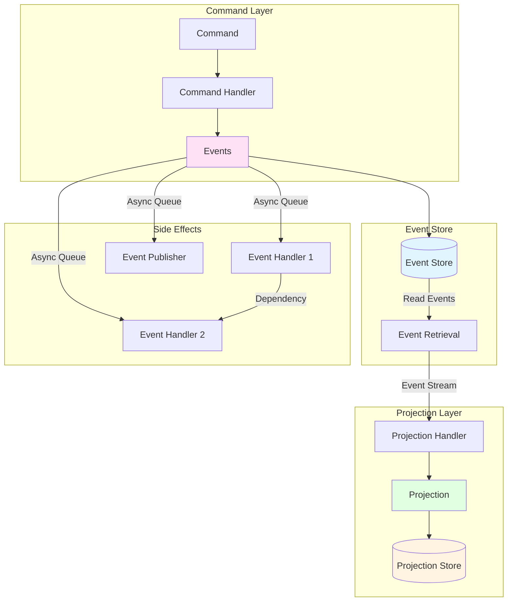
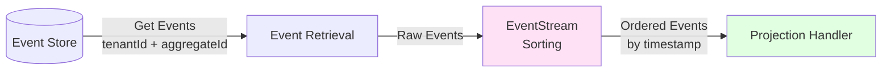
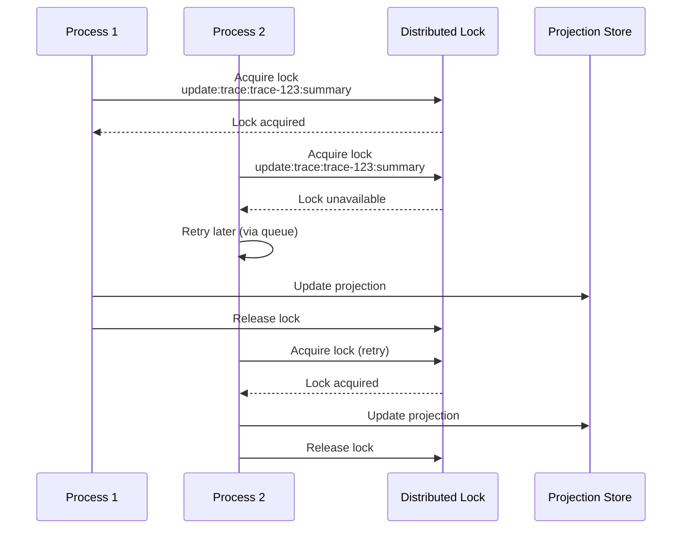
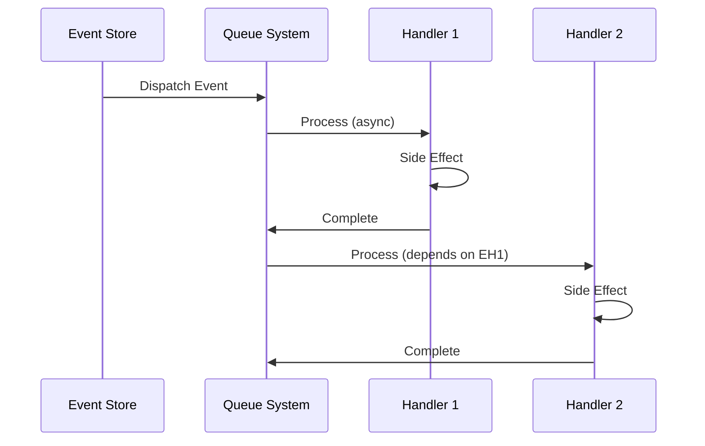
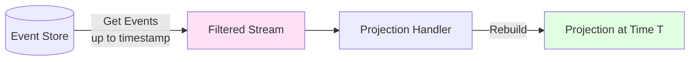
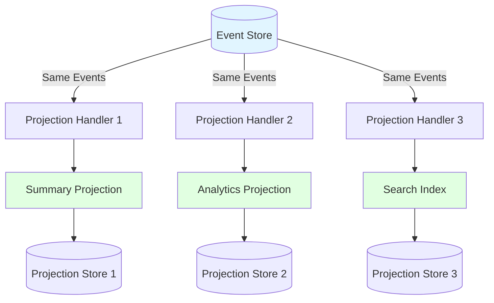
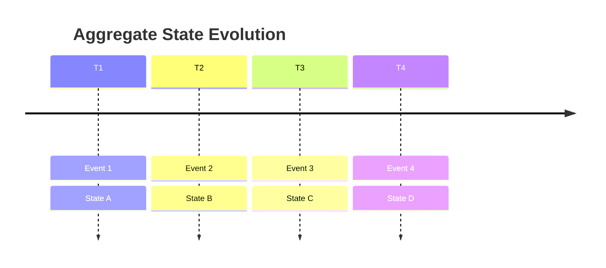
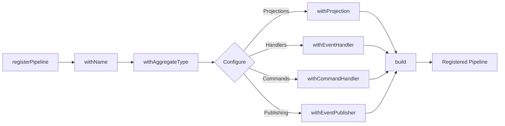

# Event Sourcing Library - Core Concepts & Architecture

A high-level overview of the event sourcing library's core concepts, architecture, and capabilities. For implementation details, see [README.md](./README.md).

## Core Philosophy

Event sourcing stores **immutable events** rather than mutable state. Current state is derived by replaying events through **projections** (computed views). This enables:

- **Time travel**: Rebuild state at any point in time
- **Debugging**: See exactly what happened and when
- **Multiple views**: Create different projections from the same events
- **Audit trail**: Complete history of all changes

## Core Concepts

### Events

Events are immutable facts that represent something that happened. They are the source of truth.

**Key properties:**

- `id`: Unique identifier
- `aggregateId`: The aggregate this event belongs to
- `tenantId`: Multi-tenant isolation
- `timestamp`: When it occurred
- `type`: Event type for routing
- `data`: Event-specific payload

See: [`domain/types.ts`](./domain/types.ts#L18-L33)

### Commands

Commands represent **intent** to perform an action. They are validated and processed by command handlers, which produce events.

**Flow:** Command → Command Handler → Events

See: [`commands/command.ts`](./commands/command.ts)

### Projections

Projections are **computed views** built by replaying events through projection handlers. They represent the current state of an aggregate from a specific perspective.

**Key properties:**

- Built from events (never directly modified)
- Can be rebuilt at any time
- Multiple projections can exist for the same aggregate
- Stored separately for fast queries

See: [`domain/types.ts`](./domain/types.ts#L39-L50)

### Event Handlers (Side Effects)

Event handlers react to individual events and perform side effects (e.g., writing to ClickHouse, triggering external processes). They process events asynchronously via queues.

See: [`domain/handlers/eventReactionHandler.ts`](./domain/handlers/eventReactionHandler.ts)

## Architecture Overview

**Key flow:**

1. Commands are sent and processed by command handlers
2. Command handlers produce events
3. Events are stored in the event store (immutable, append-only)
4. Events trigger side effects (handlers, publishing) asynchronously
5. Events are replayed through projection handlers to build projections
6. Projections are stored separately for fast queries

See: [`services/eventSourcingService.ts`](./services/eventSourcingService.ts#L145-L186) for the `storeEvents` implementation.

## Guaranteed Ordering & Consistency

### Event Ordering Within Aggregates

Events for the same aggregate are **guaranteed to be processed in order**. This is critical for maintaining consistency when building projections.

**How it works:**

1. **Event Storage**: Events are stored scoped to `tenantId + aggregateId + aggregateType`
2. **Event Retrieval**: The event store returns events for a specific aggregate, typically ordered by timestamp
3. **EventStream Ordering**: The `EventStream` class ensures events are always in chronological order before being passed to projection handlers

**Ordering strategies:**

- **`timestamp`** (default): Events sorted chronologically by `timestamp` field
- **`as-is`**: Preserves order from event store (use when DB pre-sorts)
- **Custom function**: Provide a comparator for custom sorting logic

**Tenant Isolation:**

- All event queries are scoped to `tenantId + aggregateId + aggregateType`
- Events from different tenants are never mixed, even if they share the same aggregateId
- The event store validates tenantId before any operations

See: [`streams/eventStream.ts`](./streams/eventStream.ts#L38-L68) for ordering implementation and [`stores/eventStore.types.ts`](./stores/eventStore.types.ts#L11-L12) for concurrency guarantees.

### Concurrent Projection Updates

When multiple processes try to update the same projection simultaneously, **distributed locking** prevents race conditions and ensures consistency.

**Lock Scope:**

- Locks are scoped to: `aggregateType + aggregateId + projectionName`
- Each tenant's aggregates are isolated (tenantId is validated in context, and aggregateIds are unique per tenant)
- Only updates to the **same aggregate's projection** are serialized

**Why per-aggregate locking:**

- Different aggregates can be updated concurrently (no contention)
- Only updates to the **same aggregate's projection** are serialized
- This maximizes parallelism while ensuring consistency

**Note:** Without distributed locking in production, concurrent updates to the same aggregate projection may result in lost updates. See: [`services/eventSourcingService.ts`](./services/eventSourcingService.ts#L598-L608) for lock implementation.

## Side Effects: Event Handlers & Publishing

After events are stored, they trigger side effects through two mechanisms:

### Event Handlers

Event handlers process individual events asynchronously via queues. They can:

- Filter by event type
- Have dependencies on other handlers (executed in order)
- Be idempotent (via job IDs)
- Have concurrency limits

**Handler dependencies:** Handlers are topologically sorted to respect dependencies. See: [`services/eventSourcingService.ts`](./services/eventSourcingService.ts#L474-L555)

**Queue processing:** Handlers are dispatched to queues for async processing. See: [`services/eventSourcingService.ts`](./services/eventSourcingService.ts#L317-L414)

### Event Publishing

Events can be published to external systems (message queues, event buses) after successful storage. Publishing failures are logged but don't fail event storage.

See: [`publishing/eventPublisher.types.ts`](./publishing/eventPublisher.types.ts) and [`services/eventSourcingService.ts`](./services/eventSourcingService.ts#L152-L175)

## Time Travel & Debugging

One of the most powerful features of event sourcing is the ability to rebuild state at any point in time.

### Rebuilding Projections

Projections can be rebuilt by replaying events up to a specific timestamp:

**Implementation:** See [`services/eventSourcingService.ts`](./services/eventSourcingService.ts#L1013-L1020) for `replayEvents` (time travel support).

**Manual projection updates:** You can manually rebuild projections for debugging or recovery. See: [`services/eventSourcingService.ts`](./services/eventSourcingService.ts#L662-L818)

### Event Streams

Events are provided to projection handlers as **EventStream** objects, which:

- Guarantee chronological ordering (unless `as-is` ordering is used)
- Provide metadata (event count, first/last timestamps)
- Enable time-based filtering

See: [`streams/eventStream.ts`](./streams/eventStream.ts)

### Debugging Workflow

1. **Inspect events:** Query the event store for all events for an aggregate
2. **Rebuild at timestamp:** Use `replayEvents` to see state at a specific time
3. **Compare projections:** Rebuild projections at different timestamps to see state evolution
4. **Event timeline:** Use event timestamps and metadata to understand the sequence of changes

## Multiple Projections for Different Views

A single aggregate can have multiple projections, each providing a different view of the same events.

**Use cases:**

- **Summary view:** Fast, denormalized view for UI
- **Analytics view:** Aggregated metrics and statistics
- **Search index:** Full-text searchable representation
- **Reporting view:** Pre-computed reports

**Registration:** Multiple projections are registered via the pipeline builder. See: [`runtime/pipeline/builder.ts`](./runtime/pipeline/builder.ts#L306-L332)

**Access:** Each projection is accessed by name. See: [`services/eventSourcingService.ts`](./services/eventSourcingService.ts#L912-L940)

## Understanding State Over Time

Event sourcing makes it easy to understand how state evolved over time:

### Event Timeline

Events are stored with timestamps, creating a complete timeline:

### Projection Metadata

Projections include metadata about the events that produced them:

- `eventCount`: Number of events processed
- `firstEventTimestamp`: When the first event occurred
- `lastEventTimestamp`: When the last event occurred
- `computedAtUnixMs`: When the projection was computed

See: [`domain/types.ts`](./domain/types.ts#L55-L64)

### Simple View Models

Projections act as simple view models that:

- Hide event complexity behind a simple interface
- Can be queried efficiently (stored separately)
- Can be rebuilt if the projection logic changes
- Represent state at a point in time

**Example:** A trace projection might aggregate all span events into a simple `{ spans: [], metadata: {} }` structure, hiding the complexity of individual span events.

## Pipeline Registration

Pipelines are registered using a fluent builder pattern:

**Type safety:** The builder enforces required fields through TypeScript's type system. See: [`runtime/pipeline/builder.ts`](./runtime/pipeline/builder.ts#L195-L541)

## Key Implementation Files

- **Core types:** [`domain/types.ts`](./domain/types.ts)
- **Event streams:** [`streams/eventStream.ts`](./streams/eventStream.ts)
- **Main service:** [`services/eventSourcingService.ts`](./services/eventSourcingService.ts)
- **Pipeline builder:** [`runtime/pipeline/builder.ts`](./runtime/pipeline/builder.ts)
- **Command handling:** [`commands/commandHandlerClass.ts`](./commands/commandHandlerClass.ts)
- **Event handlers:** [`domain/handlers/eventReactionHandler.ts`](./domain/handlers/eventReactionHandler.ts)
- **Projection handlers:** [`domain/handlers/eventHandler.ts`](./domain/handlers/eventHandler.ts)
- **Distributed locking:** [`utils/distributedLock.ts`](./utils/distributedLock.ts)

## Next Steps

- **Implementation guide:** See [README.md](./README.md) for code examples and patterns
- **Security & concurrency:** See the security guide for tenant isolation and distributed locking
- **Store interfaces:** See `stores/` directory for implementing custom stores
