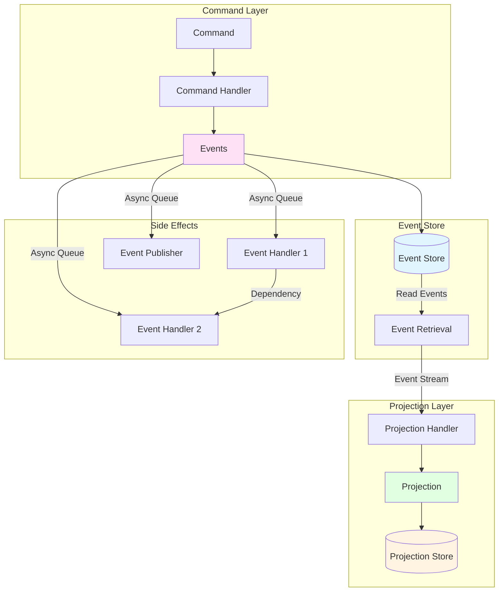
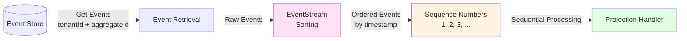
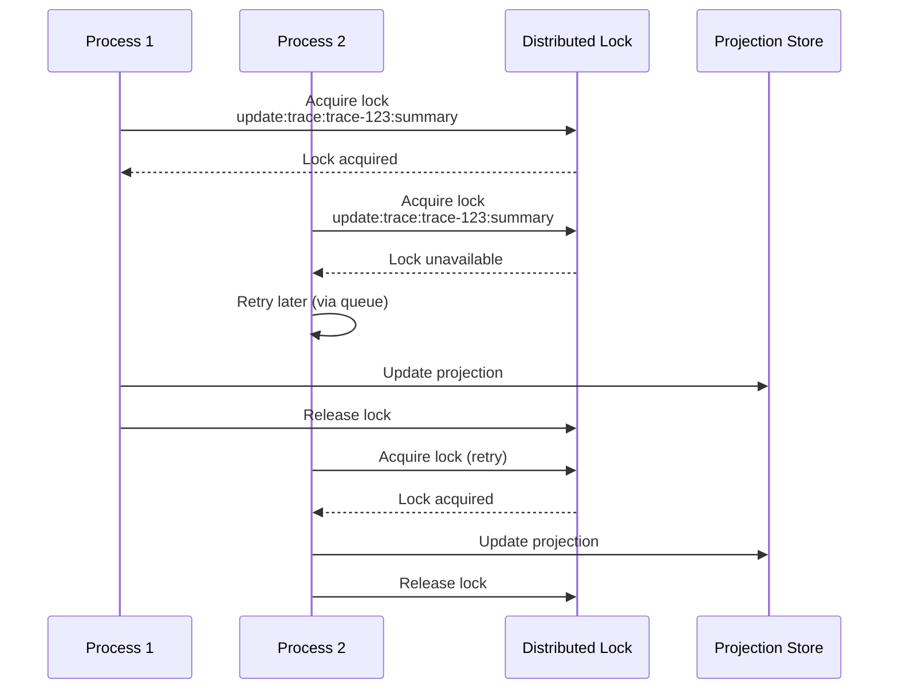
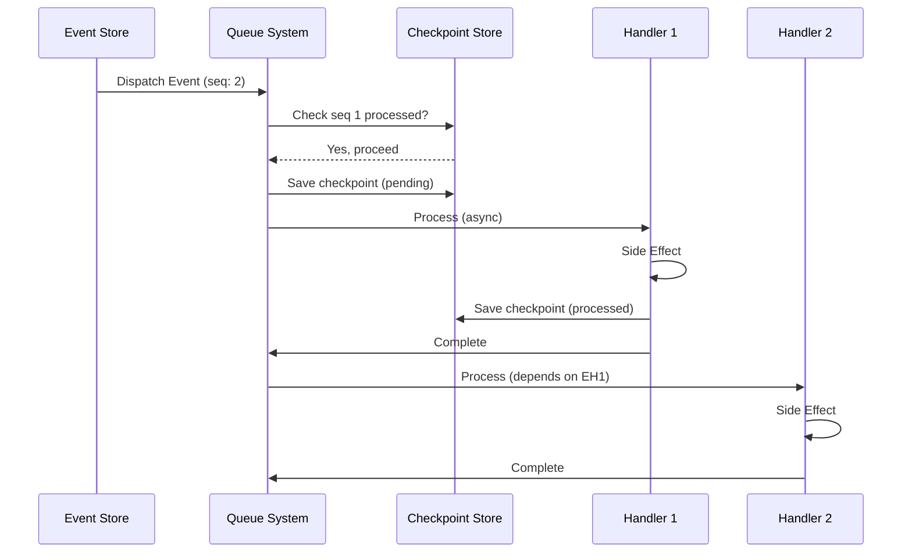
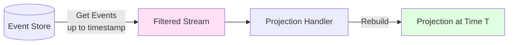
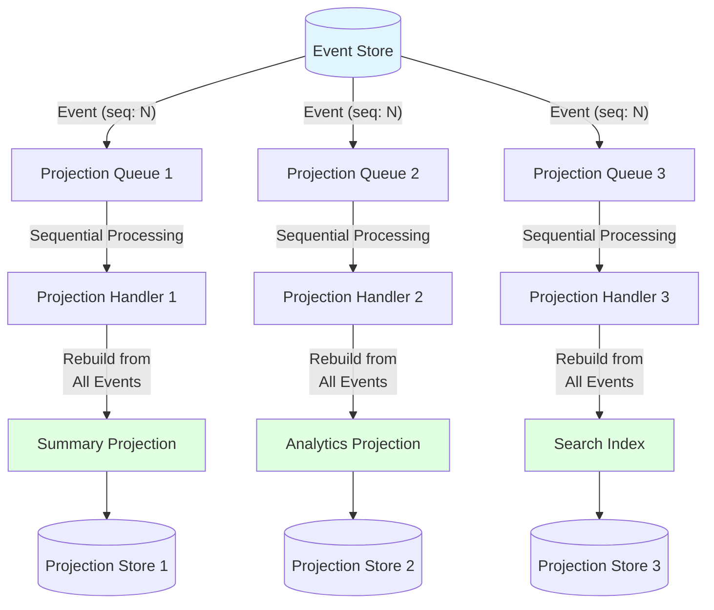
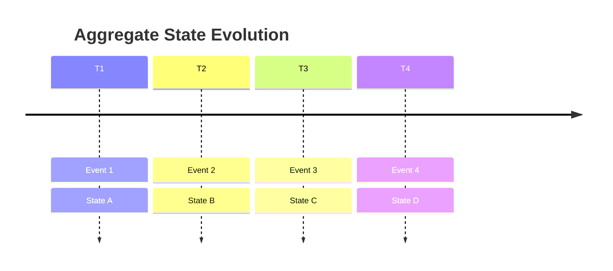
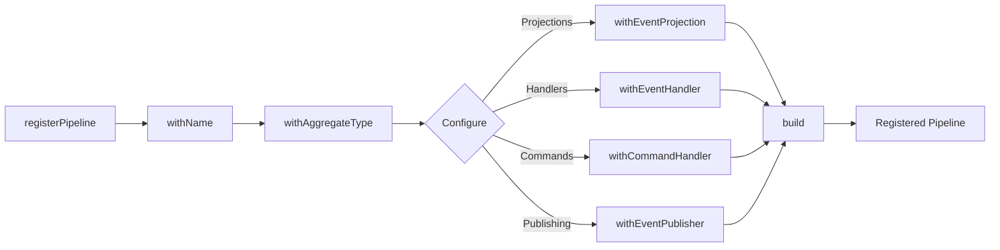

# Event Sourcing Library - Core Concepts & Architecture

A high-level overview of the event sourcing library's core concepts, architecture, and capabilities. For implementation details, see [README.md](./README.md).

## Core Philosophy

Event sourcing stores **immutable events** rather than mutable state. Current state is derived by replaying events through **projections** (computed views). This enables:

- **Time travel**: Rebuild state at any point in time
- **Debugging**: See exactly what happened and when
- **Multiple views**: Create different projections from the same events
- **Audit trail**: Complete history of all changes

## Core Concepts

### Events

Events are immutable facts that represent something that happened. They are the source of truth.

**Key properties:**

- `id`: Unique identifier
- `aggregateId`: The aggregate this event belongs to
- `tenantId`: Multi-tenant isolation
- `timestamp`: When it occurred
- `type`: Event type for routing
- `data`: Event-specific payload

See: [`domain/types.ts`](./domain/types.ts#L18-L33)

### Commands

Commands represent **intent** to perform an action. They are validated and processed by command handlers, which produce events.

**Flow:** Command → Command Handler → Events

See: [`commands/command.ts`](./commands/command.ts)

### Projections

Projections are **computed views** built by replaying events through projection handlers. They represent the current state of an aggregate from a specific perspective.

**Key properties:**

- Built from events (never directly modified)
- Can be rebuilt at any time
- Multiple projections can exist for the same aggregate
- Stored separately for fast queries

See: [`domain/types.ts`](./domain/types.ts#L39-L50)

### Event Handlers (Side Effects)

Event handlers react to individual events and perform side effects (e.g., writing to ClickHouse, triggering external processes). They process events asynchronously via queues.

See: [`domain/handlers/eventReactionHandler.ts`](./domain/handlers/eventReactionHandler.ts)

## Architecture Overview

**Key flow:**

1. Commands are sent and processed by command handlers
2. Command handlers produce events
3. Events are stored in the event store (immutable, append-only)
4. Events trigger side effects (handlers, publishing) asynchronously
5. Events are replayed through projection handlers to build projections
6. Projections are stored separately for fast queries

See: [`services/eventSourcingService.ts`](./services/eventSourcingService.ts#L145-L186) for the `storeEvents` implementation.

## Guaranteed Ordering & Consistency

### Event Ordering Within Aggregates

Events for the same aggregate are **guaranteed to be processed in order**. This is critical for maintaining consistency when building projections and processing side effects.

**How it works:**

1. **Event Storage**: Events are stored scoped to `tenantId + aggregateId + aggregateType`
2. **Event Retrieval**: The event store returns events for a specific aggregate, typically ordered by timestamp
3. **Sequence Numbers**: Each event is assigned a sequence number (1-indexed) based on its position in chronological order within the aggregate
4. **EventStream Ordering**: The `EventStream` class ensures events are always in chronological order before being passed to projection handlers
5. **Sequential Processing**: Handlers and projections enforce strict sequential processing - event N+1 cannot be processed until event N is processed

**Sequence Number Computation:**

Sequence numbers are computed using `countEventsBefore()` - the number of events that occurred before this event (by timestamp and ID), plus 1. This ensures:
- Events are numbered 1, 2, 3, ... in chronological order
- Sequence numbers are stable and deterministic
- Out-of-order processing is prevented

**Sequential Processing Enforcement:**

Before processing an event, the system:
1. Checks if the event was already processed (idempotency)
2. Verifies that the previous sequence number (N-1) was processed
3. Checks if any previous events failed (stops processing if so)
4. Only processes if all conditions are met

**Ordering strategies:**

- **`timestamp`** (default): Events sorted chronologically by `timestamp` field
- **`as-is`**: Preserves order from event store (use when DB pre-sorts)
- **Custom function**: Provide a comparator for custom sorting logic

**Tenant Isolation:**

- All event queries are scoped to `tenantId + aggregateId + aggregateType`
- Events from different tenants are never mixed, even if they share the same aggregateId
- The event store validates tenantId before any operations

See: [`streams/eventStream.ts`](./streams/eventStream.ts#L38-L68) for ordering implementation, [`services/eventSourcingService.ts`](./services/eventSourcingService.ts#L854-L867) for sequence number computation, and [`stores/eventStore.types.ts`](./stores/eventStore.types.ts#L11-L12) for concurrency guarantees.

### Concurrent Projection Updates

When multiple processes try to update the same projection simultaneously, **distributed locking** prevents race conditions and ensures consistency.

**Lock Scope:**

- Locks are scoped to: `aggregateType + aggregateId + projectionName`
- Each tenant's aggregates are isolated (tenantId is validated in context, and aggregateIds are unique per tenant)
- Only updates to the **same aggregate's projection** are serialized

**Why per-aggregate locking:**

- Different aggregates can be updated concurrently (no contention)
- Only updates to the **same aggregate's projection** are serialized
- This maximizes parallelism while ensuring consistency

**Note:** Without distributed locking in production, concurrent updates to the same aggregate projection may result in lost updates. See: [`services/eventSourcingService.ts`](./services/eventSourcingService.ts#L598-L608) for lock implementation.

## Side Effects: Event Handlers & Publishing

After events are stored, they trigger side effects through two mechanisms:

### Event Handlers

Event handlers process individual events asynchronously via queues. They can:

- Filter by event type
- Have dependencies on other handlers (executed in order)
- Be idempotent (via per-event checkpoints)
- Have concurrency limits
- Enforce sequential ordering per aggregate

**Per-Event Checkpointing:**

Each event is checkpointed individually with status tracking:
- **`pending`**: Event is queued but not yet processed
- **`processed`**: Event was successfully processed
- **`failed`**: Event processing failed

Checkpoints enable:
- **Idempotency**: Already processed events are automatically skipped
- **Sequential ordering**: Events are processed in sequence number order
- **Failure detection**: Failed events stop processing of subsequent events for that aggregate
- **Recovery**: Failed events can be identified and reprocessed

**Handler dependencies:** Handlers are topologically sorted to respect dependencies. See: [`services/eventSourcingService.ts`](./services/eventSourcingService.ts#L728-L843)

**Queue processing:** Handlers are dispatched to queues for async processing. See: [`services/eventSourcingService.ts`](./services/eventSourcingService.ts#L273-L310)

**Sequential ordering:** Events are processed in sequence number order per aggregate. See: [`services/eventSourcingService.ts`](./services/eventSourcingService.ts#L873-L1091) for `handleEvent` implementation.

### Event Publishing

Events can be published to external systems (message queues, event buses) after successful storage. Publishing failures are logged but don't fail event storage.

See: [`publishing/eventPublisher.types.ts`](./publishing/eventPublisher.types.ts) and [`services/eventSourcingService.ts`](./services/eventSourcingService.ts#L228-L251)

### Failure Handling

When an event fails processing (handler or projection), the system:

1. **Saves checkpoint as `failed`**: Records the failure with error message
2. **Stops processing subsequent events**: Events with higher sequence numbers for that aggregate will not be processed until the failure is resolved
3. **Enables recovery**: Failed events can be identified via `getFailedEvents()` and reprocessed after fixing the issue

**Failure Detection:**

Before processing an event, the system checks `hasFailedEvents()` for the aggregate. If any previous events failed, processing stops immediately to prevent cascading failures.

**Recovery Workflow:**

1. Identify failed events using `getFailedEvents()`
2. Fix the underlying issue (code bug, data issue, external dependency, etc.)
3. Clear checkpoints for failed events using `clearCheckpoint()`
4. Events will be reprocessed automatically via queue retries or manual replay

See: [`services/eventSourcingService.ts`](./services/eventSourcingService.ts#L962-L986) for failure detection and [`stores/eventHandlerCheckpointStore.types.ts`](./stores/eventHandlerCheckpointStore.types.ts) for checkpoint store interface.

## Time Travel & Debugging

One of the most powerful features of event sourcing is the ability to rebuild state at any point in time.

### Rebuilding Projections

Projections can be rebuilt by replaying events up to a specific timestamp:

**Implementation:** See [`services/eventSourcingService.ts`](./services/eventSourcingService.ts#L1013-L1020) for `replayEvents` (time travel support).

**Manual projection updates:** You can manually rebuild projections for debugging or recovery. See: [`services/eventSourcingService.ts`](./services/eventSourcingService.ts#L662-L818)

### Event Streams

Events are provided to projection handlers as **EventStream** objects, which:

- Guarantee chronological ordering (unless `as-is` ordering is used)
- Provide metadata (event count, first/last timestamps)
- Enable time-based filtering

See: [`streams/eventStream.ts`](./streams/eventStream.ts)

### Debugging Workflow

1. **Inspect events:** Query the event store for all events for an aggregate
2. **Rebuild at timestamp:** Use `replayEvents` to see state at a specific time
3. **Compare projections:** Rebuild projections at different timestamps to see state evolution
4. **Event timeline:** Use event timestamps and metadata to understand the sequence of changes

## Multiple Projections for Different Views

A single aggregate can have multiple projections, each providing a different view of the same events. Projections are processed asynchronously via queues, similar to event handlers.

**Key characteristics:**

- **Per-event triggering**: Each event triggers a projection rebuild for all projections
- **Full rebuild**: Projections rebuild from **all events** for the aggregate (not incremental)
- **Queue-based**: Each projection has its own queue processor for async processing
- **Sequential ordering**: Events are processed in sequence number order per aggregate
- **Per-event checkpoints**: Each event is checkpointed for each projection
- **Distributed locking**: Concurrent updates to the same aggregate projection are serialized

**Processing Flow:**

1. Event is stored in event store
2. Event is dispatched to each projection's queue
3. Queue processor processes event in sequence number order
4. Before processing, checks previous sequence number was processed
5. Rebuilds projection from all events for the aggregate
6. Saves checkpoint as `processed` on success, `failed` on failure

**Use cases:**

- **Summary view:** Fast, denormalized view for UI
- **Analytics view:** Aggregated metrics and statistics
- **Search index:** Full-text searchable representation
- **Reporting view:** Pre-computed reports

**Registration:** Multiple projections are registered via the pipeline builder. See: [`runtime/pipeline/builder.ts`](./runtime/pipeline/builder.ts#L303-L329)

**Access:** Each projection is accessed by name. See: [`services/eventSourcingService.ts`](./services/eventSourcingService.ts#L1671-L1713)

**Implementation:** See [`services/eventSourcingService.ts`](./services/eventSourcingService.ts#L1099-L1331) for `processProjectionEvent` and [`services/eventSourcingService.ts`](./services/eventSourcingService.ts#L320-L364) for projection queue initialization.

## Understanding State Over Time

Event sourcing makes it easy to understand how state evolved over time:

### Event Timeline

Events are stored with timestamps, creating a complete timeline:

### Projection Metadata

Projections include metadata about the events that produced them:

- `eventCount`: Number of events processed
- `firstEventTimestamp`: When the first event occurred
- `lastEventTimestamp`: When the last event occurred
- `computedAtUnixMs`: When the projection was computed

See: [`domain/types.ts`](./domain/types.ts#L55-L64)

### Simple View Models

Projections act as simple view models that:

- Hide event complexity behind a simple interface
- Can be queried efficiently (stored separately)
- Can be rebuilt if the projection logic changes
- Represent state at a point in time

**Example:** A trace projection might aggregate all span events into a simple `{ spans: [], metadata: {} }` structure, hiding the complexity of individual span events.

## Pipeline Registration

Pipelines are registered using a fluent builder pattern:

**Type safety:** The builder enforces required fields through TypeScript's type system. See: [`runtime/pipeline/builder.ts`](./runtime/pipeline/builder.ts#L195-L541)

## Key Implementation Files

- **Core types:** [`domain/types.ts`](./domain/types.ts)
- **Event streams:** [`streams/eventStream.ts`](./streams/eventStream.ts)
- **Main service:** [`services/eventSourcingService.ts`](./services/eventSourcingService.ts)
- **Pipeline builder:** [`runtime/pipeline/builder.ts`](./runtime/pipeline/builder.ts)
- **Command handling:** [`commands/commandHandlerClass.ts`](./commands/commandHandlerClass.ts)
- **Event handlers:** [`domain/handlers/eventReactionHandler.ts`](./domain/handlers/eventReactionHandler.ts)
- **Projection handlers:** [`domain/handlers/eventHandler.ts`](./domain/handlers/eventHandler.ts)
- **Distributed locking:** [`utils/distributedLock.ts`](./utils/distributedLock.ts)
- **Processor checkpoints:** [`stores/eventHandlerCheckpointStore.types.ts`](./stores/eventHandlerCheckpointStore.types.ts)

## Next Steps

- **Implementation guide:** See [README.md](./README.md) for code examples and patterns
- **Security & concurrency:** See the security guide for tenant isolation and distributed locking
- **Store interfaces:** See `stores/` directory for implementing custom stores
