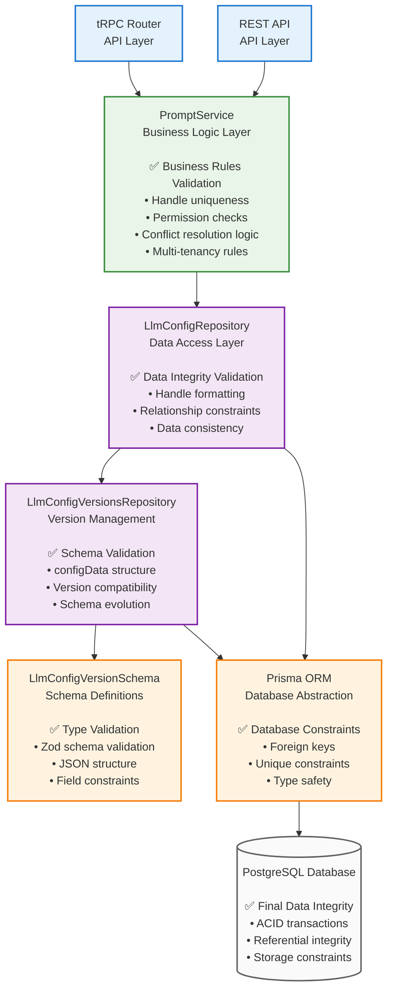
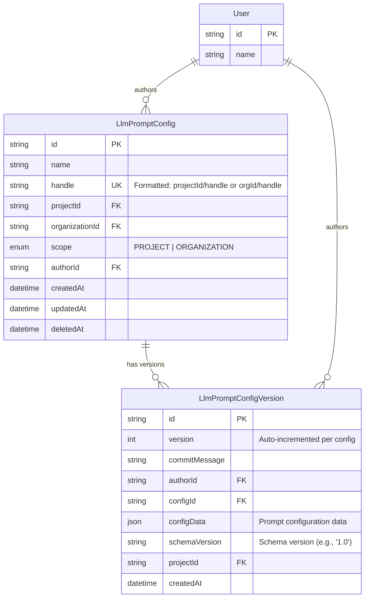
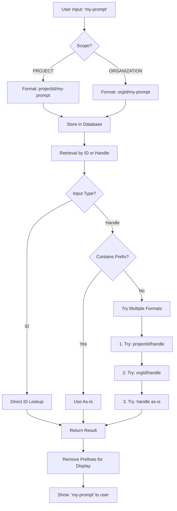
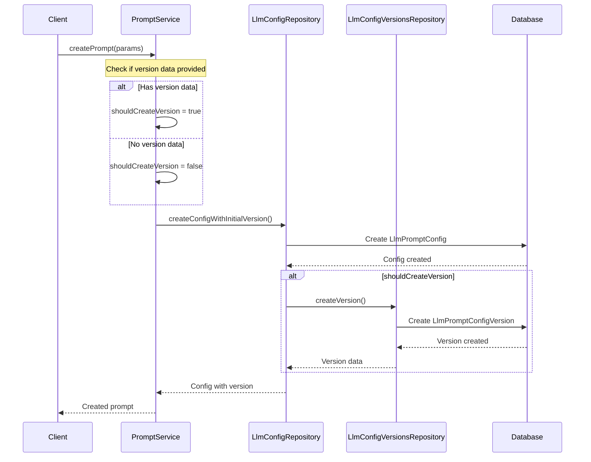
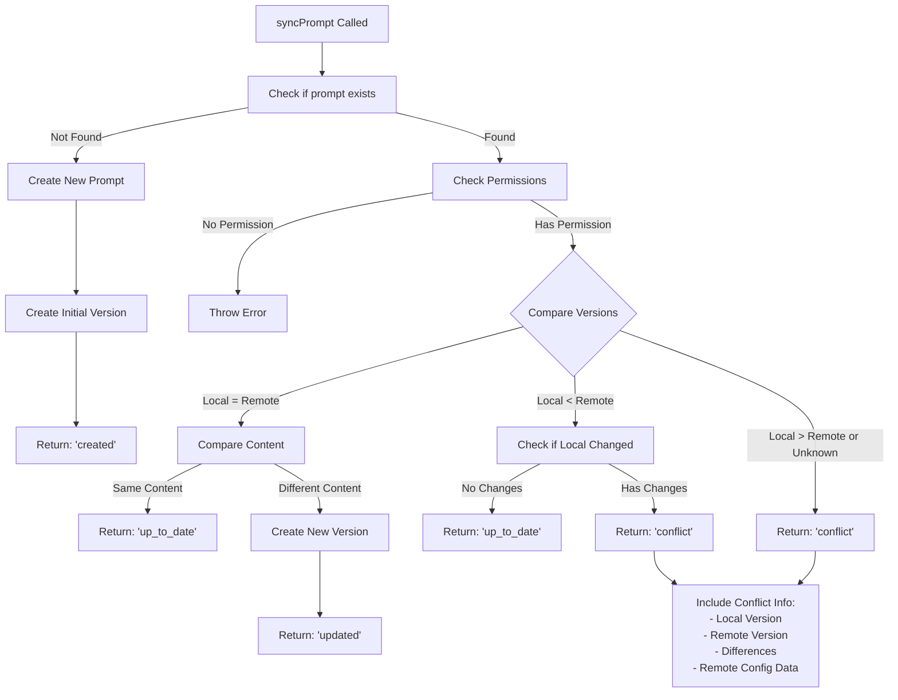

# Prompt Configuration System

This module provides a comprehensive system for managing LLM prompt configurations with versioning, multi-tenancy, and conflict resolution capabilities.

## Ideal Architecture & Validation Flow

This diagram shows the **ideal layered architecture** with clear separation of concerns and where different types of validation should occur:



## Validation Layers Explained

### 1. **API Layers**

#### **REST API** (Public-Facing)

- **Input Validation**: Strict request structure validation, API key authentication
- **Rate Limiting**: Public API quotas and throttling
- **Security**: Input sanitization, CORS, request size limits
- **Documentation**: OpenAPI/Swagger compliance
- **Backward Compatibility**: Versioned endpoints, stable contracts
- **Should NOT contain**: Business logic, internal implementation details

#### **tRPC Router** (Internal)

- **Input Validation**: Basic type checking (leverages TypeScript)
- **Session Authentication**: Internal user session validation
- **Lightweight**: Minimal overhead for internal operations
- **Type Safety**: End-to-end TypeScript type safety
- **Should NOT contain**: Business logic, but can have more flexible validation

### 2. **Business Logic Layer** (PromptService)

- **Business Rules**: Handle uniqueness, scope validation
- **Permission Logic**: Multi-tenant access control
- **Workflow Validation**: Conflict resolution rules
- **Cross-entity Logic**: Complex business constraints

### 3. **Data Access Layer** (Repositories)

- **Data Integrity**: Handle formatting, relationship validation
- **Transaction Management**: Ensuring atomic operations
- **Query Optimization**: Efficient data retrieval

### 4. **Schema Validation Layer** (LlmConfigVersionSchema)

- **Structure Validation**: JSON schema compliance
- **Type Safety**: Zod-based validation
- **Version Compatibility**: Schema evolution support

### 5. **Database Layer** (Prisma + PostgreSQL)

- **Final Constraints**: Foreign keys, unique constraints
- **ACID Properties**: Transaction isolation
- **Data Persistence**: Storage integrity

## Current State vs Ideal Architecture

### ❌ **Current Issues Found**

1. **tRPC Router Bypasses Service Layer**

   ```typescript
   // ❌ WRONG: Direct repository usage in tRPC
   const repository = new LlmConfigRepository(ctx.prisma);
   return await repository.getAllWithLatestVersion({...});
   ```

2. **Inconsistent API Patterns**

   - REST API ✅ Uses PromptService correctly
   - tRPC Router ❌ Bypasses PromptService, uses repositories directly

3. **Business Logic in Wrong Layer**

   - Permission checks mixed with data access
   - Organization ID resolution in router layer

4. **Type Inconsistencies**
   ```typescript
   // ❌ WRONG: Type mismatch in PromptService
   messages?: CreateLlmConfigVersionParams  // Should be Message[]
   ```

### ✅ **What This Architecture Should Provide**

#### **Separation of Concerns**

- Each layer has a single, well-defined responsibility
- Changes in one layer don't cascade to others
- Easy to test individual components

#### **Validation at the Right Level**

- Business rules in the service layer
- Data structure validation in schema layer
- Database constraints as final safety net

#### **Reusability**

- PromptService can be used by both tRPC and REST APIs
- Repositories can be used across different services
- Schema validation is centralized and consistent

#### **Maintainability**

- Clear boundaries make debugging easier
- New features follow established patterns
- Refactoring is safer with clear interfaces

## Required Fixes

### 1. **Fix tRPC Router** - Make it use PromptService

```typescript
// ✅ CORRECT: Use PromptService in tRPC
const promptService = new PromptService(ctx.prisma);
return await promptService.getAllPrompts({
  projectId: input.projectId,
  organizationId: await promptService.getOrganizationId(input.projectId),
});
```

### 2. **Fix PromptService Types**

```typescript
// ✅ CORRECT: Fix message type
messages?: z.infer<typeof messageSchema>[]  // Not CreateLlmConfigVersionParams
```

### 3. **Move Business Logic to Service**

- Organization ID resolution should be in PromptService
- Permission logic should be centralized
- Both APIs should use identical business logic

## Database Schema



## Handle Resolution System

The system uses a sophisticated handle resolution mechanism to support multi-tenancy:



## Key Operations Flow

### 1. Create Prompt Flow



### 2. Sync/Conflict Resolution Flow



## Schema Versioning

The system supports schema evolution through versioned configuration schemas:

```mermaid
graph LR
    subgraph "Schema V1.0"
        A[configData Structure:<br/>- prompt: string<br/>- messages: Message[]<br/>- inputs: Input[]<br/>- outputs: Output[]<br/>- model: string<br/>- temperature?: number<br/>- max_tokens?: number<br/>- prompting_technique?: object]
    end

    subgraph "Validation Flow"
        B[getSchemaValidator] --> C[Validate configData]
        C --> D[Parse & Transform]
    end

    subgraph "Future Versions"
        E[Schema V2.0<br/>Future enhancements]
    end

    A --> B
    D --> F[Store in Database]
    A -.-> E
```

## Configuration Data Structure

```mermaid
graph TB
    subgraph "LlmPromptConfigVersion.configData"
        CD[configData: JsonValue]

        subgraph "Schema V1.0 Structure"
            P[prompt: string]
            M[messages: Message[]]
            I[inputs: Input[]]
            O[outputs: Output[]]
            MOD[model: string]
            T[temperature?: number]
            MT[max_tokens?: number]
            PT[prompting_technique?: object]
        end

        CD --> P
        CD --> M
        CD --> I
        CD --> O
        CD --> MOD
        CD --> T
        CD --> MT
        CD --> PT
    end

    subgraph "Input Types"
        IT[type: 'str' | 'float' | 'bool' | 'image' | 'list[str]' | etc.]
        II[identifier: string]
    end

    subgraph "Output Types"
        OT[type: 'str' | 'float' | 'bool' | 'json_schema']
        OI[identifier: string]
        JS[json_schema?: object]
    end

    I --> IT
    I --> II
    O --> OT
    O --> OI
    O --> JS
```

## Key Components

### PromptService

- **Purpose**: Business logic layer for prompt operations
- **Responsibilities**:
  - Handle formatting and resolution
  - Prompt CRUD operations
  - Sync and conflict resolution
  - Handle uniqueness validation

### LlmConfigRepository

- **Purpose**: Data access layer for prompt configurations
- **Responsibilities**:
  - Config CRUD operations
  - Handle creation and resolution
  - Permission checking
  - Content comparison

### LlmConfigVersionsRepository

- **Purpose**: Data access layer for prompt versions
- **Responsibilities**:
  - Version CRUD operations
  - Version validation
  - Version history management

### Schema Validation

- **Purpose**: Ensure data integrity across schema versions
- **Features**:
  - Versioned schemas (currently V1.0)
  - Zod-based validation
  - Schema evolution support

## Multi-Tenancy Support

The system supports both project-scoped and organization-scoped prompts:

- **PROJECT scope**: `{projectId}/{handle}` - Accessible within the project
- **ORGANIZATION scope**: `{organizationId}/{handle}` - Accessible across the organization

## Error Handling

- **NotFoundError**: When prompts or versions don't exist
- **Permission Errors**: When users lack modify permissions
- **Validation Errors**: When schema validation fails
- **Conflict Resolution**: Structured conflict information for sync operations

## Usage Examples

### Creating a Prompt

```typescript
const prompt = await promptService.createPrompt({
  projectId: "proj_123",
  organizationId: "org_456",
  handle: "my-prompt",
  scope: "PROJECT",
  authorId: "user_789",
  prompt: "Hello {{name}}!",
  inputs: [{ identifier: "name", type: "str" }],
  outputs: [{ identifier: "response", type: "str" }],
  model: "gpt-4",
});
```

### Syncing a Prompt

```typescript
const result = await promptService.syncPrompt({
  idOrHandle: "my-prompt",
  localConfigData: {
    /* config data */
  },
  localVersion: 1,
  projectId: "proj_123",
  organizationId: "org_456",
  authorId: "user_789",
  commitMessage: "Updated prompt",
});

// Handle different outcomes
switch (result.action) {
  case "created": // New prompt created
  case "updated": // Prompt updated
  case "up_to_date": // No changes needed
  case "conflict": // Manual resolution required
}
```

## Development Notes

- All prompts must have at least one version
- Handles are automatically prefixed with project/organization IDs
- Schema validation ensures data integrity
- Conflict resolution provides detailed diff information
- Permissions are checked for all modify operations
