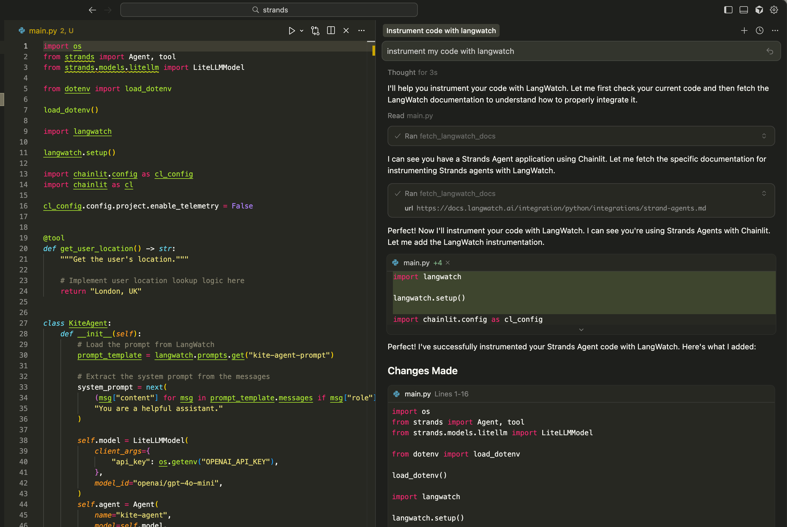

# LangWatch 🏰 MCP Server

The LangWatch MCP Server makes your AI coding assistant an expert in both [LangWatch](https://docs.langwatch.ai/), for automatically instrumenting your code, managing versioned prompts and creating evaluations; and [Scenario](https://scenario.langwatch.ai/), for automatically testing your agents via simulations.

## Setup in your Coding Assistant 👩‍💻

1. Open Cursor/Claude Code/your editor Settings
2. Navigate to the MCP settings
3. Set the "name" as "LangWatch"
4. Add the LangWatch MCP:

```json
{
  "mcpServers": {
    "langwatch": {
      "command": "npx",
      "args": ["-y", "@langwatch/mcp-server"]
    }
  }
}
```

## Tools

The MCP Server provides the following tools:

### `fetch_langwatch_docs`

- **Description:** Fetches the LangWatch docs for understanding how to implement LangWatch in your codebase.
- **Parameters:**
  - `url`: (Optional) The full url of the specific doc page. If not provided, the docs index will be fetched.

### `fetch_scenario_docs`

- **Description:** Fetches Scenario docs for understanding how to write agent simulations to test the agents on your codebase.
- **Parameters:**
  - `url`: (Optional) The full url of the specific doc page. If not provided, the docs index will be fetched.

## Example Usage

Ask your coding assistant to instrument your code:

> "Can you instrument my LLM code with LangWatch"

Or ask it to write a scenario test:

> "Can you implement a scenario test for my agent?"



## 🛟 Support

If you have questions or need help, join our community:

- [Discord Community](https://discord.gg/kT4PhDS2gH)
- [LangWatch Docs](https://docs.langwatch.ai/)
- [Email Support](mailto:support@langwatch.ai)
