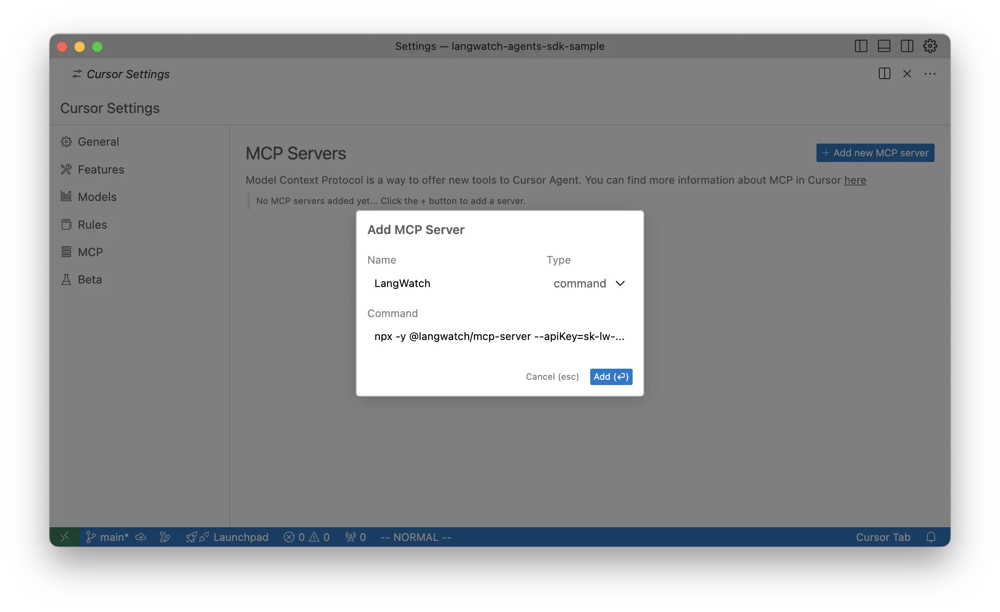

# LangWatch 🏰 MCP Server

The LangWatch MCP Server is a tool designed to aid finding, searching, and looking up Traces from the LangWatch platform via the [Model Context Protocol](https://modelcontextprotocol.io/introduction).

This server facilitates communication with LangWatch's API, allowing you to retrieve and manage LLM traces.

## Setup in Cursor 👩‍💻

1. Navigate to the Cursor Settings
2. Navigate to the MCP item in the sidebar
3. Set the "name" as "LangWatch MCP"
4. Set the "type" to `command`
5. Set the "command" to `npx -y @langwatch/mcp-server --apiKey=ey....`
	- You **must** use `=` to join the command with the value!

- `--apiKey`: Your LangWatch API key. This is mandatory and must be provided.
- `--endpoint`: *Optional* The endpoint for the LangWatch API. Defaults to `https://app.langwatch.ai` if not specified.

> [!TIP]
> To aid in securing your keys, the MCP will first look at the global system environment variables `LANGWATCH_API_KEY` and `LANGWATCH_ENDPOINT` to check if they have values as well as looking at arguments passed into the server on start.

<picture>
<source media="(prefers-color-scheme: dark)" srcset="../assets/mcp-server/cursor-setup.dark.webp">
<source media="(prefers-color-scheme: light)" srcset="../assets/mcp-server/cursor-setup.light.webp">

</picture>

## Tools

The MCP Server provides the following tools:

### `get_latest_traces`

- **Description:** Retrieves the latest LLM traces.
- **Parameters:**
  - `pageOffset` (optional): The page offset for pagination.
  - `daysBackToSearch` (optional): The number of days back to search for traces. Defaults to 1.

### `get_trace_by_id`

- **Description:** Retrieves a specific LLM trace by its ID.
- **Parameters:**
  - `id`: The ID of the trace to retrieve.

## Usage in Cursor

To use these tools within Cursor, follow these steps:

1. **Open the Cursor Chat view:**
    - `Cmd + I`

2. **Ensure the MCP server is running:**

3. **Interact with your Agent:**
    - Ask a question like the following to test the tools are accessible: *Note: When the tool is detected, you'll need to run `Run tool` in the chat view for it to be called.

> "I just ran into an issue while debugging, show me the latest traces from the last 30 days"

<picture>
<source media="(prefers-color-scheme: dark)" srcset="../assets/mcp-server/cursor-example.dark.webp">
<source media="(prefers-color-scheme: light)" srcset="../assets/mcp-server/cursor-example.light.webp">

</picture>

## 🛟 Support

If you have questions or need help, join our community:

- [Discord Community](https://discord.gg/kT4PhDS2gH)
- [Email Support](mailto:support@langwatch.ai)
