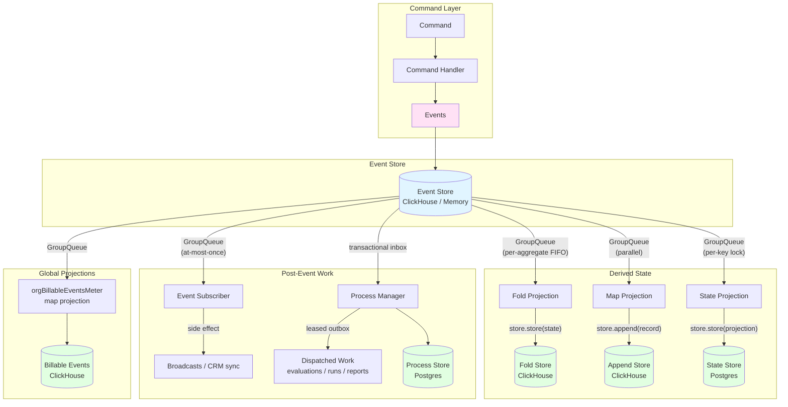

# Event Sourcing - Architecture

A high-level overview of the event sourcing system's core concepts, architecture, and design decisions. For implementation details and code patterns, see [README.md](./README.md).

## Core Philosophy

Event sourcing stores **immutable events** rather than mutable state. Current state is derived by applying events through **projections** (computed views). This enables:

- **Audit trail**: Complete history of all changes
- **Multiple views**: Different projections from the same events
- **Debugging**: See exactly what happened and when
- **Decoupled side effects**: Projections and post-event handlers fan out independently

## Core Concepts

### Events

Events are immutable facts representing something that happened. They are the source of truth.

**Key properties:**

- `id`: Unique identifier
- `aggregateId`: The aggregate this event belongs to
- `tenantId`: Multi-tenant isolation
- `timestamp`: When it occurred
- `type`: Event type string for routing
- `data`: Event-specific payload

See: [`domain/types.ts`](./domain/types.ts)

### Commands

Commands represent **intent** to perform an action. Command handlers validate the intent and produce events.

**Flow:** Command --> Command Handler --> Events --> Event Store --> Projections + Subscribers + Process Managers

The id of anything a command creates is **derived from the work's natural key**, never minted per attempt (ADR-081). That is what makes two deliveries of one unit of work collapse in the event log rather than duplicate.

See: [`commands/command.ts`](./commands/command.ts)

### The Five Substrates

Everything a pipeline registers is one of five things. Three of them derive state, two of them do work.

#### Fold Projection (stateful, ordered)

Reduces a stream of events into accumulated state for a single aggregate. Processes events in FIFO order per aggregate via **GroupQueue**.

**Lifecycle:**

1. `store.get(aggregateId)` -- load current state (or `init()` if none exists)
2. `apply(state, event)` -- pure function producing new state
3. `store.store(state)` -- persist updated state

The fold state is the implicit checkpoint. If a fold fails at step 3, the event will be retried. No separate checkpoint store is needed because the persisted state tells the system exactly where it left off.

A store that reads its own committed rows back carries a `projectionVersion` and reports an older stamp as a miss, so rows written before a column existed are rebuilt once rather than decoding their defaults into permanently wrong state (ADR-066).

See: [`projections/foldProjection.types.ts`](./projections/foldProjection.types.ts), [`projections/foldProjectionExecutor.ts`](./projections/foldProjectionExecutor.ts)

#### Map Projection (stateless, parallel)

Transforms individual events into records and appends them to a store. Stateless -- each event is processed independently with no ordering guarantees. Dispatched through the global **GroupQueue**.

**Lifecycle:**

1. `map(event)` -- pure function producing a record (or `null` to skip)
2. `store.append(record)` -- append to storage

See: [`projections/mapProjection.types.ts`](./projections/mapProjection.types.ts), [`projections/mapProjectionExecutor.ts`](./projections/mapProjectionExecutor.ts)

#### State Projection (operational, direct)

The default projection registered by `.withProjection()`. Mechanically a fold, but with a deliberately narrower contract than a ClickHouse fold: one direct `load` / `apply` / `store` cycle under the queue's per-key lock, no event-log recovery read, no Redis cache hook, no attached outbox. Its stored row carries an event cursor (`acceptedAt` + `eventId`) so a replay is deterministic. Every adopter is Postgres.

See: [`projections/stateProjection.types.ts`](./projections/stateProjection.types.ts), [`projections/stateProjectionExecutor.ts`](./projections/stateProjectionExecutor.ts)

#### Event Subscriber (live, at-most-once)

A live consumer of an event that has already been committed to the log. It receives the event and nothing else -- `EventSubscriberContext` is `tenantId` + `aggregateId` -- and is dispatched from the routing seam, independent of any projection. Subscribers are never invoked by replay, so nothing a subscriber does is reconstructible; they must make their own handling idempotent.

Delivery is **at-most-once unless the handler raises**. The routing path has no retry: `ProjectionRouter.dispatch` logs a fan-out failure and continues, so a projection fault cannot fail an already-committed write, and nothing re-dispatches afterwards. A handler that rethrows hands the job back to GroupQueue while it is still in flight; a handler that swallows has dropped the work.

`options.enqueue` is the ADR-069 seam evaluated *before* a job is staged: `filter` declines an event outright (the cheapest job is the one that never exists) and `stage` swaps the payload for a small claim-check reference. Both run on the no-retry path, so both must be total.

See: [`subscribers/eventSubscriber.types.ts`](./subscribers/eventSubscriber.types.ts)

#### Process Manager (durable, at-least-once)

The durable substrate: a transactional inbox that dedups redelivery, persisted per-instance state, `nextWakeAt` deadlines, and a leased outbox that retries an intent up to the process's own `maxAttempts`. It is what work that costs money or must happen rides on, and what "later rather than now" is expressed with.

The runtime owns the manager, the shared process outbox and the wake workers; a pipeline declares the topology and the ProcessRuntime supplies the machinery.

See: [`process-manager/`](./process-manager/), ADR-052, ADR-073

### Choosing between them

ADR-075 decides it with one question -- *if this work is lost, does anything need to be able to tell?*

| If the work... | Substrate | Guarantee |
| --- | --- | --- |
| pushes to whoever is connected right now | **subscriber** | at-most-once; a lost push is invisible by the next refetch |
| calls a third party where loss is acceptable by contract | **subscriber** | debounced, no durable trace |
| produces state someone later reads as fact | **projection** | rebuilt by replay from the event log |
| dispatches work that costs money or must happen | **process manager** | leased outbox, retried to `maxAttempts` |
| happens *later* rather than *now* | **process manager** | `nextWakeAt`, a durable deadline |

Derived state must go through a projection rather than a handler beside one. A handler is not replayed, so any divergence between it and the event log is permanent.

## Architecture Overview

**Key flow:**

1. Commands are sent and processed by command handlers
2. Command handlers produce events
3. Events are stored in the event store (immutable, append-only)
4. The projection router fans each event out to fold projections (ordered per aggregate), map projections (parallel), state projections (per-key lock), event subscribers, and any process manager whose inbox accepts it
5. Fold and state projections reduce events into accumulated state; map projections append per-event rows
6. Subscribers perform at-most-once side effects; process managers commit an intent to their leased outbox and arm any deadline
7. Replay rebuilds every projection from the log. It never invokes a subscriber and never re-dispatches an outbox

## Queue System

Every projection and every subscriber dispatches through the in-house **GroupQueue**: per-aggregate FIFO + cross-aggregate parallelism on Redis primitives + Lua. Not BullMQ. The framework wires one GroupQueue per pipeline at the composition root.

The summary:

- **GroupQueue (for folds)** — fold projections need per-aggregate FIFO. The `groupKey` is the aggregate id; events for the same aggregate process in order, different aggregates parallelise.
- **GroupQueue (for maps + subscribers)** — same queue infrastructure, different group keys. No per-aggregate ordering; just dedup + retries + tiered storage.
- **Process managers** — the queue carries the inbox delivery, but the durability lives in Postgres: the transactional inbox, the instance state and the leased outbox, drained by the ProcessRuntime's own workers.
- **Memory Queue (for testing / no Redis)** — when Redis is unavailable (local dev, fast unit tests), the framework drops to an in-process queue ([`queues/memory.ts`](./queues/memory.ts)) that processes jobs asynchronously with simple concurrency control. Not a tier of GroupQueue — entirely separate code path with no Lua, no Redis, no tiered storage.

GroupQueue has its own deep-dive docs:

- **[`queues/groupQueue/ARCHITECTURE.md`](./queues/groupQueue/ARCHITECTURE.md)** — staging Lua, dispatcher loop, the tiered envelope (inline → Redis blob → S3), renewable blob leases, retries, dedup, pause/resume, tenant isolation, failure handling.
- **[`queues/groupQueue/README.md`](./queues/groupQueue/README.md)** — when to use it, configuration knobs, process roles, caveats, testing, observability.

The tiered storage in one line: a payload's serialized size picks where it lives at encode time — inline JSON (≤ 1 KiB) → inline gzip (1–4 KiB) → standalone Redis key (4–256 KiB) → object store / S3 (> 256 KiB, ≤ 50 MiB). Identical bytes collapse to one stored blob via content addressing, protected by per-holder expiring leases and reclaimed lazily.

## Process Roles

Three roles run the event-sourcing runtime, configured via the `processRole` option. What matters is not the name but whether the role runs the worker stack — `roleRunsWorkers(role)` ([`app-layer/config.ts`](../app-layer/config.ts)) is the single test, and code must never compare `processRole === "worker"` directly.

- **`web`**: Dispatches commands and stages events. The dispatcher loop and local processor are NOT started, so the web process can create events and stage queue jobs but never processes them.
- **`worker`**: Stages AND dispatches — runs the BRPOP signal loop, the local concurrency processor, the process-manager outbox and wake workers, and the metrics collector for every registered queue.
- **`all`**: The dev-only single-process mode (`WORKERS_IN_PROCESS=1`), where the web server also hosts the worker stack. Never used in production, which always runs web and worker as separate deployments.

This separation allows horizontal scaling — multiple web instances stage work while dedicated worker instances process it. `roleRunsWorkers` wires to GroupQueue's `consumerEnabled` option at construction time.

## No Checkpoints Needed

Unlike traditional event sourcing systems that use checkpoint stores to track processing progress, this system does not need them:

- **GroupQueue provides ordering**: per-aggregate FIFO is enforced inside the staging Lua — events for the same aggregate are dispatched in stage-order without a sequence-number tracker.
- **Fold state is the implicit checkpoint**: the last persisted fold state tells the system where it is. If processing fails, the queue retries the event with backoff (in front of the same group, preserving FIFO) and the fold re-applies from current state.
- **Map projections are stateless**: each event is independently appended — no position tracking needed.
- **State projections carry their own cursor**: the stored row holds `acceptedAt` + `eventId`, so the projection knows its own position without an external tracker.
- **Process managers checkpoint transactionally**: the inbox records what it has consumed in the same transaction that advances the instance state, so a redelivery is recognised rather than reapplied.

## Global Projection Registry

The system registers **global projections** that span all pipelines. They are registered on a virtual `global` pipeline and receive events from every pipeline. Today that is `orgBillableEventsMeter`, an org-scoped **map** projection that records each billable event to ClickHouse for deduplicated counting — deduplicated on the event's `idempotencyKey`, falling back to its id.

See: [`projections/global/`](./projections/global/), [`projections/projectionRegistry.ts`](./projections/projectionRegistry.ts) for the registry.

## Tenant Isolation

All operations are scoped to `tenantId`. Events, projections, and stores enforce tenant isolation:

- All event queries are scoped to `tenantId + aggregateId + aggregateType`
- The event store validates `tenantId` before any operations
- Events from different tenants are never mixed

## Failure Handling

- **Fold failures**: GroupQueue retries the job with exponential backoff in front of the same group (FIFO is preserved). On retry, the fold loads current state and re-applies the event. If state was already stored, the fold is effectively idempotent.
- **Map failures**: GroupQueue retries the job. Append stores should be idempotent or tolerate duplicates.
- **State projection failures**: GroupQueue retries the job; the stored cursor makes a re-applied event recognisable.
- **Subscriber failures**: a raised error hands the job back to GroupQueue for redelivery. A swallowed one is permanent loss — nothing re-dispatches subscriber fan-out, and replay does not run subscribers.
- **Fan-out failures**: `ProjectionRouter.dispatch` catches per event and reports an `AggregateError`, so one failing component cannot fail an already-committed write or starve the others in the batch.
- **Process manager failures**: the outbox re-leases the intent and retries to `maxAttempts`; the instance state and the deadline survive the worker that was holding them.
- **Transient blob-store failures** (offloaded body temporarily unreachable — network blip, 5xx): GroupQueue re-stages the SAME envelope without re-encoding, so the body stays referenced through the retry. Distinguished from "missing" so a transient store outage can't mass-drop every in-flight offloaded job.
- **Genuinely missing offloaded body** (TTL backstop kicked in, or manual purge): decode returns null, the slot is completed, the work recovers via event replay. The append-only event log is the durable source of truth.

## Key Implementation Files

| Component | Path |
|-----------|------|
| Core types | [`domain/types.ts`](./domain/types.ts) |
| Commands | [`commands/command.ts`](./commands/command.ts), [`commands/commandHandlerClass.ts`](./commands/commandHandlerClass.ts) |
| Command bus (cross-pipeline dispatch) | [`commands/commandBus.ts`](./commands/commandBus.ts) |
| Static builder | [`pipeline/staticBuilder.ts`](./pipeline/staticBuilder.ts) |
| Process-manager builder | [`pipeline/processBuilder.ts`](./pipeline/processBuilder.ts) |
| Central class | [`eventSourcing.ts`](./eventSourcing.ts) |
| Composition root | [`pipelineRegistry.ts`](./pipelineRegistry.ts) |
| Service | [`services/eventSourcingService.ts`](./services/eventSourcingService.ts) |
| Fold executor | [`projections/foldProjectionExecutor.ts`](./projections/foldProjectionExecutor.ts) |
| Map executor | [`projections/mapProjectionExecutor.ts`](./projections/mapProjectionExecutor.ts) |
| State executor | [`projections/stateProjectionExecutor.ts`](./projections/stateProjectionExecutor.ts) |
| Projection router | [`projections/projectionRouter.ts`](./projections/projectionRouter.ts) |
| Subscriber types | [`subscribers/eventSubscriber.types.ts`](./subscribers/eventSubscriber.types.ts) |
| Process runtime | [`process-manager/processRuntime.ts`](./process-manager/processRuntime.ts) |
| Replay service | [`replay/replayService.ts`](./replay/replayService.ts) |
| GroupQueue (deep dive) | [`queues/groupQueue/ARCHITECTURE.md`](./queues/groupQueue/ARCHITECTURE.md) + [`queues/groupQueue/README.md`](./queues/groupQueue/README.md) |
| GroupQueue (main class) | [`queues/groupQueue/groupQueue.ts`](./queues/groupQueue/groupQueue.ts) |
| Event store (interface) | [`stores/eventStore.types.ts`](./stores/eventStore.types.ts) |
| Event store (ClickHouse) | [`stores/eventStoreClickHouse.ts`](./stores/eventStoreClickHouse.ts) |
| Event store (Memory) | [`stores/eventStoreMemory.ts`](./stores/eventStoreMemory.ts) |
| Utilities | [`utils/event.utils.ts`](./utils/event.utils.ts) |

## Related ADRs

- [ADR-066](../../../../dev/docs/adr/066-projection-clickhouse-cached-store.md) — fold read-back and the projection version gate
- [ADR-069](../../../../dev/docs/adr/069-payload-cost-doctrine.md) — the enqueue seam: filter and claim-check staging
- [ADR-075](../../../../dev/docs/adr/075-post-event-work-subscribers-and-process-managers.md) — which substrate for which job
- [ADR-081](../../../../dev/docs/adr/081-the-unit-of-dispatched-work.md) — derived identity for dispatched work
- [ADR-082](../../../../dev/docs/adr/082-pipelines-own-their-composition.md) — pipelines own their composition; the command bus

## Next Steps

- **Implementation guide:** See [README.md](./README.md) for code examples and patterns
- **Pipeline implementations:** See [`pipelines/`](./pipelines/) for the 14 active pipelines
