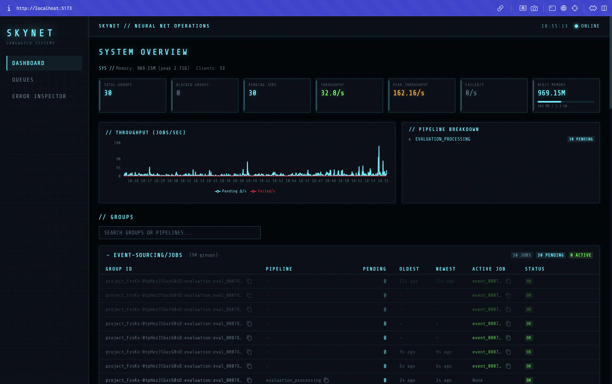

# Skynet

Real-time BullMQ queue monitoring dashboard for LangWatch.



## Features

- **Live Dashboard** — SSE-powered real-time view of all group queues, pipeline breakdowns, and throughput metrics
- **Group Queue Inspector** — Drill into individual groups to see staged jobs, active jobs, and blocked state
- **Completed Job Viewer** — View recently completed BullMQ jobs for finished groups
- **Failed Jobs Manager** — Browse, retry, and remove failed jobs across all queues
- **BullMQ Queue Browser** — Inspect jobs by state (waiting, active, completed, failed, delayed) per queue
- **Pipeline Tree** — Visual breakdown of job pipelines with filtering
- **Actions** — Unblock groups, drain groups, retry/remove jobs in bulk

## Quick Start

```bash
cp .env.example .env
# Edit .env with your Redis connection string

pnpm install
pnpm dev
```

The dashboard will be available at `http://localhost:6380`.

## Environment Variables

| Variable | Default | Description |
|----------|---------|-------------|
| `REDIS_URL` | `redis://127.0.0.1:6379` | Redis connection string |
| `SKYNET_USERNAME` | — | Basic auth username (optional, no auth if unset) |
| `SKYNET_PASSWORD` | — | Basic auth password (optional, no auth if unset) |
| `SKYNET_SKIP_AUTH` | — | Set to `1` to disable auth for local development |
| `BULLBOARD_PORT` | `6380` | Server port |

## Architecture

```
src/
├── client/          # React + Chakra UI frontend (Vite)
│   ├── components/  # UI components (dashboard, groups, jobs, errors)
│   ├── hooks/       # React hooks (SSE, data fetching, state)
│   ├── pages/       # Route pages
│   └── utils/       # Helpers (timeAgo, etc.)
├── server/          # Express backend
│   ├── middleware/   # Auth
│   ├── routes/      # API endpoints (SSE, groups, jobs, actions, bullmq)
│   ├── services/    # Redis scanning, metrics collection, BullMQ operations
│   └── sse/         # SSE connection management
└── shared/          # Types and constants shared between client/server
```

## Scripts

| Command | Description |
|---------|-------------|
| `pnpm dev` | Start dev server (client + server with hot reload) |
| `pnpm build` | Build for production |
| `pnpm start` | Start production server |
| `pnpm check` | TypeScript type check |
