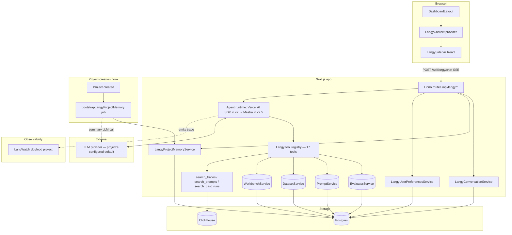
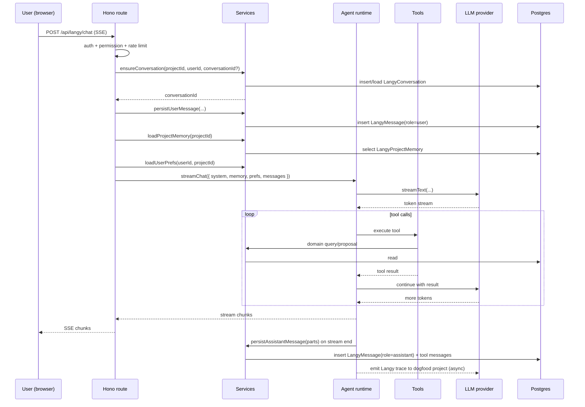
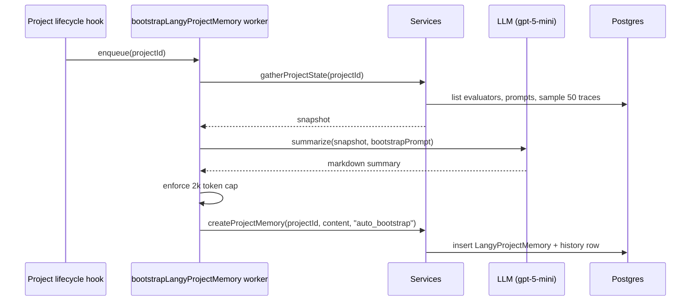
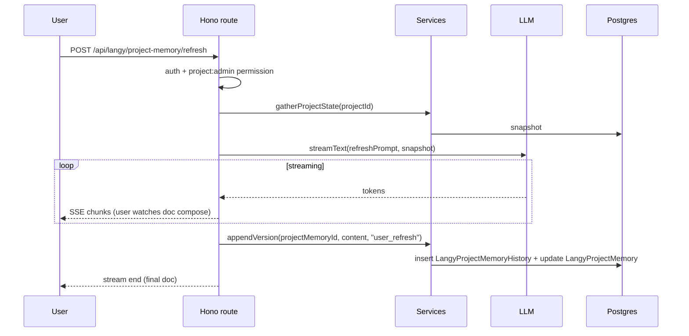
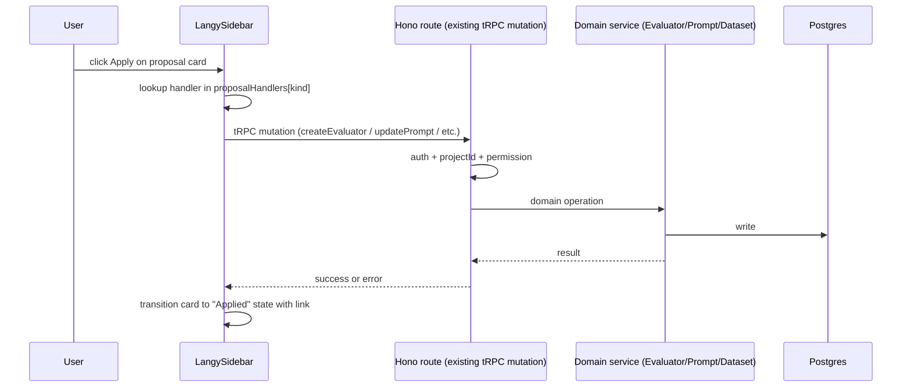

# Langy architecture — deep spec

> Companion to `PRD.md` and `memory-design.md`. The PRD says *what*. The memory
> doc says *how memory is stored*. This doc says *how the pieces fit and
> communicate*.
>
> Status: **Draft for review.**
> Last updated: 2026-05-06

## 1. Topology



## 2. Component boundaries

| Component | Responsibility | Does NOT do |
|---|---|---|
| **LangySidebar / LangyContext** | Render chat, propagate page-level proposal handlers, manage local UI state | Tool execution, persistence, routing |
| **Hono routes** | Auth, permissions, rate limiting, request → service → response orchestration | Business logic, direct Prisma calls |
| **Services** (`Langy*Service`) | All read/write to Langy tables; multitenancy enforcement; transaction boundaries | HTTP, streaming |
| **Agent runtime** | LLM call, streaming, tool dispatch, message assembly | Persistence (it calls services for that) |
| **Tools** | Domain operations — list evaluators, propose changes, search | Cross-cutting concerns (auth, logging — those are in the route layer) |
| **Bootstrap worker** | Generate project memory at project creation | Anything user-facing |

The CLAUDE.md rule applies: **routes call services, never repositories;
services call repositories, never each other directly without crossing
boundaries cleanly.**

## 3. API contracts

### 3.1 Chat

```
POST /api/langy/chat
Content-Type: application/json

Request body:
{
  "conversationId": string | null,    // null → create a new conversation
  "messages": UIMessage[],            // Vercel AI SDK shape
  "projectId": string,
  "experimentSlug": string | null,    // optional page context
  "userMode": "non_expert" | "expert" // from LangyUserPreferences, sent for visibility
}

Response: SSE stream (Vercel AI SDK toUIMessageStreamResponse)

Errors:
- 401 Unauthorized — no session
- 403 Forbidden — missing project permission
- 409 Conflict — no model configured for project ("configure a model first")
- 429 Too Many Requests — rate limit exceeded
- 500 Internal Server Error — model call failed
```

### 3.2 Conversation listing

```
GET /api/langy/conversations?projectId=...&limit=50&cursor=...

Response:
{
  "conversations": [
    {
      "id": string,
      "title": string,
      "isShared": boolean,
      "isOwn": boolean,
      "updatedAt": string (ISO),
      "messageCount": number
    }
  ],
  "nextCursor": string | null
}
```

### 3.3 Conversation detail

```
GET /api/langy/conversations/:id?projectId=...

403 if not owner and not shared.

Response:
{
  "conversation": LangyConversation,
  "messages": LangyMessage[]
}
```

### 3.4 Conversation mutations

```
POST   /api/langy/conversations           // create (usually called implicitly by /chat)
DELETE /api/langy/conversations/:id       // soft delete
PATCH  /api/langy/conversations/:id       // toggle isShared, edit title
```

### 3.5 Project memory

```
GET   /api/langy/project-memory?projectId=...
PUT   /api/langy/project-memory           // user edit
POST  /api/langy/project-memory/refresh   // streaming SSE — user-initiated refresh
```

### 3.6 User preferences

```
GET /api/langy/preferences?projectId=...
PUT /api/langy/preferences                // mode toggle, dismissed kinds
```

## 4. Sequence diagrams

### 4.1 Send a message (turn lifecycle)



### 4.2 Project memory bootstrap (project creation)



### 4.3 Project memory refresh (user-initiated, streaming)



### 4.4 Apply a proposal



## 5. State machines

### 5.1 Conversation states

```
┌─────────┐  user opens new chat  ┌────────┐  user closes/leaves  ┌──────────┐
│ none    │ ────────────────────► │ active │ ────────────────────►│ inactive │
└─────────┘                       └────────┘                       └──────────┘
                                       │ user deletes
                                       ▼
                                  ┌─────────┐  90 days   ┌──────────┐
                                  │ deleted │ ─────────► │ purged   │
                                  └─────────┘            └──────────┘
```

### 5.2 Project memory states

```
┌──────────┐  project created     ┌──────────────┐  user edits       ┌────────┐
│ none     │ ───────────────────► │ bootstrapped │ ────────────────► │ edited │
└──────────┘                      └──────┬───────┘                   └────┬───┘
                                         │ 30 days                        │
                                         ▼                                ▼
                                    ┌─────────┐  user clicks refresh  ┌──────────┐
                                    │ stale   │ ────────────────────► │refreshed │
                                    └─────────┘                       └──────────┘
```

### 5.3 Proposal lifecycle (existing v1, captured for completeness)

```
emitted by tool → proposed → (apply) → applying → applied
                       │
                       └─→ (discard) → discarded
```

## 6. Multitenancy enforcement (the three layers)

| Layer | What enforces | Where |
|---|---|---|
| 1. Permission middleware | `hasProjectPermission(userId, projectId, capability)` returns 403 if missing | All `/api/langy/*` routes |
| 2. Service layer guard | Every Prisma query includes `projectId` in WHERE | `Langy*Service` methods |
| 3. Authorization at read | For per-user data: `userId` match OR `isShared` flag | `LangyConversationService.findById` |

Anti-patterns blocked at code-review:
- Routes calling Prisma directly
- Services with methods that take only `id` (no `projectId`)
- Frontend accepting raw IDs without going through the service layer

## 7. Token budgeting per turn

```
┌───────────────────────────────────────────────────────────┐
│  CONTEXT WINDOW (model-dependent, e.g. 128k-1M)           │
│  ┌─────────────────────────────────────────────────────┐ │
│  │ System prompt (identity + rules)        ~2k tokens  │ │  pinned
│  │ Project memory (L4, summarized to cap)  ≤2k tokens  │ │  pinned
│  │ User preferences (mode, etc.)           ~50 tokens  │ │  pinned
│  ├─────────────────────────────────────────────────────┤ │
│  │ Conversation history (sliding window)   variable    │ │  managed
│  │   - if total budget exceeded:                       │ │
│  │   - oldest 50% summarized into a [summary] block    │ │
│  │   - replaced inline                                 │ │
│  ├─────────────────────────────────────────────────────┤ │
│  │ Tool results (current turn only, never persisted)   │ │  ephemeral
│  ├─────────────────────────────────────────────────────┤ │
│  │ Assistant response (output)                         │ │  output
│  └─────────────────────────────────────────────────────┘ │
└───────────────────────────────────────────────────────────┘

Pinned + managed ≤ 80% of model window. Output reserve ≥ 20%.
If pinned alone > 15% of window: log warning, alert engineering.
```

## 8. Observability

Every Langy LLM call emits a LangWatch trace into the **dogfood project**
(separate dedicated project for Langy's own observability). Trace fields:

- `langy.conversation_id`
- `langy.user_id` (hashed)
- `langy.project_id` (hashed)
- `langy.user_mode` (`non_expert` | `expert`)
- `langy.injected_memory_tokens`
- `langy.tools_called` (list)
- `langy.suggestion_kind` (if emitted)
- `langy.error` (if any)

This is the foundation of the Traces Hour ritual. We dogfood our own product
on our own product.

## 9. Failure handling

| Failure | What the user sees | What happens |
|---|---|---|
| LLM provider 5xx | "Langy is having trouble — try again" | Trace logged with error; retry once with exponential backoff |
| Tool throws | Tool call result includes `error` field; LLM is told it failed and decides what to do | Logged; rate-limited if same tool fails repeatedly in a turn |
| Apply mutation fails | Proposal card shows error toast; card stays in "Proposed" state | User can retry or edit |
| Bootstrap worker fails | Project memory remains absent; first chat triggers a silent retry; if it fails twice, surfaces a settings banner | Logged with the error; ops alert |
| Conversation persistence fails | User sees a warning that "this conversation may not be saved" | Stream continues; we attempt to persist on retry |
| No model configured | 409 with structured error: "configure a model first" | UI redirects to model settings page |

## 10. Testing strategy

| Layer | What we test | Where |
|---|---|---|
| Component (UI) | LangySidebar opens, proposal cards render, dismissal works | `langwatch/src/components/langy/__tests__/*.integration.test.tsx` |
| Route | Auth, permissions, rate limit, request/response shape | `langwatch/src/server/routes/__tests__/langy.*.test.ts` |
| Service | Multitenancy enforcement, deletion semantics, retention | `langwatch/src/server/services/langy/__tests__/*.unit.test.ts` |
| Tool | Each tool's input/output shape; project isolation | Service-layer tests (tools are thin wrappers) |
| BDD | All scenarios in `*.feature` are bound to passing tests | Vitest + scenario binding |
| Eval (Traces Hour) | Real conversation traces graded weekly | Dogfood project |

## 11. Open architecture questions

1. **Where does the agent runtime live?** v2 = in-process inside Next.js. v2.5
   = Mastra in-process. v3 = consider extracting to a Hono service if the
   deploy cadence of the main app starts conflicting with Langy iteration speed.
2. **Streaming protocol.** Stick with Vercel AI SDK's UI message stream. When
   migrating to Mastra, ensure compatibility (Mastra builds on the same primitives).
3. **Pgvector?** Defer to v3 (L7 in PRD §6). Architecture above is unchanged
   when added — it would slot into the search tools.
4. **Rate-limit scope.** Per-user-per-project? Per-org? Both? Default proposal:
   per-user-per-project, with an org-level burst cap.

## 12. Decision log

| Date | Decision | Rationale |
|---|---|---|
| 2026-05-06 | In-process Next.js for v2; revisit extraction at v3 | Avoid premature service split; deploy cadence is fine for now |
| 2026-05-06 | Mastra over Google ADK and LangGraph-JS | TS-native, lightest migration, no GCP lock-in |
| 2026-05-06 | Bootstrap as a background job, not lazy-on-first-open | "Magic of being prepared" UX outweighs eager-job complexity |
| 2026-05-06 | Streaming for user-initiated refresh, silent for auto-bootstrap | Streaming where the user is watching; silent where they aren't |
| 2026-05-06 | Suggestions inline in chat turn, no worker | Smarter and lighter than cron; agent has full context already |
| 2026-05-06 | Self-observability via dedicated dogfood project | Dogfood is our primary eval signal |
